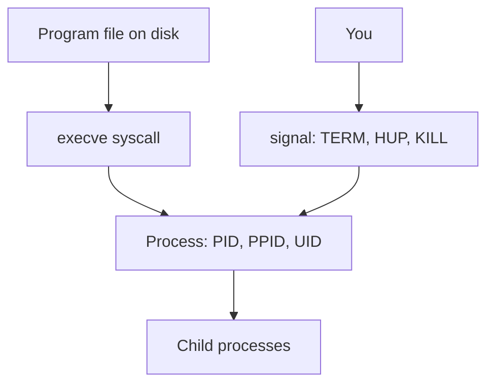

# Month 15 · Week 1 · Day 4
# Processes, Signals, and a User systemd Service

**Program:** Full-Stack Mastery · 18 months  
**Phase:** 5 — Production engineering  
**Month index:** [../../README.md](../../README.md)  
**Week 1:** [1](day-01.md) · [2](day-02.md) · [3](day-03.md) · Day 4 (today) · [5](day-05.md) · [6](day-06.md) · [7](day-07.md)  
**Week rhythm today:** Lab (type-along + independent)  
**Student state:** You can name a path and a permission bit. Today the machine is **alive**: programs become **processes**, processes have **parents**, and you ask them to stop with **signals** — not by closing a laptop lid and hoping.  
**Study time:** 3–4 focused hours  
**Prereq:** Day 3 gate passed. Bash in Ubuntu.

Labs: `~/fullstack-lab/month-15/week-01/day-04/`. Do **not** `kill -9` random PIDs you do not own. Do not paste Project 7. Do not install Kubernetes.

---

## How to use this textbook

1. Read Block A until PID, parent, and SIGTERM are sentences you can say.  
2. Type the sleep/signal lab. Predict, then signal.  
3. Write a **user** systemd unit for a tiny script — not for Postgres on the bare metal.  
4. Optional review links are for later rechecking.

---

## How to read this chapter

A **program** is a file (`/usr/bin/python3`). A **process** is that program **running**: a PID, an address space, open files, a current directory, an environment. Month 1 said this on Windows. Today you inspect it the way a Linux host does.



**Wrong belief:** “Closing the terminal always stops the server cleanly.”  
**Correct:** a child may be **orphaned** and adopted by PID 1, or it may die with the session, or it may ignore `SIGHUP`. Services exist so a process is **supervised**, not accidentally tied to a window.

**Wrong belief:** “`kill -9` is how professionals stop things.”  
**Correct:** `SIGKILL` cannot be caught. The process gets no chance to flush logs, close sockets, or finish a transaction. `SIGTERM` is the polite request. `SIGKILL` is for a process that will not go.

---

## Today's contract

By the end of this day you will be able to:

1. Explain **PID**, **PPID**, and the process tree.  
2. Name **SIGTERM**, **SIGKILL**, **SIGHUP** and when to use each.  
3. Read `ps` and a snapshot of `top` / `htop` if present.  
4. Explain **systemd** as the manager of **units** on Ubuntu — not as “the cloud.”  
5. Install a **user** service that starts a tiny script, show status, stop it.

**Today's gate.** Closed-book:

> A PID is a running program. SIGTERM asks it to exit; SIGKILL forces it. systemd starts and restarts **units**. I can write a user unit for a script I own. I did not kill PID 1. I did not paste Project 7.

---

## Time box

| Block | Minutes | Work |
|---|---|---|
| A | 40 | Theory |
| B | 80 | Type-along: ps, signals, user unit |
| C | 65 | Independent: crash loop vs clean stop |
| D | 15 | Git |
| E | 15 | Recall |

---

# Block A — Theory

## 1. Why processes before Docker

A container (Week 2) is **isolation around one or more processes** sharing a kernel. If you cannot find a PID on Ubuntu, you will not find it in `docker exec`. Compose healthchecks (Week 3) are still “is this process answering.” Observability (Week 4) is still “what did that process print.”

## 2. PID, parent, init

Every process has:

| Field | Meaning |
|---|---|
| **PID** | Process identifier, unique on this kernel at this moment (PIDs are reused later) |
| **PPID** | Parent PID — who `fork`ed it |
| **UID/GID** | Whose permissions apply (Day 2) |
| **state** | Running, sleeping, zombie (dead, waiting for parent to `wait`) |

When you type `sleep 60` in bash, bash **forks** and the child **execs** `sleep`. The parent is your shell. If the parent dies first, children are reparented. On systemd systems, PID **1** is `systemd` (in WSL this is mostly true on current Ubuntu WSL; if PID 1 is not systemd, write that down honestly — the ideas still hold, and user units may need `systemctl --user` with lingering caveats listed in office hours).

**Wrong belief:** “PID 1 is my terminal.”  
**Correct:** PID 1 is the first userspace process. Killing it is how you wreck a VM. You will **not** send SIGKILL to PID 1.

## 3. Signals

A **signal** is an asynchronous message the kernel delivers to a process.

| Signal | Number (typical) | Catchable? | Meaning in practice |
|---|---|---|---|
| **SIGTERM** | 15 | Yes | “Please shut down.” Default `kill PID` |
| **SIGINT** | 2 | Yes | Ctrl+C in a foreground terminal |
| **SIGHUP** | 1 | Yes | Historically “modem hung up”; daemons often **reload config**; shells may terminate jobs |
| **SIGKILL** | 9 | **No** | Kernel tears the process down now |
| **SIGSTOP** | 19 | No | Pause (you will not need this today) |

`kill` is a badly named command: it **sends a signal**. Default is TERM.

```bash
kill -TERM "$PID"
kill -HUP "$PID"
kill -KILL "$PID"
```

A well-behaved server on SIGTERM: stop taking new work, finish in-flight requests if it can, close sockets, exit 0. Docker will send SIGTERM on `docker stop`, then SIGKILL after a grace period (Week 2). That is why your FastAPI/uvicorn should not ignore TERM.

**Wrong belief:** “HUP always means reload Nginx.”  
**Correct:** HUP means whatever the **program** chooses, or the default (often die). Read that program’s docs. Nginx happens to reload. Your Python script will die unless you install a handler — you will not write production signal handlers today; you will **observe** defaults.

## 4. ps and top

**`ps`** is a snapshot.

```bash
ps
ps aux
ps -ef
ps -o pid,ppid,user,stat,cmd -p "$PID"
```

Styles differ (`aux` BSD, `-ef` System V). You need: find a PID, see its command line, see its parent.

**`top`** is a live view of CPU and memory. Press `q` to quit. `htop` is nicer if installed; not required.

You are looking for **your** sleep process and **your** python, not for a hunt through every kernel thread.

## 5. systemd units — the concept

**systemd** is Ubuntu’s init and service manager. A **unit** is a configuration object: service, socket, timer, mount, and others.

A **service unit** answers: what command to start, as which user, what to do if it exits, after which other units.

Two scopes:

| Scope | Command | Lives in |
|---|---|---|
| **system** | `sudo systemctl start nginx` | `/etc/systemd/system/` |
| **user** | `systemctl --user start labhello` | `~/.config/systemd/user/` |

Today you write a **user** unit so you do not install a system daemon as root for a lab script. WSL is not a full multi-user server; user systemd may need:

```bash
systemctl --user status
```

If that fails, office hours. The **concept** you must still own: a unit file is text; `daemon-reload` after edits; `start` / `stop` / `status`; logs via `journalctl` (Day 7, preview today with `--user`).

**Wrong belief:** “systemd is Kubernetes.”  
**Correct:** systemd manages processes on **one** machine. Kubernetes schedules containers across a cluster. Not this month.

**Wrong belief:** “If I put `&` at the end of the command, I have a service.”  
**Correct:** you have a background job in **this** shell session. No restart policy, no start-at-boot, no clean logs. That is a demo, not an operations story.

## 6. A minimal unit (you will type this)

```ini
[Unit]
Description=Month 15 lab hello loop

[Service]
ExecStart=/usr/bin/python3 /home/YOU/fullstack-lab/month-15/week-01/day-04/hello.py
Restart=on-failure

[Install]
WantedBy=default.target
```

Replace `YOU`. Use **absolute paths** in `ExecStart`. systemd does not log in like you; it will not expand your mental `cd` from yesterday.

`Restart=on-failure` is a first taste of Week 3’s restart policy. It is not a substitute for fixing a crash.

## 7. What you will not do today

- No `kill -9 1`.  
- No disabling systemd-networkd for fun.  
- No packing Project 7 into a unit (the product is not the gym).  
- No Docker until Week 2.

## 8. Say it — two minutes

PID vs program; TERM vs KILL; what HUP historically meant; why ExecStart is absolute; user vs system systemd. If you stumble, re-read 2–6.

---

# Block B — Type-along

```bash
mkdir -p ~/fullstack-lab/month-15/week-01/day-04
cd ~/fullstack-lab/month-15/week-01/day-04
ps -o pid,ppid,cmd
id
```

Write `TREE.md`: your bash PID; its PPID; a guess who the parent is (`ps -o pid,cmd -p PPID`).

### Lab 1 — sleep, find, TERM

In **this** terminal:

```bash
sleep 300 &
echo $!
```

`$!` is the PID of the last background job. Confirm:

```bash
ps -o pid,ppid,stat,cmd -p $!
```

In the same directory, write `SIGNAL.md` as you go. Send TERM:

```bash
kill -TERM $!
sleep 0.2
ps -o pid,cmd -p $! || echo "gone"
```

The process should be gone. `kill` with a dead PID prints an error — that is evidence, not failure of the lesson.

Start another `sleep 300 &`. This time:

```bash
kill -KILL $!
```

Write: both died; which one had a chance to clean up (sleep has nothing to flush — say that honestly). The **habit** is still TERM first.

### Lab 2 — HUP and a shell job

```bash
sleep 300 &
kill -HUP $!
ps -p $! || echo "gone after HUP"
```

Default `sleep` dies on HUP. Write that. Nginx would differ; you are not installing Nginx today (Week 3 Compose may).

### Lab 3 — ps aux, find yourself

```bash
ps aux | head
ps aux | grep -v grep | grep sleep || true
```

If no sleep remains, start one, grep, then TERM it. Write how you distinguished **your** sleep from someone else’s (on WSL, you are usually the only user).

### Lab 4 — top for thirty seconds

```bash
top -n 3 -d 1
```

`-n 3` snapshots three times then exits so you are not trapped. Write: which column is `%CPU`, which is `PID`, what `q` would do in interactive top.

### Lab 5 — hello.py and a user unit

Create `hello.py` — a loop that prints every five seconds and flushes stdout:

```python
import sys
import time

i = 0
while True:
    i += 1
    print(f"hello-lab {i}", flush=True)
    time.sleep(5)
```

Make sure it runs in the foreground: `python3 hello.py`, Ctrl+C (SIGINT). Then stop.

Create the user directory and unit. Substitute your home:

```bash
mkdir -p ~/.config/systemd/user
HOME_DIR="$HOME"
UNIT="$HOME/.config/systemd/user/labhello.service"
```

Type the unit with `nano` or VS Code (WSL). `ExecStart` must be absolute: `/usr/bin/python3` and the full path to `hello.py`. `WorkingDirectory=` may be the day-04 folder.

```bash
which python3
readlink -f hello.py
```

Then:

```bash
systemctl --user daemon-reload
systemctl --user start labhello.service
systemctl --user status labhello.service
```

If `status` is active, you have a supervised process. Find its PID in the status output. Confirm with `ps`.

```bash
journalctl --user -u labhello.service -n 20 --no-pager
```

If `journalctl --user` is empty, still record `status`. WSL journal behavior varies; `status` showing the Python command is the gate.

Stop:

```bash
systemctl --user stop labhello.service
systemctl --user status labhello.service || true
```

Write `UNIT.md`: where the file lives; ExecStart line; PID you saw; whether journalctl printed `hello-lab`.

If `systemctl --user` fails entirely, write `WSL-SYSTEMD.md` with the error. Fallback gym (still required): run `python3 hello.py &`, record PID, `kill -TERM`, prove it died. Then read the unit file as **literature** you typed even if the user bus is unavailable — and fix systemd in office hours before Week 2 pretends services do not exist.

Enable is optional (start at login):

```bash
systemctl --user enable labhello.service
systemctl --user disable labhello.service
```

Leave it **disabled** when you finish so a loop does not surprise you tomorrow.

---

# Block C — Independent

### Task 1 — Parent chain

Start `sleep 120 &`. Using only `ps -o pid,ppid,cmd -p`, walk **two** parents up. Draw them in `PARENTS.md`. TERM the sleep when done.

### Task 2 — Predict signals

Write `PREDICT.md` **before** running:

1. Foreground `sleep 999`, then Ctrl+C — which signal?  
2. `kill PID` with no args — which signal?  
3. `docker stop` (next week) — TERM then KILL. Write that as a prediction you will verify in Week 2.

Then verify 1–2 in the terminal. Record actual.

### Task 3 — A crashing service

Copy `hello.py` to `crash.py` that **raises** after printing once. Point a second unit `labcrash.service` at it with `Restart=on-failure` and `RestartSec=2`. Start it, `status` twice a few seconds apart. Write: did systemd restart it? Then **stop** the unit so it does not restart forever.

This is the seed of Week 3 restart policy and Week 4 “crash loop” diagnosis. Do not leave it enabled.

### Task 4 — What Project 7 would need (names only)

`PRODUCT-PROCESS.md` (eight lines): the **process** you start for the API today (uvicorn/hypercorn — whatever you actually use), and whether it is currently “a terminal you must not close.” No source paste. Honest: “I start it in VS Code” is a valid starting point; the month exists to do better with Compose.

---

# Block D — Git

```bash
cd ~/fullstack-lab
git add month-15/week-01/day-04
git commit -m "Month 15 Day 4: signals lab and user systemd unit."
```

Do not commit `~/.config/systemd/user/` unless you copy the unit **into** the lab folder as `labhello.service.example`. Copy it:

```bash
cp ~/.config/systemd/user/labhello.service ~/fullstack-lab/month-15/week-01/day-04/labhello.service.example
```

---

# Block E — Recall

1. Program vs process.  
2. PPID.  
3. SIGTERM vs SIGKILL.  
4. Default `kill` signal.  
5. Why ExecStart is absolute.  
6. system vs user systemd.  
7. Why `&` is not a service.

---

## Office hours

**`System has not been booted with systemd as init system`.** Older WSL. Enable systemd in `/etc/wsl.conf`:

```ini
[boot]
systemd=true
```

Then from **PowerShell**: `wsl --shutdown`, reopen Ubuntu. This is a documented Ubuntu/WSL path, not a hack. If you cannot enable it, use the fallback gym and continue; fix before Week 3 Compose “restart” talk.

**`Failed to connect to bus`.** User systemd session missing. Same shutdown, or `sudo apt install -y dbus-user-session` then new login. Do not spend the whole day on D-Bus; record and fallback.

**`kill: No such process`.** Already dead. Evidence.

**Killed the wrong PID.** If the machine feels dead, restart Ubuntu (`wsl --shutdown` from Windows). Do not practice on PID 1.

---

## Definition of done

- [ ] SIGNAL.md shows TERM and KILL on **your** sleep  
- [ ] User unit started and stopped, or WSL-SYSTEMD.md + fallback TERM  
- [ ] crash unit stopped (not left looping)  
- [ ] Gate paragraph closed-book  
- [ ] Commit exists  

---

## Optional review links

- [systemd.service(5)](https://www.freedesktop.org/software/systemd/man/latest/systemd.service.html)  
- [signal(7)](https://man7.org/linux/man-pages/man7/signal.7.html)  
- [Microsoft: systemd support in WSL](https://learn.microsoft.com/windows/wsl/wsl-config#systemd-support)  

---

## Tomorrow

**Docs day:** SSH keys, `ssh-keygen`, `authorized_keys`, why passwords in chat fail. You may SSH into a **local Linux container** as the box.
