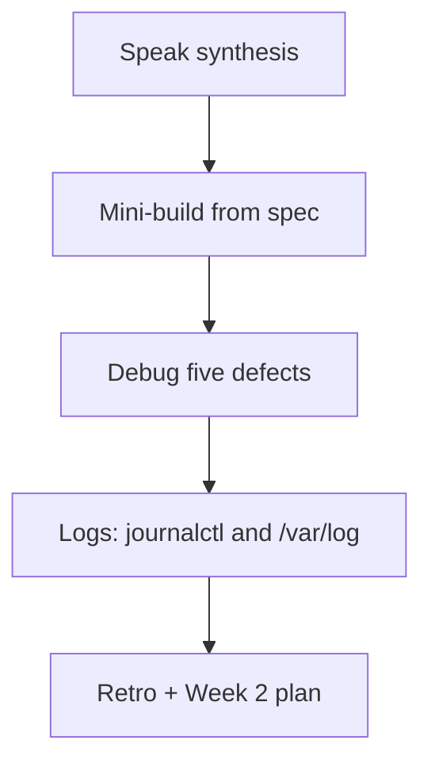

# Month 15 · Week 1 · Day 7
# Week Review — Linux: Tree, Bits, Processes, SSH, Ports, Logs

**Program:** Full-Stack Mastery · 18 months  
**Phase:** 5 — Production engineering  
**Month index:** [../../README.md](../../README.md)  
**Week 1:** [1](day-01.md) · [2](day-02.md) · [3](day-03.md) · [4](day-04.md) · [5](day-05.md) · [6](day-06.md) · Day 7 (today)  
**Week rhythm today:** Review, repair, plan Week 2  
**Student state:** You installed Ubuntu, decoded permissions, signaled a process, wrote an SSH runbook, and mapped a port. Today those ideas must still live in your head — from **this file**.  
**Study time:** 3–4 focused hours

Do not start Week 2 because the calendar moved. A Docker image on a student who cannot read `Permission denied` is two problems.

Work in `~/fullstack-lab/month-15/week-01/day-07/`. Do not implement the mini-build inside Project 7. Bash in Ubuntu. Kubernetes is not this week and not this month.

---

## How to read this chapter

This is a **closed-book teaching day**. The synthesis **is** the Week 1 lesson.



Days 1–6 closed during mini-build. Repair from **this** recap.

---

## Week synthesis (the lesson, in this book)

You work on a **Windows laptop**. Production is **Linux**. WSL2 gives you a real Linux **kernel** and an Ubuntu **distro** (userspace + apt + FHS). The **shell** is bash. PowerShell is not the production shell this month. One tree starts at `/`.

**FHS.** `/etc` configuration. `/var` variable data including logs. `/home` people. `/usr` installed programs. `/tmp` temporary. `/root` is root’s home, not `/`. Labs live in `~/fullstack-lab` on the Linux filesystem, not `/mnt/c`, so POSIX modes and later Docker binds behave.

**Users and bits.** UID/GID. Nine bits: owner, group, other. Directory `x` is traverse. Octal: `r=4,w=2,x=1`. `640` is `rw-r-----`. `chmod 777` is not a fix. `umask` subtracts bits from new files. `sudo` runs one command as UID 0 after **your** password.

**Processes.** A PID is a running program. PPID is the parent. `kill` sends a signal. Default **SIGTERM** (15) asks the process to exit. **SIGKILL** (9) cannot be caught. **SIGHUP** (1) default often dies; some daemons reload. systemd manages **units**. A user unit lives under `~/.config/systemd/user/`. `ExecStart` is an **absolute** path. `&` in a shell is not a service.

**SSH.** Key pair: private `600` never chat, never git. Public line in `authorized_keys`. Password auth off on the lab box. Host key change after a recreated container is expected; `ssh-keygen -R` for that host, not `StrictHostKeyChecking=no` forever.

**Network tools.** `apt update` refreshes indexes; `apt install` installs. `ss -lptn` listening sockets and PIDs. `ping` is ICMP. `curl` is HTTP. `dig` talks DNS; `getent hosts` is what most programs use. `127.0.0.1` is local; `0.0.0.0` is all IPv4 interfaces.

**Logs (today).** systemd units: `journalctl`. Classic files: `/var/log`. Disk full often means `/var` grew. You read logs; you do not delete `/var/log` as a personality.

**Wrong belief:** “Docker means I can skip Linux.”  
**Correct:** a container is Linux processes + a filesystem tree + ports.

**Wrong belief:** “HTTP 403 means chmod.”  
**Correct:** 403 is often application authz. Kernel denials say `Permission denied` / `EACCES`.

**Wrong belief:** “Kubernetes this month.”  
**Correct:** no. Compose is Week 3.

---

## Today's contract

**Today's gate.** Closed-book:

> I can explain a path, a permission triad, a PID, a listening port, and where logs live. I diagnosed five Linux defects from this file. I used journalctl or /var/log with evidence. I did not start Week 2 on an empty mini.

---

## Time box

| Block | Minutes | Work |
|---|---|---|
| 1 | 30 | Speak the synthesis; write `exam-01.md` |
| 2 | 50 | Mini-build: cafeteria clock script + user unit **or** supervised loop |
| 3 | 35 | Debug A–E |
| 4 | 30 | journalctl + `/var/log` walk |
| 5 | 20 | Break a permission; restore |
| 6 | 15 | Design: what Docker will not forgive |
| 7 | 15 | Retro + Week 2 plan |

---

# Complete explanation — logs you must still own

## 1. journalctl

systemd stores logs in the **journal**.

```bash
journalctl --user -n 20 --no-pager
journalctl --user -u labhello.service -n 50 --no-pager
journalctl -xe --no-pager | tail
```

`--no-pager` prints to the terminal (good for capturing evidence). `-n` last N lines. `-u` one unit. `--user` your user units. System units need sudo for some journals.

If WSL journal is empty, say so and use file logs in Block 4.

## 2. /var/log

Traditional files. On Ubuntu you may see `syslog`, `auth.log`, `dmesg`, or mostly journal. `ls -l /var/log` anyway. **Write what exists.** `sudo tail -n 20 /var/log/syslog` if the file exists.

You are learning **where to look**, not grepping secrets. If a log line looks like a password, do not copy it into git.

## 3. Disk full (concept)

`df -h` shows filesystems. `df -i` inodes. When `Use%` is 100%, writes fail with `No space left on device`. Culprits: `/var/log`, Docker images (Week 2), `~/` downloads. Today you only **record** `df -h` in the mini notes so the idea is real.

---

# Block 1 — Speak

No notes from Days 1–6 files. Cover: kernel vs distro; FHS four dirs; 640; TERM vs KILL; authorized_keys; ss port map; logs. Then `exam-01.md` (15–25 lines, your words).

```bash
mkdir -p ~/fullstack-lab/month-15/week-01/day-07
cd ~/fullstack-lab/month-15/week-01/day-07
```

---

# Block 2 — Mini-build (Days 1–6 closed)

**Spec: cafeteria clock** — not Project 7.

```bash
mkdir -p ~/fullstack-lab/month-15/week-01/day-07/mini
cd ~/fullstack-lab/month-15/week-01/day-07/mini
```

`clock.py` — infinite loop, print `tick N` every 3 seconds, `flush=True`.

`clock.service.example` — user unit: absolute `ExecStart`, `Restart=on-failure`, description “cafeteria clock.”

Install the unit into `~/.config/systemd/user/cafclock.service`, `daemon-reload`, `start`, `status`. Capture PID. `ss` is not required unless you add a port.

Add `http_clock.py` as **stretch if systemd user failed yesterday**: `python3 -m http.server 8766 --bind 127.0.0.1` from `mini/`, map port → PID in `PORT.txt`.

Required files:

- `clock.py`  
- `cafclock.service` copy in mini  
- `STATUS.txt` — `systemctl --user status` snippet **or** fallback PORT.txt  
- `IDENTITY.txt` — `uname -s -r`, `cat /etc/os-release` PRETTY_NAME, `id`  

Stop the unit / server when Block 2 evidence is saved so it does not run all night.

```bash
systemctl --user stop cafclock.service 2>/dev/null || true
```

---

# Block 3 — Debug five defects

Write `exam-03-debug.md`. For each: **what is wrong**, **which Linux idea**, **fix in one or two sentences**. Do not write exploit steps. Do not “just 777.”

**A.** `cat /home/sam/notes.md` → Permission denied. `ls -l` shows `-rw------- sam sam`. You are `you`. Junior’s fix: `sudo chmod 777 /home/sam/notes.md`.

**B.** `python3 -m http.server 8765` → `Address already in use`. Junior reboots Windows.

**C.** `uv: command not found` in Ubuntu after it worked in PowerShell last month. `echo $PATH` does not include the Windows path you expected.

**D.** `echo hi > /var/log/my-app.log` → Permission denied. Disk is not full (`df -h` shows 40% used).

**E.** `systemctl --user start cafclock` fails. `status` shows `ExecStart=/usr/bin/python3 clock.py` (relative). Journal: `No such file or directory`.

After you write A–E, check keys at the bottom of this file.

---

# Block 4 — Logs walk

Write `LOGS.md`.

```bash
ls -l /var/log | head
df -h
journalctl --user -n 15 --no-pager || true
```

If `cafclock` ran:

```bash
journalctl --user -u cafclock.service -n 20 --no-pager || true
```

Answer:

1. Did `/var/log` contain files you could read without sudo? Name two.  
2. What percent full is the main filesystem?  
3. One sentence: if this disk hit 100%, which directory would you inspect first and **why** (concept: variable data).  
4. Difference: `journalctl` vs a file in `/var/log`.

Do not `rm` logs. Do not `truncate` as a flex.

---

# Block 5 — Break a permission; restore

In mini:

```bash
echo "tray-count" > trays.txt
chmod 000 trays.txt
cat trays.txt
```

Save the error in `exam-05-deny.txt`. Restore `644` **without sudo**. `cat` works. This is rehearsal for “permission denied” as evidence, not a vibe.

---

# Block 6 — Design

`design.md` (10–15 lines): Week 2 Docker will pack a process into an image. Name three Week 1 ideas that **remain true inside a container** (PID, `/etc` inside the container, listen port). Name one thing Docker will **not** fix (a 403 from FastAPI, a missing test from Month 14).

---

# Block 7 — Retro

`retro.md`: weakest Day 1–6 skill; whether you still want `chmod 777`; whether SSH.md exists; Week 2 question about “image vs container.”

Week 2 is **Docker**: image vs container, Dockerfile, volumes, a tiny API. Do not start it if Block 2 has no clock script.

## Debug keys (after you write A–E)

**A.** Owner triad `rw-------`; you are other. 777 shares with the world. Fix: sam copies the file, or grants group read, or you sudo **cat** if policy allows — not 777 on her home.

**B.** Another process holds 8765. `ss -lptn` + `ps`. Stop that process (TERM) or pick another port. Reboot is a sledgehammer that also loses unsaved work.

**C.** PATH is per OS/shell. Ubuntu does not automatically run Windows `uv.exe`. Install uv in WSL or call the Linux binary. Do not “fix PATH” by appending random `/mnt/c` program files as a lifestyle (slow, mixed).

**D.** `/var/log` is not yours to write. App should log to stdout (Week 4) or to a file it owns under `/var/log/app` created with correct owner — or to `~/fullstack-lab`. Permission, not disk full.

**E.** systemd working directory is not your mental `cd`. Absolute path to `clock.py`. `daemon-reload` after the edit.

If you wrote “Linux is broken” for any of these, rewrite from the synthesis.

```bash
cd ~/fullstack-lab
git add month-15/week-01/day-07
git commit -m "Month 15 Week 1 review: clock mini-build, logs, five defects."
```

---

## Office hours

**journalctl empty.** WSL. LOGS.md still has `ls /var/log` and `df -h`. Enable systemd as in Day 4 office hours if you want user journals.

**Mini used Project 7.** Rebuild cafeteria clock. Copying product code is not review.

**Still on PowerShell.** You cannot pass Week 1.

Windows: you may **read** the textbook in Cursor on Windows. You **type** labs in Ubuntu.

---

## Definition of done

- [ ] Synthesis spoken; `exam-01.md` exists  
- [ ] Mini clock exists; unit or port evidence  
- [ ] Debug A–E written, then checked  
- [ ] `LOGS.md` with df and a log source  
- [ ] Deny snippet captured and restored  
- [ ] Week 2 not started on an empty mini  

---

## Optional review links

Repair from this synthesis first.

- [journalctl(1)](https://www.freedesktop.org/software/systemd/man/latest/journalctl.html)  
- [ss(8)](https://man7.org/linux/man-pages/man8/ss.8.html)  
- [df(1)](https://man7.org/linux/man-pages/man1/df.1.html)  

---

# Lecture: five defects, slowly

**Permission denied** is a triad and a path. Walk parents for directory `x`.

**Port in use** is a socket. `ss` then `ps`. TERM the owner if it is yours.

**PATH** is how the shell finds programs. Distros do not share PATH with Windows automatically.

**Disk full** is `df`. Conceptually `/var` and images fill first. You did not fill the disk on purpose.

**Failed unit** is `status` + `journalctl`. Relative ExecStart is the classic.

**Closed-book cards** (write answers in `retro.md`):

1. Kernel vs distro.  
2. `/etc` vs `/var` vs `/home`.  
3. Directory `x`.  
4. `chmod 640` in letters.  
5. SIGTERM vs SIGKILL.  
6. What goes in `authorized_keys`.  
7. `127.0.0.1` vs `0.0.0.0`.  
8. apt update vs install.  
9. ping vs curl.  
10. Where you look after a user unit fails.

Miss more than two: re-read the synthesis, then the mini, then Week 2.

---

## Next week

**Week 2 — Docker:** image vs container vs process; Dockerfile; layers; volumes and networks; a tiny FastAPI you invent in fullstack-lab — still not Project 7 source.
