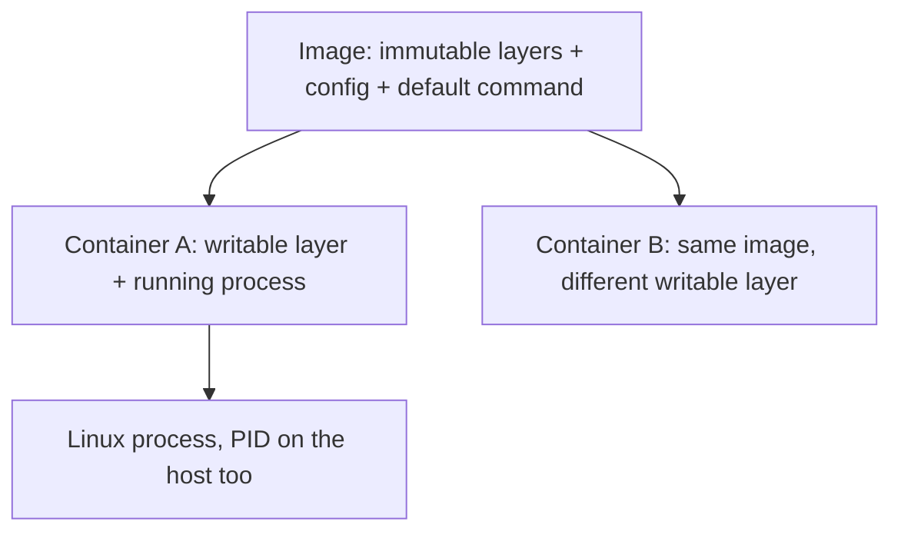

# Month 15 · Week 2 · Day 1
# Image, Container, Process: Docker Desktop and the First Commands

**Program:** Full-Stack Mastery · 18 months  
**Phase:** 5 — Production engineering  
**Month index:** [../../README.md](../../README.md)  
**Week 2:** Day 1 (today) · [2](day-02.md) · [3](day-03.md) · [4](day-04.md) · [5](day-05.md) · [6](day-06.md) · [7](day-07.md)  
**Week rhythm today:** Learn + type-along  
**Student state:** Week 1’s gate is true enough to continue: you can explain a path, a permission bit, a PID, and a listening port on Ubuntu. Today those processes get a **packaging** story.  
**Study time:** 3–4 focused hours

**This week covers:** image vs container, Dockerfile, layers, context, volumes, networks, published ports, env vars, a tiny FastAPI image.

Today: what an **image** is, what a **container** is, why both are still **Linux processes**, Docker Desktop on a Windows laptop, `hello-world`, and `docker ps` / `images` / `run` / `rm`. Dockerfile syntax is Day 2. Do not skip it.

Labs: `~/fullstack-lab/month-15/week-02/day-01/` in **Ubuntu bash**. Docker Desktop must be running with the **WSL2 engine**. PowerShell is not the lab shell. This textbook will **not** paste Project 7.

---

## How to use this textbook

1. Read until you can say “image vs container vs process” without using the word “lightweight VM” as a synonym.  
2. Type every `docker` command in Ubuntu.  
3. When a container exits, ask **what PID 1 inside it did** — not “Docker is broken.”  
4. Optional review links are for later rechecking.

---

## How to read this chapter

A **container** is a running (or stopped) instance: isolated userspace, its own PID namespace (PID 1 inside is *your* process), its own filesystem view, its own network stack (usually). It is **not** a second kernel. The kernel is still the Linux kernel WSL2 or the Docker VM provides. Week 1 was not optional flavoring.



**Wrong belief:** “Docker is a lighter virtual machine, so I do not need Linux.”  
**Correct:** the VM (on Docker Desktop for Windows) exists to **host a Linux kernel**. Inside, you have processes, `/etc`, users, and ports. You already studied those.

**Wrong belief:** “If `docker ps` is empty, no containers exist.”  
**Correct:** `docker ps` shows **running** containers. `docker ps -a` also shows **exited** ones. `hello-world` exits immediately. That is success, not a crash — you will prove it.

Kubernetes would schedule containers across machines. **Not this month.** You will talk to one Docker engine.

---

## Today's contract

By the end of this day you will be able to:

1. Define **image**, **container**, and **process** in one sentence each, and how they relate.  
2. Confirm **Docker Desktop + WSL2** from Ubuntu (`docker version`, `docker info`).  
3. Run `hello-world`, explain why it **exits**.  
4. Use `docker images`, `docker ps -a`, `docker run`, `docker rm`, `docker rmi` **on purpose**.  
5. Run a longer-lived container (`nginx` or `python` sleep), exec or curl it, then remove it.

**Today's gate.** Closed-book:

> An image is a template of layers and a default command. A container is an instance with a writable layer. Inside it, PID 1 is a Linux process sharing the host kernel. `docker ps` is running only. hello-world exits after printing. I typed this in Ubuntu.

---

## Time box

| Block | Minutes | Work |
|---|---|---|
| A | 50 | Theory |
| B | 60 | Type-along: hello-world, ps, rm |
| C | 65 | Independent: nginx or python container notes |
| D | 15 | Git |
| E | 15 | Recall |

---

# Block A — Theory

## 1. Why Docker exists in this program

You can run FastAPI with `uv run uvicorn` on Ubuntu. Production still needs: the same Python version, the same system libraries, a start command that is not “remember what I typed in March,” and a way to run **Postgres next door** without installing it on the host (Week 3).

Docker packages **filesystem + metadata + a command**. Compose (Week 3) packages **several** such packages and a network. Neither replaces Month 14 tests. A green `docker ps` can still serve a 403 bug.

## 2. Image

An **image** is an immutable snapshot:

- a stack of **layers** (filesystem diffs) — Day 2  
- configuration: env, exposed ports (documentation + defaults), user, working directory  
- a default **command** (`CMD` / `ENTRYPOINT`) — Day 2  

Images have **names** (`hello-world`, `ubuntu:24.04`) and **ids**. Tags like `:latest` are Day 5’s lie. Today: a name is a pointer.

Images live on the **engine**. `docker pull` fetches from a **registry** (Docker Hub by default). `docker build` creates an image from a Dockerfile (tomorrow).

**Wrong belief:** “The image is a running server.”  
**Correct:** the image is the **recipe frozen**. Running is a container.

## 3. Container

`docker run IMAGE` creates a **container**:

1. Allocate a container id.  
2. Stack the image layers, add a thin **writable** layer.  
3. Set up namespaces (PID, mount, net, …) and cgroups (resource limits — you will not tune them today).  
4. **Start a process** as PID 1 *inside* the container.

When that process **exits**, the container is **exited**. It still exists on disk until `docker rm`. Its writable layer still holds files you created **inside** — until you remove the container. That is why “it worked in the container but I lost my writes”: you rm’d the instance.

**Wrong belief:** “Stopped containers disappear.”  
**Correct:** they clutter `docker ps -a` and occupy disk. `docker rm` (or `docker run --rm`) is hygiene.

## 4. Process (Week 1, still true)

On the **host** (the Linux VM Docker uses), the container’s PID 1 is **also** a host PID (different number). `docker top CONTAINER` shows the inside view. A signal to stop: `docker stop` sends **SIGTERM**, waits, then **SIGKILL** — Day 4 predicted this.

You can `docker exec` a **second** process into a **running** container (`bash`, `ps`). If the container has already exited, exec fails: there is no namespace to enter.

**Wrong belief:** “`docker exec` starts the container.”  
**Correct:** `docker start` restarts an exited container’s **original** PID 1. `exec` is extra processes beside a living PID 1.

## 5. Docker Desktop on Windows

Docker Desktop:

- runs a Linux engine in WSL2 (or a similar VM)  
- provides `docker` CLI integration into your Ubuntu distro  
- provides a GUI you may ignore  

From Ubuntu:

```bash
docker version
docker info
```

Client and Server both must appear. If Server is missing, Desktop is not running, or WSL integration is off (Day 5 office hours).

The engine has a **disk** for images and volumes. Filling it is a real outage (`no space left`). Day 7 of Week 1 mentioned `/var`; Docker data is another hog.

## 6. The command set today

| Command | Job |
|---|---|
| `docker version` / `info` | Client and engine |
| `docker pull NAME` | Fetch image |
| `docker images` | List images (`docker image ls`) |
| `docker run [opts] IMAGE [cmd]` | Create + start |
| `docker ps` | Running containers |
| `docker ps -a` | All containers |
| `docker stop ID` | TERM then KILL |
| `docker start ID` | Start an existing container again |
| `docker rm ID` | Delete container (must be stopped unless `-f`) |
| `docker rmi IMAGE` | Delete image (no container may still use it) |
| `docker logs ID` | PID 1 stdout/stderr |
| `docker inspect ID` | JSON truth |

`docker run --rm` removes the container when it exits — good for one-shots like `hello-world`.

`docker run -it` attaches interactive TTY — for `bash` in ubuntu. `hello-world` does not need `-it`.

## 7. hello-world, slowly

The `hello-world` image’s command prints a message and **exits 0**. A successful run looks “gone” if you only `docker ps`. That teaches `ps -a` and `logs`.

## 8. Isolation is not magic security

Containers share a kernel. A process running as **root in the container** is a user namespace story (Week 3: non-root USER). Do not assume “it’s in Docker, so it cannot hurt the host.” Do not run random images from a tweet. Pull official `hello-world` and `ubuntu` today.

Defense only: no breakout PoCs.

## 9. Say it — two minutes

Image vs container vs process; why hello-world vanishes from `ps`; stop vs rm vs rmi; SIGTERM on docker stop. If you stumble, re-read 2–4.

---

# Block B — Type-along

```bash
mkdir -p ~/fullstack-lab/month-15/week-02/day-01
cd ~/fullstack-lab/month-15/week-02/day-01
docker version
docker info | head -n 30
```

Write `ENGINE.md`: Docker version; OS/Arch of the **server** (should be linux); Storage Driver if listed.

### Lab 1 — hello-world

```bash
docker pull hello-world
docker images
docker run hello-world
docker ps
docker ps -a
```

Find the exited container id (short prefix is enough).

```bash
docker logs CONTAINER_ID
docker rm CONTAINER_ID
docker ps -a
```

Write `HELLO.md`: why `ps` was empty and `ps -a` was not; what the logs contained (paraphrase); what `rm` did.

### Lab 2 — run --rm

```bash
docker run --rm hello-world
docker ps -a
```

`--rm` should leave no extra hello-world container. Write one sentence.

### Lab 3 — a process that stays up

```bash
docker run -d --name week2-sleep ubuntu:24.04 sleep 300
docker ps
docker inspect week2-sleep --format '{{.State.Pid}} {{.State.Status}}'
docker top week2-sleep
```

Host PID vs inside: `docker exec week2-sleep ps aux` (ps may be missing in ubuntu image — if so `docker exec week2-sleep cat /proc/1/cmdline` and `echo`).

```bash
docker exec week2-sleep cat /etc/os-release | head
```

That `/etc` is **inside** the container’s tree, not your WSL `/etc`. Write `INSIDE.md`: two sentences.

```bash
docker stop week2-sleep
docker ps -a
docker rm week2-sleep
```

Time how long `stop` takes (sleep handles TERM by dying quickly). Write: stop sent a signal (Week 1).

### Lab 4 — name collision

```bash
docker run -d --name week2-sleep ubuntu:24.04 sleep 60
docker run -d --name week2-sleep ubuntu:24.04 sleep 60
```

The second should fail: name in use. `docker rm -f week2-sleep` then retry once, then rm -f again. Write the error in `COLLISION.txt`.

---

# Block C — Independent

### Task 1 — nginx as a black box (optional if pull is slow: python)

**Preferred:**

```bash
docker run -d --name week2-ngx -p 8088:80 nginx:alpine
curl -sS -D - http://127.0.0.1:8088 -o /tmp/ngx.html | head
ss -lptn | grep 8088 || true
docker logs week2-ngx | tail
docker rm -f week2-ngx
```

Write `NGINX.md`: host port vs container port (preview of Day 4); what curl status you got.

If you cannot pull nginx, use:

```bash
docker run --rm -p 8767:8765 python:3.12-alpine python -m http.server 8765
```

Then curl `http://127.0.0.1:8767` from **another** terminal. Ctrl+C / rm as appropriate.

### Task 2 — Vocabulary sheet

`VOCAB.md` — your words:

| Term | Definition | Command that proved it |
|---|---|---|
| Image | | |
| Container | | |
| PID 1 in container | | |
| Exited vs running | | |
| docker rm vs rmi | | |

### Task 3 — Disk awareness

```bash
docker system df
```

Write numbers into `DISK.md`. Do not `docker system prune -a` today unless you understand it deletes unused images.

### Task 4 — Product (names only)

`PRODUCT.md` (six lines): which process in Project 7 will become a container later (API, maybe web). No source. You will **not** containerize it this week until Day 6’s **lab** FastAPI, and Project 7 only when **you** copy a pattern in Week 3+.

---

# Block D — Git

```bash
cd ~/fullstack-lab
git add month-15/week-02/day-01
git commit -m "Month 15 Week 2 Day 1: image vs container notes and docker evidence."
```

---

# Block E — Recall

1. Image vs container.  
2. Why hello-world exits.  
3. `ps` vs `ps -a`.  
4. `rm` vs `rmi`.  
5. What `docker stop` sends first.  
6. Is a container a second kernel?

---

## Office hours

**Cannot connect to the Docker daemon.** Start Docker Desktop. Wait until it says running. New Ubuntu tab. `docker version`.

**`permission denied` to docker.sock.** WSL integration, or add your user to `docker` group **inside** the distro Desktop manages — follow Docker Desktop’s WSL docs. Do not `chmod 777` the socket.

**Pull timeouts.** Network. Retry. Do not switch to a random unofficial image.

**I ran `docker rm $(docker ps -aq)` on a shared machine.** This lab assumes your laptop. Never do that at work.

---

## Definition of done

- [ ] ENGINE.md and HELLO.md exist  
- [ ] You created, inspected, stopped, and removed a long-lived container  
- [ ] VOCAB.md filled  
- [ ] Gate paragraph closed-book  
- [ ] Commit exists  

---

## Optional review links

- [Docker: docker run](https://docs.docker.com/reference/cli/docker/container/run/)  
- [Docker Desktop WSL](https://docs.docker.com/desktop/wsl/)  
- [Docker: Images overview](https://docs.docker.com/get-started/docker-concepts/the-basics/what-is-an-image/)  

---

## Tomorrow

**Dockerfile:** `FROM`, `RUN`, `COPY`, `CMD` vs `ENTRYPOINT`, layers, build context, `.dockerignore`.
