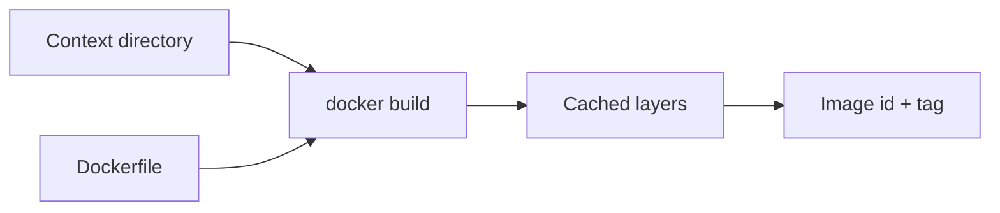

# Month 15 · Week 2 · Day 2
# Dockerfile: FROM, RUN, COPY, CMD vs ENTRYPOINT, Layers, Context

**Program:** Full-Stack Mastery · 18 months  
**Phase:** 5 — Production engineering  
**Month index:** [../../README.md](../../README.md)  
**Week 2:** [1](day-01.md) · Day 2 (today) · [3](day-03.md) · [4](day-04.md) · [5](day-05.md) · [6](day-06.md) · [7](day-07.md)  
**Week rhythm today:** Exercises + typed drills (still a teaching day)  
**Student state:** Yesterday you ran images other people built. Today you **write** a Dockerfile and **see layers**.  
**Study time:** 3–4 focused hours  
**Prereq:** Day 1 gate passed. `docker version` works in Ubuntu.

Labs: `~/fullstack-lab/month-15/week-02/day-02/`. Tiny **cafeteria menu** app — not Project 7. Do not `COPY` your entire home directory.

---

## How to use this textbook

1. Read until CMD vs ENTRYPOINT is a sentence, not a coin flip.  
2. Type the Dockerfile. Build it twice. Notice what **does not** rerun.  
3. Break the context on purpose with a huge junk file, then `.dockerignore`.  
4. Optional review links are for later rechecking.

---

## How to read this chapter

A **Dockerfile** is a text program the builder executes to produce an **image**. Each instruction usually creates a **layer**. The **build context** is the directory you send to the engine (`docker build .` — the `.` is the context). The Dockerfile is **not** the context by itself; it is a file that **refers** to the context with `COPY`.



**Wrong belief:** “The Dockerfile runs every time I `docker run`.”  
**Correct:** `build` creates an image. `run` starts a container from that image. `RUN` in the Dockerfile is **build-time**. `CMD` is **run-time**.

**Wrong belief:** “COPY . /app is always fine.”  
**Correct:** that sends **everything** in the context: `.git`, `node_modules`, secrets, `venv`. `.dockerignore` is the seatbelt. Context too big is a Week 2 Day 7 defect.

---

## Today's contract

By the end of this day you will be able to:

1. Write a Dockerfile with `FROM`, `WORKDIR`, `COPY`, `RUN`, `CMD`.  
2. Explain **CMD vs ENTRYPOINT** (and how they combine).  
3. Explain **layers** and why instruction **order** affects cache.  
4. Name the **build context** and use **`.dockerignore`**.  
5. Build and run your image without copying Project 7.

**Today's gate.** Closed-book:

> FROM starts from a base image. RUN executes at build time. COPY takes files from the context. CMD is the default container command; ENTRYPOINT is the fixed binary. Layers cache until an earlier layer changes. .dockerignore keeps junk out of the context.

---

## Time box

| Block | Minutes | Work |
|---|---|---|
| A | 50 | Theory |
| B | 70 | Type-along: menu image |
| C | 65 | Independent: ENTRYPOINT drill + ignore |
| D | 15 | Git |
| E | 15 | Recall |

---

# Block A — Theory

## 1. FROM

Every Dockerfile starts with `FROM` (except some advanced cases you do not need). It names a **base image**.

```dockerfile
FROM python:3.12-slim
```

You inherit that image’s filesystem and metadata, then add layers. Pick **official** bases. `slim` vs full vs alpine vs distroless is Week 3. Today `python:3.12-slim` or `python:3.12-alpine` is enough.

**Wrong belief:** “FROM ubuntu means my laptop Ubuntu.”  
**Correct:** it means the **Ubuntu image**, a different tree. Your WSL `/home` is not inside unless you COPY or mount it.

## 2. RUN

`RUN` executes in a **temporary container during build** and commits the result as a layer.

```dockerfile
RUN apt-get update && apt-get install -y --no-install-recommends curl \
 && rm -rf /var/lib/apt/lists/*
```

Chaining `&&` and cleaning apt lists keeps the **layer small**. Two `RUN apt-get update` lines far apart is how you get stale cache and fat images.

`RUN` is not what users of `docker run` type. If you put `RUN python app.py`, the **build** would start the app and hang (or fail). That is a Day 7 defect: **CMD vs RUN**.

## 3. COPY vs ADD

**`COPY`** copies files from the **context** into the image. Use COPY.

**`ADD`** can unpack tarballs and fetch URLs. Do not use ADD unless you can say why. Surprise tar extraction is not a gift.

```dockerfile
COPY menu.py /app/menu.py
COPY requirements.txt /app/requirements.txt
```

Paths on the left are **relative to the context root**, not relative to the Dockerfile’s location if you passed `-f` from elsewhere. That mismatch is another Day 7 defect.

## 4. WORKDIR

```dockerfile
WORKDIR /app
```

Sets the working directory for later `RUN`, `CMD`, `COPY` relative targets. Creates the dir if needed. Prefer this over `RUN mkdir && cd` — `cd` in a RUN does not persist anyway; each RUN is a new shell.

## 5. CMD vs ENTRYPOINT

Both specify what runs as PID 1. They differ in **override** behavior.

**Exec form** (JSON array) is what you should type — no nested shell unless you want one:

```dockerfile
CMD ["python", "/app/menu.py"]
ENTRYPOINT ["python", "/app/menu.py"]
```

**Shell form** `CMD python /app/menu.py` runs under `/bin/sh -c`. Signals (SIGTERM) may hit **sh**, not Python — Week 1’s signal lesson. Prefer exec form.

| Setup | `docker run IMAGE` | `docker run IMAGE --help` |
|---|---|---|
| Only `CMD ["python","app.py"]` | `python app.py` | replaces CMD: runs `--help` as the whole command (usually fails) |
| Only `ENTRYPOINT ["python","app.py"]` | `python app.py` | appends: `python app.py --help` |
| ENTRYPOINT `["python"]` + CMD `["app.py"]` | `python app.py` | `python --help` (replaces CMD, keeps ENTRYPOINT) |

**ENTRYPOINT** is the stable binary. **CMD** is default arguments. `docker run IMAGE other.py` with ENTRYPOINT `python` runs `python other.py`.

`docker run --entrypoint` overrides ENTRYPOINT. Use rarely.

**Wrong belief:** “CMD and ENTRYPOINT are synonyms.”  
**Correct:** CMD is easily replaced by extra args to `docker run`. ENTRYPOINT is not (unless `--entrypoint`).

## 6. Layers and cache

Each `FROM`/`RUN`/`COPY` typically adds a layer. Docker **reuses** a layer if the instruction and its inputs match a previous build.

**Cache-busting:** if you `COPY . /app` first, **any** file change busts the cache and you reinstall pip every build. Pattern:

1. COPY only `requirements.txt`  
2. RUN pip install  
3. COPY the rest of the app  

Code changes reuse the pip layer. That is the industrial habit. Multi-stage (Week 3) is the next habit.

`docker build --no-cache` ignores cache. Use when diagnosing, not daily.

## 7. Build context and .dockerignore

```bash
docker build -t menu:dev .
```

The `.` tarball (conceptually) is sent to the engine. **Large context** = slow builds, leaked secrets, “why is this COPY failing.”

`.dockerignore` syntax resembles `.gitignore`:

```text
.git
__pycache__
*.md
.venv
secret.env
junk.bin
```

The Dockerfile itself is still available to the builder even if ignored in some versions — do not rely on cute tricks. Ignore **data**, not your brain.

**Wrong belief:** “.dockerignore is for the running container.”  
**Correct:** it affects **build context**. Runtime mounts are Day 4.

## 8. ENV, EXPOSE, USER (preview)

`ENV` sets environment in the image. `EXPOSE` is **documentation** (and a default for `-P`); it does **not** publish a port. `USER` drops root — Week 3 will insist. Today you may still build as root and **notice** it (`whoami` inside). Day 7 will call running as root a defect to name, not a lifestyle to keep.

## 9. Say it — two minutes

Build-time vs run-time; COPY context; why requirements COPY comes first; ENTRYPOINT vs CMD; what .dockerignore saves.

---

# Block B — Type-along

```bash
mkdir -p ~/fullstack-lab/month-15/week-02/day-02
cd ~/fullstack-lab/month-15/week-02/day-02
```

Create `menu.py`:

```python
import json
import os

MENU = [{"id": 1, "item": "lentil soup", "cents": 350}]

def main() -> None:
    print(json.dumps({"station": os.environ.get("STATION", "north"), "menu": MENU}))

if __name__ == "__main__":
    main()
```

Create `requirements.txt` with a comment only, or empty file — no FastAPI yet (Day 6). A single line `# cafeteria menu lab` is enough so COPY has a file.

Create `Dockerfile`:

```dockerfile
FROM python:3.12-slim
WORKDIR /app
COPY requirements.txt /app/requirements.txt
RUN pip install --no-cache-dir -r requirements.txt || true
COPY menu.py /app/menu.py
CMD ["python", "/app/menu.py"]
```

If `requirements.txt` is empty of packages, `pip install -r` still succeeds. Prefer **no** `|| true` if the file is valid — make a valid empty requirements (just comments) so pip exits 0. **Type a clean RUN** without `|| true`.

```dockerfile
FROM python:3.12-slim
WORKDIR /app
COPY requirements.txt /app/requirements.txt
RUN pip install --no-cache-dir -r requirements.txt
COPY menu.py /app/menu.py
CMD ["python", "/app/menu.py"]
```

```bash
docker build -t cafeteria-menu:day2 .
docker run --rm cafeteria-menu:day2
docker run --rm -e STATION=south cafeteria-menu:day2
```

Write `BUILD.md`: image id (`docker images cafeteria-menu`); output of both runs.

Rebuild without changing files:

```bash
docker build -t cafeteria-menu:day2 .
```

Write which steps say `CACHED`. Change `menu.py` (add a second soup). Rebuild. Write: which step reran; did pip install rerun?

---

# Block C — Independent

### Task 1 — ENTRYPOINT combo

Copy Dockerfile to `Dockerfile.entry`. Use:

```dockerfile
ENTRYPOINT ["python"]
CMD ["/app/menu.py"]
```

Build `-t cafeteria-menu:entry -f Dockerfile.entry .`

```bash
docker run --rm cafeteria-menu:entry
docker run --rm cafeteria-menu:entry --version
```

`--version` is a python flag — you should see Python’s version, **not** the menu, because CMD was replaced. Write `ENTRY.md`: why. Then:

```bash
docker run --rm --entrypoint python cafeteria-menu:day2 /app/menu.py
```

Same menu, different override path.

### Task 2 — Fat context

```bash
dd if=/dev/zero of=junk.bin bs=1M count=80
docker build -t cafeteria-menu:fat .
```

Notice transfer size in the build output (“sending build context”). Create `.dockerignore` with `junk.bin`. Rebuild. Write `CONTEXT.md`: bytes before vs after (or qualitative if the UI only says “done”). Delete `junk.bin` after.

```bash
rm junk.bin
```

### Task 3 — CMD vs RUN mistake (predict)

Write `PREDICT.md` **without** building this broken file yet:

```dockerfile
FROM python:3.12-slim
WORKDIR /app
COPY menu.py /app/menu.py
RUN python /app/menu.py
```

What happens at **build** time? Then optionally build `Dockerfile.wrong` to confirm, stop if it hangs (it should **finish** because menu.py exits). Write the lesson: RUN ran the app at build; the image’s default command might still be the base image’s python REPL. Check:

```bash
docker build -t menu-wrong -f Dockerfile.wrong .
docker run --rm menu-wrong echo survived
```

If `docker run menu-wrong` with no args drops you in python or exits oddly, that is the defect. Record it.

### Task 4 — COPY path

Put `menu.py` in `src/menu.py`. Write `Dockerfile.copypath` that `COPY menu.py` (wrong). Build; capture the error. Fix to `COPY src/menu.py /app/menu.py`. This is Day 7 “COPY path.”

---

# Block D — Git

Do not commit `junk.bin`.

```bash
cd ~/fullstack-lab
git add month-15/week-02/day-02
git commit -m "Month 15 Day 2: Dockerfile layers, CMD vs ENTRYPOINT, dockerignore."
```

---

# Block E — Recall

1. RUN vs CMD.  
2. Why COPY requirements before app code.  
3. What the build context is.  
4. ENTRYPOINT + extra docker run args.  
5. Exec form vs shell form (signals).  
6. Does EXPOSE publish a port?

---

## Office hours

**`failed to compute cache key: not found`.** COPY source missing from context (wrong path or dockerignored).

**pip failed on empty file.** Use comments-only requirements, not a zero-byte file if pip complains.

**Build context gigabytes.** You ran `docker build` from `~`. Always `cd` to the lab dir. `.dockerignore` is not optional if you ever build from a dirty tree.

---

## Definition of done

- [ ] `cafeteria-menu:day2` runs and prints JSON  
- [ ] Cache observation written  
- [ ] `.dockerignore` proved on junk.bin  
- [ ] ENTRY.md explains override  
- [ ] Commit exists without junk.bin  

---

## Optional review links

- [Dockerfile reference](https://docs.docker.com/reference/dockerfile/)  
- [Build context / dockerignore](https://docs.docker.com/build/concepts/context/)  
- [CMD vs ENTRYPOINT](https://docs.docker.com/reference/dockerfile/#cmd)  

---

## Tomorrow

**Memory day:** write a Dockerfile from spec with Days 1–2 **closed**. Recap lives in that file.
