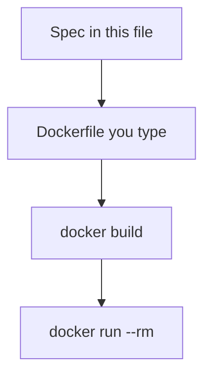

# Month 15 · Week 2 · Day 3
# From Memory: Write a Dockerfile from Spec

**Program:** Full-Stack Mastery · 18 months  
**Phase:** 5 — Production engineering  
**Month index:** [../../README.md](../../README.md)  
**Week 2:** [1](day-01.md) · [2](day-02.md) · Day 3 (today) · [4](day-04.md) · [5](day-05.md) · [6](day-06.md) · [7](day-07.md)  
**Week rhythm today:** Implement from memory  
**Student state:** Day 2 gate passed. You built `cafeteria-menu`. Today you write a **new** Dockerfile from this file’s spec. Days 1–2 textbook files stay **closed** during the drills.  
**Study time:** 3–4 focused hours  
**Prereq:** Day 2 gate passed.

Labs: `~/fullstack-lab/month-15/week-02/day-03/`. Do **not** copy Day 2’s Dockerfile. Do **not** paste Project 7. Bash + Docker in Ubuntu.

---

## How Day 3 works

Days 1 and 2 stay **closed** during Blocks 1–4. This file contains a recap so you are not sent to another site to learn.

Allowed: this recap; your fullstack-lab notes (not Day 1–2 textbook); `docker` output.

Not allowed: AI-generated Dockerfiles as the first draft; opening Day 2 during drills; Hub COPY-paste tutorials as teacher.

Stuck **more than 25 minutes**: open **only** the matching Day 1 or Day 2 section, read, close, continue. Record `lookups.txt`.

**No answer key in the first half.** Write the Dockerfile and `PREDICT.md` first. Worked box waits **after** you attempt.

---

## How to read this chapter

Build **creates** an image. Run **starts** a process from it. The Dockerfile is a recipe of **layers**. The context is the directory you pass to `docker build`.



**Wrong belief:** “Memory day means rebuild Day 2 with the file open.”  
**Correct:** new spec, recap only.

---

## Complete explanation (Docker you must still own)

**Image.** Immutable layers + config + default command. Template. `docker images`.

**Container.** Instance with a writable layer and a process (PID 1 inside). `docker run`. Exits when PID 1 exits. `docker ps` running; `ps -a` includes exited. `docker rm` deletes containers; `docker rmi` deletes images.

**Process.** Still Linux. `docker stop` → SIGTERM then SIGKILL. Not a second kernel. Not Kubernetes (not this month).

**Dockerfile.** `FROM` base. `WORKDIR` directory. `RUN` **build-time** shell, becomes a layer. `COPY` from **context**. `CMD` default args/command, easy to override with `docker run IMAGE args`. `ENTRYPOINT` fixed binary; extra args append (unless `--entrypoint`). Prefer **exec form** JSON arrays so PID 1 is your app (signals).

**Layers / cache.** Order: copy lock/requirements, install deps, copy source. Changing source should not reinstall pip.

**Context / .dockerignore.** `docker build .` sends the directory. Ignore `.git`, venv, junk, secrets. COPY path is relative to context. Wrong path → build error.

**EXPOSE** does not publish ports. **RUN python app.py** is not how you start the app at runtime.

**Root.** Default USER is often root. Week 3 will drop it. Today you can name it as a smell.

**Wrong belief:** “CMD runs at build.”  
**Correct:** RUN builds; CMD starts containers.

**Wrong belief:** “hello-world failed because docker ps is empty.”  
**Correct:** it exited 0; look at `ps -a` and `logs`.

---

## Today's contract

1. Write `exam-01.md` from the recap.  
2. Implement **library kiosk** image from spec (not cafeteria copy).  
3. Predict CMD vs ENTRYPOINT on paper.  
4. Use `.dockerignore`.  
5. Compare to the worked box only after `docker run` evidence.

**Today's gate.** Closed-book:

> I can write a Dockerfile from a spec: FROM, WORKDIR, COPY, RUN pip, CMD exec form. I can explain context and why RUN is not CMD.

---

## Time box

| Block | Minutes | Work |
|---|---|---|
| 1 | 25 | Speak recap; `exam-01.md` |
| 2 | 55 | Kiosk app + Dockerfile from spec |
| 3 | 40 | Predict CMD/ENTRYPOINT; tiny experiments |
| 4 | 30 | Debug five Dockerfile mislabels (paper) |
| 5 | 20 | Worked box; `DIFF.md` |
| 6 | 20 | Design: how Project 7 would split COPY |
| 7 | 15 | Retro |

---

# Block 1 — Speak

Cover: image vs container vs process; RUN vs CMD; context; cache order; stop signals. Write `exam-01.md` (12–20 lines).

```bash
mkdir -p ~/fullstack-lab/month-15/week-02/day-03
cd ~/fullstack-lab/month-15/week-02/day-03
```

---

# Block 2 — Spec: library kiosk (Days 1–2 closed)

Domain: **library kiosk**, not Project 7, not Day 2 soup.

Create `kiosk.py` that prints JSON:

```json
{"kiosk": "east-wing", "open": true, "holds": 3}
```

`kiosk` must come from env var `KIOSK` defaulting to `east-wing`.

`requirements.txt`: comments only (no packages).

Dockerfile requirements (you write it):

- `FROM python:3.12-slim`  
- `WORKDIR /app`  
- COPY requirements first, `RUN pip install --no-cache-dir -r requirements.txt`  
- COPY `kiosk.py`  
- `CMD` exec form running `kiosk.py`  
- `.dockerignore` including `__pycache__`, `.git`, `*.md`  

```bash
docker build -t library-kiosk:day3 .
docker run --rm library-kiosk:day3
docker run --rm -e KIOSK=west-wing library-kiosk:day3
```

Evidence in `RUN.txt`. If build fails, fix from this recap, not from Day 2 files.

Add a 5MB `noise.bin` (`dd`), confirm context, add it to `.dockerignore`, rebuild, `rm noise.bin`.

---

# Block 3 — Predict, then run

Write `PREDICT.md` **first**:

**Q1.** Image has `CMD ["python","/app/kiosk.py"]`. `docker run library-kiosk:day3 python -c 'print(1)'` — what PID 1 is?  
**Q2.** Same image, `ENTRYPOINT ["python","/app/kiosk.py"]` instead. `docker run library-kiosk:day3 python -c 'print(1)'` — what happens?  
**Q3.** `EXPOSE 8000` in Dockerfile, `docker run -d image` with no `-p`. Can you curl host 8000?

Then optionally retag a second build to test Q2 if time. Record actual vs predicted in `PREDICT.md` after.

---

# Block 4 — Debug mislabels (paper)

`DEBUG.md`: wrong claim, correct claim, why.

**A.** “`docker ps` empty means hello-world failed.”  
**B.** “`RUN pip install` runs every `docker run`.”  
**C.** “`COPY . /app` is best because I will not forget files.”  
**D.** “`EXPOSE 8000` publishes 8000 on my laptop.”  
**E.** “Shell form CMD is the same as exec form for SIGTERM.”  

---

# Block 5 — Worked box (only after kiosk image runs)

Write `DIFF.md` or `MATCH.txt`. Then read.

**Spec Dockerfile shape:**

```dockerfile
FROM python:3.12-slim
WORKDIR /app
COPY requirements.txt /app/requirements.txt
RUN pip install --no-cache-dir -r requirements.txt
COPY kiosk.py /app/kiosk.py
CMD ["python", "/app/kiosk.py"]
```

`.dockerignore` lists noise, pycache, git, markdown.

**Q1.** Extra args **replace CMD**. PID 1 is `python -c print(1)` — menu/kiosk JSON should **not** print.  
**Q2.** Extra args **append to ENTRYPOINT**. You get `python /app/kiosk.py python -c ...` which should **error**.  
**Q3.** EXPOSE does not publish. curl host 8000 fails unless `-p`.

**A.** Exited successfully; `ps -a` / logs.  
**B.** RUN is build-time.  
**C.** Fat context, secrets, cache bust. Copy specific files or use dockerignore.  
**D.** Need `-p`.  
**E.** Shell form: sh is PID 1; Python may not see TERM.

---

# Block 6 — Design

`DESIGN.md` (10–15 lines): For **your** API (names only), which file would you COPY first for cache (requirements/pyproject/uv.lock)? What must never be in the context (`.env`, `.git`, `node_modules`)? You will not paste Project 7.

---

# Block 7 — Retro

`retro.md`: which instruction you almost put in the wrong order; lookups.txt.

```bash
cd ~/fullstack-lab
git add month-15/week-02/day-03
git commit -m "Month 15 Day 3: library kiosk Dockerfile from memory."
```

---

## Office hours

**Copied cafeteria-menu.py.** Delete. The kiosk JSON shape is the spec.

**pip install failed.** Comment-only requirements.txt.

**Used PowerShell docker.** Ubuntu.

---

## Definition of done

- [ ] exam-01.md  
- [ ] library-kiosk:day3 runs with default and `KIOSK` override  
- [ ] PREDICT.md attempted **before** answers  
- [ ] DEBUG.md A–E  
- [ ] DIFF.md after the box  
- [ ] Commit exists  

---

## Optional review links

Repair from this recap first.

- [Dockerfile reference](https://docs.docker.com/reference/dockerfile/)  

---

# Lecture: reading a Dockerfile spec

When a spec says “default command,” that is **CMD** (or ENTRYPOINT+CMD). When it says “must always run python,” that is **ENTRYPOINT**. When it says “install dependencies,” that is **RUN** after copying the lock file, **not** at container start.

When a spec says “do not include git history,” that is **`.dockerignore`**, not `RUN rm -rf .git` after `COPY .` (too late: already in context and maybe in a layer).

Write `HEURISTIC.md` (six lines). Then Block 5 if you have not.

## A kiosk Dockerfile that would fail the spec

```dockerfile
FROM python:latest
COPY . /app
WORKDIR /app
RUN python kiosk.py
```

Four defects in four lines: `latest`; fat context; WORKDIR after COPY (works but sloppy); RUN executes the app at **build**. The image’s runtime CMD is still the base image default (Python REPL or nothing useful). Write `FOUR-DEFECTS.md`: one sentence each.

## Env at run, not bake

```bash
docker run --rm -e KIOSK=west-wing library-kiosk:day3
```

If you `ENV KIOSK=east-wing` in the Dockerfile, `-e` still overrides at run. Secrets must **not** be ENV in the Dockerfile. KIOSK is not a secret; a database password is.

## Exec form reminder

```dockerfile
CMD ["python", "/app/kiosk.py"]
```

not

```dockerfile
CMD python /app/kiosk.py
```

The second is shell form: PID 1 is `sh`. Week 1 signals: TERM may not reach Python until sh dies. Day 4 `docker stop` grace is this lesson in a trench coat.

## Context experiment you already did

If `noise.bin` was not ignored, the builder “sending context” step is slow. If you `docker build` from `~`, you may COPY your `.ssh`. That is a **secret leak into an image layer**. `docker history` will not pretty-print the key, but the blob is there. Treat leaked private keys as **Day 5 Week 1 rotate**. Write `LEAK.md` only if you actually built from home — then rebuild from the lab dir.

**Wrong belief:** “The Dockerfile is secret because it has COPY.”  
**Correct:** the Dockerfile is source. The **context tarball** is what must not include keys.

**Wrong belief:** “I tagged `library-kiosk` so it is pinned.”  
**Correct:** without `:0.1.0` or a digest you have an implicit latest. Day 5 this week.

---

## Tomorrow

**Lab:** volumes vs bind mounts, bridge networks, published ports, environment variables — tiny API + volume.
