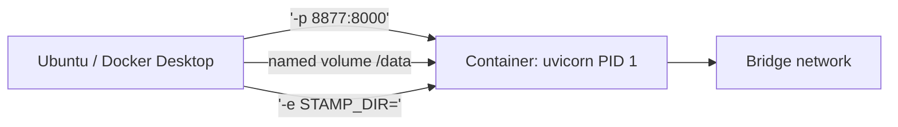
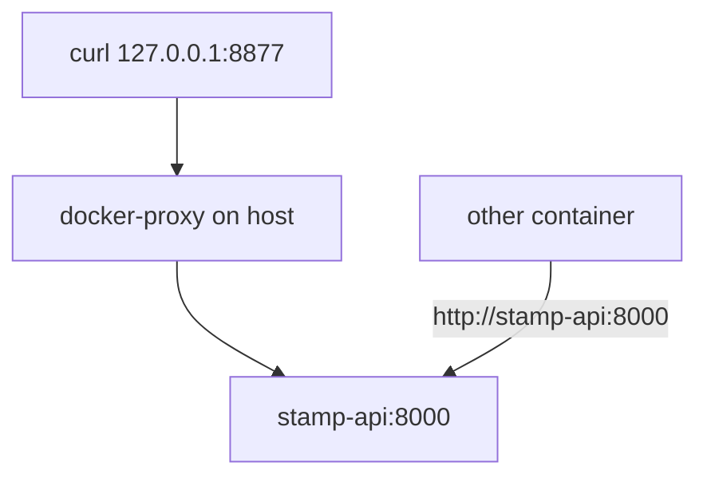

# Month 15 · Week 2 · Day 4
# Lab: Volumes, Bind Mounts, Bridge Networks, Published Ports, Env

**Program:** Full-Stack Mastery · 18 months  
**Phase:** 5 — Production engineering  
**Month index:** [../../README.md](../../README.md)  
**Week 2:** [1](day-01.md) · [2](day-02.md) · [3](day-03.md) · Day 4 (today) · [5](day-05.md) · [6](day-06.md) · [7](day-07.md)  
**Week rhythm today:** Lab (type-along + independent)  
**Student state:** You can build an image. Today the container must **keep data**, **talk on a network**, and **take configuration** without baking secrets into a layer.  
**Study time:** 3–4 focused hours  
**Prereq:** Day 3 gate passed.

Labs: `~/fullstack-lab/month-15/week-02/day-04/`. Tiny **stamp API** — in-memory plus a **file on a volume**. Not Project 7. Not Kubernetes.

---

## How to use this textbook

1. Read Block A until volume vs bind mount is a picture, not a synonym.  
2. Type the API and Compose-less `docker run` flags. Predict curl **before** you hit enter.  
3. Destroy the container, prove the **named volume** still has the file.  
4. Optional review links are for later rechecking.

---

## How to read this chapter

A container’s writable layer **dies with `docker rm`**. Anything you must keep goes on a **volume** or a **bind mount**. Anything you must reach from the laptop goes through a **published port**. Anything that changes between machines goes in **environment variables** (or later, env files — Week 3).



**Wrong belief:** “I published 8000 because EXPOSE 8000 is in the Dockerfile.”  
**Correct:** `EXPOSE` documents. `-p host:container` (or Compose `ports`) **publishes**. Without `-p`, another container on the same **bridge network** can still reach it by **container name** and internal port. Your browser cannot.

**Wrong belief:** “Bind mount and volume are the same: both persist.”  
**Correct:** both persist **relative to rm’ing the container**. A **named volume** is managed by Docker (lives in the engine’s data dir). A **bind mount** is a path **you pick** on the host (`/home/you/...`). Bind mounts are great for lab code; named volumes are the usual choice for database files (Week 3).

---

## Today's contract

By the end of this day you will be able to:

1. Publish a port and curl it from Ubuntu.  
2. Create a **named volume**, mount it, write a file, `rm` the container, mount again, see the file.  
3. Contrast a **bind mount** of a host directory.  
4. Put two containers on a **user-defined bridge** and curl **by name**.  
5. Pass `-e` and prove the process saw it.

**Today's gate.** Closed-book:

> -p publishes to the host. Bridge DNS is for container names, not hostnames on Windows. Named volumes survive container rm. Bind mounts are host paths. Env configures runtime, not build, unless I bake ENV into the image. I did not paste Project 7.

---

## Time box

| Block | Minutes | Work |
|---|---|---|
| A | 40 | Theory |
| B | 85 | Type-along: stamp API + volume + port |
| C | 60 | Independent: bridge DNS + bind mount |
| D | 15 | Git |
| E | 15 | Recall |

---

# Block A — Theory

## 1. Why this lab exists

Images are immutable (sort of: layers are). Production databases are not. If Postgres data lives in the container writable layer, `docker rm` is an unscheduled restore drill. Week 3 will put Postgres on a named volume. Today you feel the same idea with a JSON file.

## 2. Published ports

```bash
docker run -p 8877:8000 ...
```

Left: **host** (WSL/Desktop). Right: **container** listen port. Traffic to `127.0.0.1:8877` on Ubuntu hits the container’s `8000`.

`-p 8000:8000` is fine when it does not collide (Day 6 Week 1: address already in use). `-P` publishes all EXPOSEd ports to **random** host ports — annoying for labs.

`0.0.0.0` vs `127.0.0.1` on the **host** side: `-p 127.0.0.1:8877:8000` keeps it on localhost. Prefer that on a shared Wi-Fi.

**Wrong belief:** “The app should listen on 8877 inside the container because I published 8877.”  
**Correct:** the app listens on **8000 inside**. Publishing maps. Mismatch is a classic outage.

## 3. Bridge networks

Default `docker run` attaches to the `bridge` network. Containers there can have **IP addresses** but **no reliable DNS names** on the old default bridge.

**User-defined bridge:**

```bash
docker network create stampnet
docker run --network stampnet --name stamp-api ...
```

Then another container on `stampnet` can `curl http://stamp-api:8000/...` using the **container name**. That is Compose’s default behavior (Week 3).

From **your Ubuntu shell**, `stamp-api` is **not** a DNS name unless you use extra tricks. You curl **localhost:publishedPort**.



## 4. Named volumes vs bind mounts

**Named volume:**

```bash
docker volume create stampdata
docker run -v stampdata:/data ...
```

Docker creates/manages `stampdata`. Inspect: `docker volume inspect stampdata`. Do not depend on finding the host path under WSL; treat the volume as an object.

**Bind mount:**

```bash
docker run -v "$PWD/hostdata:/data" ...
```

The directory `hostdata` **is** the data. Edit from Ubuntu, see inside the container. Permissions: the container user must be able to write (Week 1 bits; Week 3 non-root). Bind-mounting from `/mnt/c` is slow and mode-weird. Stay in `~/fullstack-lab`.

**Anonymous volumes** (`-v /data`) get a random name. Fine for throwaways; harder to find.

**Wrong belief:** “Volumes make my image smaller.”  
**Correct:** they **detach** data from the image/container lifecycle. The image size is layers.

## 5. Environment variables

```bash
docker run -e STAMP_DIR=/data -e GREETING=hi ...
```

The process sees `STAMP_DIR`. This is 12-factor-lite (Week 3 Day 5): config in the environment. Do **not** `COPY .env` with production secrets into the image (that becomes a layer forever unless you are very careful). Day 5 this week: tags and registries. Secrets: never in git, never in Hub.

`ENV` in a Dockerfile bakes a **default**. `-e` at run overrides. Prefer run-time for secrets.

## 6. Tiny API shape (you will type)

FastAPI, one file, `GET /health`, `POST /stamps` appends a line to `/data/stamps.jsonl` (or a path from env), `GET /stamps` reads it. Uvicorn PID 1.

You may `pip install fastapi uvicorn` **in the image**. Keep it tiny. No SQLAlchemy. No Project 7 models.

## 7. What you will not do today

- No Compose file yet (Week 3). You will type long `docker run` lines so you **feel** the flags Compose will hide.  
- No Kubernetes Services.  
- No host network mode unless you can explain it — you do not need it.

## 8. Say it — two minutes

-p order; named volume vs bind; why host cannot curl container-name; env at run vs ENV in image; writable layer vs volume.

---

# Block B — Type-along

```bash
mkdir -p ~/fullstack-lab/month-15/week-02/day-04
cd ~/fullstack-lab/month-15/week-02/day-04
```

### B1 — stamp app

Create `requirements.txt`:

```text
fastapi
uvicorn[standard]
```

Create `app.py`. Type it. Behavior:

- `STAMP_DIR` env, default `/data`  
- on startup, `mkdir` that dir  
- `GET /health` → `{"status":"ok"}`  
- `POST /stamps` JSON `{"mark": "string"}` → append JSON line to `STAMP_DIR/stamps.jsonl`, return 201 `{"mark": ...}`  
- `GET /stamps` → `{"items":[...]}` parsed from the file (empty list if missing)  

Keep it under ~60 lines. No auth. No Project 7.

Dockerfile: python slim, WORKDIR /app, copy requirements, pip install, copy app.py, `EXPOSE 8000` (documentation), CMD exec form:

```dockerfile
CMD ["uvicorn", "app:app", "--host", "0.0.0.0", "--port", "8000"]
```

`--host 0.0.0.0` is required **inside** the container so the published port can reach uvicorn. Listening on 127.0.0.1 **inside** would refuse forwarded traffic. Write that sentence in `HOST.md`.

```bash
docker build -t stamp-api:day4 .
docker volume create stampdata
docker rm -f stamp-api 2>/dev/null || true
docker run -d --name stamp-api \
  -p 127.0.0.1:8877:8000 \
  -e STAMP_DIR=/data \
  -v stampdata:/data \
  stamp-api:day4
docker logs stamp-api
```

Predict in `PREDICT.txt`: curl health status; after one POST, GET items length.

```bash
curl -sS http://127.0.0.1:8877/health
curl -sS -X POST http://127.0.0.1:8877/stamps -H "Content-Type: application/json" -d '{"mark":"dock-a"}'
curl -sS http://127.0.0.1:8877/stamps
```

### B2 — Survive rm

```bash
docker rm -f stamp-api
docker run -d --name stamp-api \
  -p 127.0.0.1:8877:8000 \
  -e STAMP_DIR=/data \
  -v stampdata:/data \
  stamp-api:day4
curl -sS http://127.0.0.1:8877/stamps
```

`dock-a` should still be there. Write `VOLUME.md`: what would have happened without `-v stampdata:/data`.

### B3 — Env visible

```bash
docker exec stamp-api printenv STAMP_DIR
```

Should print `/data`. Change nothing else.

```bash
docker rm -f stamp-api
```

---

# Block C — Independent

### Task 1 — Bind mount contrast

```bash
mkdir -p ~/fullstack-lab/month-15/week-02/day-04/hostdata
docker run -d --name stamp-bind \
  -p 127.0.0.1:8878:8000 \
  -e STAMP_DIR=/data \
  -v "$PWD/hostdata:/data" \
  stamp-api:day4
curl -sS -X POST http://127.0.0.1:8878/stamps -H "Content-Type: application/json" -d '{"mark":"bind-1"}'
ls -l hostdata
cat hostdata/stamps.jsonl
docker rm -f stamp-bind
cat hostdata/stamps.jsonl
```

Write `BIND.md`: the file remains on **your** tree after rm. Difference vs named volume (you `ls` this one easily).

### Task 2 — User-defined bridge

```bash
docker network create stampnet
docker run -d --name stamp-api --network stampnet \
  -e STAMP_DIR=/data \
  -v stampdata:/data \
  stamp-api:day4
```

**No `-p`.** From Ubuntu, curl localhost 8000 should **fail**. From a **peer** container:

```bash
docker run --rm --network stampnet curlimages/curl:8.5.0 \
  curl -sS http://stamp-api:8000/health
```

If `curlimages/curl` pull is painful, use `python:3.12-slim` with `apt` — too slow. Alternative:

```bash
docker run --rm --network stampnet stamp-api:day4 python -c "import urllib.request; print(urllib.request.urlopen('http://stamp-api:8000/health').read())"
```

Wait: that starts **another** uvicorn as CMD. Override:

```bash
docker run --rm --network stampnet --entrypoint python stamp-api:day4 \
  -c "import urllib.request; print(urllib.request.urlopen('http://stamp-api:8000/health').read())"
```

Write `BRIDGE.md`: host curl without `-p` failed; name DNS worked on stampnet.

```bash
docker rm -f stamp-api
docker network rm stampnet
```

### Task 3 — Wrong port story

Write `WRONG-PORT.md` (eight lines): if uvicorn listens 8000 and you `-p 8877:80`, what happens? (Connection refused / empty — proxy hits 80 inside, nothing there.) Do not leave a broken container running; you may demonstrate then rm.

### Task 4 — Cleanup

```bash
docker rm -f stamp-api stamp-bind 2>/dev/null || true
docker volume ls
```

Keep `stampdata` until you write `VOLUME.md`; then `docker volume rm stampdata` if you want a clean engine.

---

# Block D — Git

Do not commit `.venv` if you created one. Commit app, Dockerfile, notes.

```bash
cd ~/fullstack-lab
git add month-15/week-02/day-04
git commit -m "Month 15 Day 4: stamp API with volume, bind, and bridge notes."
```

---

# Block E — Recall

1. Left vs right of `-p`.  
2. Why uvicorn `--host 0.0.0.0`.  
3. Named volume vs bind mount.  
4. Default bridge DNS vs user-defined.  
5. Where a secret must **not** live.  
6. Does EXPOSE publish?

---

## Office hours

**curl empty / 502.** Container exited. `docker ps -a`, `docker logs`. Import error in app.py.

**Permission denied writing /data.** Volume owned by root vs later USER (Week 3). Today you are likely root in the container — if you still fail, `docker exec` `ls -ld /data`.

**`error while mounting` from /mnt/c.** Move the lab to `~/fullstack-lab` on the Linux disk.

**Network name DNS fails.** Typo in `--name` vs URL host. They must match.

---

## Definition of done

- [ ] Health curl 200 on published port  
- [ ] Named volume survived `docker rm`  
- [ ] Bind mount file visible on host  
- [ ] Bridge name curl evidence  
- [ ] HOST.md explains 0.0.0.0  
- [ ] Commit exists  

---

## Optional review links

- [Docker: volumes](https://docs.docker.com/engine/storage/volumes/)  
- [Docker: networking overview](https://docs.docker.com/engine/network/)  
- [Docker: bind mounts](https://docs.docker.com/engine/storage/bind-mounts/)  
- [FastAPI deployment](https://fastapi.tiangolo.com/deployment/)  

---

## Tomorrow

**Docs:** image tags, **digests**, registries (GHCR / Docker Hub as ideas), why **latest is a lie**.
