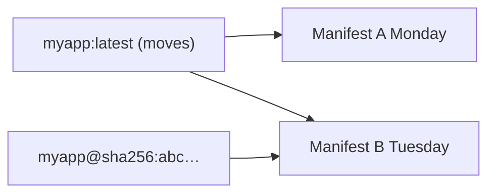

# Month 15 · Week 2 · Day 5
# Tags, Digests, Registries: Why `latest` Is a Lie

**Program:** Full-Stack Mastery · 18 months  
**Phase:** 5 — Production engineering  
**Month index:** [../../README.md](../../README.md)  
**Week 2:** [1](day-01.md) · [2](day-02.md) · [3](day-03.md) · [4](day-04.md) · Day 5 (today) · [6](day-06.md) · [7](day-07.md)  
**Week rhythm today:** Tests / docs (a runbook you could hand a teammate)  
**Student state:** You published a port and kept a volume. Today you name **what you actually ran**. “We deployed `myapp:latest`” is not a sentence a postmortem can use.  
**Study time:** 3–4 focused hours  
**Prereq:** Day 4 gate passed.

Labs: `~/fullstack-lab/month-15/week-02/day-05/`. You will **inspect** tags and digests on images you already have and write `IMAGES.md`. You do **not** need an account on Docker Hub or GHCR to learn the **idea**. You will not push Project 7. You will not paste secrets into a tag.

---

## How to use this textbook

1. Read until tag vs digest is as clear as branch vs commit.  
2. Inspect a local image’s `RepoTags` and `RepoDigests` / `Id`.  
3. Write `IMAGES.md` as policy for **this** course and for **your** future deploys.  
4. Optional review links are for later rechecking.

---

## How to read this chapter

An image **id** (`sha256:…`) is content. A **tag** is a mutable pointer (like a branch). A **digest** (`repo@sha256:…`) is an immutable pointer to a manifest (like a commit, with extra registry nuance you will name honestly).



**Wrong belief:** “`python:3.12` and `python:latest` are pinned.”  
**Correct:** `3.12` still moves when 3.12.7 becomes 3.12.8. `latest` moves whenever the publisher wants. For **reproducible** deploys you record a **digest** or a tag you **control** and never retag.

**Wrong belief:** “The registry is Docker Hub only.”  
**Correct:** a **registry** is a server that stores image manifests and blobs. Docker Hub is one. **GHCR** (GitHub Container Registry) is one. Cloud vendors run others. `docker pull` uses a registry. Compose will too.

Kubernetes imagePullPolicy drama is not this month. The same tag lie still applies there later.

---

## Today's contract

By the end of this day you will be able to:

1. Explain **tag**, **image id**, and **digest** in complete sentences.  
2. Show `docker image inspect` fields that prove a tag is not content.  
3. Describe **Docker Hub** and **GHCR** as registries (login conceptually; no required push).  
4. Write **`IMAGES.md`**: naming policy, what `latest` may be used for (never production pin), how to record what ran.  
5. Explain why copying `latest` from a Slack screenshot is not an incident artifact.

**Today's gate.** Closed-book:

> A tag moves. A digest names a manifest. I inspect images before I trust a name. I do not pin production to latest. I wrote IMAGES.md. Registries store images; Hub and GHCR are two.

---

## Time box

| Block | Minutes | Work |
|---|---|---|
| A | 45 | Theory |
| B | 70 | Type-along: inspect, retag locally, document |
| C | 60 | Independent: IMAGES.md + failure stories |
| D | 15 | Git |
| E | 15 | Recall |

---

# Block A — Theory

## 1. Why names lie

Humans need names: `cafeteria-menu:day2`. The engine needs bytes. Between them sits a **tag** in a **repository**.

When you `docker build -t stamp-api:day4 .` you create (or reuse) an image id and add a tag pointing at it. If you build **again** with the same tag, the tag **moves** to the new id. The old image may become `<none>` dangling unless something else tags it.

This is useful in a lab. It is lethal in production if “restart the container” pulls a different `latest` than last week.

## 2. Image id

`docker images --no-trunc` or `docker image inspect --format '{{.Id}}'`. The id is a sha256 of the **image configuration** (not a number you invent). Two tags can point at the **same** id (aliases). One tag cannot point at two ids at once.

## 3. Manifest and digest

Registries speak the **distribution spec**: a **manifest** (or manifest list for multi-arch) references layer blobs. The **digest** is the hash of the manifest.

When you pull `ubuntu:24.04`, the client resolves the tag to a digest, then pulls blobs. After pull, inspect may show `RepoDigests`. That string is what you should copy into a lockfile **if** you need bit-for-bit the same image later.

**Honest nuance:** rebuilding locally with the same Dockerfile can produce a **different** id (timestamps, base image updates). Digests shine when you **pulled** or **pushed** a specific manifest. Local `docker build` tags are still “whatever we built on this machine.”

**Wrong belief:** “I will never need a registry; I only build on the laptop.”  
**Correct:** the moment a teammate or CI must run the **same** bits, you push to a registry or share a saved tar (`docker save` / `load`) — both are naming problems. Month 16 CI will return here.

## 4. Registries as an idea

| Registry | Typical image name shape | Who authenticates |
|---|---|---|
| Docker Hub | `library/python` or `python` (official), `user/repo` | docker login, rate limits for anonymous pull |
| GHCR | `ghcr.io/org/repo` | GitHub token / SSO |
| Self-hosted | `registry.example.com/app` | whatever you configured |

**Push** uploads blobs + manifest and sets a tag. **Pull** downloads. **Public** vs **private** is access control. Official images on Hub are convenient and still **move** under tags.

You do **not** need to push today. You **do** need to write: “we would push `ghcr.io/<you>/stamp-api:0.1.0` and also record the digest in the release notes.”

Never put passwords in image names, labels, or `docker login` commands pasted into chat (Week 1 Day 5 habit).

## 5. latest is a lie

`latest` is an ordinary tag. It is **not** “the newest semantically.” It is “whatever last got tagged `latest`.” Some projects never update `latest`. Some update it to a **beta**. Some images do not have `latest` at all.

In this course:

- Lab tags: `day4`, `week2`, `dev` — fine.  
- Anything you might redeploy: **version tag you own** (`0.1.0`) plus digest in notes when pulled.  
- `latest` in a README for a one-shot `docker run` demo is acceptable if you say it is a demo.

**Wrong belief:** “CI should always pull latest so we stay fresh.”  
**Correct:** CI should pull a **known** tag/digest so a red test is about **your** commit, not a surprise base image. Dependabot-style updates are **explicit** PRs, not silent latest.

## 6. Multi-arch (name only)

`python:3.12-slim` on Hub is often a **manifest list**: amd64 and arm64. Docker Desktop on Windows/WSL typically runs **amd64** Linux VMs (or arm on ARM PCs). `docker image inspect` Architecture field matters when a teammate has an M-series Mac. One sentence in `IMAGES.md`: we record **architecture** when something “works on my machine.”

## 7. What IMAGES.md must prevent

- Slack: “just run `myapp:latest`” as the only artifact  
- Dockerfile `FROM python:latest`  
- Retagging `prod` over an image that is already in production without a new version  
- Committing a Hub password

---

# Block B — Type-along

```bash
mkdir -p ~/fullstack-lab/month-15/week-02/day-05
cd ~/fullstack-lab/month-15/week-02/day-05
```

### B1 — Inspect something you have

```bash
docker images
docker image inspect hello-world --format 'Id={{.Id}} Tags={{json .RepoTags}} Digests={{json .RepoDigests}} Arch={{.Architecture}}'
```

If hello-world was pruned, `docker pull hello-world` first. Repeat for `stamp-api:day4` if it still exists, or `python:3.12-slim`.

Write `INSPECT.md`: paste **those formatted lines** (ids are not secrets). One paragraph: which fields would you put in a postmortem.

### B2 — Retag locally (no registry)

```bash
docker pull python:3.12-slim
docker tag python:3.12-slim month15-python:demo
docker images | grep -E 'python|month15-python'
docker image inspect month15-python:demo --format '{{.Id}}'
docker image inspect python:3.12-slim --format '{{.Id}}'
```

The ids should **match**. Two names, one content. Write `TAG.md`.

Then:

```bash
docker tag python:3.12-slim month15-python:latest
```

You now have `latest` pointing at the same id. Write: latest did **zero** magic.

### B3 — Move a tag (the lie, locally)

Build a tiny image in this folder:

`echo 'FROM hello-world' > Dockerfile`

```bash
docker build -t month15-lie:latest .
docker image inspect month15-lie:latest --format '{{.Id}}'
echo 'FROM ubuntu:24.04' > Dockerfile
docker build -t month15-lie:latest .
docker image inspect month15-lie:latest --format '{{.Id}}'
docker images month15-lie
```

The tag `month15-lie:latest` **moved**. The first image may show `<none>` if untagged. Write `LIE.md`: this is what production `latest` does across days.

```bash
docker rmi month15-lie:latest || true
```

### B4 — Digest from a pull (if present)

```bash
docker pull python:3.12-slim
docker image inspect python:3.12-slim --format '{{json .RepoDigests}}'
```

Copy one digest string into `DIGEST.txt`. If empty (built locally only), write why: **no registry digest until pull/push**.

---

# Block C — Independent: IMAGES.md

Write **`IMAGES.md`** with complete sentences, required sections:

1. **Definitions** — tag, id, digest, registry.  
2. **Hub vs GHCR** — one paragraph each: who hosts, example name shape, when this program might use them (Month 16 preview: CI push).  
3. **Policy for fullstack-lab** — tags like `week02-day05`; never commit secrets; `latest` only for throwaway demos.  
4. **Policy for Project 7 (future)** — you will **not** deploy `project7:latest` as the only pin; you will use a version tag **you** bump. Names only, no source.  
5. **Incident artifact** — the inspect command you will run.  
6. **latest is a lie** — the B3 experiment in four sentences.  
7. **Not Kubernetes** — one sentence: orchestrators pull the same lying tags unless you digest-pin.

### Stories (`STORIES.md`)

**S1.** Monday prod is `api:latest`. Tuesday Hub `latest` is a broken build. Auto-pull on restart. What happened?  
**S2.** Two engineers `docker build -t api:1.0 .` on different laptops without a registry. Same tag, different ids.  
**S3.** Dockerfile `FROM python:latest`. Six months later CI is mysteriously red.  
**S4.** Someone `docker login` and pastes the token in Discord (tie to Week 1 Day 5).

Answers in your words; no exploit; no “hack the registry.”

---

# Block D — Git

```bash
cd ~/fullstack-lab
git add month-15/week-02/day-05
git commit -m "Month 15 Day 5: IMAGES.md tags, digests, latest-is-a-lie lab."
```

---

# Block E — Recall

1. Tag vs digest.  
2. Can two tags share an id?  
3. Does `latest` mean newest semver?  
4. Name two registries.  
5. Why local build may lack RepoDigests.  
6. Why `FROM python:latest` hurts CI.

---

## Office hours

**RepoDigests empty.** Local build. Pull an official image to see digests.

**`docker push` denied.** You do not need push today. Do not create a Hub repo just to feel done.

**Rate limit on Hub pull.** Wait, or use an image you already have. Do not scrape random mirrors.

---

## Definition of done

- [ ] INSPECT.md, TAG.md, LIE.md exist  
- [ ] IMAGES.md has all seven sections  
- [ ] STORIES.md S1–S4  
- [ ] Gate paragraph closed-book  
- [ ] Commit exists  

---

## Optional review links

- [Docker: docker tag](https://docs.docker.com/reference/cli/docker/image/tag/)  
- [Docker Hub](https://docs.docker.com/docker-hub/)  
- [GHCR: Working with the Container registry](https://docs.github.com/en/packages/working-with-a-github-packages-registry/working-with-the-container-registry)  
- [OCI image spec (overview)](https://github.com/opencontainers/image-spec)  

---

# Lecture: four stories, slowly

**S1.** Auto-pull `api:latest` on restart is a **mutable pointer**. Monday’s process is not Tuesday’s bytes. Pin `api:0.4.2` or `api@sha256:…`. Record the digest in the release notes you will write in Month 16.

**S2.** Two laptops, same tag `1.0`, no registry: you do not have one artifact. You have two builds. A registry (Hub, GHCR, or `docker save`) is how a tag becomes a **shared** pointer. Until then, say “my local 1.0.”

**S3.** `FROM python:latest` moves when the publisher retags. Six months later your CI is a different interpreter. Pin `python:3.12.6-slim` or a digest. Still rebuild **on purpose** when you want upgrades.

**S4.** A Hub token in Discord is a **credential leak** (Week 1 Day 5). Revoke the token; do not “hope nobody noticed.” The tag lecture is also an ops-hygiene lecture.

## inspect format you should memorize

```bash
docker image inspect IMAGE --format '{{.Id}} {{json .RepoTags}} {{json .RepoDigests}} {{.Architecture}}'
```

Write those four into every postmortem template in IMAGES.md section 5.

## What “official image” means

On Docker Hub, `python` without a slash is a **library** image. `alice/python` is a user repo. Trust is not binary: official images still **move tags**. Official means “this is the publisher Docker documents,” not “immutable.”

**Wrong belief:** “Digest means the Dockerfile is reproducible.”  
**Correct:** digest means **that manifest’s blobs**. A rebuild can produce a new digest from the same Dockerfile. Pin what you **pulled** or **pushed**.

**Wrong belief:** “GHCR is only for GitHub Actions.”  
**Correct:** it is a registry. Actions will **push** in Month 16. Today you only need the **name shape** `ghcr.io/org/app:tag`.

If `RepoDigests` is `[]`, you built locally and never pulled that tag from a registry. Say so in DIGEST.txt. That honesty is the lesson.

---

## Tomorrow

**Independent:** containerize a **tiny FastAPI** you invent in fullstack-lab — not Project 7.
