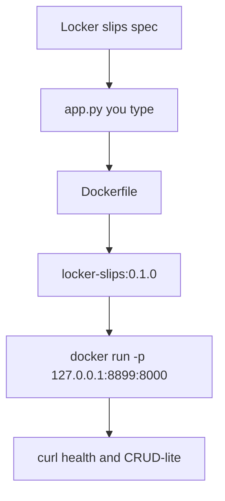

# Month 15 · Week 2 · Day 6
# Independent: Containerize a Tiny FastAPI (Lab App, Not Project 7)

**Program:** Full-Stack Mastery · 18 months  
**Phase:** 5 — Production engineering  
**Month index:** [../../README.md](../../README.md)  
**Week 2:** [1](day-01.md) · [2](day-02.md) · [3](day-03.md) · [4](day-04.md) · [5](day-05.md) · Day 6 (today) · [7](day-07.md)  
**Week rhythm today:** Independent implementation  
**Student state:** You can write a Dockerfile, publish a port, and name a tag honestly. Today you put those together on a **new** tiny API.  
**Study time:** 3–4 focused hours  
**Prereq:** Day 5 gate passed.

This textbook will **not** give you a finished app. It will give you a **spec envelope** and a **forbidden list**. Domain is imposed so you cannot paste Project 7: **campus locker slips**.

Labs: `~/fullstack-lab/month-15/week-02/day-06/`. Pattern later may move toward Project 7 — **not today**.

---

## How to use this textbook

1. Invent the locker-slip API **inside the spec**. Empty swagger is failing work.  
2. Dockerfile + `.dockerignore` + `README.md` (how to build and curl).  
3. Tag it `locker-slips:0.1.0` — not only `latest`.  
4. Optional review links are for later rechecking.

---

## How to read this chapter

Week 2’s skill is not “I ran nginx.” It is “I can **ship a process I wrote** as an image I can explain.”



**Wrong belief:** “I’ll copy Project 7 into the context to save time.”  
**Correct:** you will copy coupling, secrets, and a context the size of a house. The gym is small on purpose. Week 3 Compose pattern is what you may later copy **as a pattern**.

**Wrong belief:** “Independent day means no theory.”  
**Correct:** the spec below **is** the teacher. If you cannot finish, the gap is yesterday’s layer, not a missing YouTube video.

---

## Today's contract

By the end of this day you will be able to:

1. Run a FastAPI app **you wrote** in a container.  
2. `GET /health` 200; create and list **slips**.  
3. Show `docker image inspect` tag `0.1.0`.  
4. Document build/run/curl in `README.md`.  
5. Keep `.env` secrets out of the image (you should not need a real secret; prove `.dockerignore`).

**Today's gate.** Closed-book:

> I containerized a lab FastAPI I typed. The tag is versioned. The context is small. I can curl health on a published port. I did not paste Project 7.

---

## Time box

| Block | Minutes | Work |
|---|---|---|
| A | 25 | Inventory: commands you will use |
| B | 40 | App + tests of the contract with curl (maybe without Docker first)  
| C | 90 | Dockerfile, build, run, evidence |
| D | 20 | Self-review against the checklist |
| E | 15 | Recall + commit |

---

# Block A — Inventory (no essays yet)

Write `INVENTORY.md`:

- `docker version` server OK?  
- Base image you will FROM (python 3.12 slim recommended)  
- Host port you will publish (8899 suggested)  
- Tag `locker-slips:0.1.0`  
- Whether Day 4 stamp-api still occupies a port — `ss -lnt | grep 8877` etc.

Stop leftover containers:

```bash
docker ps -a
```

Do not `docker rm $(docker ps -aq)` blindly if you still need Day 4 evidence; rm **names you recognize**.

---

# Block B — Spec envelope: locker slips

Create the folder and a **venv on Ubuntu if you want host pytest** — optional. Docker is the deliverable.

### Must

| Method | Path | Rules |
|---|---|---|
| GET | `/health` | 200 `{"status":"ok"}` |
| POST | `/slips` | JSON `{"locker": str min 1, "note": str min 1}` → 201 `{"id": int, "locker": ..., "note": ...}` |
| GET | `/slips/{id}` | 200 or 404 |
| GET | `/slips` | 200 array |

In-memory dict. Unique `locker` → 409. Empty strings → 422 (Pydantic). No Postgres. No Redis. No auth. No frontend.

Uvicorn: `--host 0.0.0.0 --port 8000`.

### Should if time

`DELETE /slips/{id}` → 204 empty body. Remember: do not `.json()` on 204 if you test later.

### Must not

- Project 7 models, routers, or copy-paste  
- `COPY . /app` without `.dockerignore`  
- `CMD python app.py` shell form as the only start if you can write exec form uvicorn  
- `FROM python:latest`  
- Bind-mounting the Windows `C:\` project  
- Kubernetes YAML  
- Publishing `0.0.0.0:80` on a cafe Wi-Fi; use `127.0.0.1:8899`

### Fake secret to ignore

Create `secret.env` with `TOKEN=not-a-real-secret`. `.dockerignore` it. After build, `docker run --rm locker-slips:0.1.0 ls /app` must **not** show `secret.env`.

---

# Block C — Dockerfile and evidence

You type `app.py`, `requirements.txt` (`fastapi`, `uvicorn[standard]`, `pydantic` as needed), `Dockerfile`, `.dockerignore`.

Suggested order in Dockerfile (from Day 2 recap in your head):

1. FROM python:3.12-slim  
2. WORKDIR /app  
3. COPY requirements.txt  
4. RUN pip install --no-cache-dir -r requirements.txt  
5. COPY app.py  
6. EXPOSE 8000  
7. CMD exec form uvicorn  

Build:

```bash
mkdir -p ~/fullstack-lab/month-15/week-02/day-06
cd ~/fullstack-lab/month-15/week-02/day-06
# you create files here
docker build -t locker-slips:0.1.0 .
docker tag locker-slips:0.1.0 locker-slips:week2
```

`week2` is an extra alias — same id (Day 5). Still **prefer 0.1.0** in the README.

```bash
docker rm -f locker-slips 2>/dev/null || true
docker run -d --name locker-slips -p 127.0.0.1:8899:8000 locker-slips:0.1.0
docker logs locker-slips
curl -sS http://127.0.0.1:8899/health
curl -sS -X POST http://127.0.0.1:8899/slips -H "Content-Type: application/json" \
  -d '{"locker":"B-12","note":"umbrella"}'
curl -sS http://127.0.0.1:8899/slips
curl -sS http://127.0.0.1:8899/slips/1
curl -sS -o /dev/null -w "%{http_code}" http://127.0.0.1:8899/slips/999
```

Expect 404 on 999. Duplicate locker POST → 409.

Write `EVIDENCE.md`: commands and status codes. `docker image inspect locker-slips:0.1.0 --format '{{.Id}} {{json .RepoTags}}'`.

Prove ignore:

```bash
docker run --rm --entrypoint ls locker-slips:0.1.0 /app
```

`secret.env` absent. `README.md` sections: build, run, curl, stop (`docker rm -f locker-slips`), tag policy pointer to Day 5.

If the app only works with a bind mount, you did not COPY source — fix that. Bind mounts are allowed as an **extra** dev mode in README, not as the only way.

---

# Block D — Self-review

`CHECK.txt` yes/no:

- [ ] Health 200  
- [ ] 201 create, list, 404, 409, 422  
- [ ] Tag 0.1.0  
- [ ] secret.env not in image  
- [ ] Exec form CMD  
- [ ] README can be followed closed-book tomorrow  
- [ ] No Project 7 files  
- [ ] `docker stop` then `docker start` still serves (in-memory data may **reset** — write that honesty in README: writable layer / memory)  

In-memory **will** reset on new container. That is correct. Persistence was Day 4 volumes; you may add a volume **optional stretch**, not required.

---

# Block E — Recall and git

Recall:

1. Why `--host 0.0.0.0`.  
2. Why not FROM latest.  
3. Why not COPY Project 7.  
4. Tag vs latest.  
5. What happens to in-memory dict on rm.

```bash
cd ~/fullstack-lab
git add month-15/week-02/day-06
git commit -m "Month 15 Day 6: locker-slips FastAPI image 0.1.0."
```

Keep `secret.env` gitignored too.

---

## Office hours

**422 on valid JSON.** Field names must match the spec: `locker`, `note`.

**Container exits immediately.** `docker logs`. Usually: module `app` not found (WORKDIR/COPY), or CMD used `uvicorn.app` typo.

**Port in use.** `ss -lptn | grep 8899`. Another locker-slips. `docker rm -f`.

**pip too slow.** You are on a slow network. Keep slim base; do not switch to a mystery image.

**I containerized Project 7 anyway.** It does not count for Day 6. Build locker-slips.

---

## Definition of done

- [ ] Image `locker-slips:0.1.0` runs  
- [ ] EVIDENCE.md curl statuses  
- [ ] README.md  
- [ ] secret.env not in image  
- [ ] Commit exists without secrets  

---

## Optional review links

- [FastAPI First Steps](https://fastapi.tiangolo.com/tutorial/first-steps/)  
- [docker build](https://docs.docker.com/reference/cli/docker/buildx/build/)  
- [Dockerfile CMD](https://docs.docker.com/reference/dockerfile/#cmd)  

---

# Lecture: a FastAPI image that actually listens

Uvicorn inside a container must bind **`0.0.0.0`**. Binding `127.0.0.1` makes the server reachable only from **inside** the container. `-p 8899:8000` will then look “open” on the host (`ss` shows docker-proxy) while `curl` hangs or resets. `docker logs` may still say “Uvicorn running on http://127.0.0.1:8000”. That sentence is the bug.

```dockerfile
CMD ["uvicorn", "app:app", "--host", "0.0.0.0", "--port", "8000"]
```

The **right** of `-p` must match `--port`. `-p 8899:80` with uvicorn on 8000 is a silent miss (Week 2 Day 4 WRONG-PORT).

## In-memory honesty

`GET /slips` after `docker restart locker-slips` may still have data (same writable layer). `docker rm -f` then `run` again **loses** the dict. README must say this. Persistence is a **volume** (Day 4), not a hope.

## 409 and 422

Unique `locker` → 409 is an **application** rule. Empty `note` → 422 is **Pydantic**. If you used `dict` instead of a model, 422 may never happen. The spec asked for 422. Add a BaseModel.

## secret.env proof

```bash
docker run --rm --entrypoint ls locker-slips:0.1.0 -la /app
```

If `secret.env` appears, `.dockerignore` did not match, or you COPY’d it by name. Fix ignore; rebuild **without** cache if needed: `docker build --no-cache -t locker-slips:0.1.0 .`

**Wrong belief:** “gitignore already blocked it.”  
**Correct:** gitignore is git. Docker context is `.dockerignore`.

**Wrong belief:** “Tag week2 is a version.”  
**Correct:** it is an alias. README’s canonical tag is `0.1.0`.

Write `README.md` so Day 7 you can rebuild without this textbook. That is the independent-day standard.

---

## Tomorrow

**Week review:** debug broken Dockerfiles (context too big, COPY path, running as root, CMD vs RUN). Do not start Week 3 if locker-slips does not curl.
