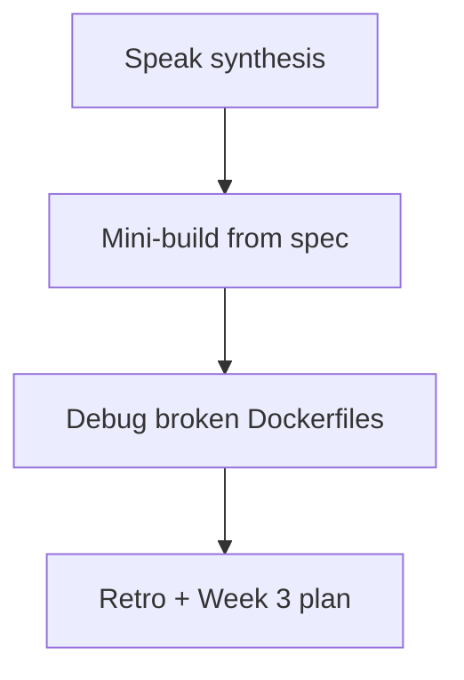

# Month 15 · Week 2 · Day 7
# Week Review — Docker: Image, Dockerfile, Data, Names

**Program:** Full-Stack Mastery · 18 months  
**Phase:** 5 — Production engineering  
**Month index:** [../../README.md](../../README.md)  
**Week 2:** [1](day-01.md) · [2](day-02.md) · [3](day-03.md) · [4](day-04.md) · [5](day-05.md) · [6](day-06.md) · Day 7 (today)  
**Week rhythm today:** Review, repair, plan Week 3  
**Student state:** You ran hello-world, wrote Dockerfiles, kept a volume, named tags, containerized locker-slips. Today those ideas must still live in your head — from **this file**.  
**Study time:** 3–4 focused hours

Do not start Week 3 because the calendar moved. Compose on a student who thinks `latest` is a version is two problems.

Work in `~/fullstack-lab/month-15/week-02/day-07/`. Not Project 7. Ubuntu bash. Kubernetes is not this month.

---

## How to read this chapter

This is a **closed-book teaching day**. The synthesis **is** the Week 2 lesson.



Days 1–6 closed during mini-build. Repair from **this** recap.

---

## Week synthesis (the lesson, in this book)

A container **shares a Linux kernel**. Week 1 still applies: processes, signals, `/etc` **inside** the container, ports. Docker Desktop on Windows hosts that kernel via WSL2. You type `docker` in **Ubuntu**.

**Image** = immutable layers + config + default command. **Container** = instance + writable layer + a process as PID 1. `docker ps` is **running**. `hello-world` **exits**; that is success. `docker rm` deletes containers; `docker rmi` deletes images. `docker stop` sends **SIGTERM** then **SIGKILL**.

**Dockerfile.** `FROM` base. `RUN` **build-time**. `COPY` from **build context**. `CMD` default command (overridden by `docker run IMAGE args`). `ENTRYPOINT` fixed binary (args append). Exec form JSON arrays: PID 1 is your app (signals). `EXPOSE` does not publish. `WORKDIR` persists; `cd` in a RUN does not.

**Layers.** Copy dependency files, `RUN pip`, copy source — so code edits do not reinstall. **Context** is the directory in `docker build .`. **`.dockerignore`** keeps `.git`, venvs, secrets, junk out. Huge context is a defect. Wrong COPY path is a defect. `RUN python app.py` as a substitute for CMD is a defect.

**Runtime.** `-p host:container` publishes. App listens **inside** (8000) on **0.0.0.0** to be reachable. **Named volume** survives `docker rm`. **Bind mount** is a host path. User-defined **bridge** DNS: container **name**. Host curls localhost:publishedPort, not `http://container-name`.

**Config.** `-e` runtime env. Do not bake secrets into layers. **Tags move.** **Digests** pin manifests from a registry. **`latest` is a lie.** Hub and GHCR are registries (ideas). Record `0.1.0` plus inspect id.

**Root.** Images often run as root today; Week 3 will add `USER`. You must still **name** it as a smell (debug D).

**Wrong belief:** “Compose is required to learn volumes.”  
**Correct:** you already passed `-v` and `--network`. Compose will YAML the same flags.

**Wrong belief:** “Kubernetes this week.”  
**Correct:** no.

---

## Today's contract

**Today's gate.** Closed-book:

> I can explain image vs container, write a small Dockerfile from spec, say why context and COPY break, why latest lies, and I diagnosed the four Dockerfile defects in this file.

---

## Time box

| Block | Minutes | Work |
|---|---|---|
| 1 | 30 | Speak synthesis; `exam-01.md` |
| 2 | 55 | Mini-build: lost-and-found API image |
| 3 | 40 | Debug A–D (and E stretch) |
| 4 | 20 | Review locker-slips README vs reality |
| 5 | 20 | Rebuild mini; break CMD; restore |
| 6 | 15 | Design: what Compose will wrap |
| 7 | 15 | Retro + Week 3 plan |

---

# Complete explanation — four defects you must still own

## 1. Context too big

`docker build .` from `$HOME` sends everything not ignored. Slow, leaky, cache-busting. Fix: build from the app directory; `.dockerignore`; never COPY the world.

## 2. COPY path

`COPY app.py` looks in the **context root**, not “where I think the Dockerfile lives” if you used `-f` oddly, and not inside a subdirectory you forgot. Error: `failed to compute cache key` / file not found. Fix: path relative to context; or change context.

## 3. Running as root

Default USER is often `root` (UID 0 **inside**). A RCE in the app is then root in that namespace. Week 3: `useradd` + `USER`. Today: `docker exec whoami`. Fix is not “Docker is safe.”

## 4. CMD vs RUN

`RUN uvicorn ...` tries to start the server **at build** (hangs or fails). `CMD` starts at **run**. Mixing them up is the “image built but nothing listens” or “build never finishes” pair.

---

# Block 1 — Speak

Cover: image/container/process; RUN vs CMD; -p; volume vs bind; latest; four defects. `exam-01.md` 15–25 lines.

```bash
mkdir -p ~/fullstack-lab/month-15/week-02/day-07
cd ~/fullstack-lab/month-15/week-02/day-07
```

---

# Block 2 — Mini-build (Days 1–6 closed)

**Spec: lost-and-found desk** — not locker-slips copy, not Project 7.

```bash
mkdir -p mini
cd mini
```

`app.py`:

| Method | Path | Rules |
|---|---|---|
| GET | `/health` | 200 `{"status":"ok"}` |
| POST | `/items` | 201 `{"id","label"}` label min 1 |
| GET | `/items` | 200 array |

In-memory. Dockerfile: slim, requirements first, exec form uvicorn 0.0.0.0:8000, tag `lostfound:0.1.0`. `.dockerignore` with `*.md` and `secret.env`. Create `secret.env` dummy; prove it is not in `/app`.

```bash
docker build -t lostfound:0.1.0 .
docker run -d --name lostfound -p 127.0.0.1:8901:8000 lostfound:0.1.0
curl -sS http://127.0.0.1:8901/health
```

`WHOAMI.txt`: `docker exec lostfound whoami` — expect `root` unless you already added USER (not required). One sentence: Week 3 will change this.

Stop: `docker rm -f lostfound`.

---

# Block 3 — Debug Dockerfiles

Write `exam-03-debug.md`. For each: **what fails or hurts**, **root cause**, **fix**. You may type the broken files in `broken/` and build if you want evidence; paper is enough if you are honest.

**A. Context too big**

Someone runs `docker build -t x .` from `~` with Dockerfile:

```dockerfile
FROM python:3.12-slim
COPY . /app
```

No `.dockerignore`. Home contains `.ssh` and `junk.bin` 2GB.

**B. COPY path**

Context is `mini/` with `src/app.py`. Dockerfile: `COPY app.py /app/app.py`.

**C. Running as root**

`docker exec whoami` → `root`. Junior: “It’s containerized so it’s fine.”

**D. CMD vs RUN**

```dockerfile
FROM python:3.12-slim
WORKDIR /app
COPY app.py .
RUN ["uvicorn", "app:app", "--host", "0.0.0.0", "--port", "8000"]
```

**E. (stretch)** `CMD python app.py` shell form; `docker stop` takes 10 seconds always. Tie to SIGTERM / PID 1 = `sh`.

---

# Block 4 — Review Day 6

Open **only** your locker-slips `README.md`. One gap: `GAP.txt`. If the image is missing, Week 2 Day 6 is incomplete — do it before Week 3.

---

# Block 5 — Break CMD; restore

In mini, temporarily change CMD to `["python", "-c", "print('oops')"]`, rebuild, run, curl health **fails**. Restore uvicorn CMD, rebuild, curl 200. Paste fail snippet into `exam-05-fail.txt`. This is not Month 14’s feature-break gate; it is “I can see a wrong CMD.”

---

# Block 6 — Design

`design.md` (10–15 lines): Week 3 Compose will list **services**. Which flags from this week become `ports`, `volumes`, `environment`, `build`? What still will not be Kubernetes.

---

# Block 7 — Retro

`retro.md`: weakest skill; whether you still trust `latest`; Week 3 question about `depends_on`.

## Debug keys (after you write A–E)

**A.** Context is `~`. Ignore/copy specific files; `cd` to project. Secrets in layers if COPY succeeded.  
**B.** COPY paths relative to context; use `COPY src/app.py`.  
**C.** Isolation ≠ non-root. Add USER (Week 3).  
**D.** RUN at build tries to start server. Use CMD/ENTRYPOINT.  
**E.** Shell form: sh as PID 1; exec form.

If you wrote “install Kubernetes” for any, rewrite.

```bash
cd ~/fullstack-lab
git add month-15/week-02/day-07
git commit -m "Month 15 Week 2 review: lostfound mini and Dockerfile defects."
```

---

## Office hours

**Mini copied locker-slips wholesale.** Change domain to lost-and-found labels. Copying is not review.

**Build from Windows path.** Ubuntu `~/fullstack-lab`.

**whoami already non-root.** Fine — write how you did it; still explain C.

---

## Definition of done

- [ ] exam-01.md  
- [ ] lostfound:0.1.0 health 200  
- [ ] Debug A–D written, then checked  
- [ ] GAP.txt for Day 6  
- [ ] Week 3 not started on a missing mini  

---

## Optional review links

- [Dockerfile reference](https://docs.docker.com/reference/dockerfile/)  
- [Best practices: images](https://docs.docker.com/build/building/best-practices/)  
- [docker stop](https://docs.docker.com/reference/cli/docker/container/stop/)  

---

# Lecture: broken Dockerfiles, slowly

Read a Dockerfile top to bottom asking: **when does this run — build or container start?** If the answer is “the server,” it is CMD/ENTRYPOINT. If the answer is “install a compiler,” it is RUN.

Ask: **where does COPY look?** Always context.

Ask: **who is UID 0?** If you did not USER, it is root.

Ask: **what did we actually tag?** inspect.

## Defect A, with a command

```bash
cd ~
# do not actually do this if your home is huge — predict
# docker build -t x .
```

The builder archives the context. `.ssh`, `Downloads`, `AppData` via `/mnt` if you were in the wrong place — **do not** learn this by leaking keys. Stay in `~/fullstack-lab/month-15/week-02/day-07/mini`. `.dockerignore` is the seatbelt, not a reason to build from `~`.

## Defect B, with a tree

```text
mini/
  Dockerfile
  src/app.py
```

`COPY app.py` looks for `mini/app.py`, not `mini/src/app.py`. Error text: file not found / cache key. Fix the left-hand COPY path.

## Defect C, with id

```bash
docker exec lostfound id
```

`uid=0(root)` is the default. Week 3 `USER`. Today you **name** it. Running as root in a lab is not a CVE write-up; shipping that habit is.

## Defect D, with a hang

`RUN uvicorn ...` at build: the build **starts a server**. You wait, or it fails when the builder kills the step. `CMD` is the line `docker run` uses. If you already built `menu-wrong` in Day 2, you felt this.

## Defect E, signals

Shell form: `CMD uvicorn app:app --host 0.0.0.0 --port 8000` → `/bin/sh -c`. `docker stop` TERMs sh. Exec form JSON array → uvicorn is PID 1 and can finish requests.

**Closed-book cards** (retro.md):

1. Image vs container.  
2. ps vs ps -a.  
3. RUN vs CMD.  
4. Left side of -p.  
5. Named volume vs bind.  
6. Why 0.0.0.0 inside.  
7. latest.  
8. Two registries.  
9. .dockerignore vs .gitignore (similar syntax, different job: context vs git).  
10. docker stop signals.

Miss more than two: synthesis, then mini, then Week 3.

---

## Next week

**Week 3 — Compose and production images:** compose.yaml, depends_on as start order not readiness, multi-stage, non-root, healthchecks, named volumes for Postgres, env files, four lab services.
