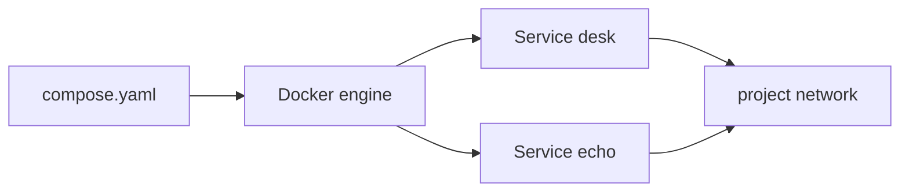
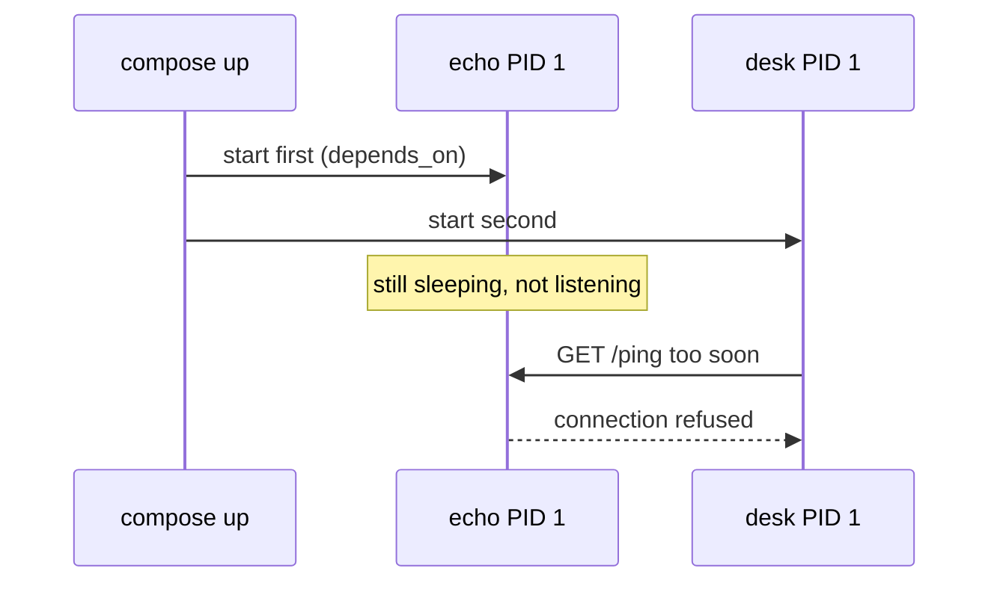

# Month 15 · Week 3 · Day 1
# Compose: Services, Networks, and depends_on as Start Order

**Program:** Full-Stack Mastery · 18 months  
**Phase:** 5 — Production engineering  
**Month index:** [../../README.md](../../README.md)  
**Week 3:** Day 1 (today) · [2](day-02.md) · [3](day-03.md) · [4](day-04.md) · [5](day-05.md) · [6](day-06.md) · [7](day-07.md)  
**Week rhythm today:** Learn + type-along  
**Student state:** Week 2’s gate is true: you can build an image, publish a port, and explain a volume. Today YAML will **name** those flags so two processes start as a **stack**.  
**Study time:** 3–4 focused hours

**This week covers:** Compose services, multi-stage and non-root images, healthchecks, Postgres volumes, env files, four lab services.

Today: `compose.yaml` **services**, **networks**, and the honest meaning of **`depends_on`**: start **order**, not **readiness**. Healthchecks are Day 4. Do not skip Day 4 and then blame Compose.

Labs: `~/fullstack-lab/month-15/week-03/day-01/`. Tiny **desk + echo** pair — not Project 7. Not Kubernetes. Ubuntu bash. `docker compose` (plugin) in this course.

---

## How to use this textbook

1. Read until you can say `depends_on` without the word “ready.”  
2. Type a two-service compose file. Break DNS on purpose. Fix it.  
3. Watch logs of the API that talks to a neighbor **too soon** — even if both “started.”  
4. Optional review links are for later rechecking.

---

## How to read this chapter

Compose is a **declarative** file for: build or image name, command, ports, volumes, environment, **networks**, restart policy (Day 4). It talks to the **same** Docker engine as Week 2. It is not an orchestrator cluster. It is a rehearsal for production-shaped **wiring**.



**Wrong belief:** “If Compose is green, the product is in production.”  
**Correct:** Compose on your laptop is a **rehearsal**. Production still needs images you trust, config you can name, health that means something, and logs you can grep (Week 4). Kubernetes is **not** this month.

**Wrong belief:** “`depends_on: db` waits until Postgres accepts connections.”  
**Correct:** classic `depends_on` waits until the **container has started** (PID 1 launched). Postgres may still be “starting up.” The API will crash, retry, or hang. `depends_on` + `condition: service_healthy` waits on a **healthcheck** — Day 4. Today you will **feel** the race with a slow echo.

---

## Today's contract

By the end of this day you will be able to:

1. Write `compose.yaml` with two **services** and a **network**.  
2. Use **service names as DNS** on that network (Week 2 bridge lesson).  
3. Publish only what the **host** must curl.  
4. Explain **`depends_on` as start order**.  
5. Run `docker compose up --build`, `ps`, `logs`, `down`.

**Today's gate.** Closed-book:

> Services are named containers. They share a Compose network and resolve each other by service name. depends_on orders starts; it does not mean the app inside is ready. I curl localhost published ports from Ubuntu, and service names from inside the network.

---

## Time box

| Block | Minutes | Work |
|---|---|---|
| A | 50 | Theory |
| B | 60 | Type-along: desk + slow echo |
| C | 65 | Independent: break DNS; document the race |
| D | 15 | Git |
| E | 15 | Recall |

---

# Block A — Theory

## 1. Why YAML exists

Week 2 `docker run` lines were long on purpose. Teams will not paste ten flags into Slack. Compose files are **reviewable** in git (except secrets). The file is usually `compose.yaml` (Compose Specification) or `docker-compose.yml` (older name). This course uses **`compose.yaml`**.

```bash
docker compose version
```

If that fails, Docker Desktop’s Compose plugin is missing. Fix Desktop; do not install a random third compose.

## 2. Services

A **service** is a long-running role: `api`, `db`, `web`. Compose creates **containers** from it (default: one replica). Fields you will use this week:

| Field | Week 2 equivalent |
|---|---|
| `image` | image name |
| `build` | `docker build` |
| `ports` | `-p` |
| `volumes` | `-v` |
| `environment` / `env_file` | `-e` |
| `networks` | `--network` |
| `depends_on` | start order (not a Week 2 flag) |
| `command` | extra args / override CMD |
| `restart` | Day 4 |

**Project name** defaults to the directory name. Containers get names like `day-01-api-1`. DNS name on the network is the **service** name (`api`), not the container name, for most practical curls.

## 3. Networks

Compose creates a **user-defined bridge** for the project by default. All services join it unless you say otherwise. That is why `http://echo:9200` works from `desk` and failed from your laptop without a published port.

You may declare networks explicitly for teaching:

```yaml
networks:
  campus:
    driver: bridge
```

Wrong network is a Week 3 Day 7 defect: service A on `frontend`, database on `backend` only, API forgot to join `backend`.

**Wrong belief:** “I need `network_mode: host` so DNS works.”  
**Correct:** host mode skips Compose DNS and is a special case. You do not need it today.

## 4. depends_on, slowly

```yaml
services:
  desk:
    depends_on:
      - echo
```

Compose starts `echo` before `desk`. That is **order**. If `echo`’s PID 1 is a shell script that sleeps 8 seconds before binding the port, `desk` may still start its FastAPI immediately and fail the first request.

There is a newer form:

```yaml
depends_on:
  echo:
    condition: service_started   # default
    # condition: service_healthy # needs healthcheck
    # condition: service_completed_successfully
```

Today: use **service_started** (implicit) and **document the race**. Day 4: healthcheck + `service_healthy`.

**Wrong belief:** “Restart the API ten times in Compose instead of healthchecks.”  
**Correct:** retries hide the diagnosis. Healthchecks name **ready**. App-level retry with backoff can still be wise — but you should **know** why the first second failed.

## 5. up, down, logs, ps

```bash
docker compose up --build
docker compose up -d --build
docker compose ps
docker compose logs
docker compose logs -f desk
docker compose down
docker compose down -v
```

`-d` detached. `--build` rebuilds images from `build:`. `down` stops and removes containers and the **default network**. `down -v` also removes **named volumes** declared in the file — Week 3 Day 7 “volume wipe.” Do not `-v` casually on a database you like.

`Ctrl+C` on attached `up` sends stop (TERM) to services.

## 6. Build vs image

```yaml
build: .
image: campus-desk:0.1.0
```

`build` produces an image; `image` names it. You can also `image: python:3.12-slim` plus `command:` for a one-liner service (the slow echo today).

## 7. One picture



That sequence is today’s lesson. Not a Compose bug.

## 8. Say it — two minutes

Service vs container; DNS name; depends_on vs ready; down vs down -v; why the host uses published ports.

---

# Block B — Type-along

```bash
mkdir -p ~/fullstack-lab/month-15/week-03/day-01
cd ~/fullstack-lab/month-15/week-03/day-01
docker compose version
```

### B1 — slow echo (no FastAPI)

Create `echo.py`:

```python
import json
import time
from http.server import BaseHTTPRequestHandler, HTTPServer

time.sleep(8)

class H(BaseHTTPRequestHandler):
    def do_GET(self):
        body = json.dumps({"ok": True, "path": self.path}).encode()
        self.send_response(200)
        self.send_header("Content-Type", "application/json")
        self.send_header("Content-Length", str(len(body)))
        self.end_headers()
        self.wfile.write(body)

if __name__ == "__main__":
    HTTPServer(("0.0.0.0", 9200), H).serve_forever()
```

The **sleep is before bind** — a cartoon of Postgres starting. Dockerfile for echo: python slim, COPY echo.py, CMD exec form `python /app/echo.py`.

### B2 — desk API

Create `desk.py` FastAPI (or stdlib urllib if you want fewer deps — FastAPI is fine).

- `GET /health` → 200 local  
- `GET /via-echo` → server-side HTTP GET `http://echo:9200/ping` and return that JSON or 503 with error text  

`ECHO_URL` env default `http://echo:9200/ping`.

Dockerfile for desk: similar to locker-slips. CMD uvicorn `desk:app` 0.0.0.0:8000.

### B3 — compose.yaml

Type (indent with spaces):

```yaml
services:
  echo:
    build:
      context: .
      dockerfile: Dockerfile.echo
    image: campus-echo:0.1.0
  desk:
    build:
      context: .
      dockerfile: Dockerfile.desk
    image: campus-desk:0.1.0
    ports:
      - "127.0.0.1:8910:8000"
    environment:
      ECHO_URL: http://echo:9200/ping
    depends_on:
      - echo

networks:
  default:
    name: campus-day01
```

You may omit the networks block and use the project default. Explicit name helps `docker network ls`.

```bash
docker compose up --build
```

From **another** terminal, immediately:

```bash
curl -sS -w "\n%{http_code}\n" http://127.0.0.1:8910/via-echo
```

Then wait 10 seconds, curl again. Write `RACE.md`: first vs second response. That is `depends_on` as start order.

```bash
docker compose logs echo | head
docker compose ps
```

Ctrl+C or `docker compose down` when done with the attached session.

---

# Block C — Independent

### Task 1 — DNS break

Change `ECHO_URL` to `http://echo-typo:9200/ping`. `up -d`, curl `/via-echo`. Capture 503/error. Restore. Write `DNS.md`: the name must match the **service** key.

### Task 2 — Host vs network

From Ubuntu: `curl http://echo:9200/ping` — should fail DNS. From:

```bash
docker compose exec desk python -c "import urllib.request; print(urllib.request.urlopen('http://echo:9200/ping').read())"
```

(after echo is actually listening). Write `WHERE.md`.

### Task 3 — down -v warning

`docker volume ls` before/after `docker compose down` **without** `-v`. If you declared no volumes, say so. Write one sentence: when we add Postgres, `down -v` is a data funeral.

### Task 4 — Product names only

`PRODUCT.md`: two services you would list for Project 7 (api, db, …). No source. Do not write a real product compose yet if it would paste env secrets.

---

# Block D — Git

```bash
cd ~/fullstack-lab
git add month-15/week-03/day-01
git commit -m "Month 15 Week 3 Day 1: compose desk+echo and depends_on race."
```

---

# Block E — Recall

1. Service DNS name.  
2. depends_on vs health.  
3. Why first /via-echo failed.  
4. down vs down -v.  
5. Why host curl http://echo:9200 fails.  
6. Is Compose Kubernetes?

---

## Office hours

**`docker compose` vs `docker-compose`.** Use `docker compose`. Hyphen binary is legacy.

**YAML indent error.** Spaces, not tabs. Services under `services:`.

**desk built before echo image.** `--build` builds both; depends_on is **runtime** order.

**Race did not happen.** Your machine is fast and 8 seconds was enough before the first curl — curl **immediately** from a second terminal as `up` starts. Increase sleep to 15 if needed.

---

## Definition of done

- [ ] compose up works  
- [ ] RACE.md shows too-soon vs later  
- [ ] DNS.md typo experiment  
- [ ] Gate paragraph closed-book  
- [ ] Commit exists  

---

## Optional review links

- [Compose specification](https://docs.docker.com/compose/compose-file/)  
- [depends_on](https://docs.docker.com/compose/how-tos/startup-order/)  
- [Compose CLI](https://docs.docker.com/reference/cli/docker/compose/)  

---

## Tomorrow

**Production images:** multi-stage builds, non-root `USER`, distroless/slim trade-offs.
