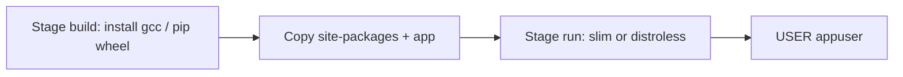

# Month 15 · Week 3 · Day 2
# Production-Shaped Images: Multi-Stage, Non-Root USER, Slim vs Distroless

**Program:** Full-Stack Mastery · 18 months  
**Phase:** 5 — Production engineering  
**Month index:** [../../README.md](../../README.md)  
**Week 3:** [1](day-01.md) · Day 2 (today) · [3](day-03.md) · [4](day-04.md) · [5](day-05.md) · [6](day-06.md) · [7](day-07.md)  
**Week rhythm today:** Exercises + typed drills (still a teaching day)  
**Student state:** Yesterday Compose started two services. Today the **API image** must look less like a laptop and more like something you would **push**.  
**Study time:** 3–4 focused hours  
**Prereq:** Day 1 gate passed.

Labs: `~/fullstack-lab/month-15/week-03/day-02/`. Tiny **badge printer** FastAPI — not Project 7. You will still run as a learner: no real distroless debugging marathon if the image lacks a shell — you will **learn the trade-off** and use **slim** as the default you can exec into.

---

## How to use this textbook

1. Read until multi-stage is “copy artifacts, leave the compiler behind,” not “two FROM for style.”  
2. Add a non-root `USER`. Prove `whoami`.  
3. Compare image **sizes** slim vs a fatter FROM if you have time.  
4. Optional review links are for later rechecking.

---

## How to read this chapter

A production-shaped image is **small**, **non-root**, and **reproducible** (Week 2 tags). Multi-stage builds help the first. `USER` helps the second. Distroless helps size and attack surface, and **hurts** `docker exec bash`.



**Wrong belief:** “Non-root means the container cannot bind 8000.”  
**Correct:** ports **below 1024** are the historical privileged ones. 8000 is fine for an unprivileged user. (80/443 inside a container are a reason people keep root or use a reverse proxy — Week 3 Day 6 nginx can bind 80 as its own story.)

**Wrong belief:** “Distroless is required to pass this month.”  
**Correct:** you must **explain** it. You must **run** non-root on slim. Distroless is optional stretch. Kubernetes is not this month.

---

## Today's contract

By the end of this day you will be able to:

1. Write a **multi-stage** Dockerfile: builder installs deps; runtime copies them.  
2. `useradd` (or `adduser`) + `USER` + correct file **ownership**.  
3. `docker exec whoami` is not root.  
4. State **slim vs distroless** trade-offs in a table you wrote.  
5. Still curl `/health`.

**Today's gate.** Closed-book:

> Multi-stage copies artifacts into a smaller runtime stage. The app runs as a non-root USER. Slim still has a shell for debugging. Distroless drops the shell and package manager. I did not chmod 777 to make USER work.

---

## Time box

| Block | Minutes | Work |
|---|---|---|
| A | 50 | Theory |
| B | 70 | Type-along: multi-stage + USER |
| C | 65 | Independent: size notes + permission trap |
| D | 15 | Git |
| E | 15 | Recall |

---

# Block A — Theory

## 1. Why images get fat

`FROM python:3.12` includes a lot. `RUN apt-get install build-essential` for a Python package with native code adds compilers **forever** if they stay in the same stage as the app. You pay: pull time, disk, and extra binaries an attacker could use.

**Multi-stage:** first `FROM` is a **builder**. Second `FROM` is **runtime**. `COPY --from=builder /path /path` brings only what you need.

```dockerfile
FROM python:3.12-slim AS builder
WORKDIR /app
COPY requirements.txt .
RUN pip install --no-cache-dir --prefix=/install -r requirements.txt

FROM python:3.12-slim AS runtime
WORKDIR /app
COPY --from=builder /install /usr/local
COPY app.py .
```

Exact pip `--prefix` vs `venv` copy patterns vary. You will type a **working** pattern in Block B. The idea is stable: **wheels in, gcc out**.

If your app is pure Python, multi-stage still teaches the muscle for Week 3 Day 6 frontend (`npm run build` then nginx copies `dist/`).

## 2. Non-root USER

Week 2 Day 7 called root a smell. Fix:

1. Create a user with a **fixed UID** (e.g. 10001) so volume ownership is predictable.  
2. `chown` the app directory.  
3. `USER appuser` **before** CMD.

```dockerfile
RUN useradd --create-home --uid 10001 --shell /usr/sbin/nologin appuser \
 && chown -R appuser:appuser /app
USER appuser
```

**Writable dirs:** if the app writes `/data`, that mount must be writable by 10001. Named volumes created as root may need `chown` in an entrypoint — a real production snag. Lab: chown in Dockerfile for `/app` only; if you add `/data`, document it.

**Wrong belief:** “USER in the Dockerfile changes my WSL user.”  
**Correct:** it changes the **container** process UID.

**Wrong belief:** “I will `chmod 777 /app` so non-root works.”  
**Correct:** that undoes the point. chown to the user.

## 3. Slim vs alpine vs distroless

| Base | What you get | Cost |
|---|---|---|
| `python:3.12` | Full Debian, many tools | Large |
| `python:3.12-slim` | Debian slim + Python | Sensible default this month |
| `python:3.12-alpine` | musl, apk, often smaller | Native wheels may **break** (need musl builds) |
| **Distroless** (`gcr.io/distroless/python3`) | Python runtime, **no shell**, no apt | Tiny attack surface; **cannot** `docker exec bash`; debugging is logs + rebuild |

**Distroless** images are not a Linux distro you log into. There is no package manager. PID 1 is your app. If you need `curl` **inside** the image for a healthcheck command, distroless fights you — healthchecks can run **from the engine** using `CMD-SHELL` only if a shell exists, or use HTTP health on the published port from Compose (Day 4).

**Wrong belief:** “Alpine is always smaller and always better.”  
**Correct:** musl + pip binary wheels is a weekend of `gcc` in the builder. Slim is boring and ships.

## 4. Still not a scanner report

You will not run a full CVE marathon today. Smaller + non-root is the **habit**. Month 16+ may add scanning. Do not paste exploit PoCs for a CVSS score.

## 5. Frontend preview (Day 6)

Multi-stage for a static UI:

1. `FROM node:…` → `npm ci` → `npm run build`  
2. `FROM nginx:alpine` → `COPY --from=build /app/dist /usr/share/nginx/html`  
3. nginx user is already non-root in some images — read the image docs when you get there.

Today is Python.

## 6. Say it — two minutes

Why two FROM; what COPY --from does; why USER; why distroless makes exec hard; why 8000 is OK unprivileged.

---

# Block B — Type-along

```bash
mkdir -p ~/fullstack-lab/month-15/week-03/day-02
cd ~/fullstack-lab/month-15/week-03/day-02
```

`app.py` — FastAPI:

- `GET /health` → `{"status":"ok"}`  
- `GET /who` → `{"user": os.getuid()}`  (uid number)  
- `GET /badge/{name}` → `{"badge": name}`  

`requirements.txt`: fastapi, uvicorn[standard].

Write `Dockerfile` multi-stage. Runtime:

- COPY deps from builder  
- COPY app.py  
- useradd 10001  
- chown /app  
- USER appuser  
- CMD uvicorn 0.0.0.0:8000 exec form  

A practical builder pattern (type carefully):

```dockerfile
FROM python:3.12-slim AS builder
WORKDIR /build
COPY requirements.txt .
RUN pip install --no-cache-dir --target /build/site-packages -r requirements.txt

FROM python:3.12-slim AS runtime
ENV PYTHONPATH=/app/site-packages
WORKDIR /app
RUN useradd --create-home --uid 10001 --shell /usr/sbin/nologin appuser
COPY --from=builder /build/site-packages /app/site-packages
COPY app.py /app/app.py
RUN chown -R appuser:appuser /app
USER appuser
EXPOSE 8000
CMD ["python", "-m", "uvicorn", "app:app", "--host", "0.0.0.0", "--port", "8000"]
```

If `useradd` fails on slim (shadow utils), `apt-get install` in **runtime** only the tiny package needed — or use `adduser`. Prefer getting `useradd` working; `python:3.12-slim` usually includes it via `passwd`. If not:

```dockerfile
RUN apt-get update && apt-get install -y --no-install-recommends passwd \
 && rm -rf /var/lib/apt/lists/* \
 && useradd ...
```

That apt layer is OK if required; still not 777.

```bash
docker build -t badge-printer:0.1.0 .
docker run -d --name badge -p 127.0.0.1:8911:8000 badge-printer:0.1.0
curl -sS http://127.0.0.1:8911/health
curl -sS http://127.0.0.1:8911/who
docker exec badge whoami
docker exec badge id
```

Write `PROOF.md`: uid from `/who` (should be 10001), `whoami` (appuser or uid). Not root.

```bash
docker rm -f badge
```

---

# Block C — Independent

### Task 1 — Size

```bash
docker images badge-printer:0.1.0
```

Optional: build `Dockerfile.fat` FROM `python:3.12` (full) single-stage with the same app. Compare sizes in `SIZE.md`. Do not pull extra images if you are bandwidth-poor; write the **expected** direction (full > slim).

### Task 2 — Permission trap

Add `USER appuser` **before** `COPY app.py` without chown, or COPY as root after USER (COPY as root after USER may fail or create root-owned files depending on version). Produce a failure **or** a root-owned file. Write `TRAP.md`: order is create user → copy → chown → USER → CMD. Fix back to working.

### Task 3 — Distroless paragraph

Read nothing external required. From this chapter, write `DISTROLESS.md` (12–20 lines): when you would choose it; how you would debug (logs, local slim image same tag, not exec bash); how HTTP healthchecks still work from Compose **outside** the container. Stretch: try `gcr.io/distroless/python3-debian12` only if pull works; if it fails, do **not** spend the day on it.

### Task 4 — Compose hook

`compose.yaml` one service `badge` build `.` ports 8911. `docker compose up --build -d`, curl, `down`. Proof you can combine Day 1 + Day 2.

---

# Block D — Git

```bash
cd ~/fullstack-lab
git add month-15/week-03/day-02
git commit -m "Month 15 Day 2: multi-stage non-root badge-printer image."
```

---

# Block E — Recall

1. What stays in the runtime stage.  
2. Why USER after chown.  
3. Port 8000 vs 80.  
4. Distroless debug story.  
5. Alpine pip risk.  
6. 777 as a non-fix.

---

## Office hours

**`useradd: command not found`.** Install `passwd` package in the runtime stage, or `busybox adduser` — still chown.

**`Permission denied` uvicorn.** Files owned by root. chown -R.

**`python: No module named uvicorn`.** PYTHONPATH / copy target wrong. `docker run --rm --entrypoint ls badge-printer:0.1.0 /app/site-packages`.

**whoami still root.** USER line missing or after it you `USER root` accidentally.

---

## Definition of done

- [ ] Multi-stage Dockerfile  
- [ ] whoami not root  
- [ ] /health 200  
- [ ] SIZE.md or DISTROLESS.md exists  
- [ ] Commit exists  

---

## Optional review links

- [Multi-stage builds](https://docs.docker.com/build/building/multi-stage/)  
- [Dockerfile USER](https://docs.docker.com/reference/dockerfile/#user)  
- [Distroless](https://github.com/GoogleContainerTools/distroless)  

---

## Tomorrow

**Memory day:** write a compose file from spec with Days 1–2 closed.
