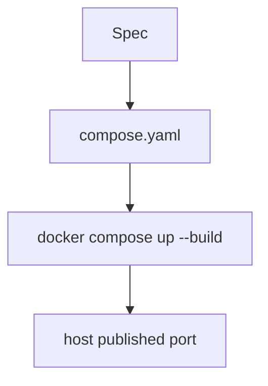

# Month 15 · Week 3 · Day 3
# From Memory: A Compose File from Spec

**Program:** Full-Stack Mastery · 18 months  
**Phase:** 5 — Production engineering  
**Month index:** [../../README.md](../../README.md)  
**Week 3:** [1](day-01.md) · [2](day-02.md) · Day 3 (today) · [4](day-04.md) · [5](day-05.md) · [6](day-06.md) · [7](day-07.md)  
**Week rhythm today:** Implement from memory  
**Student state:** Day 2 gate passed. You can wire two services and drop root. Today you write a **new** compose stack from this spec. Days 1–2 textbook files stay **closed** during drills.  
**Study time:** 3–4 focused hours  
**Prereq:** Day 2 gate passed.

Labs: `~/fullstack-lab/month-15/week-03/day-03/`. Do **not** copy Day 1 `compose.yaml`. Not Project 7. Ubuntu + Docker.

---

## How Day 3 works

Days 1–2 closed during Blocks 1–4. Recap lives **here**.

Allowed: this recap; your lab notes (not Day 1–2 textbook); compose output.

Not allowed: pasting a Hub “compose template” as the first draft; opening Day 1 during drills.

Stuck 25 minutes: open only the matching section, then close. `lookups.txt`.

Worked box **after** `compose.yaml` exists and you have attempted curls.

---

## How to read this chapter

Compose names **services**. DNS names are service keys. `depends_on` is **start order**. Images should be **named** and, when you build them, **non-root** if the spec says so.



**Wrong belief:** “Memory day is `up` the old folder.”  
**Correct:** new names: **ticket booth** + **queue**.

---

## Complete explanation (Compose + images you must still own)

**Compose** is YAML for the Docker engine: services, networks, volumes, env, ports, build. `docker compose up --build`, `ps`, `logs`, `down`. `down -v` deletes named volumes — data funeral.

**Services** share a project **bridge network**. From service `booth`, URL host `queue` works. From Ubuntu, use `127.0.0.1:published`. `depends_on` starts dependencies first; **PID 1 started ≠ listening**. Healthchecks (Day 4) + `service_healthy` wait for ready. Today if the spec includes a slow start, document it.

**Images.** `build` + `image` tag. Multi-stage: builder installs, runtime copies. `USER` non-root, chown, no 777. Slim default; distroless = no shell. `EXPOSE` ≠ publish. uvicorn `--host 0.0.0.0`.

**Week 2 still true.** Context, .dockerignore, CMD vs RUN, latest is a lie, named volumes.

**Not Kubernetes.** One cluster scheduler is out of scope.

**Wrong belief:** “depends_on means the HTTP 200 is true.”  
**Correct:** it means start order.

**Wrong belief:** “Host `/etc/hosts` should include `queue`.”  
**Correct:** only container DNS on the Compose network.

---

## Today's contract

1. Speak recap into `exam-01.md`.  
2. Implement **booth + queue** from spec.  
3. Non-root on the booth image if you build it.  
4. Paper-debug five compose mistakes.  
5. Compare to worked box after evidence.

**Today's gate.** Closed-book:

> I wrote compose.yaml from spec. Service DNS matches YAML keys. depends_on is order. The booth image is not latest. I did not copy Day 1 files.

---

## Time box

| Block | Minutes | Work |
|---|---|---|
| 1 | 25 | Speak; exam-01.md |
| 2 | 60 | booth + queue stack |
| 3 | 35 | Predict depends_on |
| 4 | 30 | DEBUG.md A–E |
| 5 | 20 | Worked box; DIFF.md |
| 6 | 20 | Design: Project 7 service list (names) |
| 7 | 15 | Retro |

---

# Block 1 — Speak

Cover: services, DNS, depends_on, down -v, USER, multi-stage purpose. `exam-01.md`.

```bash
mkdir -p ~/fullstack-lab/month-15/week-03/day-03
cd ~/fullstack-lab/month-15/week-03/day-03
```

---

# Block 2 — Spec: ticket booth (Days 1–2 closed)

**queue** service:

- Python `http.server` style or tiny script on port **9300**  
- `GET /status` returns `{"queue":"open"}`  
- Bind `0.0.0.0`  
- Image tag `campus-queue:0.1.0`  
- No host ports required  

**booth** service:

- FastAPI `GET /health` local ok  
- `GET /line` fetches `http://queue:9300/status` (env `QUEUE_URL`)  
- Publish `127.0.0.1:8912:8000`  
- Image `campus-booth:0.1.0`  
- `depends_on: [queue]`  
- **USER non-root** in booth Dockerfile (uid 10001 acceptable)  

Both: `.dockerignore`, exec form CMD, not `FROM python:latest`.

```bash
docker compose up --build -d
curl -sS http://127.0.0.1:8912/health
curl -sS http://127.0.0.1:8912/line
docker compose exec booth whoami
docker compose down
```

Evidence in `RUN.txt`. whoami not root.

---

# Block 3 — Predict

`PREDICT.md` before experiments:

**P1.** `QUEUE_URL=http://campus-queue:9300/status` (container name guess).  
**P2.** booth `depends_on` omitted; you `compose up` — possible race?  
**P3.** `docker compose down -v` when a volume `queuedata` exists.

Then optionally break P1 to confirm.

---

# Block 4 — Debug (paper)

**A.** “Compose is green so Postgres accepted SQL.” (even if spec has no Postgres — apply the idea)  
**B.** YAML service `queue` but URL `http://db:9300`.  
**C.** booth `USER` then files still root-owned, uvicorn Permission denied.  
**D.** `ports: "8912:8000"` without `127.0.0.1:` on cafe Wi-Fi — what did you publish?  
**E.** Two `FROM` in Dockerfile without `COPY --from` — is it multi-stage?

---

# Block 5 — Worked box (after RUN.txt)

**DNS:** host in URL = **service key** `queue`, not folder name, not image name.

**P1.** `campus-queue` is probably **not** the DNS name. Fail.

**P2.** Race possible if queue slow; depends_on reduces but does not eliminate unreadiness.

**P3.** Named volume deleted; data gone.

**A.** Green = containers started. Readiness is health/SQL ping (Day 4).  
**B.** Wrong name.  
**C.** chown before USER.  
**D.** `0.0.0.0:8912` on the host — LAN may reach it. Prefer `127.0.0.1:8912:8000`.  
**E.** Two FROM without COPY --from is two leftover stages; final stage must receive artifacts.

Write `DIFF.md`.

---

# Block 6 — Design

`DESIGN.md`: list four future lab services (Day 6): web, api, postgres, redis — one sentence each on **network**. No Project 7 source.

---

# Block 7 — Retro

```bash
cd ~/fullstack-lab
git add month-15/week-03/day-03
git commit -m "Month 15 Day 3: booth+queue compose from memory."
```

---

## Office hours

**Copied day-01 echo.py as queue.** Change port and JSON key to the spec.

**whoami root.** USER line; compose isn’t using the image you think (`image:` vs `build`).

---

## Definition of done

- [ ] exam-01.md before box  
- [ ] /health and /line work  
- [ ] whoami not root  
- [ ] DEBUG + DIFF  
- [ ] Commit exists  

---

## Optional review links

- [Compose file](https://docs.docker.com/compose/compose-file/)  
- [Multi-stage](https://docs.docker.com/build/building/multi-stage/)  

---

# Lecture: reading a compose spec

Service keys **are** DNS. Ports left-side are **host**. Image tags you own (`0.1.0`). depends_on list is **order**. If the spec says non-root, `docker compose exec SERVICE whoami` is the test, not the YAML comment.

Write `HEURISTIC.md` (six lines). Then Block 5 if needed.

## YAML that looks right and is wrong

```yaml
services:
  campus-queue:
    build: .
  booth:
    environment:
      QUEUE_URL: http://queue:9300/status
    depends_on:
      - queue
```

The service key is `campus-queue`, not `queue`. DNS will not find `queue`. `depends_on: queue` is also a missing key — Compose will error, which is **kinder** than a silent DNS miss. Write `YAML-TRAP.md`: rename either the service or the URL until they match.

## whoami vs image:

```yaml
api:
  image: campus-booth:0.1.0
  build: .
```

If an old `campus-booth:0.1.0` was built **as root** yesterday, and you added USER but forgot `--build`, `up -d` reuses the old image. `whoami` is root. Fix: `docker compose up --build -d` and confirm `docker image inspect campus-booth:0.1.0` time.

## Publishing without 127.0.0.1

```yaml
ports:
  - "8912:8000"
```

On Docker Desktop this often binds `0.0.0.0:8912` on the VM/Windows. A roommate on Wi-Fi might reach your lab. Prefer:

```yaml
ports:
  - "127.0.0.1:8912:8000"
```

**Wrong belief:** “I am on WSL so only I can connect.”  
**Correct:** Desktop publishes through Windows networking. Localhost restriction is still the habit.

## Multi-stage that is not

```dockerfile
FROM python:3.12-slim
FROM python:3.12-slim
COPY app.py /app
```

The first FROM is discarded. Nothing was copied `--from`. You have a single-stage image with a confusing file. Multi-stage **requires** `COPY --from=builder`.

## P1–P3 recap after the box

P1: hostname = **service key**.  
P2: omitting depends_on allows the booth to start first; race more likely.  
P3: `down -v` deletes named volumes in the file.

---

## Tomorrow

**Lab:** healthchecks, restart policy, named volumes for Postgres, env files (`.env` not committed).
