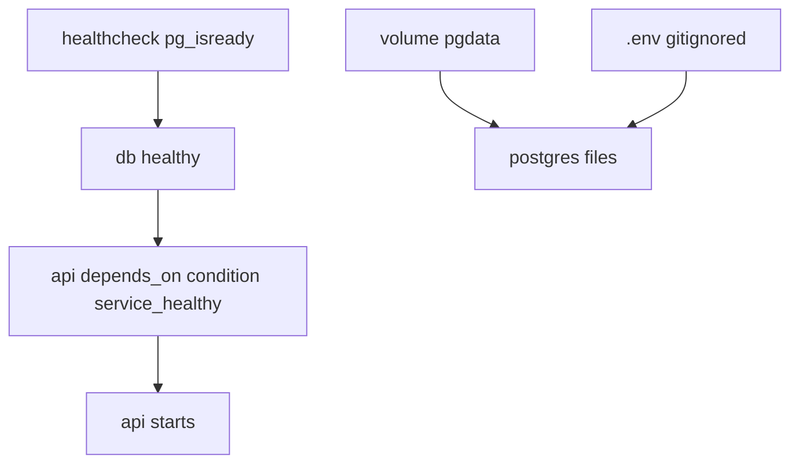

# Month 15 · Week 3 · Day 4
# Lab: Healthchecks, Restart Policy, Postgres Volumes, Env Files

**Program:** Full-Stack Mastery · 18 months  
**Phase:** 5 — Production engineering  
**Month index:** [../../README.md](../../README.md)  
**Week 3:** [1](day-01.md) · [2](day-02.md) · [3](day-03.md) · Day 4 (today) · [5](day-05.md) · [6](day-06.md) · [7](day-07.md)  
**Week rhythm today:** Lab (type-along + independent)  
**Student state:** You can write compose from spec. Today the stack must **tell the truth** about readiness, **survive a crash**, **keep Postgres files**, and **keep secrets out of git**.  
**Study time:** 3–4 focused hours  
**Prereq:** Day 3 gate passed.

Labs: `~/fullstack-lab/month-15/week-03/day-04/`. **Campus lost-property** API + **Postgres** — not Project 7. You invent a 20-line table. Week 4 will add `/ready` inside FastAPI; today Compose **healthcheck** can be `pg_isready` and a curl to `/health`.

---

## How to use this textbook

1. Read until healthcheck vs restart vs volume vs env_file are four knobs.  
2. Type compose with Postgres **official image** (you do not FROM postgres in your API Dockerfile).  
3. Prove: API waits until **healthy**; data survives `down` without `-v`; `.env` is gitignored.  
4. Optional review links are for later rechecking.

---

## How to read this chapter

**Healthcheck** is the engine asking: should this container be **healthy**? Unhealthy is not the same as **stopped**. **Restart policy** is: if PID 1 **exits**, should we start it again? **Named volume** is where Postgres writes files. **env file** is how you pass `POSTGRES_PASSWORD` without committing it.



**Wrong belief:** “`restart: always` means the product is reliable.”  
**Correct:** it means a crash loop can **hide** in `ps` as “Restarting.” You still need logs (Week 4) and a **reason**. `on-failure` vs `always` vs `unless-stopped` are different sentences.

**Wrong belief:** “`.env` in the image is the same as `env_file`.”  
**Correct:** `COPY .env` bakes secrets into a **layer**. `env_file:` is **runtime** injection. Gitignore the file. Provide `.env.example` with dummy names.

Kubernetes probes are cousins of healthchecks. **Not this month.**

---

## Today's contract

By the end of this day you will be able to:

1. Add a **healthcheck** to Postgres (`pg_isready`) and see `healthy` in `compose ps`.  
2. `depends_on` with `condition: service_healthy` on the API.  
3. Set `restart:` on the API and **demonstrate** a crash restart (then stop the loop).  
4. Use a **named volume** for Postgres; `down` without `-v` keeps data.  
5. Use **`env_file`** + `.gitignore`; never commit a real password.

**Today's gate.** Closed-book:

> Healthchecks measure ready-enough for Compose. depends_on service_healthy waits on that. Named volumes keep Postgres files. env_file is runtime. restart policies restart PID 1; they do not fix bugs. I did not paste Project 7.

---

## Time box

| Block | Minutes | Work |
|---|---|---|
| A | 40 | Theory |
| B | 85 | Type-along: api + postgres |
| C | 60 | Independent: wipe vs keep; crash loop; .env.example |
| D | 15 | Git (no .env) |
| E | 15 | Recall |

---

# Block A — Theory

## 1. Healthcheck fields

```yaml
healthcheck:
  test: ["CMD-SHELL", "pg_isready -U campus -d lostproperty"]
  interval: 5s
  timeout: 3s
  retries: 10
  start_period: 10s
```

`test` exit 0 = healthy. `CMD` vs `CMD-SHELL`: shell form needed for pipes; exec form if the binary exists. **Distroless APIs** may not have `curl` inside — then healthcheck the **API from another service** or use a Python one-liner, or wait for Week 4 HTTP `/health` from the engine if you install curl (slim has it if you apt — extra size). Today: **Postgres image includes `pg_isready`**. API healthcheck stretch: `curl -f http://127.0.0.1:8000/health` **inside** the API container if curl exists; otherwise skip API healthcheck until Week 4 middleware lab.

`compose ps` shows `health: starting` then `healthy`.

## 2. depends_on condition

```yaml
depends_on:
  db:
    condition: service_healthy
```

API container **will not start** until db is healthy. This kills Day 1’s 8-second cartoon **if** `pg_isready` is the right check. It is **still** not “migrations finished” or “schema exists.” Honest sentence: healthy means **the check you wrote**.

## 3. Restart policies

| Policy | Behavior |
|---|---|
| `no` | Default. Stay dead. |
| `on-failure` | Restart if non-zero exit |
| `always` | Restart even after `0` (and after daemon restart, with caveats) |
| `unless-stopped` | Like always, but if you **stop** it, stay stopped |

`restart: always` on a process that **cannot** connect to db and **exits** will loop. `compose ps` looks busy. `logs` tell the truth.

For a **deliberate** crash demo: a one-shot command `python -c "raise SystemExit(1)"` with `restart: on-failure` — watch Restart Count, then `compose stop` / change command back.

Do not leave a crash loop overnight.

## 4. Postgres named volume

```yaml
services:
  db:
    image: postgres:16
    volumes:
      - pgdata:/var/lib/postgresql/data
    env_file:
      - .env
volumes:
  pgdata:
```

Official images store files in `/var/lib/postgresql/data` (version-specific paths exist — 16 is this lab). **Do not bind-mount a random empty dir incorrectly** or you will see permission errors (UID 999 `postgres`). Named volume is the default happy path.

`POSTGRES_USER`, `POSTGRES_PASSWORD`, `POSTGRES_DB` initialize **only on first empty data dir**. Changing `.env` later will **not** change the password inside an existing volume. That surprise is a Day 7 defect. Fix: new volume or `down -v` **knowing you wipe**.

## 5. env files

`.env` next to compose is **auto-read for interpolation** (`${POSTGRES_PASSWORD}`) in some Compose versions **and** you should still use `env_file:` on the service for the **container** env. Read Compose docs later; today:

- `.env` gitignored  
- `.env.example` committed with `POSTGRES_PASSWORD=changeme`  
- real `.env` you create locally  

**Wrong belief:** “gitignore means Docker cannot see .env.”  
**Correct:** gitignore is git. Docker reads the file from disk.

Never put production passwords in the textbook folder `Downloads\2026`. Lab only.

## 6. API talks to Postgres

Connection URL: `postgresql://user:pass@db:5432/lostproperty` — host **`db`** (service name). You may use `psycopg` or SQLAlchemy — **keep it tiny**: one table `slips(id serial, label text)`. Or even `psycopg` one SELECT 1 for `/health` and insert for POST. Do not import Project 7 ORM models.

If installing a driver is too much time, the API may only `GET /health` without SQL **plus** you still run Postgres with volume — but then you missed the point. **Minimum:** `GET /health` pings `SELECT 1`.

Week 4 splits `/health` vs `/ready`. Today one `/health` that pings DB is acceptable; mention the split in notes.

## 7. Say it — two minutes

healthy vs running; service_healthy; volume first-init; env_file vs COPY; restart loop.

---

# Block B — Type-along

```bash
mkdir -p ~/fullstack-lab/month-15/week-03/day-04
cd ~/fullstack-lab/month-15/week-03/day-04
```

Create `.gitignore`:

```text
.env
```

Create `.env.example`:

```text
POSTGRES_USER=campus
POSTGRES_PASSWORD=changeme
POSTGRES_DB=lostproperty
```

Copy to `.env` (same values for lab).

`app.py`: FastAPI, read `DATABASE_URL`, `/health` runs `SELECT 1` (503 if fail), `POST /slips` `{label}`, `GET /slips`.

Dockerfile: slim, deps include `psycopg[binary]` or `psycopg2-binary`, non-root if you can still write nothing on `/app`. Connecting to Postgres does not need a local volume on the API.

`compose.yaml` sketch you **type** and complete:

```yaml
services:
  db:
    image: postgres:16
    env_file: .env
    volumes:
      - pgdata:/var/lib/postgresql/data
    healthcheck:
      test: ["CMD-SHELL", "pg_isready -U campus -d lostproperty"]
      interval: 5s
      timeout: 3s
      retries: 10
    # no host port required; API uses docker DNS
  api:
    build: .
    image: lost-property-api:0.1.0
    env_file: .env
    environment:
      DATABASE_URL: postgresql://campus:${POSTGRES_PASSWORD}@db:5432/lostproperty
    ports:
      - "127.0.0.1:8913:8000"
    depends_on:
      db:
        condition: service_healthy
    restart: on-failure

volumes:
  pgdata:
```

Interpolation: Compose reads `.env` for `${POSTGRES_PASSWORD}` in the YAML. If interpolation fails, hardcode the URL in `environment` using the same lab password — still gitignore `.env`.

```bash
docker compose up --build -d
docker compose ps
curl -sS http://127.0.0.1:8913/health
```

Wait until db is healthy. Write `HEALTH.md`: time to healthy; whether API started after.

```bash
curl -sS -X POST http://127.0.0.1:8913/slips -H "Content-Type: application/json" -d '{"label":"purple scarf"}'
curl -sS http://127.0.0.1:8913/slips
docker compose down
docker compose up -d
curl -sS http://127.0.0.1:8913/slips
```

Scarf should **remain**. Write `PERSIST.md`.

---

# Block C — Independent

### Task 1 — Volume wipe (on purpose)

```bash
docker compose down -v
docker compose up -d
curl -sS http://127.0.0.1:8913/slips
```

Empty list. Write `WIPE.md`: `-v` deleted `pgdata`. Restore a slip for later if you want.

### Task 2 — Password change lie

With data volume present, change `POSTGRES_PASSWORD` in `.env`, `down` **without** `-v`, `up`. API may fail auth. Write `AUTH.md`: init only on empty dir; volume still has old password. Fix: revert password **or** wipe volume **knowing the cost**. Do not “hack Postgres.” Revert is the intended fix.

### Task 3 — Restart demo

Temporarily set api `command:` to a failing python one-liner, `restart: on-failure`. `up`, `compose ps` a few times, `logs`. Then **remove** the command override, `up -d --build`. Write `RESTART.md`. Do not leave it failing.

### Task 4 — git check

```bash
git check-ignore -v .env || true
```

`SECRETS.md`: .env ignored; .env.example committed.

---

# Block D — Git

```bash
cd ~/fullstack-lab
git status
```

If `.env` is staged, unstage. Commit the rest.

```bash
git add month-15/week-03/day-04
git commit -m "Month 15 Day 4: postgres volume, healthcheck, env_file lab."
```

`docker compose down` when finished (keep volume unless you want wipe).

---

# Block E — Recall

1. pg_isready vs “schema migrated.”  
2. service_healthy.  
3. down vs down -v.  
4. When POSTGRES_* apply.  
5. env_file vs COPY .env.  
6. restart: always vs on-failure.

---

## Office hours

**db unhealthy forever.** User/db names must match `.env`. `logs db`.

**API healthy wait forever.** Healthcheck command wrong; `compose ps` db.

**Permission denied /var/lib/postgresql/data.** Bind mount from Windows. Use named volume.

**.env committed.** `git rm --cached .env` (not `--force` destroy). Rotate the lab password anyway.

**psycopg install fails.** `psycopg[binary]` on slim usually works. Do not compile from source all afternoon.

---

## Definition of done

- [ ] db healthy; API /health 200  
- [ ] Data survives `down` without `-v`  
- [ ] WIPE.md from `down -v`  
- [ ] .env not in git  
- [ ] Crash loop stopped  
- [ ] Commit exists  

---

## Optional review links

- [Compose healthcheck](https://docs.docker.com/reference/compose-file/services/#healthcheck)  
- [Postgres Docker env](https://hub.docker.com/_/postgres)  
- [Compose env_file](https://docs.docker.com/compose/how-tos/environment-variables/set-environment-variables/)  
- [restart](https://docs.docker.com/reference/compose-file/services/#restart)  

---

## Tomorrow

**Docs:** startup order, persistence, configuration — 12-factor-lite.
