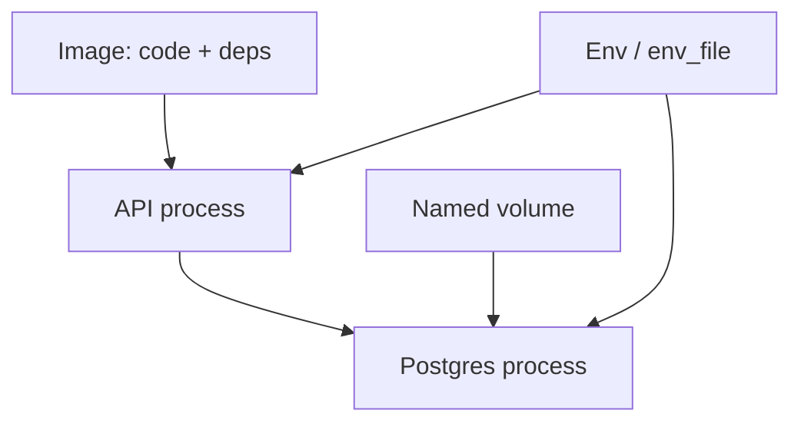

# Month 15 · Week 3 · Day 5
# Docs: Startup Order, Persistence, and 12-Factor-Lite Config

**Program:** Full-Stack Mastery · 18 months  
**Phase:** 5 — Production engineering  
**Month index:** [../../README.md](../../README.md)  
**Week 3:** [1](day-01.md) · [2](day-02.md) · [3](day-03.md) · [4](day-04.md) · Day 5 (today) · [6](day-06.md) · [7](day-07.md)  
**Week rhythm today:** Tests / docs (a runbook you could hand a teammate)  
**Student state:** You ran Postgres with a healthcheck and a volume. Today you **write the sentences** a teammate needs so they do not invent `down -v` at 2 a.m.  
**Study time:** 3–4 focused hours  
**Prereq:** Day 4 gate passed.

Labs: `~/fullstack-lab/month-15/week-03/day-05/`. Primary deliverable: **`RUNBOOK.md`**. You may copy **facts** from Day 4 evidence, not Project 7 source. Compose may stay down; this is a writing day with small verify commands.

---

## How to use this textbook

1. Read 12-factor-lite until config vs code vs data are three buckets.  
2. Write RUNBOOK.md so someone else could `up` Day 4’s shape.  
3. Add a one-page diagram in Mermaid.  
4. Optional review links are for later rechecking.

---

## How to read this chapter

The Twelve-Factor App (Heroku era) is a **checklist**, not a religion. This course takes a **lite** subset that matches Compose on a laptop:

1. **Config in the environment** (not baked into images).  
2. **Backing services as attached resources** (Postgres is `db:5432`, not “install on the host”).  
3. **Processes are stateless**; **state lives in volumes** (or managed DBs later).  
4. **Logs as event streams** (stdout — Week 4).  
5. **Admin/migrate as one-off processes** (you will name the idea; you may not run Alembic today).



**Wrong belief:** “12-factor means I cannot use Docker volumes.”  
**Correct:** volumes **are** how you attach a disk-backed service locally. In AWS you will attach RDS instead (Month 16). Same **idea**: the app does not store the canonical database inside its own writable layer.

**Wrong belief:** “The runbook is the compose file.”  
**Correct:** YAML is what the engine does. The runbook is **order, wipe danger, passwords, and how to tell ready**.

Kubernetes manifests will later encode some of this. **Not this month.**

---

## Today's contract

By the end of this day you will be able to:

1. Explain **startup order** vs **readiness** in writing.  
2. Explain **persistence** (volume lifecycle, first-init env).  
3. Explain **config** (env, examples, interpolation, what never to commit).  
4. Produce **`RUNBOOK.md`** with commands that work in Ubuntu.  
5. List **gaps** (migrations, secrets managers, orchestrators) honestly.

**Today's gate.** Closed-book:

> Config is env, not an image layer. Postgres data is a volume. depends_on healthy is readiness for the check I wrote. down -v wipes. I wrote RUNBOOK.md. I did not paste Project 7.

---

## Time box

| Block | Minutes | Work |
|---|---|---|
| A | 45 | Theory |
| B | 40 | Inventory Day 4 stack |
| C | 80 | Write RUNBOOK.md + quiz answers |
| D | 20 | Self-review checklist |
| E | 15 | Recall + commit |

---

# Block A — Theory

## 1. Startup order (three clocks)

| Clock | What it measures | Tool |
|---|---|---|
| **Compose start order** | PID 1 launched | `depends_on` (service_started) |
| **Health** | Your probe passed | `healthcheck` + `service_healthy` |
| **App ready** | DB schema, Redis, migrations | `/ready` (Week 4), migrate job |

Students mash these into “the stack is up.” A runbook must **split** them.

Example: `compose ps` healthy, but API 500 because table missing. Healthcheck was `pg_isready`, not `SELECT FROM slips`.

## 2. Persistence

| Object | Survives `compose stop` | Survives `down` | Survives `down -v` |
|---|---|---|---|
| Container writable layer | yes | **no** | no |
| Named volume | yes | **yes** | **no** |
| Bind mount host files | yes | yes | yes (host still has them) |
| Image | yes | yes | yes |

Postgres **first boot** reads `POSTGRES_USER/PASSWORD/DB` when the data directory is empty. Later boots ignore those for password **change**. Runbook must say: “to reset the database, `down -v` and accept data loss.”

**Wrong belief:** “I edited .env so the password updated.”  
**Correct:** you updated the **file**. The volume still has the old role. Day 4 AUTH.md.

## 3. Configuration 12-factor-lite

**Code** = git + image tags you built (`0.1.0`).  
**Config** = env: URLs, credentials, log level.  
**Credentials** = env or a secret store (not this month); **never** Slack; **never** image layers; **never** commit.

Patterns:

- `.env.example` committed  
- `.env` gitignored  
- `environment:` for non-secrets (`LOG_LEVEL=info`)  
- Compose interpolation `${VAR}` from the shell or `.env`  

**Dev vs prod:** same image, different env. That is the point of not baking Hub passwords into Dockerfile `ENV POSTGRES_PASSWORD=...`.

**Wrong belief:** “EXPOSE and ports are config.”  
**Correct:** they are **wiring**. Config is what the **process** reads (`os.environ`).

## 4. Backing services

Postgres, Redis, S3, SMTP are **resources** identified by URL. Locally: `db`, `redis` DNS names. In production: RDS hostname. The app should not require “we installed Postgres with apt on the VM” as the only story — though that exists in the wild.

## 5. Stateless processes

API containers should be disposable. Session state in the DB or signed cookies (you already did cookies in earlier months). Uploaded files: object storage later, not the API writable layer.

## 6. What a good RUNBOOK contains

1. Prerequisites (Docker Desktop, Ubuntu, `cp .env.example .env`)  
2. `up --build -d`  
3. How to wait (`compose ps` healthy)  
4. curl examples  
5. Where data lives  
6. How to wipe  
7. How to read logs  
8. What not to do (`down -v` on prod-like data, commit `.env`, `latest`)  
9. Known races (migrations)  

## 7. Gaps you will not fake

- No HashiCorp Vault today  
- No Kubernetes Secrets  
- No CI pushing images (Month 16)  
- No TLS between services  

Write them under **Out of scope**. Honesty is the document working.

---

# Block B — Inventory

From **your** Day 4 folder (allowed: your lab, not textbook Day 4 if you prefer memory — but inventory may open **your** compose.yaml):

Write `INVENTORY.md`:

- service names  
- published ports  
- volume names  
- healthcheck test line  
- whether .env is ignored  

If Day 4 is missing, stop and finish Day 4. This day has nothing to document.

Verify:

```bash
cd ~/fullstack-lab/month-15/week-03/day-04
docker compose ps || true
git check-ignore -v .env || true
```

---

# Block C — RUNBOOK.md (spec envelope)

Create `~/fullstack-lab/month-15/week-03/day-05/RUNBOOK.md` with **these headings**. Complete sentences. Commands in bash.

1. **Title and audience** — classmate on a Windows laptop + WSL Ubuntu.  
2. **Prerequisites**  
3. **Config** — .env.example table of variables; 12-factor-lite paragraph.  
4. **Startup order** — the three clocks.  
5. **Bring up** — exact commands.  
6. **Ready?** — what `compose ps` and curl must show.  
7. **Persistence** — volume name; down vs down -v; first-init password.  
8. **Logs** — `docker compose logs -f api`  
9. **Tear down**  
10. **Incidents** — db not healthy; API 503; auth failed after password edit; port in use (Week 1).  
11. **Out of scope** — K8s, Vault, Month 16.  
12. **Mermaid** — services + volume + env.

Also `QUIZ.md` answered in your words:

**Q1.** Why `pg_isready` can be green while `GET /slips` 500s.  
**Q2.** Why images should not contain `.env`.  
**Q3.** What `restart: always` will do to a missing-env crash.  
**Q4.** Why Redis (Day 6) should also be a **service URL**, not `localhost` from inside the API container (localhost would be the API container itself).

---

# Block D — Self-review

`CHECK.txt`:

- [ ] A stranger could up the stack from RUNBOOK without Slack  
- [ ] down -v is labeled dangerous  
- [ ] No real passwords in RUNBOOK (changeme from example is OK)  
- [ ] Three clocks present  
- [ ] Kubernetes explicitly out of scope  
- [ ] Quiz answered  

---

# Block E — Recall and git

Recall:

1. Three clocks.  
2. When POSTGRES_PASSWORD applies.  
3. Stateless API vs volume.  
4. env_file vs image ENV.  
5. What RUNBOOK is for.

```bash
cd ~/fullstack-lab
git add month-15/week-03/day-05
git commit -m "Month 15 Day 5: Compose RUNBOOK startup, persistence, config."
```

---

## Office hours

**Wrote a novel of slogans.** Cut anything that is not operational. Commands must be copyable **by typing**, not a screenshot of Desktop GUI.

**Pasted Project 7 DATABASE_URL with a real host.** Remove. Lab names only.

---

## Definition of done

- [ ] RUNBOOK.md complete (12 sections)  
- [ ] QUIZ.md  
- [ ] CHECK.txt honest  
- [ ] Commit exists  

---

## Optional review links

- [12factor.net](https://12factor.net/)  
- [Compose environment variables](https://docs.docker.com/compose/how-tos/environment-variables/)  
- [Postgres Docker](https://hub.docker.com/_/postgres)  

---

# Lecture: the three clocks, with a 500

A teammate reports `GET /slips` → 500. `compose ps` is healthy.

| Clock | Status | Conclusion |
|---|---|---|
| Start order | api started after db | not the race from Day 1 |
| Health | `pg_isready` 0 | Postgres accepts connections |
| App ready | table `slips` missing | **this** clock |

`/health` that only `SELECT 1` is still 200. The 500 is **schema**. RUNBOOK section 6 must not say “healthy means the app works.” It may say “healthy means the probe we wrote.”

## Quiz keys (after you write QUIZ.md)

**Q1.** Probe ≠ schema.  
**Q2.** Image layers are copied and cached; secrets in layers leak via `docker history` / export. Runtime env dies with the container config, not baked (unless you ENV in Dockerfile).  
**Q3.** `restart: always` on missing-env: crash loop, looks “busy.”  
**Q4.** `localhost` inside the API container is the API. Redis service name is `redis`.

## What 12-factor does **not** say

It does not say “never Docker.” It does not say “never Postgres volume.” It does not replace Month 14 tests. It does not require Kubernetes.

It **does** say: config in env; processes disposable; logs to stdout (Week 4). Write `TWELVE-LITE.md`: five bullets you actually follow this month, and two you postpone (build once run anywhere in CI; admin processes as one-off migrate containers).

**Wrong belief:** “A runbook is for people who cannot read YAML.”  
**Correct:** YAML does not warn you that `down -v` is a funeral. Humans need sentences.

---

## Tomorrow

**Independent:** four services — static nginx or tiny frontend, FastAPI, PostgreSQL, Redis. Lab apps, not Project 7 source. You may later copy **the pattern**.
