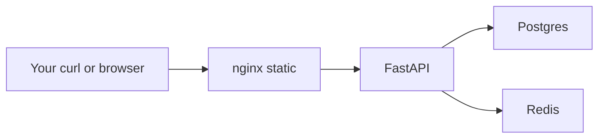

# Month 15 · Week 3 · Day 6
# Independent: Four Services — Web, API, Postgres, Redis

**Program:** Full-Stack Mastery · 18 months  
**Phase:** 5 — Production engineering  
**Month index:** [../../README.md](../../README.md)  
**Week 3:** [1](day-01.md) · [2](day-02.md) · [3](day-03.md) · [4](day-04.md) · [5](day-05.md) · Day 6 (today) · [7](day-07.md)  
**Week rhythm today:** Independent implementation  
**Student state:** You have a runbook for API + Postgres. Today you add a **front door** and a **Redis**. The domain is imposed: **campus bike-share holds**.  
**Study time:** 3–4 focused hours  
**Prereq:** Day 5 gate passed.

This textbook will **not** paste Project 7. You may later copy **the pattern** (four services, env, volumes, health) into Project 7 **yourself**. Today: new code in `~/fullstack-lab/month-15/week-03/day-06/`.

---

## How to use this textbook

1. Implement the spec envelope. Empty nginx is failing work.  
2. Four containers on one compose network.  
3. `.env` gitignored; named volume for Postgres; Redis persistence optional (named volume **or** documented ephemeral).  
4. Optional review links are for later rechecking.

---

## How to read this chapter

A “full stack” locally is not one container with everything. It is **roles**:



**Wrong belief:** “The frontend container must include Python.”  
**Correct:** nginx serves files. The browser (or curl) calls the **API** on a published port **or** via nginx reverse proxy. Reverse proxy is nicer; two published ports is acceptable if you document CORS-less curl from the host.

**Wrong belief:** “Redis localhost:6379 from the API.”  
**Correct:** host `redis` (service name), port 6379 **inside** the network. `localhost` inside the API is the API itself.

Kubernetes Deployments would split these similarly. **Not this month.**

---

## Today's contract

1. `compose.yaml` with **web**, **api**, **db**, **redis**.  
2. Static page (even 30 lines of HTML) served by **nginx**.  
3. API: health, create hold in Postgres, cache a count in Redis.  
4. db healthcheck; api `depends_on` healthy db.  
5. README with curl and what to open in a browser.

**Today's gate.** Closed-book:

> Four services, one network. Postgres has a volume. Redis is a URL. Nginx does not contain the API code. I did not paste Project 7. .env is not committed.

---

## Time box

| Block | Minutes | Work |
|---|---|---|
| A | 20 | Inventory + port plan |
| B | 40 | API + Postgres + Redis without nginx |
| C | 90 | Nginx static + glue + compose polish |
| D | 20 | Self-review |
| E | 15 | Recall + commit |

---

# Block A — Port plan

Write `PORTS.md`:

| Service | Internal | Host publish |
|---|---|---|
| web | 80 | 127.0.0.1:8920 |
| api | 8000 | 127.0.0.1:8921 (or only via nginx) |
| db | 5432 | none |
| redis | 6379 | none |

Do not publish Postgres/Redis to the cafe network.

```bash
mkdir -p ~/fullstack-lab/month-15/week-03/day-06
cd ~/fullstack-lab/month-15/week-03/day-06
```

---

# Block B — Spec envelope: bike-share holds

### Must — API

| Method | Path | Rules |
|---|---|---|
| GET | `/health` | 200 if `SELECT 1` and Redis `PING` both work; else 503 |
| POST | `/holds` | `{bike_code: str, station: str}` 201 persist **Postgres** |
| GET | `/holds` | list from Postgres |
| GET | `/stats` | `{"hold_count": N}` where N is **cached in Redis** with TTL 30s, invalidated or overwritten on POST (simple: set count on each POST and GET) |

Keep cache logic small. If Redis is down, `/health` 503. `/holds` may still be coded to hit Postgres only.

Use `redis` Python package. `redis://redis:6379/0`.

Non-root API image (Day 2 habit) if you can finish in time; otherwise note the smell in README and still finish four services — **prefer non-root**.

### Must — Postgres

`postgres:16`, named volume, `pg_isready` healthcheck, env from `.env`.

### Must — Redis

`redis:7` official image. Command default. Optional volume `redisdata:/data` + `appendonly yes` if you have time; else README: “Redis is ephemeral; counts reset.”

### Must — web

Do **not** copy a Vite Project 7 app. Create `web/index.html` (and maybe `app.js`) that:

- heading “Campus bike-share holds”  
- fetches `http://127.0.0.1:8921/holds` **or** `/api/holds` if you reverse-proxy  

**Simplest path that still counts:** nginx serves static files; browser JS uses the **published API port**. Document that this is lab-only (mixed ports). 

**Better path:** nginx.conf `location /api/ { proxy_pass http://api:8000/; }` and JS uses `/api/holds`. Then publish **only** 8920. Prefer this if you have 40 minutes.

Dockerfile.web:

```dockerfile
FROM nginx:alpine
COPY public/ /usr/share/nginx/html/
# COPY nginx.conf /etc/nginx/conf.d/default.conf  # if proxy
```

No Node build required. Multi-stage Node is stretch.

### Must not

- Project 7 source  
- `network_mode: host`  
- `chmod 777`  
- `down -v` in the README as a daily command without a warning  
- Kubernetes  

---

# Block C — Compose shape (you type the rest)

```yaml
services:
  db:
    image: postgres:16
    env_file: .env
    volumes:
      - pgdata:/var/lib/postgresql/data
    healthcheck:
      test: ["CMD-SHELL", "pg_isready -U campus -d bikeshare"]
      interval: 5s
      timeout: 3s
      retries: 10
  redis:
    image: redis:7
  api:
    build:
      context: ./api
    image: bikeshare-api:0.1.0
    env_file: .env
    environment:
      DATABASE_URL: postgresql://campus:${POSTGRES_PASSWORD}@db:5432/bikeshare
      REDIS_URL: redis://redis:6379/0
    depends_on:
      db:
        condition: service_healthy
      redis:
        condition: service_started
    ports:
      - "127.0.0.1:8921:8000"
  web:
    build:
      context: ./web
    image: bikeshare-web:0.1.0
    ports:
      - "127.0.0.1:8920:80"
    depends_on:
      - api

volumes:
  pgdata:
```

Redis `service_started` is honest: Redis is usually ready fast; you may add a healthcheck `redis-cli ping` if the image includes it.

`.env.example` with POSTGRES_* . Copy to `.env`.

```bash
docker compose up --build -d
docker compose ps
curl -sS http://127.0.0.1:8921/health
curl -sS -X POST http://127.0.0.1:8921/holds -H "Content-Type: application/json" \
  -d '{"bike_code":"BK-1","station":"north-rack"}'
curl -sS http://127.0.0.1:8921/holds
curl -sS http://127.0.0.1:8921/stats
curl -sS -D - http://127.0.0.1:8920/ | head
```

`EVIDENCE.md` statuses. Browser: open `http://127.0.0.1:8920/` if JS is written.

---

# Block D — Self-review

`CHECK.txt`:

- [ ] Four services in `ps`  
- [ ] db not published to 0.0.0.0  
- [ ] Volume declared  
- [ ] .env ignored  
- [ ] /health checks both backends  
- [ ] HTML is yours, not Project 7  
- [ ] README: up, curl, down, wipe warning  
- [ ] Images tagged 0.1.0 not only latest  

---

# Block E — Recall and git

Recall:

1. Why Redis host is `redis`.  
2. Why nginx image is not the API.  
3. depends_on redis started vs db healthy.  
4. Pattern you might copy to Project 7 later (one sentence).  
5. What you still owe Week 4 (JSON logs, /ready).

```bash
cd ~/fullstack-lab
git add month-15/week-03/day-06
git commit -m "Month 15 Day 6: bikeshare four-service compose lab."
```

Confirm `.env` untracked.

---

## Office hours

**CORS errors in browser.** Either proxy through nginx or keep using curl for the gate. Do not paste a huge CORS lecture into the API unless needed — `CORSMiddleware` allow the web origin if you JS-fetch 8921 from 8920.

**Redis connection refused.** Service name; redis not on host 6379.

**nginx 403.** Files not in `/usr/share/nginx/html`; COPY path.

**Copied Project 7 Vite.** Delete. Static HTML is the spec.

**Ran out of time for proxy.** Two ports + README is a pass if health and holds work.

---

## Definition of done

- [ ] Four services up  
- [ ] EVIDENCE.md  
- [ ] README.md  
- [ ] .env not committed  
- [ ] Gate paragraph closed-book  

---

## Optional review links

- [nginx Docker](https://hub.docker.com/_/nginx)  
- [redis Docker](https://hub.docker.com/_/redis)  
- [Compose multiple services](https://docs.docker.com/compose/intro/compose-application-model/)  

---

## Tomorrow

**Week review:** diagnose compose failures (db not ready, wrong network, volume wipe, env missing). Do not start Week 4 if four services never curled.
