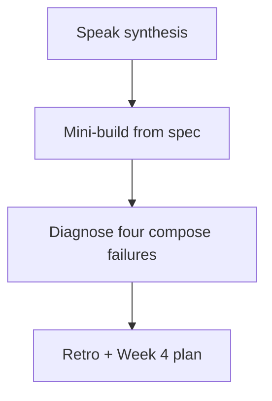

# Month 15 · Week 3 · Day 7
# Week Review — Compose Failures and Production-Shaped Images

**Program:** Full-Stack Mastery · 18 months  
**Phase:** 5 — Production engineering  
**Month index:** [../../README.md](../../README.md)  
**Week 3:** [1](day-01.md) · [2](day-02.md) · [3](day-03.md) · [4](day-04.md) · [5](day-05.md) · [6](day-06.md) · Day 7 (today)  
**Week rhythm today:** Review, repair, plan Week 4  
**Student state:** You wrote compose files, dropped root, healthchecked Postgres, documented config, and ran four lab services. Today those ideas must still live in your head — from **this file**.  
**Study time:** 3–4 focused hours

Do not start Week 4 because the calendar moved. JSON logs on a stack you cannot unstick are two problems.

Work in `~/fullstack-lab/month-15/week-03/day-07/`. Not Project 7. Ubuntu bash. Kubernetes is not this month.

---

## How to read this chapter

This is a **closed-book teaching day**. The synthesis **is** the Week 3 lesson.



Days 1–6 closed during mini-build. Repair from **this** recap.

---

## Week synthesis (the lesson, in this book)

**Compose** declares services, networks, volumes, env, ports, build, restart, healthchecks. It is a **rehearsal**, not production by itself, not Kubernetes.

**DNS:** service key is the hostname on the project network. Host Ubuntu uses **published** `127.0.0.1:port`. Wrong name (`db` vs `postgres`) is a silent connection failure.

**depends_on** without condition: **start order**. With `service_healthy`: wait until **your** healthcheck passes. `pg_isready` ≠ schema ready ≠ `/ready`.

**Images.** Multi-stage copies artifacts; runtime stays small. **USER** non-root; chown; no 777. Slim vs distroless (no shell). Tags `0.1.0`; latest lies (Week 2).

**Postgres.** Official image; named volume on data dir; `POSTGRES_*` first empty dir only; `down -v` wipes; env_file + `.env` gitignored; `.env.example` committed.

**Restart** restarts PID 1; crash loops look “alive.” Read logs.

**Four roles.** nginx (static / proxy), API, Postgres, Redis. Redis URL `redis://redis:6379/0`. Do not confuse container localhost with the host.

**12-factor-lite.** Config in env; backing services as URLs; stateless API; logs tomorrow.

**Wrong belief:** “Compose green means users are happy.”  
**Correct:** it means containers started (and maybe probes passed).

**Wrong belief:** “I will fix unreadiness with restart: always.”  
**Correct:** you will get a restart loop. Use health + `/ready` (Week 4).

---

## Today's contract

**Today's gate.** Closed-book:

> I can write a small compose stack from spec, explain depends_on vs healthy, name volume wipe, missing env, and wrong network, and I did not start Week 4 on an empty mini.

---

## Time box

| Block | Minutes | Work |
|---|---|---|
| 1 | 30 | Speak; exam-01.md |
| 2 | 55 | Mini-build: cloakroom + postgres |
| 3 | 40 | Debug A–D |
| 4 | 20 | Review Day 6 CHECK vs reality |
| 5 | 20 | Break env; restore |
| 6 | 15 | Design: what Week 4 adds |
| 7 | 15 | Retro |

---

# Complete explanation — four failures you must still own

## 1. Database not ready

API started, TCP refused or “starting up.” Evidence: `compose logs db`, `compose ps` health. Fix: `pg_isready` + `service_healthy`, and still handle errors. Not: restart always.

## 2. Wrong network

Service not on the same user-defined network; DNS name unknown. Evidence: `docker compose exec api getent hosts db` fails. Fix: default compose network or attach both services. Not: `network_mode: host` as a lifestyle.

## 3. Volume wipe

`down -v` or deleting the volume. Data gone. Evidence: empty tables; volume missing in `docker volume ls`. Fix: restore from backup (you have none — honesty) or accept loss. Runbook warning.

## 4. Env missing

`POSTGRES_PASSWORD` unset; URL empty; API crash loop. Evidence: logs `password authentication failed` or `NoneType`. Fix: env_file, `.env` present, interpolation. Not: bake password in Dockerfile.

---

# Block 1 — Speak

Cover: DNS, three clocks, USER, down -v, four services, 12-factor-lite. `exam-01.md`.

```bash
mkdir -p ~/fullstack-lab/month-15/week-03/day-07
cd ~/fullstack-lab/month-15/week-03/day-07
```

---

# Block 2 — Mini-build (Days 1–6 closed)

**Spec: cloakroom tickets** — not bikeshare copy.

Services: `db` (postgres:16, volume `cloakdata`, healthcheck, env_file), `api` (FastAPI `/health` SELECT 1, `POST /tickets` `{hook: str}`, `GET /tickets`, publish 127.0.0.1:8930:8000, depends_on healthy db, image `cloak-api:0.1.0`).

No nginx required today. No Redis required. `.env` gitignored.

```bash
docker compose up --build -d
curl -sS http://127.0.0.1:8930/health
```

`STATUS.txt` from `docker compose ps`. Then `down` (keep volume).

---

# Block 3 — Debug

Write `exam-03-debug.md`. For each: evidence you would collect, root cause, fix. You may create a **deliberate** broken compose in `broken/` if time.

**A. db not ready** — API `depends_on: db` without condition; db slow; API exits. Junior sets `restart: always` only.

**B. wrong network** — extra networks `front` and `back`; api only `front`; db only `back`.

**C. volume wipe** — teammate `docker compose down -v` to “free disk” before demo.

**D. env missing** — no `.env`; YAML `${POSTGRES_PASSWORD}` empty; postgres refuses to start (official image requires password).

**E. (stretch)** API `DATABASE_URL=...@localhost:5432` inside compose.

---

# Block 4 — Review Day 6

Open **only** your bikeshare README / CHECK. `GAP.txt` one gap (proxy, non-root, Redis persist, CORS). If four services never ran, finish Day 6 before Week 4.

---

# Block 5 — Break env; restore

Stop stack. Rename `.env` to `.env.bak`. `up`. Capture postgres/API error in `exam-05-fail.txt`. Restore `.env`. `up`. Health 200. This is missing-env, not a Month 14 feature break.

---

# Block 6 — Design

`design.md`: Week 4 will add JSON logs, request ids, `/health` vs `/ready`. Why `/ready` failing when DB is down is better than Compose green + 500 HTML.

---

# Block 7 — Retro

`retro.md`: weakest compose skill; whether you still want latest; Week 4 question.

## Debug keys (after A–E)

**A.** Start order ≠ ready. Healthcheck + condition; don’t mask with always.  
**B.** Split networks without attaching api to back: no DNS. Attach or use one network.  
**C.** `-v` deletes named volumes. Restore only if backups exist.  
**D.** Official postgres image exits without password. Provide env.  
**E.** localhost is the API container. Host is `db`.

```bash
cd ~/fullstack-lab
git add month-15/week-03/day-07
git commit -m "Month 15 Week 3 review: cloakroom mini and compose defects."
```

---

## Office hours

**Mini is a copy of day-04 folder.** Change domain to cloakroom hooks. Copying is not review.

**Postgres port published 5432 to the world.** Remove host mapping unless you need a GUI; then `127.0.0.1:5432:5432` only.

---

## Definition of done

- [ ] exam-01.md  
- [ ] Mini health 200  
- [ ] Debug A–D written then checked  
- [ ] GAP.txt  
- [ ] Week 4 not started on empty mini  

---

## Optional review links

- [Compose startup order](https://docs.docker.com/compose/how-tos/startup-order/)  
- [Compose networking](https://docs.docker.com/compose/how-tos/networking/)  
- [Postgres Docker](https://hub.docker.com/_/postgres)  

---

# Lecture: compose failures, slowly

Always: `docker compose ps` then `logs SERVICE`. Then DNS (`getent hosts db` from api). Then env (`compose exec api printenv | grep -i database` — **do not commit output if it shows passwords**; redact). Then volumes (`docker volume ls`).

## A walk through defect A (db not ready)

Junior’s timeline:

1. `depends_on: [db]`  
2. API starts, TCP to `db:5432` refused  
3. API process **exits**  
4. `restart: always`  
5. Slack: “Compose is flaky”

Your timeline:

1. `compose logs db` — still `database system is starting up`  
2. Add `healthcheck` `pg_isready`  
3. `depends_on: db: condition: service_healthy`  
4. API still **handles** a refused connection on a stray request (503), because health is not a legal contract with physics  

Write `WALK-A.md` (ten lines) as if you were explaining this to Day 1 you.

## A walk through defect B (wrong network)

```yaml
networks:
  front:
  back:
services:
  api:
    networks: [front]
  db:
    networks: [back]
```

`getent hosts db` inside api returns nothing useful. Fix: put both on `back`, or use the default single network. Split networks are for **policies** (web cannot talk to db) — then the **api** must join both. Draw that in `WALK-B.md`.

## A walk through defect C (volume wipe)

`docker compose down` removes containers and the **default network**. Named volumes **remain**. `docker compose down -v` removes volumes declared in the file. There is no undo. Runbooks must use the words **data funeral**.

```bash
docker volume ls | grep cloak
```

If the name vanished after `-v`, you have your evidence.

## A walk through defect D (env missing)

Official `postgres` image: without `POSTGRES_PASSWORD` (or a trust config you will not use), the container **exits**. API waiting on `service_healthy` waits forever. Evidence is **db logs**, not a silent API.

Interpolation: if YAML says `${POSTGRES_PASSWORD}` and the shell has no `.env`, you ship `postgresql://campus:@db:5432/x` — empty password, auth fail, which can **look like** defect D from Week 3 Day 4 (volume vs file). Ask: did Postgres **ever** start, or did it start **once** with a different password?

## Stretch E: localhost

From **inside** api, `localhost:5432` is the API container’s loopback, not the host, not `db`. `ss` inside api will not show Postgres. `getent hosts db` will.

**Wrong belief:** “I published 5432 so the API should use 127.0.0.1:5432.”  
**Correct:** published ports are for **your laptop** (TablePlus). Service-to-service uses **Docker DNS** and the **internal** port.

**Closed-book cards:**

1. Service DNS.  
2. depends_on vs healthy.  
3. down -v.  
4. First-init POSTGRES_*.  
5. USER why.  
6. Multi-stage why.  
7. Redis localhost mistake.  
8. nginx role.  
9. 12-factor config.  
10. Not Kubernetes.

Miss more than two: synthesis, mini, then Week 4.

---

## Next week

**Week 4 — Observability:** structured logs, three pillars, health vs ready, SLI/SLO lite, then the **Month 15 exam** on a failing stack.
