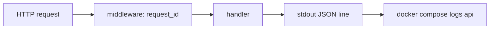

# Month 15 · Week 4 · Day 1
# Structured Logs: JSON, Levels, Secrets, and Request Ids

**Program:** Full-Stack Mastery · 18 months  
**Phase:** 5 — Production engineering  
**Month index:** [../../README.md](../../README.md)  
**Week 4:** Day 1 (today) · [2](day-02.md) · [3](day-03.md) · [4](day-04.md) · [5](day-05.md) · [6](day-06.md) · [7](day-07.md)  
**Week rhythm today:** Learn + type-along  
**Student state:** Week 3’s gate is true enough: you can run a compose stack and say when data dies. Today the stack must **speak in lines you can grep**.  
**Study time:** 3–4 focused hours

**This week covers:** structured logs, the three pillars (conceptually), health vs ready, FastAPI probes + request-id middleware, SLI/SLO lite, then the Month 15 exam.

Today: **JSON logs**, **levels**, **what not to log**, and a **correlation / request id**. Metrics and traces are Day 2 as **vocabulary**. Do not install a full observability platform today.

Labs: `~/fullstack-lab/month-15/week-04/day-01/`. Tiny **cloakroom printer** API — not Project 7. Ubuntu bash. Logs go to **stdout** (12-factor). Kubernetes log shipping is **not** this month.

---

## How to use this textbook

1. Read until “log the password to debug auth” feels like a defect, not a trick.  
2. Type a logger that prints **one JSON object per line**.  
3. Add a request id you can find in two lines of the same request.  
4. Optional review links are for later rechecking.

---

## How to read this chapter

A **log line** is a record of something that already happened. **Unstructured** logs are English sentences that break the first time a field contains a space. **Structured** logs are fields: `level`, `msg`, `request_id`, `path`, `status`. Machines parse JSON. Humans still read it — `jq` helps.



**Wrong belief:** “I’ll log to `/var/log/app.log` inside the container like a VM.”  
**Correct:** containers die; files in the writable layer die. PID 1 **stdout/stderr** is what `docker logs` and later collectors scrape. Week 1’s `/var/log` still exists on a VM; in Compose, **stdout is the contract**.

**Wrong belief:** “DEBUG everywhere in production is thorough.”  
**Correct:** DEBUG is a firehose (cost, noise, accidental PII). INFO for notable events, WARNING for recoverable trouble, ERROR for failures, CRITICAL for “wake someone.” You can raise verbosity with **env** (`LOG_LEVEL`) without a new image if you read the level at startup.

---

## Today's contract

By the end of this day you will be able to:

1. Explain **structured** vs text logs.  
2. Name **levels** and when to use each.  
3. List **secrets and PII** you will not log (passwords, tokens, cookie headers, emails if you can avoid them).  
4. Generate or accept an **`X-Request-ID`** (or `X-Correlation-ID`) and include it in every log line for that request.  
5. Read those lines with `docker logs` or `compose logs`.

**Today's gate.** Closed-book:

> Logs are stdout JSON with a level and a request id. I do not log passwords, tokens, or Authorization headers. A request id lets me grep one user’s failure. I did not paste Project 7.

---

## Time box

| Block | Minutes | Work |
|---|---|---|
| A | 55 | Theory |
| B | 60 | Type-along: JSON logger + middleware |
| C | 65 | Independent: redaction drills + compose logs |
| D | 15 | Git |
| E | 15 | Recall |

---

# Block A — Theory

## 1. Why this week exists

Month 14 told you **which test** went red. Month 15 tells you **which process** misbehaved **in a running stack**. Without logs, `compose ps` is a mood. With unstructured logs, you cannot ask “all 500s for request abc.”

Observability is not a vendor. It starts with **honest lines**.

## 2. Structured logs (JSON)

One object per line (NDJSON):

```json
{"ts":"2026-08-16T21:00:00Z","level":"info","msg":"request_finished","request_id":"7c2e…","method":"POST","path":"/tickets","status":201}
```

Properties:

- **Parseable** — `jq 'select(.status>=500)'`  
- **Stable keys** — `request_id` not `reqId` on Tuesdays  
- **No multiline stack traces as the only form** — log `msg` plus `error` field; if you must log a traceback, still prefix with JSON or use a logging library that supports `exc_info` into a field  

Python: the stdlib `logging` can use a JSON formatter you type (a few lines `json.dumps`). You do not need Datadog’s library today.

**Wrong belief:** “JSON is slower so I will concatenate strings.”  
**Correct:** the cost of one `dumps` is not your outage. Unparseable logs are.

## 3. Levels

| Level | Meaning | Example |
|---|---|---|
| DEBUG | Detail for developers, usually off in prod | SQL bind params **redacted** |
| INFO | Normal notable | request finished, job started |
| WARNING | Unexpected but continued | retry, deprecated client |
| ERROR | Operation failed | 500, insert failed |
| CRITICAL | System cannot continue | cannot boot, disk full |

HTTP 4xx: often **INFO** or **WARNING** (client mistake), not ERROR for every 422. HTTP 5xx: ERROR. This keeps error dashboards meaningful (Day 5 alerts).

## 4. What not to log

Never:

- Passwords, password hashes  
- `Authorization` header values, API keys, session tokens  
- Full credit card numbers (you should not have them anyway)  
- Private keys  

Avoid when you can:

- Email, phone, government ids — **PII**. If you must, **minimize** (user id, not email) and know the policy.  
- Full request bodies on auth endpoints.  
- Cookies (`Cookie:` header).  

**Wrong belief:** “I’ll log the token to see if the client sent it.”  
**Correct:** log `auth_present: true/false` and maybe last four of a **non-secret** id. Tokens in logs become tokens in every log vendor and every Slack paste.

Defense only: this is **redaction**, not an exploit guide. Do not practice stealing tokens from logs on systems you do not own.

## 5. Request correlation id

A **request id** (correlation id) is a string that follows **one HTTP request** through logs (and later, traces).

Sources:

1. Client sends `X-Request-ID` (or `traceparent` — Day 2). **Validate** it (length, charset) so the client cannot flood 4MB headers into logs.  
2. Else the API **generates** a UUID.

Middleware:

- Put the id on a **contextvar** or `request.state`  
- Log it on every line  
- Return it on the **response header** so curl/`httpie` can show it  

When nginx proxies (Week 3), it should **forward** the header to the API. If not, the web and API ids will not match — a classic “I grepped the wrong container.”

**Wrong belief:** “The Docker container id is the request id.”  
**Correct:** container id is the **process world**. Thousands of requests share it. Request id is per request.

## 6. stdout and Docker

`print` without flush can delay lines. Logging to stdout with `flush` or `StreamHandler` is the default you want. `docker compose logs -f api` follows PID 1 stdout/stderr.

If you use gunicorn+uvicorn workers later, **each** worker logs — still stdout. Do not configure syslog inside the lab.

## 7. Sampling and volume (name only)

At 10k RPS, logging every request body is a denial of **your own** wallet. Today your lab is tiny: log request **summaries** (method, path, status, duration_ms). That habit scales.

## 8. Say it — two minutes

JSON one object per line; levels; three things you never log; where the request id lives; why stdout not a file in the container.

---

# Block B — Type-along

```bash
mkdir -p ~/fullstack-lab/month-15/week-04/day-01
cd ~/fullstack-lab/month-15/week-04/day-01
```

Create `app.py` FastAPI:

- Middleware: read `X-Request-ID` or generate `uuid4()`, store on `request.state.request_id`, set response header `X-Request-ID`  
- Logging helper: `log(level, msg, **fields)` writes JSON to stdout including `request_id` if present  
- `GET /health` → 200, log info `health_ok`  
- `POST /tickets` `{hook: str min 1}` → 201 in-memory, log info `ticket_created` with **hook length** not necessarily the hook if it might be PII — for this lab hook is a coat-hook code; logging the code is OK. Also `GET /tickets`  
- `GET /boom` → 500 after log error `intentional_boom`  

Do **not** log `Authorization` even if the client sends one. If you want a drill: if header present, log `authorization_header: true` only.

CMD uvicorn 0.0.0.0:8000. Dockerfile optional today; you may run:

```bash
# in Ubuntu, with a venv if you want
uv init --name lab-logs || true
# or: pip in venv
```

If `uv` exists in WSL:

```bash
uv init --name lab-logs
uv add fastapi uvicorn
uv run uvicorn app:app --host 127.0.0.1 --port 8940
```

If not, `python3 -m venv .venv && source .venv/bin/activate && pip install fastapi uvicorn`.

**Docker path (preferred for `docker logs`):** Dockerfile + `docker run -p 127.0.0.1:8940:8000`. Then:

```bash
curl -sS -D - http://127.0.0.1:8940/health -o /dev/null
curl -sS -H "X-Request-ID: lab-req-1" -X POST http://127.0.0.1:8940/tickets \
  -H "Content-Type: application/json" -d '{"hook":"H-22"}'
docker logs CONTAINER 2>&1 | tail
```

Write `LINES.md`: two JSON lines that share `lab-req-1`.

---

# Block C — Independent

### Task 1 — Redaction stories

`REDACT.md` — for each, **what to log instead**:

**R1.** Login handler receives `{"email":"a@b.c","password":"secret"}`.  
**R2.** Incoming `Authorization: Bearer eyJ...`.  
**R3.** Exception on payment: the card number is in the exception string.  
**R4.** DEBUG SQL: `WHERE email = 'a@b.c'`.

### Task 2 — Level choices

`LEVELS.md`: 422 validation; 500 unhandled; process start; disk full (concept); client sent request id.

### Task 3 — Compose logs

If you containerized: `docker compose logs --no-color api | tail -n 20`. Prove you can `grep lab-req-1`. If not using compose, `docker logs`.

### Task 4 — Anti-patterns

`ANTI.md` (eight lines): logging `print(request.headers)`; writing `/var/log/app.log` without a volume; `LOG_LEVEL=debug` in production by default.

---

# Block D — Git

Do not commit `.venv`.

```bash
cd ~/fullstack-lab
git add month-15/week-04/day-01
git commit -m "Month 15 Week 4 Day 1: JSON logs and request id middleware."
```

---

# Block E — Recall

1. Why JSON.  
2. Why stdout.  
3. Three never-log items.  
4. Who generates the request id if the client omits it.  
5. 422 vs 500 level.  
6. Container id vs request id.

---

## Office hours

**JSON invalid because of single quotes.** `json.dumps` uses double quotes. Do not `print("{'a':1}")`.

**uvicorn access log duplicates your JSON.** You can disable uvicorn access logs later (`--no-access-log`) and keep your structured line. Today, extra text lines are OK if **your** lines are JSON.

**Logged the password “just in the lab.”** Delete that code. Muscle memory.

---

## Definition of done

- [ ] JSON lines with request_id  
- [ ] Response header echoes id  
- [ ] REDACT.md  
- [ ] Gate paragraph closed-book  
- [ ] Commit exists  

---

## Optional review links

- [12factor: logs](https://12factor.net/logs)  
- [Python logging](https://docs.python.org/3/library/logging.html)  
- [FastAPI middleware](https://fastapi.tiangolo.com/tutorial/middleware/)  

---

# Lecture: a JSON line you can grep

A minimum useful line:

```json
{"ts": "2026-08-16T21:00:00Z", "level": "info", "msg": "request_finished", "request_id": "lab-req-1", "method": "POST", "path": "/tickets", "status": 201}
```

`ts` should be **UTC** (Month 14 clock habit). `level` lowercase or uppercase — **pick one** and keep it. `msg` is a stable machine string (`request_finished`), not a novel (`User Bob created a thing`). Bob’s name is PII.

## Middleware placement

If you log only inside path operations, a 404 from FastAPI itself may have no id. Middleware around `call_next` sees **every** request, including `/health` and missing routes.

Validate `X-Request-ID`: allow `A-Za-z0-9-_` up to 128 characters. A client sending a 2 MB header is not “correlation”; it is abuse. Ignore and generate.

## Redaction R1–R4 keys (after you write REDACT.md)

**R1.** Log `login_attempt` + `email_present: true`, never the password, preferably not the email — user id after lookup.  
**R2.** `authorization_header: true`, never the bearer value.  
**R3.** Catch and log `payment_failed` + error **code**; do not `str(exc)` if it embeds PAN.  
**R4.** Log `query_name=user_by_email` not the interpolated SQL.

## uvicorn access log vs your JSON

Two lines per request is OK today. Later: `--no-access-log` and keep structured `request_finished`. Do not parse uvicorn’s text line in a dashboard.

**Wrong belief:** “I’ll write JSON to `/var/log/app.log` and mount a volume.”  
**Correct:** you *can*, and then you have two places. Stdout is the Compose contract (`docker compose logs`). A volume of logs is extra.

**Wrong belief:** “DEBUG in production helps me.”  
**Correct:** it helps attackers and your bill. `LOG_LEVEL` env, default INFO.

Write `LEVEL-POLICY.md` (eight lines) for this lab: default INFO; how you would switch to DEBUG for one incident (compose `environment`, not a new image).

---

## Tomorrow

**Three pillars:** logs, metrics, traces conceptually; OpenTelemetry as **vocabulary**, not a mandatory install.
