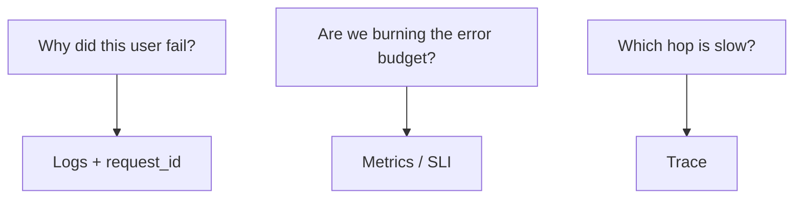

# Month 15 · Week 4 · Day 2
# Three Pillars: Logs, Metrics, Traces (and OpenTelemetry as Vocabulary)

**Program:** Full-Stack Mastery · 18 months  
**Phase:** 5 — Production engineering  
**Month index:** [../../README.md](../../README.md)  
**Week 4:** [1](day-01.md) · Day 2 (today) · [3](day-03.md) · [4](day-04.md) · [5](day-05.md) · [6](day-06.md) · [7](day-07.md)  
**Week rhythm today:** Exercises + teaching drills  
**Student state:** Yesterday you emitted JSON with a request id. Today you place that line among **three kinds of questions**. You will **not** be required to install an OpenTelemetry SDK or a collector.  
**Study time:** 3–4 focused hours  
**Prereq:** Day 1 gate passed.

Labs: `~/fullstack-lab/month-15/week-04/day-02/`. Paper + a tiny **instrumentation.md** map. Not Project 7. Not a Datadog trial.

---

## How to use this textbook

1. Read until you can assign a production question to a **pillar**.  
2. Fill tables from this chapter, not from a vendor homepage.  
3. Write what you would **emit** (log fields, a counter name, a span name) without installing OTel.  
4. Optional review links are for later rechecking.

---

## How to read this chapter

**Observability** is the ability to ask new questions about a running system without shipping new code for every question. In practice teams buy tools. The **ideas** are older than the tools.

The **three pillars** (a common teaching picture):

| Pillar | What it is | Good for |
|---|---|---|
| **Logs** | Discrete events with fields | “What happened to request X?” |
| **Metrics** | Aggregated numbers over time | “Is the error **rate** up?” “How full is the queue?” |
| **Traces** | A request’s path as **spans** across services | “Where did the 800ms go — nginx, API, Postgres?” |



**Wrong belief:** “I must run Jaeger this week or I did not learn tracing.”  
**Correct:** you must **define a span** in sentences. Installing OpenTelemetry is optional stretch. Month 16+ may add exporters. This month’s gate asks you to **say** what a metric and a trace are for.

**Wrong belief:** “Metrics replace logs.”  
**Correct:** metrics are cheap at high volume and **lossy** (you see rates, not the one body that 500’d). Logs are the opposite. Traces connect hops. You want a **budget** for each, not a religion.

Kubernetes has metrics-server and sidecars. **Not this month.**

---

## Today's contract

1. Define log, metric, trace, span, exemplar (name only), cardinality (danger).  
2. Map eight questions to a **primary** pillar.  
3. Explain **OpenTelemetry** as a **vendor-neutral API/SDK/protocol** — not a SaaS.  
4. Explain **correlation**: request id vs trace id.  
5. Write `PILLARS.md` for the bike-share or cloakroom lab (names only).

**Today's gate.** Closed-book:

> Logs answer what happened on one request. Metrics answer rates and gauges. Traces answer where time went across services. OpenTelemetry is a vocabulary and toolkit for emitting those, not a required install this month.

---

## Time box

| Block | Minutes | Work |
|---|---|---|
| A | 55 | Theory |
| B | 50 | Type-along: map eight questions |
| C | 70 | Independent: PILLARS.md + fake span sketch |
| D | 15 | Git |
| E | 15 | Recall |

---

# Block A — Theory

## 1. Logs (you already started)

High **cardinality** (request id, user id) is OK in logs if you **redact**. Volume is the cost. Day 1 JSON + request id is the log pillar.

## 2. Metrics

A **metric** is a named measurement: counter, gauge, histogram.

| Type | Example |
|---|---|
| **Counter** | `http_requests_total` (only goes up) |
| **Gauge** | `queue_depth`, `process_resident_memory_bytes` |
| **Histogram** | `http_request_duration_seconds` buckets |

**Labels/tags** (`path`, `status`) make metrics powerful and dangerous. `path=/holds/12345` as a label **explodes cardinality** (one time series per id) and melts Prometheus. Use `path=/holds/{id}` templated routes.

**Wrong belief:** “I’ll metric every user email as a label.”  
**Correct:** that is a PII leak **and** a cardinality bomb.

You will not install Prometheus today. You will **name** two metrics your API should eventually expose (`/metrics` is a common path; not required this month).

## 3. Traces and spans

A **trace** is one request’s journey (id). A **span** is a timed operation: `HTTP GET /holds`, `postgres.query`, `redis.GET`. Spans form a tree (parent/child).

If nginx → API → Postgres, you hope to see three spans **with the same trace id**. That is how you answer “is it the database.”

**Context propagation:** headers like `traceparent` (W3C) carry trace id across services. Your Day 1 `X-Request-ID` is a **cousin**. In a mature stack, **trace id** is the correlation key; request id may be the same or an extra field. For this month, **one id in logs is the habit**; you should **know** traces exist.

## 4. OpenTelemetry (OTel) as vocabulary

**OpenTelemetry** is an open standard and set of libraries to **create** logs/metrics/traces and **export** them (OTLP) to a backend (Jaeger, Grafana Tempo, a vendor, stdout).

Pieces you may hear:

| Word | Meaning |
|---|---|
| **API** | How your code records a span/counter |
| **SDK** | Actual implementation, processors, exporters |
| **Instrumentation** | Auto (FastAPI plugin) or manual (`start_as_current_span`) |
| **Collector** | Optional process that receives, batches, exports |
| **OTLP** | The protocol |

**Wrong belief:** “OpenTelemetry is Grafana.”  
**Correct:** Grafana may **display** data OTel exported. OTel is the **how we emit**.

**Wrong belief:** “I failed Month 15 if I did not `pip install opentelemetry-distro`.”  
**Correct:** [Month 15 README](../../README.md) gate: you can say what a metric and a trace are for, even if you only emit logs this month.

Optional stretch: print a **fake** span as JSON `{trace_id, span_id, name, duration_ms}` in the same logger — still not a collector.

## 5. Which pillar first?

On-call heuristic:

1. **Symptom metric** (error rate, latency p99) — is it happening **now** and **how big**?  
2. **Trace** a slow request — which span?  
3. **Logs** for that trace/request id — exception message (redacted).

Day 5 will say: **alert on symptoms**, not on “CPU might be high.” CPU is a gauge that **explains** sometimes; user-facing error rate **is** the symptom.

## 6. Health vs pillars

`/health` is not a pillar. It is a **probe**. A green healthcheck with a red error-rate metric is a famous lie. Week 4 Day 3 memory + Day 4 lab: `/ready` fails when DB is down.

## 7. Say it — two minutes

Three pillars; cardinality; span vs trace; OTel vs vendor; request id vs trace id; why not email labels.

---

# Block B — Type-along: eight questions

```bash
mkdir -p ~/fullstack-lab/month-15/week-04/day-02
cd ~/fullstack-lab/month-15/week-04/day-02
```

Write `CLASSIFY.md`. For each question: **primary pillar**, **one signal name**, **what the others miss**.

**Q1.** Did request `lab-req-1` 500, and what exception?  
**Q2.** Is p99 latency for `POST /holds` worse than yesterday?  
**Q3.** Is the slowness in Redis or Postgres?  
**Q4.** How many 503s in the last five minutes?  
**Q5.** What `request_id` did the browser show when the create button failed?  
**Q6.** Are we about to fill the Postgres volume? (disk — infra metric)  
**Q7.** Did we log a password by accident? (still logs — audit)  
**Q8.** CPU is 90% — should we page? (trap)

Do not install tools. This is classification.

---

# Block C — Independent

### Task 1 — PILLARS.md

For **your** Week 3 four-service lab (or Day 1 tickets API if you never finished Day 6):

- two log events you already have or owe  
- two metrics you would add later (`http_requests_total{status}`, `hold_create_seconds`)  
- one trace: spans `nginx`, `api.POST /holds`, `postgres.insert`, `redis.set`  
- where the **id** lives (header name)

No Project 7 source. Names only.

### Task 2 — Fake span sketch

In any small Python file `span_sketch.py`, print one JSON span (hardcoded durations). Run it. This is **pedagogy**, not OTel.

### Task 3 — Cardinality trap

`CARD.md`: why `http_requests_total{user_id="..."}` is a bad metric label and an OK **log field**.

### Task 4 — OTel glossary

`OTEL.md`: API, SDK, exporter, collector — one sentence each, from this chapter.

---

# Block D — Git

```bash
cd ~/fullstack-lab
git add month-15/week-04/day-02
git commit -m "Month 15 Day 2: three pillars classification and OTel vocabulary."
```

---

# Block E — Recall

1. Log vs metric vs trace.  
2. Span.  
3. Cardinality bomb.  
4. What OTel is not.  
5. Alert on CPU vs error rate (preview).  
6. Is installing Jaeger required today?

---

## Office hours

**Installed a full Grafana stack and lost the day.** Stop. Classification files are the deliverable. You may play with Grafana **after** CLASSIFY.md.

**Q8 I said logs.** CPU is a **metric**. Whether to page is Day 5 (usually no, unless it correlates with user symptoms).

---

## Definition of done

- [ ] CLASSIFY.md Q1–Q8  
- [ ] PILLARS.md  
- [ ] OTEL.md  
- [ ] Gate paragraph closed-book  
- [ ] Commit exists  

---

## Optional review links

- [OpenTelemetry docs](https://opentelemetry.io/docs/)  
- [W3C traceparent](https://www.w3.org/TR/trace-context/)  
- [Prometheus metric types](https://prometheus.io/docs/concepts/metric_types/)  

---

# Lecture: eight questions, slowly

**Q1** is a **log** because you have a unique request id and need the exception **text**. A metric would tell you “500s happened,” not which line of code. A trace would show which span failed, still not the traceback unless you also log.

**Q2** is a **histogram** (or a timer) over many requests. Logs can compute p99 if you export duration_ms and run a query, but that is a slow metric. Name `http_request_duration_seconds` with label `path` **templated**.

**Q3** is a **trace**. Logs in one container cannot prove the other hop’s wait unless you logged timestamps in both and aligned ids — that is a handmade trace. Spans are the honest tool.

**Q4** is a **counter** ratio: `http_requests_total{status="503"}` / `http_requests_total`. Idle zero traffic: do not divide by zero in an alert (Day 5).

**Q5** is **logs** plus the **response header**. The browser DevTools network panel shows `X-Request-ID` if you echoed it. That is why Day 1 middleware sets the header.

**Q6** is an **infra gauge** (`disk_used_ratio`). It is not a user SLI by itself. It **explains** F (exam disk full). Put it on dashboard row 2.

**Q7** is an **audit log** question. Metrics will not show a password field. Grep JSON keys. Prevention is redaction in code, not a dashboard.

**Q8** CPU is a **gauge**. Paging is Day 5. Primary pillar for “should we page” is usually **error ratio or latency SLI**, with CPU as a follow-up panel.

Write `Q8.md` (six lines): a sentence you would put on an alert “CPU high” ticket: “Investigate only if error ratio or p99 moved.”

## Correlation ids, two names

| Id | Typical header | Job |
|---|---|---|
| Request / correlation id | `X-Request-ID` | Grep logs for one HTTP call |
| Trace id | `traceparent` (W3C) | Join spans across services |

They can be **the same string** in a small lab. In a mature stack, trace id is 128-bit hex in `traceparent`. You do not need to parse `traceparent` this month. You do need to **not** call a container id a request id.

**Wrong belief:** “If I log duration_ms I have traces.”  
**Correct:** you have a **field on a log**. A trace is a **tree of spans** with parent ids.

**Wrong belief:** “If I have traces I can delete logs.”  
**Correct:** traces are timing and topology. Logs hold messages and redacted errors.

## Cardinality, with numbers

If you have 10,000 user ids and you put `user_id` on a counter, you created 10,000 time series **per** other label combination. Prometheus memory is not your lab disk. Logs can include `user_id` (if policy allows) because they are **events**, not perpetual series.

Write `CARD.md` if you have not: one good label (`method`, `status`, `route_template`) and one forbidden (`email`, `raw path with id`).

## OpenTelemetry without installing it

Imagine this pipeline: your FastAPI app uses an SDK → exporter OTLP → a collector → Grafana Tempo. None of those processes are required in `docker compose ps` today. If you added them and broke the lab, `down` them. Vocabulary still stands.

Optional stretch (15 minutes, after CLASSIFY.md):

```python
print('{"trace_id":"abc","span_id":"001","parent_span_id":null,"name":"GET /holds","duration_ms":42}')
```

That is a **cartoon span**. Do not claim you “run OpenTelemetry.”

---

## Tomorrow

**Memory:** health vs ready; which pillar answers which question — Days 1–2 closed.
