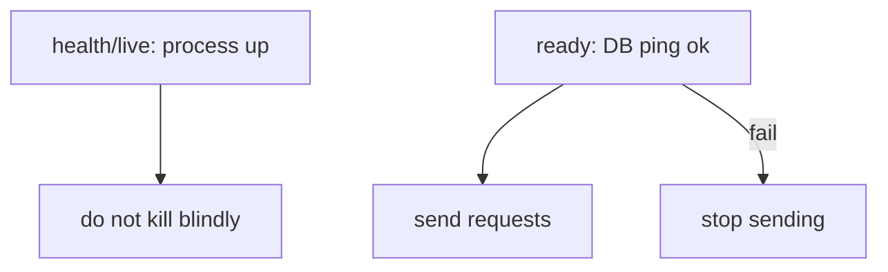
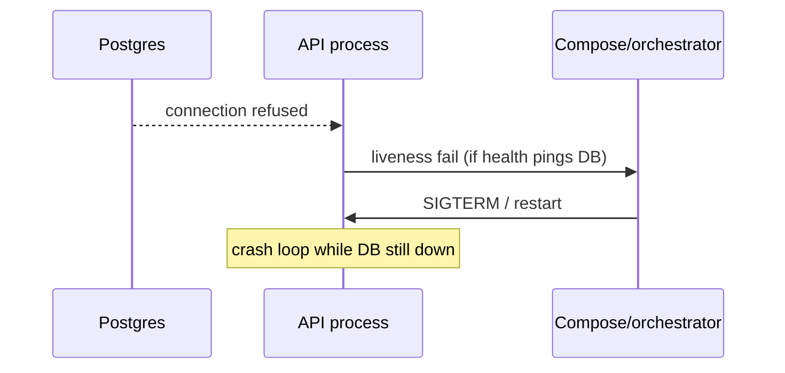

# Month 15 · Week 4 · Day 3
# From Memory: Health vs Ready, and Which Pillar Answers Which Question

**Program:** Full-Stack Mastery · 18 months  
**Phase:** 5 — Production engineering  
**Month index:** [../../README.md](../../README.md)  
**Week 4:** [1](day-01.md) · [2](day-02.md) · Day 3 (today) · [4](day-04.md) · [5](day-05.md) · [6](day-06.md) · [7](day-07.md)  
**Week rhythm today:** Implement from memory  
**Student state:** Day 2 gate passed. You can name JSON logs and three pillars. Today probes and pillars must still live in your head — from **this file**.  
**Study time:** 3–4 focused hours  
**Prereq:** Day 2 gate passed.

Labs: `~/fullstack-lab/month-15/week-04/day-03/`. Days 1–2 textbook **closed** during drills. Not Project 7.

---

## How Day 3 works

Recap is the teacher. Worked box **after** `PROBES.md` and `PILLARS.md` exist.

Stuck 25 minutes: open only the matching Day 1 or 2 section. `lookups.txt`.

---

## How to read this chapter

**Liveness** (often `/health` or `/live`): is the **process** sane enough to keep running? If this fails, an orchestrator **restarts** the container. A restart will **not** fix a down database; it will **crash-loop**.

**Readiness** (`/ready`): should we **send traffic**? If the DB is down, fail ready. Load balancers (and Compose `service_healthy` if you point it here) **stop sending** work. The process can stay up.

This month you are not required to split `/live` vs `/health` vs `/ready` into three paths, but you **must** own **health vs ready** as two ideas. Day 4 will implement FastAPI `/health` and `/ready`.



**Wrong belief:** “Memory day means reread Day 2.”  
**Correct:** recap below; new classification rows.

---

## Complete explanation (observability you must still own)

**Structured logs.** One JSON object per line on **stdout**. Fields: `level`, `msg`, `request_id`. `docker compose logs`. Not a file in the writable layer as the only copy.

**Levels.** DEBUG noisy; INFO normal; WARNING recovered trouble; ERROR failed operation; CRITICAL wake. 5xx ERROR; 4xx usually not ERROR flood.

**Do not log.** Passwords, tokens, Authorization values, cookies, card numbers. Prefer `auth_present`. Minimize PII.

**Request id.** From `X-Request-ID` if sane, else UUID. Echo on response. Grep one request. Not the container id.

**Three pillars.** Logs: one event. Metrics: rates/gauges/histograms; watch **cardinality**. Traces: spans across hops; **trace id**. OTel: API/SDK/exporter/collector **vocabulary**; install optional. Alert on **symptoms** (Day 5).

**Probes.** Health/live ≠ ready. DB down → ready fail, not necessarily kill PID 1. Compose `pg_isready` is a **db** healthcheck; app `/ready` is the **app’s** truth.

**Wrong belief:** “Green `/health` means the product works.”  
**Correct:** it means what you coded. If health does not ping the DB, Postgres can be dead.

**Wrong belief:** “Traces replace request ids.”  
**Correct:** traces **are** ids plus timing tree. Logs should still carry the id.

**Not Kubernetes** — but K8s **liveness vs readiness** is the same idea you are learning in FastAPI.

---

## Today's contract

1. Define health vs ready closed-book.  
2. Classify eight questions onto pillars (new set).  
3. Sketch `/health` and `/ready` behavior in markdown **before** Day 4 code.  
4. Redaction two-liners from memory.

**Today's gate.** Closed-book:

> Ready fails when the DB cannot be pinged. Health may still be ok so we do not restart-loop. Logs vs metrics vs traces answer different questions. I do not log secrets.

---

## Time box

| Block | Minutes | Work |
|---|---|---|
| 1 | 25 | Speak; exam-01.md |
| 2 | 45 | PROBES.md |
| 3 | 45 | PILLARS.md eight questions |
| 4 | 30 | REDACT + DEBUG mislabels |
| 5 | 20 | Worked box; DIFF.md |
| 6 | 20 | Design: bike-share /ready |
| 7 | 15 | Retro |

---

# Block 1 — Speak

Cover: JSON stdout; never-log list; three pillars; OTel one sentence; health vs ready. `exam-01.md`.

```bash
mkdir -p ~/fullstack-lab/month-15/week-04/day-03
cd ~/fullstack-lab/month-15/week-04/day-03
```

---

# Block 2 — Probes from memory

Write `PROBES.md`:

1. `/health` — what it **may** check (process only) vs what people wrongly stuff into it.  
2. `/ready` — must fail when **Postgres is down** (Week 4 Day 4 spec). Redis? Your choice, documented.  
3. What happens if liveness pings the DB and the DB is down (crash loop).  
4. How Compose `healthcheck` on the **db service** differs from API `/ready`.  
5. One curl example you will run tomorrow.

No FastAPI required today. Markdown is the product. Stretch: a 10-line `ready.py` function `def db_ok() -> bool` with a fake.

---

# Block 3 — Pillars (new questions)

`PILLARS.md` — primary pillar + why.

**T1.** p95 of `GET /stats` this hour.  
**T2.** Exception text for request id `abc`.  
**T3.** Was Redis or Postgres the slow child span?  
**T4.** Disk percent on the volume (concept).  
**T5.** Did we emit `password=` in logs?  
**T6.** Are 500s 2% of traffic?  
**T7.** Which nginx upstream timed out?  
**T8.** (Trap) `compose ps` is healthy. Users still 500. Which pillar first?

---

# Block 4 — Debug mislabels

`DEBUG.md`:

**A.** “Liveness should SELECT 1 so we restart if DB dies.”  
**B.** “Metrics with `user_email` label.”  
**C.** “OpenTelemetry is a dashboard company.”  
**D.** “docker logs is a trace.”  
**E.** “X-Request-ID is a secret like a password.”

---

# Block 5 — Worked box (after files exist)

**Probes:** Ready = can we take traffic (DB ping). Health/live = process alive; **do not** kill for DB outage. Compose db health ≠ API ready.

**T1** metrics histogram. **T2** logs. **T3** traces. **T4** infra metric (gauge). **T5** logs (audit). **T6** metrics counter ratio. **T7** traces or nginx logs. **T8** logs/metrics of the **API** — compose health was the wrong layer.

**A.** Crash loop; use ready. **B.** Cardinality + PII. **C.** OTel is a standard. **D.** Logs. **E.** Request ids are correlators; still do not put tokens in them; they are not passwords but do not log them in public Slack either — they can appear in user-facing headers.

Write `DIFF.md`.

---

# Block 6 — Design

`DESIGN.md`: for bike-share four services, when `/ready` should fail (db down; optionally redis down). What `/health` returns during that incident.

---

# Block 7 — Retro

```bash
cd ~/fullstack-lab
git add month-15/week-04/day-03
git commit -m "Month 15 Day 3: health vs ready and pillars from memory."
```

---

## Office hours

**Implemented Day 4 early.** Fine if probes markdown still exists; do not skip PROBES.md.

**Copied Day 2 CLASSIFY.md.** New T1–T8 required.

---

## Definition of done

- [ ] exam-01, PROBES, PILLARS before box  
- [ ] DEBUG A–E  
- [ ] DIFF.md  
- [ ] Commit exists  

---

## Optional review links

- [Kubernetes probes concept](https://kubernetes.io/docs/concepts/configuration/liveness-readiness-startup-probes/) — **read for ideas only**; you are not installing K8s  
- [12factor logs](https://12factor.net/logs)  

---

# Lecture: two probes, slowly

If you only have one URL, on-call will use it for **both** restart and traffic. That is how teams restart pods during a database incident and make it worse. Two URLs (or two Compose checks) split **kill me** from **stop sending me users**.

Write `HEURISTIC.md`. Then Block 5 if needed.

## Liveness anti-pattern, with a sequence



Readiness anti-pattern inverted: if you **never** fail ready, nginx keeps sending POSTs that 500. Users see errors; `compose ps` looks fine. That is Week 3 “green is not happy.”

## Pillars T1–T8 keys you already saw

If you open this lecture **before** PILLARS.md, you are cheating. After DIFF.md, use this as repair:

- T1 histogram/p95 → **metrics**  
- T2 exception + id → **logs**  
- T3 which hop → **traces**  
- T4 disk → **infra metric**  
- T5 password in logs → **logs** (audit)  
- T6 500 rate → **metrics**  
- T7 upstream timeout → **traces** or nginx **logs**  
- T8 compose green, users 500 → start with **API logs/metrics**, not `ps`

**Wrong belief:** “T8 is infrastructure because Docker is involved.”  
**Correct:** Docker is healthy. The **application** is 500ing. Layer names on the exam (frontend/network/backend/database/config/machine) still apply; here it is **backend** or **database** depending on the body of the 500.

## Request id is not a password

DEBUG E: correlators appear in **response headers** and access logs. They should not be **bearer tokens**. Do not put session secrets in `X-Request-ID`. Do not paste a production request id with PII into a public ticket if the logs also contain user fields — minimize. Still: a UUID request id is not a password. Do not `chmod 600` your log files thinking that makes Authorization headers OK to print.

## Probe table to memorize

| URL | DB down | Process up | Typical consumer |
|---|---|---|---|
| `/health` or `/live` | 200 | 200 | restart policy / liveness |
| `/ready` | 503 | 200 | load balancer / compose healthcheck |

Write `TABLE-FROM-MEMORY.md` without looking, then compare.

## What Day 4 will type (preview, not a license to skip)

You will `docker compose stop db` and curl both URLs. If you already did that in Week 3 by accident, you still write PROBES.md **in words** today. Memory day is language, not a head start on uvicorn.

**Wrong belief:** “pg_isready on the db service means the API is ready.”  
**Correct:** it means Postgres accepts connections. The API may still lack `DATABASE_URL`, schema, or Redis. `/ready` is the API’s sentence.

---

## Tomorrow

**Lab:** FastAPI `/health` `/ready` (db ping), fail ready when DB down; request-id middleware.
