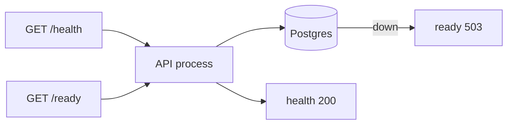

# Month 15 · Week 4 · Day 4
# Lab: `/health`, `/ready`, and Request-Id Middleware

**Program:** Full-Stack Mastery · 18 months  
**Phase:** 5 — Production engineering  
**Month index:** [../../README.md](../../README.md)  
**Week 4:** [1](day-01.md) · [2](day-02.md) · [3](day-03.md) · Day 4 (today) · [5](day-05.md) · [6](day-06.md) · [7](day-07.md)  
**Week rhythm today:** Lab (type-along + independent)  
**Student state:** You can define ready vs health on paper. Today FastAPI must **fail ready** when Postgres is down, and every request must carry an id in **JSON logs**.  
**Study time:** 3–4 focused hours  
**Prereq:** Day 3 gate passed.

Labs: `~/fullstack-lab/month-15/week-04/day-04/`. **Harbor lockers** API + Postgres — not Project 7, not a paste of Week 3 bikeshare. You may reuse **patterns** (env_file, healthcheck, volume).

---

## How to use this textbook

1. Read Block A until `/ready` 503 is a **feature**.  
2. Type middleware + probes. Predict curl **before** you stop the db.  
3. Prove logs contain the same id as the response header.  
4. Optional review links are for later rechecking.

---

## How to read this chapter

**`GET /health`** — process is up. May return `{"status":"ok"}` without a DB ping (liveness-shaped).

**`GET /ready`** — `SELECT 1` against Postgres. 200 `{"status":"ready"}` or **503** `{"status":"not_ready"}`.

When you `docker compose stop db`, `/health` should still be **200** (process up) and `/ready` **503**. That is the whole lab in one sentence.



**Wrong belief:** “I’ll make `/health` ping the DB so Compose restarts the API when Postgres dies.”  
**Correct:** that is a **liveness** anti-pattern. You will restart-loop the API during a DB outage. Ready fails; health stays green.

**Wrong belief:** “503 on /ready is an application bug.”  
**Correct:** 503 is the **honest** “do not send me traffic.” Clients and load balancers understand it. Your JSON body should not include the DB password.

---

## Today's contract

1. Middleware: request id on state, logs, response header.  
2. `/health` 200 without DB.  
3. `/ready` 200/503 from DB ping.  
4. Compose: db + api; stop db; capture evidence.  
5. No secrets in log lines.

**Today's gate.** Closed-book:

> Health means the process. Ready means the DB ping. Request id is in logs and the response. I stopped Postgres and ready failed while health did not. I did not paste Project 7.

---

## Time box

| Block | Minutes | Work |
|---|---|---|
| A | 35 | Theory (short) |
| B | 85 | Type-along: app + compose |
| C | 65 | Independent: stop db; grep id; redaction check |
| D | 15 | Git |
| E | 15 | Recall |

---

# Block A — Theory

## 1. Why two endpoints

Orchestrators (later) and Compose healthchecks (now) need a **signal**. Mixing “kill me” and “I cannot reach Postgres” causes **flapping**. Two endpoints match Kubernetes’ liveness/readiness **ideas** without installing Kubernetes.

Compose can healthcheck the API with:

```yaml
healthcheck:
  test: ["CMD", "python", "-c", "import urllib.request; urllib.request.urlopen('http://127.0.0.1:8000/ready')"]
```

That only works if the image has Python (it does) and the app listens on localhost **inside**. Alternatively `curl`. If you point Compose **api** healthcheck at `/ready`, `compose ps` will show api **unhealthy** when db is down — useful. Do **not** also `restart: always` on that or you may still loop depending on how you combine policies. Today: **curl yourself**; optional compose healthcheck on `/ready`.

## 2. Middleware order

Request id middleware should run **early** so `/ready` logs still have an id. Logging should catch exceptions and log ERROR with the id, then re-raise or return 500.

Generate UUID if header missing. Reject absurd headers: if `X-Request-ID` longer than 128 chars, ignore and generate.

## 3. DB ping

`SELECT 1` with a **short timeout**. If the URL is wrong, 503. Do not retry 30 seconds inside the request — ready should be **fast**.

## 4. JSON logger recap

`json.dumps` one line, `level`, `msg`, `request_id`, `path`. stdout.

## 5. Say it

health vs ready; stop db experiment; header + logs.

---

# Block B — Type-along

```bash
mkdir -p ~/fullstack-lab/month-15/week-04/day-04/api
cd ~/fullstack-lab/month-15/week-04/day-04
```

`.env.example` / `.env` as Week 3. `compose.yaml`: `db` postgres:16 volume + pg_isready; `api` build, `DATABASE_URL`, ports `127.0.0.1:8941:8000`, depends_on healthy db.

`api/app.py` you type:

- JSON `log()` helper  
- middleware request id  
- `/health`  
- `/ready` with psycopg `SELECT 1`  
- `POST /lockers` `{code}` 201 stored in Postgres table `lockers` (create table on startup **or** a tiny SQL file — document if first request 500 until you add CREATE TABLE). Prefer startup `CREATE TABLE IF NOT EXISTS`.  
- `GET /lockers`  

Dockerfile: slim, non-root if you can, uvicorn 0.0.0.0:8000, install fastapi uvicorn psycopg[binary].

```bash
docker compose up --build -d
curl -sS -D - http://127.0.0.1:8941/health
curl -sS -D - http://127.0.0.1:8941/ready
```

Write `PREDICT.md` **before** stopping db: health after stop? ready after stop?

```bash
docker compose stop db
curl -sS -w " health:%{http_code}\n" http://127.0.0.1:8941/health
curl -sS -w " ready:%{http_code}\n" http://127.0.0.1:8941/ready
docker compose logs api --tail 30
```

Start db again:

```bash
docker compose start db
# wait until healthy
curl -sS http://127.0.0.1:8941/ready
```

Fill `EVIDENCE.md` with actual codes. They must match the gate: health 200, ready 503, then ready 200.

---

# Block C — Independent

### Task 1 — Correlation

```bash
curl -sS -D - -H "X-Request-ID: harbor-99" http://127.0.0.1:8941/ready
docker compose logs api --no-color | grep harbor-99
```

`GREP.md`: header in `-D` output; JSON line with same id.

### Task 2 — Do not log URL passwords

If `DATABASE_URL` contains a password, ensure ready-failure logs say `db_ping_failed` **without** the URL. `REDACT-CHECK.md`: grep logs for the password string — **zero matches**. If you get a match, fix logging.

### Task 3 — Optional compose healthcheck

Point api healthcheck at `/ready`. `stop db`; `compose ps` api unhealthy. Write `COMPOSE-HC.md`. Remove restart:always if it fights you.

### Task 4 — Product note

`PRODUCT.md` six lines: where you would add `/ready` on Project 7 (path only). No source.

---

# Block D — Git

`.env` ignored.

```bash
cd ~/fullstack-lab
git add month-15/week-04/day-04
git commit -m "Month 15 Day 4: harbor lockers health ready and request id."
```

---

# Block E — Recall

1. health vs ready after db stop.  
2. Why not liveness-on-DB.  
3. Request id header name.  
4. SELECT 1 timeout.  
5. Password in DATABASE_URL logs.

---

## Office hours

**ready 503 even with db up.** URL host `db` vs localhost; depends_on; `printenv DATABASE_URL` redacted in notes.

**health 503 too.** You pinged DB in both. Split.

**API died when db stopped.** The API should **stay running**. If it exited, you have a startup-only connection with crash. Use per-request ping with try/except.

**psycopg missing.** requirements.txt.

---

## Definition of done

- [ ] Evidence: health 200 + ready 503 with db stopped  
- [ ] grep request id  
- [ ] password not in logs  
- [ ] Commit without .env  

---

## Optional review links

- [FastAPI middleware](https://fastapi.tiangolo.com/tutorial/middleware/)  
- [Compose healthcheck](https://docs.docker.com/reference/compose-file/services/#healthcheck)  
- [psycopg](https://www.psycopg.org/psycopg3/docs/)  

---

# Lecture: the db-stop experiment, slowly

This lab has one motion you will repeat on the exam: **stop the database, not the API**.

```bash
docker compose ps
docker compose stop db
docker compose ps
```

`db` should be `Exited` or `Stopped`. `api` should still be `Up`. If `api` went `Exit 1` or `Restarting`, you treated a failed TCP handshake at **import** as fatal. Open `app.py` and find any `connect()` at module level. Move the ping **inside** `/ready`.

Then:

```bash
curl -sS -D - http://127.0.0.1:8941/health | head
curl -sS -D - http://127.0.0.1:8941/ready | head
```

**Health** is 200 + JSON `status=ok` (or equivalent). **Ready** is **503** + JSON `not_ready`. If both are 503, both handlers share a helper that requires Postgres — split them. If both are 200, `/ready` is lying; you did not ping, or you swallowed the exception and returned 200 anyway.

Start the database again and **wait**:

```bash
docker compose start db
docker compose ps
# until db (health: healthy)
curl -sS -w "\n%{http_code}\n" http://127.0.0.1:8941/ready
```

Write the four numbers (health/ready × db-up/db-down) in a table in `EVIDENCE.md`. That table is the definition of this day.

## Timeouts

A ready check that waits 30 seconds will stall Compose and your curls. Use a **short** connect timeout (1–3 seconds). Failed fast is a good 503.

## Logging the failure

```python
emit("error", "db_ping_failed")  # no str(exc) if it contains the URL
```

Some drivers put the DSN in the exception. Log a **code** (`connection_refused`, `auth_failed`) if you can map it; otherwise log `db_ping_failed` only.

## Request id on probes

`curl -H "X-Request-ID: stop-db-1" http://127.0.0.1:8941/ready` should appear in `docker compose logs api`. If uvicorn access logs bury it, grep your JSON `"request_id": "stop-db-1"`.

**Wrong belief:** “Health and ready are the same because both are GET.”  
**Correct:** they are different **contracts**. One is “keep me alive.” The other is “send me users.”

**Wrong belief:** “I’ll add `restart: always` on api so db-stop is fine.”  
**Correct:** the API should not die. Restarting it does not start Postgres.

## CREATE TABLE

If `POST /lockers` 500s with `relation lockers does not exist`, `/ready` can still be 200 (`SELECT 1` does not need your table). Add `CREATE TABLE IF NOT EXISTS` on startup **or** a one-off `compose exec db psql ...` documented in `SCHEMA.md`. Do not confuse “schema missing” with “Postgres down.” That confusion is Week 3’s three clocks.

Type `SCHEMA.md` (six lines): when `/ready` is 200 but POST 500, which clock failed.

---

## Tomorrow

**Docs:** dashboards and alerting principles — SLI/SLO lite; alert on symptoms, not “CPU might be high.”
