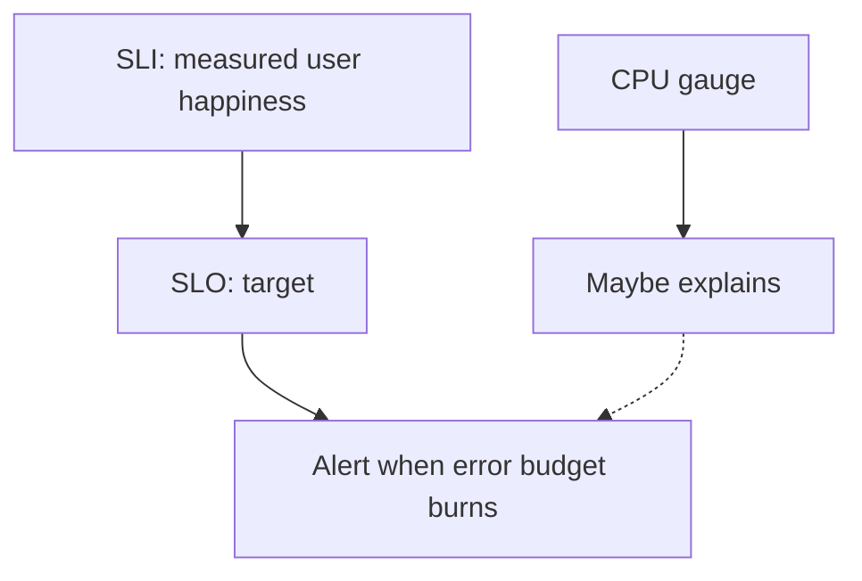

# Month 15 · Week 4 · Day 5
# Dashboards and Alerting: SLI/SLO Lite, Symptoms Not CPU Vibes

**Program:** Full-Stack Mastery · 18 months  
**Phase:** 5 — Production engineering  
**Month index:** [../../README.md](../../README.md)  
**Week 4:** [1](day-01.md) · [2](day-02.md) · [3](day-03.md) · [4](day-04.md) · Day 5 (today) · [6](day-06.md) · [7](day-07.md)  
**Week rhythm today:** Tests / docs (a policy you could hand a teammate)  
**Student state:** `/ready` tells the truth about Postgres. Today you write **what you would page on** — without installing Grafana.  
**Study time:** 3–4 focused hours  
**Prereq:** Day 4 gate passed.

Labs: `~/fullstack-lab/month-15/week-04/day-05/`. Deliverable: **`ALERTING.md`**. You may draw dashboard **sketches** in Mermaid. No required Grafana/Prometheus install. Not Project 7 source.

---

## How to use this textbook

1. Read until “CPU high” is a **hypothesis**, not a page.  
2. Pick SLIs for the harbor or bike-share lab.  
3. Write three alerts: two good, one anti-pattern you **reject**.  
4. Optional review links are for later rechecking.

---

## How to read this chapter

A **dashboard** is a visual index of metrics (and sometimes logs). An **alert** is a **notification that demands a human**. If everything is red, nothing is. Month 15 does not make you an SRE. It makes you dangerous to **bad** pager policies.



**Wrong belief:** “Alert when CPU > 80%.”  
**Correct:** CPU is often **not** what the user feels. Alert when **the service is failing its SLI** (error ratio, latency, “ready is false for 10 minutes”). Use CPU on a dashboard for **diagnosis**.

**Wrong belief:** “I need Grafana to learn SLOs.”  
**Correct:** SLO is a **sentence**: “99% of GET /holds in 5 minutes are < 300ms.” The graph is optional today.

Kubernetes HPA on CPU is a later topic. **Not this month.** Same lesson: scale on **symptoms** when you can.

---

## Today's contract

1. Define **SLI**, **SLO**, **SLA**, **error budget** in this course’s lite sense.  
2. Choose two SLIs for a lab API.  
3. Write alert rules in English (condition, duration, severity, **what to do**).  
4. Reject CPU-only paging with a paragraph.  
5. Sketch a dashboard: one row user symptoms, one row resources.

**Today's gate.** Closed-book:

> I page on user-facing symptoms and burn of a written SLO, not on CPU vibes. SLI is the measurement. Ready-failing is a symptom. I wrote ALERTING.md. I did not install a vendor to pass the day.

---

## Time box

| Block | Minutes | Work |
|---|---|---|
| A | 50 | Theory |
| B | 40 | Inventory: what you can already measure |
| C | 85 | ALERTING.md + dashboard sketch |
| D | 20 | Self-review: would you accept this page at 3 a.m.? |
| E | 15 | Recall + commit |

---

# Block A — Theory

## 1. SLI — Service Level Indicator

An **SLI** is a **number** that estimates user happiness.

Examples that fit this month:

- **Availability:** fraction of requests that are not 5xx (and maybe not timeout).  
- **Latency:** fraction of requests faster than a threshold.  
- **Readiness:** fraction of time `/ready` is 200 (careful: this is infra-shaped; still useful).  

Bad SLIs: CPU, “number of containers,” “lines of log.” Those do not equal “a student created a hold.”

## 2. SLO — Service Level Objective

An **SLO** is a **target** on an SLI over a **window**.

“99.9% of HTTP requests in 30 days succeed.” Lite lab: “99% of `/ready` probes in 24h succeed” is weak (you might not probe). Better lab SLO: “99% of `POST /lockers` return 2xx over a study afternoon” — honest about being a lab.

**Error budget** = 100% − SLO. If SLO is 99%, you may “spend” 1% failures on deploys and incidents. When the budget is burned, you **slow feature work** and **fix reliability**. That sentence is the culture; you will not have 30 days of data today.

## 3. SLA — Service Level Agreement

An **SLA** is a **contract** (refunds, legal). Students confuse SLO and SLA. You do not write an SLA for fullstack-lab. You may write SLOs as **intent**.

## 4. Alert on symptoms

Google SRE’s popular teaching: alert on **symptoms** (users failing), not **causes** (CPU, disk, “maybe memory leak”). Causes belong on **dashboards** and in **runbooks**.

Good alert:

> Page if 5xx ratio > 5% for 5 minutes on the API **and** there is traffic (avoid divide-by-zero on idle).

Good alert:

> Page if `/ready` is 503 for 10 minutes in **production**. (In lab, 10 minutes is long — use 2 minutes for a demo.)

Bad alert:

> Page if CPU > 70% for 1 minute.

CPU might be a GC blip. Users might be fine. You will hate your pager.

**Wrong belief:** “More alerts means more professional.”  
**Correct:** every alert needs an **owner** and a **first action**. If the action is “look at CPU,” put CPU on the dashboard and alert on the **user** number.

## 5. Dashboards: two rows

**Row 1 — golden signals** (lite): latency, traffic (QPS), errors, saturation (queue depth / ready).  
**Row 2 — resources:** CPU, memory, disk of the volume, restart count.

When paged from row 1, you **open** row 2. You do not page from row 2 by default.

You do not have Prometheus. Sketch with **names** of panels. Week 4 Day 2 taught histograms and counters as **future** emissions.

## 6. Logs in alerting

Alerting from logs (“ERROR in last 5 minutes”) is possible and **noisy** (one retry storm). Prefer **metrics** derived from logs or instrumentation. If you only have logs this month, a **manual** rule: “if I grep ERROR and it is not a drill, I investigate” — not a pager.

## 7. Severity

| Severity | Meaning |
|---|---|
| **Page** | Human now; users hurting |
| **Ticket** | Business hours |
| **Record** | Dashboard only |

Mis-severities are how teams mute everything.

## 8. Say it

SLI vs SLO vs SLA; error budget; symptom vs cause; two-row dashboard; CPU is diagnosis.

---

# Block B — Inventory

From Day 4 evidence (your lab):

`MEASURE.md`:

- Can you count 200 vs 503 on `/ready` by curling in a loop? (yes, even without Prometheus)  
- Can you grep request ids?  
- What you **cannot** measure yet (p99 histogram)

Write a 12-line bash **loop** that curls `/ready` 20 times and counts codes — a **manual SLI**. Put it in `sli-sample.sh` and run it. Capture output in `SAMPLE.txt`.

---

# Block C — ALERTING.md spec

Required sections:

1. **Service name** — harbor lockers lab (or your name).  
2. **SLIs** — two, with formula in words.  
3. **SLOs** — lite, with window. Honest that this is a lab.  
4. **Error budget** — one paragraph.  
5. **Alerts** — table:

| Name | Condition | For | Severity | First action |
|---|---|---|---|---|
| ReadyDown | | | page | |
| ErrorRatio | | | page | |
| CpuHigh | | | **do not page** | |

Fill CpuHigh as the **rejected** alert: first action = “open dashboard, do not wake.”

6. **Dashboard sketch** — Mermaid or markdown table of panels.  
7. **What we will not do** — page on `docker ps` restarting without user impact; page on a single 422.  
8. **Not Kubernetes** — one sentence.  
9. **Tie to Month 14** — alerts do not replace a 403 test.  

`STORIES.md`:

**S1.** CPU 95%, error ratio 0.1%, users fine.  
**S2.** CPU 20%, `/ready` 503 for 15 minutes.  
**S3.** One student POSTs invalid JSON 50 times (422).  
**S4.** `down -v` wiped prod-like data (process, not a metric).

---

# Block D — Self-review

Read ALERTING.md aloud. For each **page** alert, ask: **would I get up?** If no, demote.

`CHECK.txt` yes/no.

---

# Block E — Recall and git

Recall:

1. SLI vs SLO.  
2. Error budget.  
3. Why CPU-only pages fail.  
4. Two dashboard rows.  
5. 422 storm vs 5xx.

```bash
cd ~/fullstack-lab
git add month-15/week-04/day-05
git commit -m "Month 15 Day 5: ALERTING.md SLI SLO symptoms not CPU."
```

---

## Office hours

**Installed Prometheus anyway.** Fine **after** ALERTING.md. The doc is the gate.

**SLO 99.999% for a lab.** Fantasy. Pick a number you could measure this afternoon.

---

## Definition of done

- [ ] ALERTING.md all sections  
- [ ] sli-sample.sh ran  
- [ ] CpuHigh is not a page  
- [ ] Commit exists  

---

## Optional review links

- [Google SRE book: alerting on SLOs (chapter)](https://sre.google/sre-book/service-level-objectives/)  
- [Prometheus: alerting](https://prometheus.io/docs/alerting/latest/overview/)  
- [Grafana dashboards (concept)](https://grafana.com/docs/grafana/latest/dashboards/)  

---

# Lecture: four stories, slowly

**S1. CPU 95%, errors 0.1%.** Do **not** page. Maybe a batch job or a demo curl loop. Dashboard row 2 is yellow; row 1 is green. Write a ticket if it **stays** high and you fear noisy-neighbor — still not a 3 a.m. page unless SLI moved.

**S2. CPU 20%, `/ready` 503 for 15 minutes.** **Page** (in production). Users cannot complete writes if you pulled the API from the load balancer — or they get 503s if you did not. First action: is Postgres up? `compose ps`, `logs db`. This is Day 4’s experiment with a pager on it.

**S3. Fifty 422s.** Clients sending bad JSON. Availability SLI that counts 422 as “failure” will lie. Define success as **5xx + timeout**, or **2xx/3xx**, explicitly. 422 is often **INFO** logs (Day 1). Ticket if a **new** client version is broken; do not wake the on-call for schema validation.

**S4. `down -v`.** This is a **process** failure (human). No metric predicted it. Runbook + access control on who can `-v` in prod-like compose. Backup is Month 16-adjacent. Today: write “never `-v` on the demo volume” in ALERTING.md section 7.

## sli-sample.sh you may type

```bash
#!/usr/bin/env bash
set -euo pipefail
ok=0
ready=0
n=20
for i in $(seq 1 "$n"); do
  code=$(curl -sS -o /dev/null -w "%{http_code}" --max-time 2 "http://127.0.0.1:8941/ready" || echo 000)
  if [[ "$code" == "200" ]]; then
    ready=$((ready + 1))
  fi
  ok=$((ok + 1))
  echo "$i $code"
done
echo "ready_ok=$ready / $n"
```

That is a **manual SLI**. Prometheus would scrape `/metrics` later. Do not pretend the bash loop is production monitoring.

## Error budget arithmetic (lite)

SLO 99% over 1000 requests → budget = 10 failed requests. If you already had 10 fives, the next deploy **waits**. In a 3-hour lab, pick a window you can **count**. Fantasy six-nines teach the wrong humility.

**Wrong belief:** “SLA is a nicer word for SLO.”  
**Correct:** SLA is legal/contractual. You do not owe the textbook a refund. You owe yourself an SLO sentence.

**Wrong belief:** “Saturation means CPU.”  
**Correct:** saturation can be thread pool, connection pool, disk, or “ready false.” Name **which** pool in the dashboard title.

Write `GOLDEN.md`: four boxes — latency, traffic, errors, saturation — one sentence each for harbor lockers.

---

## Tomorrow

**Independent:** add structured logs + health/ready to the **Week 3 four-service stack**; write **`OBS.md`**.
