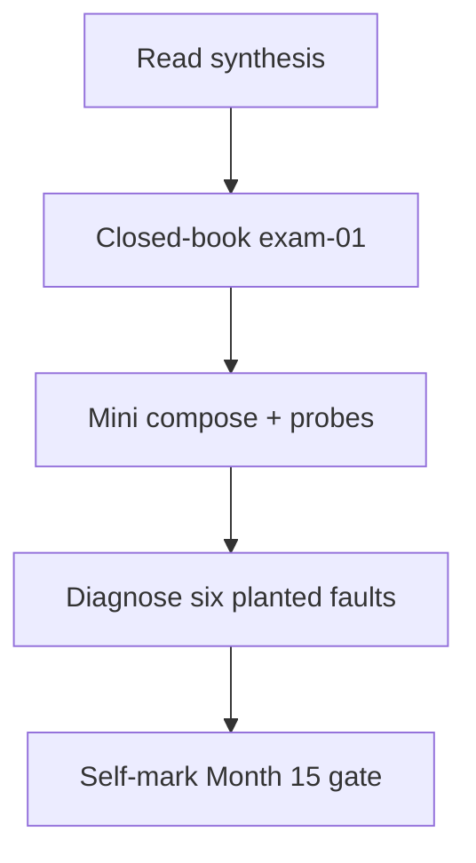
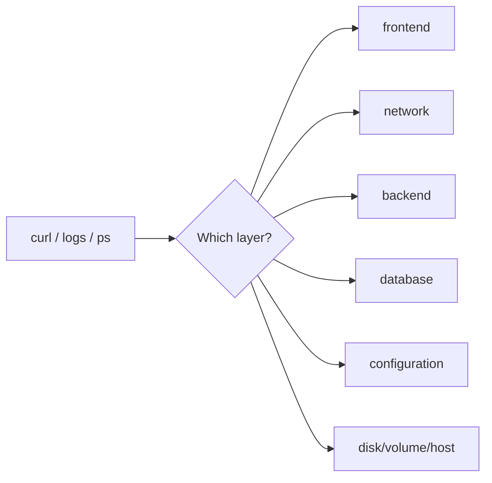

# Month 15 · Week 4 · Day 7
# Month 15 Exam + Gate

**Program:** Full-Stack Mastery · 18 months  
**Phase:** 5 — Production engineering  
**Month index:** [../../README.md](../../README.md)  
**Week 4:** [1](day-01.md) · [2](day-02.md) · [3](day-03.md) · [4](day-04.md) · [5](day-05.md) · [6](day-06.md) · Day 7 (today)  
**Week rhythm today:** Monthly exam  
**Study time:** 3–4 focused hours (repair the stack **after** if the gate is still false)

Textbook files stay **closed** except:

- **this file** (synthesis + exam blocks + self-mark table),
- [Month 15 README](../../README.md) **for the gate table wording**,
- your **own** `OBS.md` / `SSH.md` / `RUNBOOK.md` only in the blocks that say so — not as a source to paste Project 7 into the lab.

Repair forgotten facts from **this synthesis**, not from Weeks 1–4 day files and not from a random Docker blog.

Work in `~/fullstack-lab/month-15-exam/` for exam evidence. Do **not** implement exam minis inside Project 7. Do **not** start Month 16 because the calendar moved.

**Month 16** (CI/CD and AWS) opens when this gate is true.

---

## How to read this chapter

This file is the **exam and the teacher**. The synthesis is written so a student whose Weeks 1–4 notes are foggy can still re-learn the month from **today’s pages**, then prove it with the blocks and the gate.



During Blocks 1–3, other day files stay closed. If you go blank, re-read **this synthesis**. AI may not write exam-01, the mini, or the diagnosis answers.

You diagnose with **evidence**: `ps`, `ls`/`stat`, `ss`, `docker compose ps`, `logs`, `curl`, `getent`. Defense only — no exploit PoCs, no scanning networks you do not own.

Kubernetes is **not** this month. Compose is the skill.

---

## Today's contract

By the end of this day you will be able to teach Month 15 aloud from this synthesis, diagnose a failing containerized system using the six planted faults described here, and **honestly** mark the Month 15 gate.

**Today's gate** is the Month 15 Gate table below — not “I attended four weeks.” If any required row is false, **do not start Month 16**.

---

## Time box

| Block | Minutes | Work |
|---|---|---|
| 0 | 25 | Read the complete explanation; speak it |
| 1 | 35 | Closed-book `exam-01.md` |
| 2 | 40 | Mini-build (`mini/`) |
| 3 | 45 | Diagnose planted faults A–F |
| 4 | 15 | Review OBS.md vs reality |
| 5 | 20 | Oral cards (write answers) |
| 6 | 15 | Design: what Month 16 will not fix |
| 7 | 20 | Retro + self-mark |

---

## Month 15 synthesis (the lesson, in this book)

You own a **Windows laptop**. Production is **Linux**. Labs run in **WSL2 Ubuntu** and **Docker Desktop**. PowerShell is not the production shell. A container **shares a Linux kernel**. Files, users, processes, ports, and logs are Linux ideas. Docker packages them. Compose wires several packages. Neither replaces Month 14 tests.

**Week 1 — Linux.** Kernel vs distro vs shell. FHS: `/etc` config, `/var` variable (logs), `/home` people, `/usr` programs. Paths: `pwd`, `ls`, `cd`, `cat`. UID/GID; nine bits; directory `x` is traverse; octal `640`; no `chmod 777`. `sudo` is one command as root. PID, PPID; `kill` sends signals; **SIGTERM** then **SIGKILL**; `docker stop` does the same. systemd units; `ExecStart` absolute. SSH: key pair, private `600`, `authorized_keys`, no passwords in chat. `apt update` vs `install`. `ss` maps listen ports to PIDs. `ping` ICMP; `curl` HTTP; `dig`/`getent` DNS. `journalctl` and `/var/log`. Disk full: `df`.

**Week 2 — Docker.** Image = layers + config + default command. Container = instance + writable layer + process. `ps` vs `ps -a`. Dockerfile: `FROM`, `RUN` build-time, `COPY` from **context**, `CMD` vs `ENTRYPOINT`, exec form, `.dockerignore`. `-p host:container`; listen `0.0.0.0` inside. Named volume vs bind mount. Bridge DNS = container/service name. Tags **move**; **latest is a lie**; digests pin registry manifests; Hub and GHCR are registries. Do not COPY Project 7.

**Week 3 — Compose.** Services, networks, `depends_on` = **start order** not readiness unless `service_healthy`. Multi-stage; **USER** non-root; slim vs distroless. Healthchecks (`pg_isready`). Restart policy ≠ fix. Postgres named volume; `POSTGRES_*` first empty dir; `down -v` wipes. `env_file`; `.env` not committed. Four roles: nginx, API, Postgres, Redis. 12-factor-lite: config in env; backing services as URLs.

**Week 4 — Observability.** JSON logs on stdout; levels; never log secrets/PII/tokens. Request id header. Pillars: logs, metrics, traces; OpenTelemetry is vocabulary, not a required install. **Health** (process) vs **ready** (DB ping). Alert on **symptoms** (error ratio, ready down), not CPU vibes. SLI/SLO lite.

**Wrong belief:** “Compose green means production.”  
**Correct:** rehearsal. Diagnose frontend vs network vs API vs database vs config vs disk.

**Wrong belief:** “Docker skips Linux.”  
**Correct:** you still `ss`, `chmod`, and read logs.

---

# Complete explanation — diagnosis you must still own

## 1. Frontend 404 asset

nginx (or static server) returns **404** for `/app.js` or a CSS file. The HTML 200s. Evidence: `curl -I http://127.0.0.1:PORT/app.js`, nginx logs, `docker compose exec web ls` the html dir, Dockerfile `COPY` path. Not an API 404 unless the browser requested the API by mistake.

## 2. DNS / name mismatch

API uses `http://postgres:5432` but the service is `db`. Or Redis `localhost`. Evidence: `compose exec api getent hosts db`, logs `Name or service not known`, compose YAML keys.

## 3. API crash loop

PID 1 exits; `restart: always` hides it as “Restarting.” Evidence: `compose ps`, `logs api` (ImportError, missing env, bind error). Fix the **cause**; do not raise restart policy.

## 4. Postgres auth

Password in `.env` does not match volume’s first-init role. Evidence: `password authentication failed` in api or db logs. Fix: revert password or **knowing** wipe `down -v`.

## 5. Missing env

`${POSTGRES_PASSWORD}` empty; app `DATABASE_URL` None. Evidence: postgres refuses to start without password; api stack traces. Fix: `.env` from example; env_file.

## 6. Disk / volume

`No space left on device`, or empty data after `down -v`, or API writable layer lost on `rm`. Evidence: `df -h`, `docker system df`, volume ls, runbook. Fix: free space; do not delete the wrong volume.

These six are **planted** in Block 3 as **described incidents**. You may also **implement** a broken compose in `faulty/` to reproduce — optional if your written evidence chain is complete. Reproducing is stronger.

---

# Block 0 — Speak the synthesis

Out loud, no other day files: kernel vs distro; 640; TERM vs KILL; image vs container; depends_on vs ready; latest; JSON logs; health vs ready; the gate sentence. Then Block 1.

---

# Block 1 — Closed-book (35 min)

Create `~/fullstack-lab/month-15-exam/exam-01.md`.

Write **in your words** (25–40 lines):

1. Kernel vs distro vs container (three sentences).  
2. Directory `x` vs file `x`.  
3. `depends_on` without health vs `/ready`.  
4. Why `latest` is a lie.  
5. What you never log.  
6. The six fault **categories** (names only) you will use in Block 3.  

If you cannot fill it, re-read the synthesis.

---

# Block 2 — Mini-build (40 min)

Textbook closed except this spec.

```bash
mkdir -p ~/fullstack-lab/month-15-exam/mini
cd ~/fullstack-lab/month-15-exam/mini
```

**Domain: exam cloakroom** — not Project 7, not a git copy of Week 3 without changes.

Must:

- `compose.yaml` with `db` (postgres:16, named volume, `pg_isready`, env_file) and `api` (FastAPI)  
- `GET /health` 200 without DB ping  
- `GET /ready` 200/503 with `SELECT 1`  
- JSON log line with `request_id` on `/health`  
- Publish `127.0.0.1:8950:8000`  
- `.env` gitignored; `.env.example` present  
- Tag `exam-cloak-api:0.1.0` — not only latest  

Should if time: non-root USER.

Must not: Kubernetes, Project 7, Hub push, logging the password.

```bash
docker compose up --build -d
curl -sS http://127.0.0.1:8950/health
curl -sS http://127.0.0.1:8950/ready
docker compose stop db
curl -sS -w "%{http_code}" http://127.0.0.1:8950/health
curl -sS -w "%{http_code}" http://127.0.0.1:8950/ready
docker compose start db
```

Save codes in `mini-evidence.txt`.

---

# Block 3 — Six planted faults (45 min)

Write `exam-03-debug.md`. For **each** planted fault: **category** (frontend / network / backend / database / configuration / infrastructure), **evidence commands**, **what you would expect to see**, **fix in one or two sentences**. Do not write exploits. You are the on-call.

The system under discussion is a **lab** four-service stack like Week 3 (web, api, db, redis) plus Week 4 probes. You may imagine it **or** break a copy in `~/fullstack-lab/month-15-exam/faulty/` — if you break a copy, still write the six; do not destroy Week 4 Day 6 evidence.

**Fault A — frontend 404 asset.** `index.html` references `/assets/app.js`. The nginx image `COPY` put files in `/usr/share/nginx/html/static/` but the HTML says `/assets/`. Browser: HTML 200, JS 404, page “blank.”

**Fault B — DNS / name mismatch.** `REDIS_URL=redis://cache:6379/0` but compose service key is `redis`. `/health` might still pass if health does not ping Redis; `/stats` fails. Or API `DATABASE_URL` host `postgres` vs service `db`.

**Fault C — API crash loop.** `command:` points at `uvicorn app:app` but the module is `main:app`. `restart: always`. `compose ps` shows Restarting.

**Fault D — Postgres auth.** Engineer changed `.env` `POSTGRES_PASSWORD` after the volume initialized. API ready 503; db logs authentication failed.

**Fault E — missing env.** `.env` not copied on a fresh clone; Compose interpolates empty password; **db** container exits. API never becomes ready.

**Fault F — disk / volume.** Two sub-stories; address **both**: (1) teammate ran `docker compose down -v` before a demo; tables empty. (2) `df -h` 100% on the Docker disk; new containers fail to start with no space.

After you write A–F, compare to the worked box at the bottom.

---

# Block 4 — Review OBS.md

Open **only** your Week 4 Day 6 `OBS.md` (or note missing). `exam-04-gap.md`: one gap vs this synthesis (traces not installed is OK; missing `/ready` is not).

---

# Block 5 — Oral cards (write in exam-05-oral.md)

Answer in full sentences, closed-book:

1. Why production is Linux in this program.  
2. `chmod 640` in letters.  
3. SIGTERM vs SIGKILL.  
4. Image vs container.  
5. What `.dockerignore` protects.  
6. `depends_on` vs `service_healthy`.  
7. Why `localhost` is wrong for Postgres from the API container.  
8. Health vs ready.  
9. Name a metric vs a trace.  
10. Month 15 gate in one sentence (diagnose a failing stack with evidence).

---

# Block 6 — Design

`exam-06-design.md` (10–15 lines): why Month 16 CI/CD will **not** replace a missing `/ready` or a 403 test (Month 14). What a green GitHub Action still will not catch if Compose DNS is wrong only in production hostnames.

---

# Block 7 — Retro + self-mark

`exam-07-retro.md`: weakest week; whether you still wanted 777 or latest; remaining owed labs.

---

## Month 15 Gate (self-mark)

True **without a tutorial**. Evidence paths are yours. Wording matches [Month 15 README](../../README.md).

| # | Claim | Evidence | Pass? |
|---|---|---|---|
| 1 | In Ubuntu, explain a path, a permission bit, a process, and a listening port from **evidence** (`ls`, `stat`, `ps`, `ss`) | exam-01 + any lab notes | |
| 2 | SSH to a box (or a local Linux container acting as one) with a **key**, not a password pasted into a chat | Week 1 Day 5 `SSH.md` | |
| 3 | Build an image from a **Dockerfile** you wrote; explain **layers** and **build context** | exam mini or Week 2 | |
| 4 | Run API + Postgres (and Redis if your product uses it) with **Compose**, **named volumes**, and **env files** that are not committed secrets | mini and/or Week 3 Day 6 | |
| 5 | Images run as **non-root**. A **healthcheck** fails when the process is up but not ready | `whoami` + ready 503 / health 200 | |
| 6 | Logs are **structured** (JSON or key=value) with a **request id** | compose logs grep | |
| 7 | You can say what a **metric** and a **trace** are for, even if you only emit logs this month | exam-01 / oral | |
| 8 | Given a **failing** compose stack, you diagnose whether the fault is frontend, network, backend, database, configuration, or the machine — and write the evidence | exam-03-debug.md A–F | |

If any **required** row is false, **do not start Month 16**. Stay on Month 15 until the sentences are true.

**Non-root honesty:** if your exam mini still runs as root, row 5 is false until you add `USER` (Week 3 Day 2) **or** you have a non-root image from Week 3 you can point at. Do not mark true on a root-only month.

```bash
cd ~/fullstack-lab
git add month-15-exam
git commit -m "Complete Month 15 exam evidence."
```

---

## If you passed

**Month 16** is CI/CD and AWS. Open it only when this gate is true. Pipelines will not invent `/ready`. CloudWatch will not replace a request id you never emitted.

## If you did not pass

Stay on Month 15. This synthesis remains the teacher. Repair the missing row (often non-root, ready vs health, or SSH.md), then re-mark.

---

If the gate table has a false row, the honest action is more **evidence on Linux/Docker**, not starting AWS.

---

## Optional review links

Repair from this synthesis first.

- [Compose CLI](https://docs.docker.com/reference/cli/docker/compose/)  
- [Dockerfile reference](https://docs.docker.com/reference/dockerfile/)  
- [OpenTelemetry overview](https://opentelemetry.io/docs/what-is-opentelemetry/)  
- [12factor logs](https://12factor.net/logs)  

---

## Worked answers you should not need — check after you write A–F

**A. Frontend / nginx COPY path.** Evidence: curl 404 on the JS URL; `compose logs web`; `ls` inside html root. Fix: COPY to the path the HTML requests, or change HTML. Not an API bug if `/holds` still 200.

**B. Network / DNS.** Evidence: `getent hosts cache` fails; `getent hosts redis` works. Fix: URL host = service key. `localhost` is the API container.

**C. Backend / process.** Evidence: logs `Error loading ASGI app`; `ps` restart count. Fix: CMD module path. Restart policy was a mask.

**D. Database / auth.** Evidence: auth failed logs; volume older than `.env` edit. Fix: original password or wipe volume **with consent**.

**E. Configuration.** Evidence: db exits `password is required`; no `.env`. Fix: copy example, env_file, never commit secrets.

**F. Infrastructure / volume.** (1) `down -v` deleted named volume — data gone; restore only from backup. (2) `df` / `docker system df` — prune unused images **carefully**, not `down -v` on the database as a first move.

If your written answers disagree, fix them from this box **only after** you attempted A–F alone.



---

## Month 16 is not a reward for finishing the calendar

CI will build images. AWS will host them. If you cannot tell a 404 asset from a Postgres password, you will ship a beautiful pipeline that deploys a broken stack faster.

Continue Month 15 labs until every gate row is true. Do not begin Month 16 on a false self-mark.

## Scoring Block 3 (you, not a grader bot)

| Piece | Honest pass |
|---|---|
| Each fault named with a **layer** | A–F table |
| Evidence is a **command**, not a vibe | exam-03-debug.md |
| Fix does not include 777, latest-as-version, or exploits | |
| Ready vs crash-loop distinguished | C vs D |

If you blamed “Kubernetes” for any, rewrite from the synthesis.

**Mini** after it is green: health 200 with db stopped; ready 503 with db stopped; JSON contains request_id.

Do not put the mini inside the product repo. Do not start Month 16 tonight on a false self-mark.

## Definition of done (exam day)

- [ ] exam-01 teaches Linux + Docker + probes  
- [ ] Mini compose: health/ready evidence  
- [ ] Debug A–F written, then checked against the worked box  
- [ ] Oral cards answered  
- [ ] Self-mark table is honest  
- [ ] Month 16 not started on a false row  

The gate table is the course’s definition of done for the month. Attendance is not.
