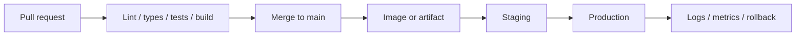

# Month 16 — CI/CD and AWS

**Program:** Full-Stack Mastery Textbook  
**Phase:** 5 — Production engineering  
**Length:** 4 weeks · 7 days each · 3–4 focused hours/day  
**Prereq:** Month 15 gate passed (you can diagnose a failing containerized system)  
**This month’s job:** Make a **fresh commit** run **lint → types → tests → build** on GitHub, then reach a **repeatable production** on AWS you can explain: DNS, HTTPS, secrets, migrations, logs, rollback.

This textbook will **not** paste Project 7. Pipelines and cloud attach to **your** repos.

---

## How this textbook is organized

```
month-16/
  README.md     ← you are here
  week-01/      CI: GitHub Actions, jobs, caches, artifacts, required checks
  week-02/      CD: images, promotion, migrations, rollback, secrets, tags
  week-03/      AWS: IAM, compute, RDS, S3, VPC/DNS/CDN concepts, CloudWatch
  week-04/      Deploy the Month-12 application + exam: commit to production
```

Labs: `~\fullstack-lab\month-16\`. Product workflows live in **your** GitHub repos.

---

## The pipeline



**Wrong belief:** “CI is a green badge.”  
**Correct:** CI is a **gate**. If lint is optional, it is decoration. A required check that you can skip with `--no-verify` on the server does not exist.

**Wrong belief:** “I SSH in and git pull on the box. That is CD.”  
**Correct:** that is a snowflake. CD means a **known artifact** (image digest or tarball) moves through **environments** with **config**, **migrations**, and a **rollback** you have actually practiced.

---

## Month 16 Gate

True **without a tutorial**:

1. A GitHub Actions workflow on PR: **lint**, **type check**, **unit tests**, **integration tests** (with a service container or equivalent), **build**.  
2. `main` cannot merge while those checks are red (branch protection, or an honest documented equivalent you can defend).  
3. You produce a **versioned artifact** (container image tagged with git SHA).  
4. Secrets live in the **platform** (Actions secrets, AWS Secrets Manager or SSM). They are **not** in git.  
5. A deploy runs **migrations** as a deliberate step, not “the API will create tables.”  
6. You can **roll back** to the previous image and say what happens to migrations.  
7. On AWS you can explain **IAM** (who may do what), **where compute runs**, **RDS PostgreSQL**, **S3** if you store objects, **DNS + HTTPS**, and **CloudWatch** (or equivalent) logs.  
8. A **fresh commit** passes CI and reaches the production URL through that process — not a one-off click you could not repeat.

If any item is false, do not start Month 17.

---

## Cost and accounts

AWS Free Tier is enough for the learning subset if you **delete what you create**. This book will name **what costs money** and how to shut it off. Do not leave a load balancer running “to look at later.”

If you cannot create an AWS account this month, you still **write every design and IAM/VPC/RDS diagram from this textbook** and run CI + a local “staging” Compose deploy. The **gate’s production URL** waits until the account exists — do not pretend localhost is production.

---

## Kubernetes

Still optional. ECS, App Runner, or a single well-understood compute service beats a cluster you cannot debug.

---

## Start

Open [week-01/day-01.md](week-01/day-01.md).

When Month 16’s gate is true, continue with [Month 17](../month-17/README.md).
