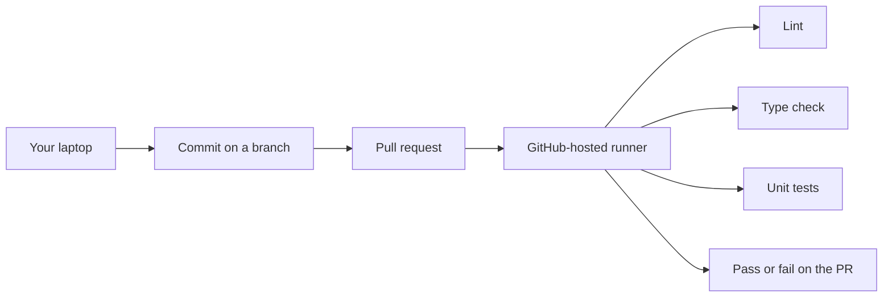
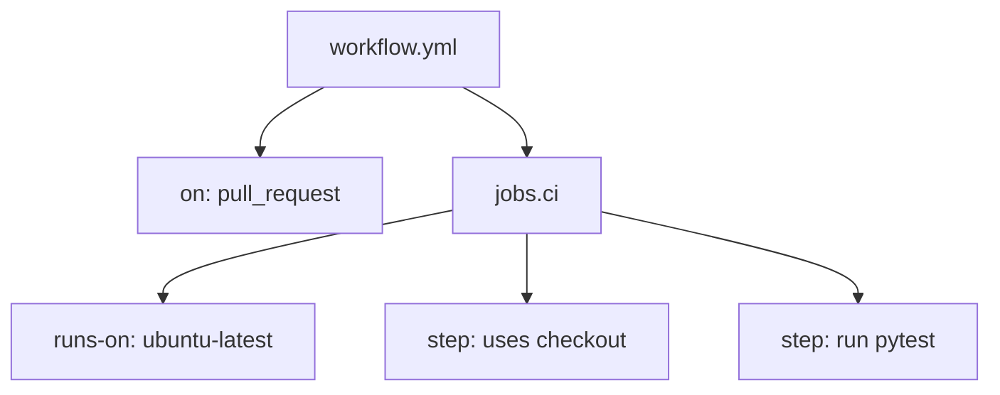

# Month 16 · Week 1 · Day 1
# Continuous Integration: The Commit as a Gate, Not a Badge

**Program:** Full-Stack Mastery · 18 months  
**Phase:** 5 — Production engineering  
**Month index:** [../../README.md](../../README.md)  
**Week 1:** Day 1 (today) · [2](day-02.md) · [3](day-03.md) · [4](day-04.md) · [5](day-05.md) · [6](day-06.md) · [7](day-07.md)  
**Week rhythm today:** Learn + type-along  
**Student state:** Month 15’s gate is true: you can diagnose a failing containerized system. Project 7 already lives in **your** repos. This month you do not invent a new product. You attach a **pipeline** that would refuse a broken commit.  
**Study time:** 3–4 focused hours

**This week covers:** what CI is, GitHub Actions vocabulary, a first workflow, YAML, Postgres service containers, caches, artifacts, required checks, a lab PR pipeline, flaky tests.

Today: what CI **is**, why the **pull request** (or the commit that would merge) is the unit of work, and why a green badge you can skip is decoration. You will type a tiny classifier lab. You will not paste Project 7. Day 2 is the first real workflow. Do not skip it.

Labs: `~\fullstack-lab\month-16\week-01\day-01\`. Product workflows stay in **your** GitHub repos. This textbook will **not** paste that product.

---

## How to use this textbook

1. Read a section. Close it. Say the idea in a full sentence with an example from **your** app.  
2. Type the tiny notes lab. Do not paste a “CI strategy template” from the internet.  
3. When you name a check, name **what bug it would catch** — not a slogan.  
4. Optional review links are for later rechecking.

---

## How to read this chapter

**Continuous integration** is a **gate on change**. A human (or a bot) proposes a change as a commit on a branch. A machine that is **not** that human’s laptop runs a known list of checks. If the checks fail, the change is not ready. If the checks pass, the change is *eligible* to merge — not automatically “good product,” but **not an accident**.



Month 14 taught you what to run: lint, types, unit, integration, a build. Month 16 teaches **where** those commands run so a green laptop is not the only evidence.

**Wrong belief:** “CI is a green badge on the README.”  
**Correct:** a badge is a picture. A **gate** is a rule: `main` cannot merge while the required workflow is red, and nobody treats `--no-verify` on a laptop as a substitute for the runner.

**Wrong belief:** “I ran pytest before I pushed, so CI is optional.”  
**Correct:** your laptop has your Node version, your leftover `.env`, your Docker Desktop, your “I skipped the slow file.” The runner has **none** of that unless you wrote it into the workflow. CI exists because laptops lie in small, friendly ways.

---

## Today's contract

By the end of this day you will be able to:

1. Define **continuous integration** as a gate on a **commit / pull request**, not as a hosting product.  
2. Name GitHub Actions parts: **workflow**, **job**, **step**, **runner**, **event**.  
3. Explain **uses** versus **run** at a conceptual level (Day 2 types the YAML).  
4. Say why a skippable check is not a gate.  
5. Write `CI-MODEL.md` in the lab with examples from **your** Project 7 — without pasting product source into this course folder.

**Today's gate.** Closed-book:

> CI is a machine that is not my laptop running lint, types, tests, and a build on the proposed change. A pull request is the unit. A badge I can ignore is not a gate. Required checks on protected `main` are a gate.

---

## Time box

| Block | Minutes | Work |
|---|---|---|
| A | 55 | Theory |
| B | 55 | Type-along: vocabulary table + a fake “would this catch it?” list |
| C | 70 | Independent: map *your* product to a PR pipeline |
| D | 15 | Git |
| E | 15 | Recall |

---

# Block A — Theory

## 1. Why this month exists

You already run commands. Month 8 ran pytest. Month 9 ran TestClient. Month 14 ran a pyramid. Month 15 ran Compose and read logs.

Those were **local** skills. Teams still ship bugs because “it worked on my machine” is treated as a process. A teammate (or future-you on a new laptop) merges a branch that never saw `ruff`, never saw `mypy`, never saw the Postgres tests, and never built the frontend. The production box is the first runner. That is not engineering. That is hope with SSH.

Month 16’s job is a **repeatable machine** in front of `main`, then a **repeatable artifact** in front of production (Week 2), then **AWS** you can explain (Week 3), then **your** app actually going out (Week 4).

Kubernetes remains **optional**. This course will not require a cluster. Compose, a container image, and one well-understood compute service beat an orchestrator you cannot debug.

## 2. The unit of CI is the proposed change

Speak this aloud.

A **commit** is a snapshot (Month 1). A **branch** is a line of commits. A **pull request** (PR) is a proposal: “please put these commits on `main`.” GitHub Actions can start when you **push**, when you **open or update a PR**, on a **schedule**, or by **hand**. For this course, the important events are **pull_request** and **push** to `main`.

Why PR-first?

- The review happens on a **diff**, not on a laptop demo.  
- The checks attach to that diff.  
- Merging a red PR is a **policy** failure, not a tooling mystery.

**Wrong belief:** “CI runs once a night on `main`. That is continuous.”  
**Correct:** that is a **batch report**. Useful as a backup. Too late: the bad commit is already on `main`. Continuous means **before merge**, on the change.

**Wrong belief:** “Every save in my editor should run the full suite in the cloud.”  
**Correct:** that is expensive and noisy. The unit is a **push** you intended, usually a PR update. Pre-commit hooks (Month 14) catch format locally. CI is the backstop that you cannot `--no-verify` away on GitHub.

## 3. GitHub Actions vocabulary

People mix these words. We will not.

| Word | What it is | Analogy |
|---|---|---|
| **Workflow** | A YAML file under `.github/workflows/` that says *when* and *what* | The exam paper |
| **Event** | The GitHub moment that starts a workflow (`pull_request`, `push`, `workflow_dispatch`) | “The student submitted” |
| **Runner** | A machine that executes jobs. GitHub-hosted `ubuntu-latest` is Linux even if you edit YAML on Windows | The exam hall |
| **Job** | A named group of steps on **one** runner (unless you add a matrix). Jobs in one workflow can run in parallel | One exam booklet |
| **Step** | One action (`uses`) or one shell command (`run`) | One question |
| **Action** | A reusable package a step `uses` (checkout, setup-node) | A provided calculator |
| **Status check** | The pass/fail GitHub stores on the commit / PR | The grade posted on the door |



**Windows note.** You type YAML in PowerShell, VS Code, or Cursor on Windows. The **default GitHub-hosted runner for this course is Linux** (`ubuntu-latest`). Paths in YAML use `/`. Shell on the runner is `bash` unless you set otherwise. Do not write PowerShell snippets inside `run:` for this course’s workflows. `curl.exe` is for **your** laptop. On the runner, `curl` is fine because it is Linux.

**Wrong belief:** “The workflow runs on my PC because I pushed from Windows.”  
**Correct:** GitHub copies the repo to a **fresh Linux VM** (or a self-hosted runner, which this course will not require). Your Docker Desktop is not there unless you install Docker on the job or use a **service container** (Day 4).

## 4. `uses` versus `run` (idea today, YAML tomorrow)

A step is one of two shapes:

- **`uses:`** — run a published **action**. Example: check out the repository so files exist on the runner. Example: install a Node version.  
- **`run:`** — run a **shell command** on the runner. Example: `uv run pytest -q`. Example: `npm run build`.

You will type both tomorrow. Today, own the distinction: **actions are other people’s (or GitHub’s) programs**; **`run` is you**. Trust `uses` the way you trust a dependency: pin a version (`@v4`, not `@main`).

**Wrong belief:** “I’ll `uses` a giant ‘do CI’ marketplace blob so I do not learn YAML.”  
**Correct:** you will not be able to debug it. This course writes **small** workflows you can read aloud.

## 5. What a green badge is, and is not

GitHub will draw a **status badge** if you ask. README pictures do not protect `main`.

A **gate** has all of these:

1. The workflow actually runs **lint, type check, unit tests, integration tests, and a build** (Week 1 finishes this list by Day 6).  
2. Failure is **red**, not a warning you scroll past.  
3. **Branch protection** (or an honest equivalent you can defend) **requires** that check on `main`. Day 5 names this.  
4. You do **not** click “skip” as a lifestyle. Skip exists for broken infrastructure, not for “tests are annoying.”

`--no-verify` skips **local** git hooks. It does **not** skip GitHub Actions. Students confuse them. Say the difference:

| Escape | What it skips | Still a gate? |
|---|---|---|
| `git commit --no-verify` | Local pre-commit hook | CI on GitHub still runs |
| Merging with failing required checks disabled | The PR gate | **No** — you turned the gate into a badge |
| Commenting out pytest in YAML | The tests | **No** |

**Wrong belief:** “If I can skip it, it is still CI.”  
**Correct:** if the team’s normal path around a red X is ‘merge anyway,’ you have a **weather report**. Weather reports do not stop floods.

## 6. What belongs in CI this month (and what waits)

This week’s pipeline, matching the [Month 16 README](../../README.md) and Project 7’s CI section:

```text
PR opened or updated
  → checkout code
  → install Python / Node
  → lint
  → type check
  → unit tests
  → integration tests (Postgres on Day 4)
  → frontend build
  → backend build or image build (image tagging is Week 2)
```

**Not this week:** deploying to AWS, Kubernetes, “notify Slack with a meme,” matrix of five Python versions unless you have a reason. **Fail-fast** and **matrix** wait for Day 7 so you understand a single green job first.

**Not CI’s job:** replacing Month 14’s pyramid. If you have no 403 test, a green workflow means “the empty suite passed.” CI multiplies **existing** claims. It does not invent them.

## 7. Jobs, parallelism, and “the build”

One workflow may have several **jobs**: `backend`, `frontend`. They start in parallel unless you set `needs:`. Parallelism is a gift when the jobs do not share a database. It is a curse when you copy-paste secrets wrong in one job and not the other (Week 2).

A **build** in CI means: compile or bundle **as production would**, on a clean machine. `npm run build` catching a TypeScript error that `npm run dev` hid is a classic win. `docker build` catching a missing file that your laptop’s volume mount hid is a Month 15 leftover showing up as a Month 16 gift.

## 8. Events you will actually use

| Event | When it fires | Use in this course |
|---|---|---|
| `pull_request` | PR open, sync (new commits), sometimes reopen | **Primary gate** |
| `push` (branches: `main`) | After merge, or a direct push if you allow one | Confirm `main` still builds; start CD later |
| `workflow_dispatch` | Button in the Actions tab | Manual retry / debug |
| `schedule` | Cron on GitHub | Optional nightly; not a substitute for PR checks |

**Wrong belief:** “I’ll only run CI on `push` to `main` so I do not waste minutes.”  
**Correct:** then the minutes you save are paid in **reverts**. Run on the PR.

## 9. What the runner does not have

A fresh `ubuntu-latest` runner has a Linux OS, common tools, and **your repo after checkout**. It does **not** have:

- your `.env` with production secrets (good — Day 5 / Week 2 secrets),  
- your Docker Desktop GUI,  
- your local Postgres unless you add a **service container** or install it,  
- your Node modules — you must install them,  
- your Windows paths.

That emptiness is the point. If the job is green, a stranger’s Linux VM could run the same commands.

## 10. Worked stories — would CI have caught it?

Keep this table. Day 3 will ask you to classify without looking.

**Story A.** A developer commits `print(debug)` and a broken `ruff` rule. Laptop: they never ran ruff.  
**CI:** lint job red. **Gate:** yes, if lint is required.

**Story B.** TypeScript error in a file Vite does not typecheck in `dev`.  
**CI:** `npm run build` or `tsc --noEmit` red.

**Story C.** pytest green on the laptop because `TEST_DATABASE_URL` points at a dirty personal database that already has the row.  
**CI:** integration job with a **fresh** Postgres (Day 4) red or, better, honest green.

**Story D.** Dockerfile `COPY`s a file the developer had locally but never committed.  
**CI:** `docker build` red. Laptop Compose still “worked” via a volume.

**Story E.** The README badge is green because the last successful run was three weeks ago and the workflow file was deleted on a branch that already merged.  
**CI:** you are looking at a **souvenir**. Open the Actions tab. Trust the check on **this** commit.

## 11. How this course already prepared you

| Month | Skill CI will call |
|---|---|
| 1 | Git commit is a snapshot; push is later |
| 8–9 | pytest, TestClient |
| 11 | Test database, Alembic |
| 14 | Pyramid, ruff/eslint, Playwright (E2E in CI is optional this week if slow; unit/API are not) |
| 15 | Linux, Docker, health, logs |

You are not learning “YAML culture.” You are putting **commands you already own** on a machine you do not babysit.

## 12. What you will not do today

- You will not create `.github/workflows/` in Project 7 today (Day 6 checklist).  
- You will not paste product source into `fullstack-lab`.  
- You will not enable GitHub Actions billing experiments. Public repos on GitHub-hosted runners have a free quota; private repos have minutes. Keep jobs **short**.  
- You will not start Week 2 image registries today.

## 13. Say it — closed-book drill (two minutes)

Without looking: workflow vs job vs step vs runner vs event; why Windows YAML still runs on Linux; why a badge is not a gate; why `--no-verify` is not an Actions skip. If you stumble, re-read sections 3–5.

---

# Block B — Type-along

```powershell
cd ~\fullstack-lab
mkdir month-16\week-01\day-01 -Force
cd ~\fullstack-lab\month-16\week-01\day-01
```

Create `VOCAB.md`. Fill every cell in **your** words (one short sentence each):

| Term | My sentence | One thing it is *not* |
|---|---|---|
| Continuous integration | | A deploy to AWS |
| Workflow | | A pytest file |
| Event | | A runner |
| Runner | | Your Windows laptop by default |
| Job | | A single shell line |
| Step | | The whole pipeline |
| `uses` | | A bash script you wrote |
| `run` | | A marketplace action |
| Status check | | A README image |
| Gate | | A skippable badge |

Create `CATCH.md`. For each bug, write **which check** should go red first (lint, types, unit, integration, build) and **what would miss it**:

| # | Bug | First check | Would miss |
|---|---|---|---|
| 1 | Unused import that ruff forbids | | |
| 2 | TypeScript `string` passed where `number` is required | | |
| 3 | `can_edit` returns True for a stranger (pure function) | | |
| 4 | `POST` returns 200 instead of 201 | | |
| 5 | Frontend production build missing `VITE_` type | | |
| 6 | File used in Dockerfile never committed | | |
| 7 | README badge still shows last month’s green | *(not a check)* | |

Row 7 is a trick. A badge is not a check. Write one sentence under the table: **what you would click instead of trusting the badge**.

Write `WINDOWS.txt` (five lines): runner OS; path separator in YAML; `curl.exe` vs runner `curl`; why PowerShell `run:` is the wrong default; extra `--` after `npm create vite` is a **laptop** fact, not an Actions fact.

---

# Block C — Independent

Open **your** Project 7 in another window. Do not copy source into the lab.

Write `MY-CI.md` in the lab folder (commands and package names only — no pasted handlers).

Required sections:

1. **Commands I already have** — the exact local commands for lint, type check, unit tests, API/integration tests, frontend build. If a command does not exist, write **OWED**.  
2. **What my laptop has that a runner will not** — Node version, uv, Docker, `.env`, a running Postgres.  
3. **PR as unit** — one sentence: which GitHub event should start the gate.  
4. **Skip temptation** — one way you might currently bypass a check (`--no-verify`, clicking merge on yellow, commenting out a test). Write how the gate will forbid that.  
5. **Not Kubernetes** — one sentence: this month’s CI does not need a cluster.

If a section is empty because the product is behind, write **that** honestly. Empty and honest beats a fake pipeline.

Do not create the real workflow today “to get ahead” unless you already finished Blocks A–B. Tomorrow is YAML.

---

# Block D — Git

```powershell
cd ~\fullstack-lab
git add month-16
git commit -m "Month 16 Day 1: CI model, vocabulary, MY-CI.md."
```

---

# Block E — Recall

1. Why the PR is the unit of CI, not “I ran tests at 2 a.m.”  
2. Workflow vs job vs step.  
3. Why the runner is Linux while you type on Windows.  
4. Badge vs required check.  
5. `--no-verify` vs GitHub Actions.

## Office hours — CI that lies

**Green laptop, red CI.** Different Python, missing env, tests skipped with `-k`. Repair: read the log; make local match the job.

**Red laptop, green CI.** You did not add the test file; or CI does not run that folder. Repair: `pytest` path in YAML.

**Badge archaeology.** Image URL points at `main`’s last success; this PR is red. Repair: look at the PR checks tab.

**One job named `ci` that `echo ok`.** That is a badge generator. Repair: real commands.

**Skipping E2E this week.** Allowed if Playwright is slow **and** you still run unit + API tests. Document the skip. Do not skip pytest.

Windows: you will not “run the workflow locally” as a requirement. Use the Actions log. If you later install a local runner tool, it is optional.

## Minimum mental model

```text
Event → Workflow file → Job on ubuntu-latest → Steps (uses / run) → Check on the PR
```

That sentence is **not** your Day 2 YAML. Tomorrow you will type `on`, `jobs`, `runs-on`, and `steps`.

---

## Definition of done

- [ ] `VOCAB.md` table filled in your words  
- [ ] `CATCH.md` includes the badge trick row  
- [ ] `WINDOWS.txt` names Linux-on-the-runner  
- [ ] `MY-CI.md` uses *your* commands without pasted source  
- [ ] You can say the gate paragraph closed-book  
- [ ] Commit exists  

---

## Optional review links

The CI-as-gate model is explained in this chapter.

- [GitHub Actions: Understanding GitHub Actions](https://docs.github.com/en/actions/get-started/understand-github-actions)  
- [GitHub: About status checks](https://docs.github.com/en/pull-requests/collaborating-with-pull-requests/collaborating-on-repositories-with-code-quality-features/about-status-checks)  
- [GitHub: Events that trigger workflows](https://docs.github.com/en/actions/reference/events-that-trigger-workflows)  

---

## Tomorrow

**First workflow** — you will type YAML: `on`, `jobs`, `runs-on`, `steps`, `uses` versus `run`. Checkout, setup Python and Node, lint, typecheck, unit tests.
