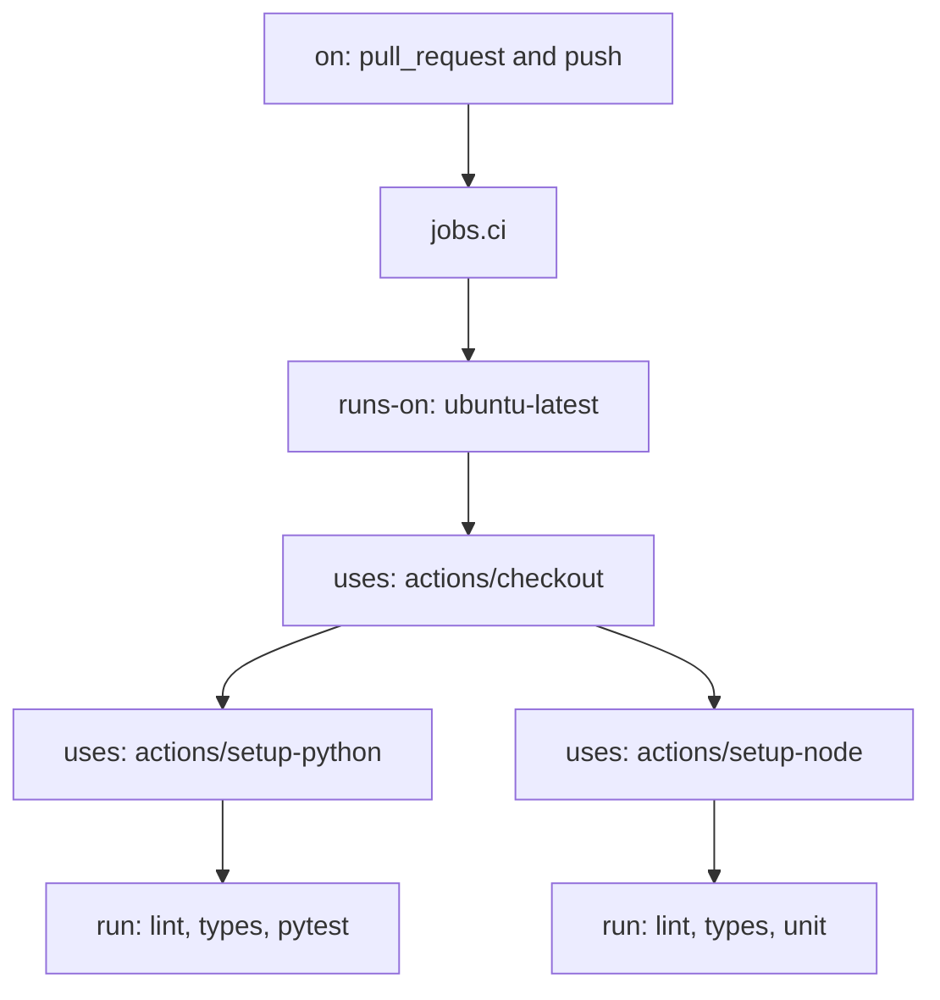

# Month 16 · Week 1 · Day 2
# First Workflow: YAML, Checkout, Lint, Types, Unit Tests

**Program:** Full-Stack Mastery · 18 months  
**Phase:** 5 — Production engineering  
**Month index:** [../../README.md](../../README.md)  
**Week 1:** [1](day-01.md) · Day 2 (today) · [3](day-03.md) · [4](day-04.md) · [5](day-05.md) · [6](day-06.md) · [7](day-07.md)  
**Week rhythm today:** Exercises + type-along  
**Student state:** Day 1 gate passed. You can name workflow, job, step, runner, and event. Today those words become a file the runner can execute.  
**Study time:** 3–4 focused hours

Labs: `~\fullstack-lab\month-16\week-01\day-02\`. You will create a **tiny** GitHub repo (or a folder you push). This is **not** Project 7. Do not paste product source. Day 6 is when you write a checklist for **your** product.

---

## How to use this textbook

Read YAML until you can draw `on` → `jobs` → `steps`. Type every line. Push and **read the Actions log**, not only the green check. Optional review links are for later.

---

## How to read this chapter

A workflow file is **data** that GitHub interprets. Indentation is structure. Two spaces, not tabs. Keys you must own today: `on`, `jobs`, `runs-on`, `steps`, `uses`, `run`, `name`, `with`.



**Wrong belief:** “YAML is just JSON with fewer brackets, so I can guess.”  
**Correct:** a wrong indent moves a step into another job or drops it. The runner will not “figure it out.” Read the parse error.

**Wrong belief:** “I’ll write this in PowerShell syntax because I am on Windows.”  
**Correct:** the runner is **Linux**. `run:` scripts are `bash` by default. Your laptop uses PowerShell to `git push`. Those are different machines.

---

## Today's contract

By the end of this day you will be able to:

1. Explain every key in a small `ci.yml`: `on`, `jobs`, `runs-on`, `steps`, `uses`, `run`, `with`, `name`.  
2. Check out the repo, install Python and Node on the runner, run lint, typecheck, and unit tests.  
3. Read a failing log and fix **your** command, not “the cloud.”  
4. Keep secrets out of YAML (there are none today; the habit starts now).

**Today's gate.** Closed-book:

> I can write a workflow that starts on a pull request, runs on Ubuntu, checks out the code, sets up Python and Node, and runs lint, typecheck, and unit tests with `run:`. `uses` is an action; `run` is a shell command on the Linux runner.

---

## Time box

| Block | Minutes | Work |
|---|---|---|
| A | 50 | Theory: YAML completely |
| B | 80 | Type-along: tiny repo + workflow + first green (or first red you fix) |
| C | 50 | Exercises: break five things on purpose, record logs |
| D | 15 | Git |
| E | 15 | Recall |

---

# Block A — Theory

## 1. Where the file lives

GitHub looks for workflows in:

```text
.github/workflows/*.yml
```

The folder name is `.github`, then `workflows`. A file named `ci.yml` or `ci.yaml` both work. This course uses `ci.yml`.

The file is committed like any other file. A workflow that exists only on your laptop does not run.

## 2. The document shape

YAML is a tree. Nested keys are indented. A workflow at minimum:

- **`name:`** — optional label in the Actions tab.  
- **`on:`** — events.  
- **`jobs:`** — map of job ids.

Each job:

- **`runs-on:`** — runner label. This course: `ubuntu-latest`.  
- **`steps:`** — list. Each list item starts with `-`.

Each step:

- **`name:`** — log heading. Write these; future-you reads logs at 11 p.m.  
- **`uses:`** **or** **`run:`** — not both as the main verb.  
- **`with:`** — inputs to an action (`uses`).  
- **`env:`** — environment variables for that step (or job-level `env`).

**Wrong belief:** “I can put `run:` and `uses:` in the same step to be efficient.”  
**Correct:** one step, one verb. Checkout is a `uses` step. Pytest is a `run` step.

## 3. `on` in full (the subset you need)

```yaml
on:
  pull_request:
  push:
    branches: [main]
```

That means: every PR (all branches, default types), and every push to `main`.

`on.pull_request.branches: [main]` means only PRs **targeting** `main`. Either shape is acceptable if you can explain it. `workflow_dispatch:` adds a button. Optional.

**Wrong belief:** “`on: push` without a branch filter is fine.”  
**Correct:** it runs on every branch push, which is often what you want for learning — or expensive if you push junk. Prefer `pull_request` plus `push` to `main`.

## 4. `jobs`, ids, and `runs-on`

`jobs.ci` is a **job id** (no spaces) with `runs-on: ubuntu-latest` and a `steps:` list. The Actions UI shows a job `name:` if you add one. Checkout is the first step: `uses: actions/checkout@v4`.

`runs-on: ubuntu-latest` is GitHub’s current Ubuntu image. It changes over years. Pinning a specific Ubuntu label is optional; this course uses `ubuntu-latest` and reads the log if something breaks.

Self-hosted runners are out of scope. Kubernetes runners are out of scope.

## 5. `uses` — checkout and setup

**Checkout** copies the triggering commit onto the runner. Without it, `pytest` has no files. Pin majors: `actions/checkout@v4`, `actions/setup-python@v5` with `python-version: "3.12"`, `actions/setup-node@v4` with `node-version: "22"`. `@main` is reckless. `with:` belongs to **that** action, not to bash. After setup, `python` and `node` are on the runner `PATH`. Your Windows `py` launcher is not there.

## 6. `run` — you own the commands

`run: pytest -q` is one bash command. `run: |` starts a multi-line script; a failed line fails the step (`bash -e`). Default working directory is the repo root. For `web/`, set `working-directory: web`. Extra `--` after `npm test` passes args through npm — related to, not the same as, laptop `npm create vite@latest . -- --template …`.

## 7. Lint, typecheck, unit — three different reds

| Check | Typical command (lab) | Catches | Misses |
|---|---|---|---|
| Lint | `ruff check .` / `npx eslint .` | Style, unused imports | Wrong 201 |
| Typecheck | `mypy` / `npx tsc --noEmit` | Type lies | Runtime SQL |
| Unit | `pytest -q` / `npx vitest run` | Pure rules | Missing decorator status |

Separate named steps are easier to read than one `&&` chain. `permissions: contents: read` is enough to test. Do not `continue-on-error` on pytest. No passwords in YAML.

**Wrong belief:** “I’ll hardcode `DATABASE_URL` in YAML because it is only CI.”  
**Correct:** Day 4 uses a service container and job `env`. Week 2 treats real secrets.

---

# Block B — Type-along

You need a **GitHub** repository. If you do not have one yet, create an empty public or private repo in the browser, then:

```powershell
cd ~\fullstack-lab\month-16\week-01\day-02
mkdir ci-lab -Force
cd ci-lab
git init
```

Create this tree **by typing**. Domain: **desk holds** (not your product).

`holds.py`:

```python
def can_release(role: str, owner_id: int, actor_id: int) -> bool:
    if role == "admin":
        return True
    return owner_id == actor_id
```

`test_holds.py`:

```python
from holds import can_release


def test_stranger_cannot_release() -> None:
    assert can_release("member", 1, 2) is False


def test_owner_can_release() -> None:
    assert can_release("member", 1, 1) is True
```

`requirements-dev.txt`:

```text
ruff==0.8.6
pytest==8.3.4
```

`ruff check .` on these two files should pass. Node/Vite is **optional** today: if you add `web/`, use `npm create vite@latest . -- --template vanilla-ts` on the laptop (keep the extra `--` in PowerShell) and real `npm run typecheck` scripts — not `echo skip` stubs. Prefer solid Python CI over fake Node steps.

Create `.github/workflows/ci.yml`. Type it. Do not paste Project 7.

```yaml
name: CI

on:
  pull_request:
  push:
    branches: [main]

permissions:
  contents: read

jobs:
  ci:
    runs-on: ubuntu-latest
    steps:
      - name: Checkout
        uses: actions/checkout@v4

      - name: Set up Python
        uses: actions/setup-python@v5
        with:
          python-version: "3.12"

      - name: Install Python tools
        run: |
          python -m pip install --upgrade pip
          pip install -r requirements-dev.txt

      - name: Lint
        run: ruff check .

      - name: Unit tests
        run: pytest -q
```

If `web/package.json` exists, add setup-node@v4, `working-directory: web`, `npm ci` (needs a lockfile; `npm install` is lab-only — write that in `NOTES.md`), then `npm run typecheck` and `npm test`. Do not add those steps as `echo skip`.

Commit, create `main`, add the GitHub remote, push. A push to `main` is enough to see the first run; a PR is better practice.

```powershell
git add .
git commit -m "Month 16 Day 2: first CI workflow for desk-holds lab."
git branch -M main
git remote add origin https://github.com/YOUR_USER/YOUR_CI_LAB.git
git push -u origin main
```

Open the **Actions** tab. Click the run. Open **Lint**. Open **Unit tests**. Write `LOG.md`: three facts from the log (Python version, how many tests, runner OS line).

If it is red, do **not** click skip. Read the step. Fix the file. Push again.

---

# Block C — Exercises (break five things)

On a branch, one at a time, push, watch red, revert. Record in `BREAK.md`: **what you changed**, **which step went red**, **the error line**.

1. Indent `run: pytest -q` so it is no longer a valid step (YAML mess).  
2. Typo `actions/checkout@v4` as `actions/chekout@v4`.  
3. Change `test_stranger_cannot_release` to expect `True`.  
4. Add an unused import that `ruff check` rejects (or `print` with a rule you enabled).  
5. Set `python-version: "2.7"` and watch setup fail — then restore `3.12`.

Do not leave `main` broken. Merge or revert so the lab repo is green at the end.

Write `USES-VS-RUN.md` (eight lines): two `uses` examples, two `run` examples, one sentence why they are not interchangeable.

---

# Block D — Git

The lab repo already has commits. Also snapshot notes in fullstack-lab:

```powershell
cd ~\fullstack-lab
git add month-16\week-01\day-02
git commit -m "Month 16 Day 2: YAML notes, BREAK.md, first workflow evidence."
```

Copy `LOG.md` and `BREAK.md` into the day-02 folder if they lived only in the GitHub repo.

---

# Block E — Recall

1. Where workflow files must live.  
2. `on` versus `jobs` versus `steps`.  
3. `uses` versus `run`.  
4. Why `runs-on: ubuntu-latest` while you edit in PowerShell.  
5. Why `permissions: contents: read` is enough for pytest.

## Office hours

**`pytest: command not found`.** Install deps on the runner before `pytest`. **Wrong folder:** `.github/workflows/`, not `workflows/` at root. **`npm ci`:** needs a lockfile. **Empty Actions tab:** enable Actions or push the YAML. **Never** put a PAT in YAML; revoke if you did.

---

## Definition of done

- [ ] `ci.yml` exists under `.github/workflows/` in the **lab** repo  
- [ ] You can explain `on`, `jobs`, `runs-on`, `steps`, `uses`, `run` closed-book  
- [ ] At least one GitHub Actions run that executed pytest  
- [ ] `BREAK.md` has five experiments  
- [ ] No secrets in git  
- [ ] Notes committed in fullstack-lab  

---

## Optional review links

- [GitHub Actions: Workflow syntax](https://docs.github.com/en/actions/using-workflows/workflow-syntax-for-github-actions)  
- [actions/checkout](https://github.com/actions/checkout)

## Tomorrow

**Memory day** — Days 1–2 closed. You will write `ci.yml` from a spec printed in Day 3’s file.
