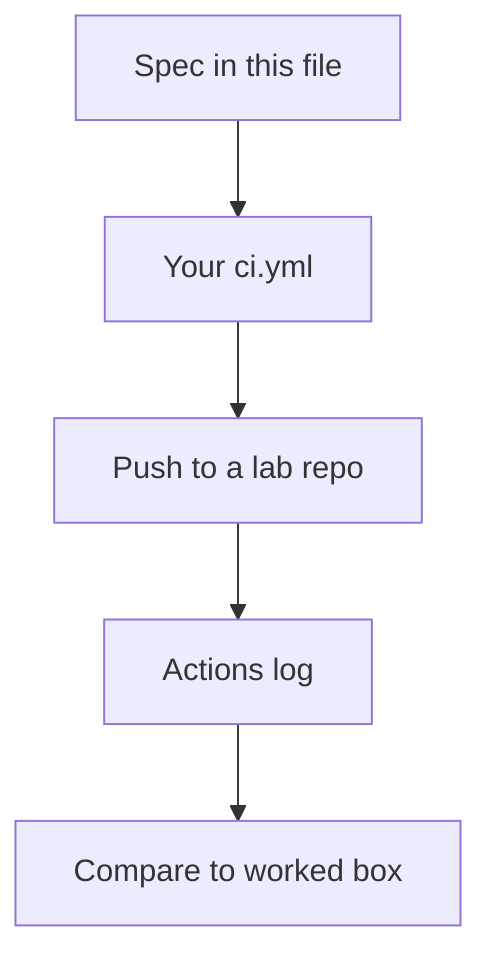

# Month 16 · Week 1 · Day 3
# From Memory: Write `ci.yml` from a Spec

**Program:** Full-Stack Mastery · 18 months  
**Phase:** 5 — Production engineering  
**Month index:** [../../README.md](../../README.md)  
**Week 1:** [1](day-01.md) · [2](day-02.md) · Day 3 (today) · [4](day-04.md) · [5](day-05.md) · [6](day-06.md) · [7](day-07.md)  
**Week rhythm today:** Implement from memory  
**Student state:** Day 2 gate passed. You have seen a workflow run. Today the YAML must still live in your head — from **this file**.  
**Study time:** 3–4 focused hours  
**Prereq:** Day 2 gate passed.

Labs: `~\fullstack-lab\month-16\week-01\day-03\`. Do **not** copy Day 2 `ci.yml`. Do **not** paste Project 7. Days 1–2 stay **closed** during the drills.

---

## How Day 3 works

Days 1 and 2 had type-along YAML. During the drills they stay **closed**. This file contains a recap so you are not sent to another site to learn.

Allowed:

- The complete explanation in this file
- Your own notes in `fullstack-lab` (not Day 1–2 textbook files)
- The Actions UI **after** you push **your** Day 3 file

Not allowed:

- Pasting a finished workflow from AI
- Opening Day 1 or Day 2 during Blocks 1–3
- Browsing GitHub docs as the teacher during the drill

If you are stuck **more than 25 minutes** on one task, open **only** the matching Day 1 or Day 2 section **in this textbook**, read it, close it, continue from memory. Record what you had to look up in `lookups.txt`. That list is tomorrow’s repair list.

There is **no answer key in the first half** of this file. You write `ci.yml` first. A worked box waits at the end for **after** you commit your attempt.

---

## How to read this chapter

A workflow is a YAML document GitHub reads. The runner is Linux. Your editor is Windows. Those facts do not fight if you keep `run:` in bash.



**Wrong belief:** “Memory day means I reread Day 2 with the file open.”  
**Correct:** the recap below is the teacher. Days 1–2 are the backup after 25 minutes.

---

## Complete explanation (CI you must still own)

**Continuous integration** is a **gate** on a proposed change. The unit is a **commit / pull request**, not a README badge. A badge you can ignore is decoration. A **required** status check on `main` is a gate (Day 5 names protection; today you still write a real job).

**Workflow.** File under `.github/workflows/`. Keys: `name`, `on`, `jobs`.

**Event (`on`).** `pull_request` runs when a PR is opened or updated. `push` with `branches: [main]` runs after merge (or a direct push). Prefer PR + `main`, not “only nightly.”

**Job.** A named map entry under `jobs:` with `runs-on` and `steps`. Job id has no spaces (`ci`).

**Runner.** `ubuntu-latest` is a Linux VM GitHub hosts. It is not your PowerShell. Paths use `/`. `curl` on the runner; `curl.exe` on Windows laptops.

**Step.** List item. One verb: `uses` **or** `run`.

**`uses`.** An action. Pin a version (`actions/checkout@v4`, `actions/setup-python@v5`, `actions/setup-node@v4`). `with:` passes inputs (`python-version`, `node-version`).

**`run`.** Bash on the runner. `pip install`, `ruff check .`, `pytest -q`, `npm ci`, `npm run typecheck`. Multi-line with `|`.

**Checkout.** Without `actions/checkout`, the runner has no repo files.

**Permissions.** `contents: read` is enough to test. Do not grant write for pytest.

**Gate vs skip.** `--no-verify` skips local hooks only. Commenting out pytest, or `continue-on-error: true` on tests, destroys the gate.

**Secrets.** Not in git. Not in YAML as passwords. None needed for today’s unit tests.

**Not Kubernetes.** A Linux VM running pytest is enough.

**Wrong belief:** “TestClient in CI is E2E.”  
**Correct:** still in-process HTTP. Playwright is E2E. Today is unit + lint.

**Wrong belief:** “If YAML parses, CI is a gate.”  
**Correct:** `echo hello` parses. A gate runs lint, types, tests.

**Windows.** Extra `--` after `npm create vite` is a **local** create quirk. Do not invent PowerShell in `run:`.

---

## Today's contract

By the end of this day you will be able to:

1. Write `ci.yml` from the spec below without opening Day 2.  
2. Classify five “is this a gate?” stories.  
3. Rebuild a tiny unit file and hook it to the workflow.  
4. Name `uses` vs `run` from memory.

**Today's gate.** Closed-book:

> I can write a PR workflow on ubuntu-latest that checks out, sets up Python, installs deps, lints, and runs pytest. I do not call a badge a gate. I do not put secrets in YAML.

---

## Time box

| Block | Minutes | Work |
|---|---|---|
| 1 | 25 | Speak the recap; write `exam-01.md` (12–20 lines) |
| 2 | 50 | Write `ci.yml` from spec into the lab folder |
| 3 | 45 | Mini-build: library holds + tests + push if you can |
| 4 | 30 | Debug five YAML defects (on paper) |
| 5 | 20 | Only now: compare to the worked box; `DIFF.md` |
| 6 | 20 | Design: which Project 7 commands map to steps |
| 7 | 15 | Retro + `lookups.txt` |

---

# Block 1 — Speak

No Day 1–2 files. Cover: CI as gate; PR as unit; workflow / job / step / runner / event; uses vs run; Linux runner; badge vs required check. Write `exam-01.md` in the lab folder — your words, not a paste of this recap.

```powershell
cd ~\fullstack-lab
mkdir month-16\week-01\day-03 -Force
cd ~\fullstack-lab\month-16\week-01\day-03
```

---

# Block 2 — Write `ci.yml` from spec

Create `.github/workflows/ci.yml` **inside the day-03 folder** (a nested gym is fine) **or** in a fresh GitHub lab repo named `m16-w1-d3`. Either way, the YAML must match this spec. You write it **before** the worked box.

**Spec (imposed):**

1. Workflow `name:` `Library holds CI`  
2. `on:` `pull_request` and `push` to `main`  
3. `permissions: contents: read`  
4. One job id `ci`, `runs-on: ubuntu-latest`  
5. Steps, in order, with `name:` on each:  
   - Checkout with `actions/checkout@v4`  
   - Python 3.12 with `actions/setup-python@v5`  
   - Install from `requirements-dev.txt` (pip upgrade, then pip install -r)  
   - `ruff check .`  
   - `pytest -q`  
6. No secrets. No `continue-on-error`. No deploy.

Write `ANNOTATE.md`: one line per key (`on`, `jobs`, `runs-on`, `steps`, `uses`, `run`) explaining it in your words.

---

# Block 3 — Mini-build from memory

Days 1–2 closed. Recap is enough.

Domain: **library holds**, not Project 7.

```powershell
cd ~\fullstack-lab\month-16\week-01\day-03
uv init --name lab-ci-memory
uv add --dev pytest ruff
```

If you prefer pip to match the YAML spec exactly, skip uv for the **runner** and keep `requirements-dev.txt`:

```text
pytest
ruff
```

`rules.py`: `can_hold(role: str, copies: int) -> bool` — False if `copies < 1`; True if role is `member` or `admin`.

Tests:

- `test_zero_copies_cannot_hold`  
- `test_member_with_copy_can_hold`  
- `test_blank_role_cannot_hold` — `role=""` is False

```powershell
uv run ruff check .
uv run pytest -q
```

Your workflow uses `ruff` and `pytest` on PATH after pip install. Locally `uv run` is fine. Do not add FastAPI today. That is Day 4.

If you have a GitHub remote for this day, push and paste a **screenshot-free** log excerpt (no tokens) into `RUN.txt`. If you cannot push today, still write the YAML; pushing is required by Day 6.

---

# Block 4 — Debug mislabels

Write `DEBUG.md`. For each: **what is wrong**, **what the runner would do**, **fix in one sentence**.

**A.** “The workflow is in `github/workflows/ci.yml` (no dot).”  
**B.** “`run:` uses `uv run pytest` but the job never installed uv.”  
**C.** “`runs-on: windows-latest` because the student uses PowerShell.”  
**D.** “Step combines `uses: actions/checkout@v4` and `run: pytest` together.”  
**E.** “`on: schedule` only, cron weekly, because PRs are noisy.”  

No running broken code required.

---

# Block 5 — Worked box (only after ci.yml exists)

Compare. Write `DIFF.md`: three lines you had wrong, or `MATCH.txt` if you nailed it. Then read the box below.

A valid solution looks like this **shape** (your comments may differ; pin versions as in the spec):

```yaml
name: Library holds CI

on:
  pull_request:
  push:
    branches: [main]

permissions:
  contents: read

jobs:
  ci:
    runs-on: ubuntu-latest
    steps:
      - name: Checkout
        uses: actions/checkout@v4

      - name: Set up Python
        uses: actions/setup-python@v5
        with:
          python-version: "3.12"

      - name: Install
        run: |
          python -m pip install --upgrade pip
          pip install -r requirements-dev.txt

      - name: Lint
        run: ruff check .

      - name: Unit tests
        run: pytest -q
```

**A–E keys:** A GitHub ignores it (wrong path). B command not found. C works but this course standardizes on Linux; Windows runners are a different PATH story. D one verb per step. E too late to be a PR gate.

If your file used `python-version: "3.11"` that is a minor miss — note it in DIFF, then match 3.12.

---

# Block 6 — Design

`DESIGN.md` (10–15 lines): list **your** Project 7 commands (lint, types, unit) as future `run:` lines. Paths only. No source. One sentence: integration tests need Postgres — preview Day 4, do not invent Kubernetes.

---

# Block 7 — Retro

`retro.md`: which YAML key you still mix with “job”; whether you wanted to paste Day 2; what you will not skip in the product checklist.

```powershell
cd ~\fullstack-lab
git add month-16
git commit -m "Month 16 Day 3: ci.yml from memory; holds mini-build."
```

---

## Office hours

**“Do I need Node today?”** No. Spec is Python. Node returns when your product checklist needs it.

**`ruff` not found locally.** `uv add --dev ruff` or `pip install ruff`.

**Indent.** Two spaces. `with:` hangs under the step, not under `jobs`.

---

## Definition of done

- [ ] `ci.yml` written **before** reading the worked box  
- [ ] Three unit tests green locally  
- [ ] `DEBUG.md` A–E attempted  
- [ ] `DIFF.md` or `MATCH.txt` after the box  
- [ ] `DESIGN.md` uses your commands, no product source  
- [ ] Commit exists  

---

## Optional review links

Repair from this recap first.

- [GitHub Actions: Workflow syntax](https://docs.github.com/en/actions/using-workflows/workflow-syntax-for-github-actions)  

---

# Lecture: how to read a workflow spec

When a spec says “on pull request,” write `on: pull_request:` (or the mapping form). When it says “Python 3.12,” that is `with: python-version` on **setup-python**, not a bash `python3.12` hope.

When a spec says “lint and unit,” those are **two steps** (or one `run` with `&&` — two named steps grade higher because logs split).

When a spec says “no secrets,” empty `env:` is correct. Do not invent `GITHUB_TOKEN` echoes.

Write `HEURISTIC.md` (six lines): your rule for choosing `uses` vs `run`. Then go to Block 5 if you have not.

---

## Tomorrow

**Lab:** integration tests with a **Postgres service container**, `DATABASE_URL` on the job, pytest. Still not Project 7.
