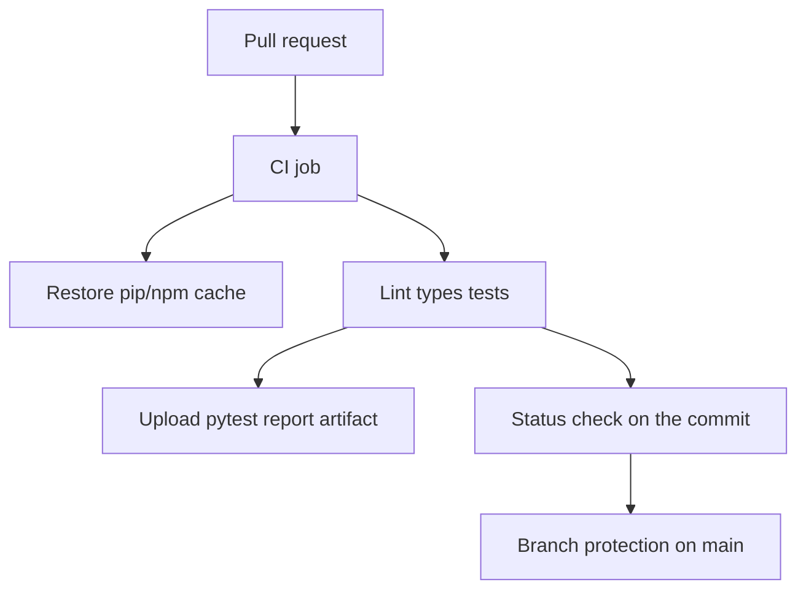

# Month 16 · Week 1 · Day 5
# Caches, Artifacts, and Required Checks: Making Green Mean Stop

**Program:** Full-Stack Mastery · 18 months  
**Phase:** 5 — Production engineering  
**Month index:** [../../README.md](../../README.md)  
**Week 1:** [1](day-01.md) · [2](day-02.md) · [3](day-03.md) · [4](day-04.md) · Day 5 (today) · [6](day-06.md) · [7](day-07.md)  
**Week rhythm today:** Tests / docs (and a small YAML change)  
**Student state:** Integration CI can talk to Postgres. Today you make the job **faster**, **inspectable**, and **unskippable** on `main` — as a concept you can defend, even if the GitHub UI click is on **your** repo.  
**Study time:** 3–4 focused hours

Labs: `~\fullstack-lab\month-16\week-01\day-05\`. Notes and a cache/artifact gym. Branch protection is configured on **GitHub**, not pasted as product source. Do not paste Project 7.

---

## How to use this textbook

1. Read caches vs artifacts vs required checks until you can teach the difference.  
2. Type a cache key and an `upload-artifact` step on a **lab** workflow.  
3. Write `PROTECTION.md` from the GitHub UI (screenshots optional; **settings names** required).  
4. Optional review links are for later rechecking.

---

## How to read this chapter

Three different objects get mixed in hallway talk:

| Object | Job | Lives after the run? |
|---|---|---|
| **Cache** | Reuse `pip` / `npm` downloads so the next run is faster | Maybe, keyed, not a release |
| **Artifact** | Keep files **from this run** (reports, a built folder) to download | Yes, for a retention period |
| **Required status check** | GitHub **refuses merge** while the named job is red or missing | Policy, not a file |



**Wrong belief:** “Caching is how we deploy.”  
**Correct:** caching is a **speed** trick. Deploying a cache of `node_modules` to production is how you ship a snowflake. Week 2 deploys an **image digest**, not a cache.

**Wrong belief:** “I uploaded an artifact, so the PR is gated.”  
**Correct:** artifacts are **files**. Gates are **rules**. You can upload from a red job depending on how you order steps. Required checks look at **conclusion**, not at a zip.

---

## Today's contract

1. Explain cache vs artifact vs required check in full sentences.  
2. Add pip and/or npm caching to a lab workflow (setup actions’ built-in cache **or** `actions/cache`).  
3. Upload a small artifact (pytest JUnit XML or a `report.txt` you generate).  
4. Document branch protection: require the CI job, no force-push to `main` if you can set it, administrators included if the UI offers “do not allow bypass.”  
5. Write `GATES.md` for Project 7 (paths and check **names** only).

**Today's gate.** Closed-book:

> A cache speeds installs. An artifact saves files from a run. A required status check on protected `main` is the gate. If I can merge red, I do not have CI. I do not put secrets in artifacts.

---

## Time box

| Block | Minutes | Work |
|---|---|---|
| A | 50 | Theory |
| B | 55 | Type-along: cache + artifact on the lab repo |
| C | 55 | Docs: branch protection + Project 7 gate names |
| D | 15 | Git |
| E | 15 | Recall |

---

# Block A — Theory

## 1. Why CI feels slow

Every job starts empty. `pip install` and `npm ci` download the internet. A **cache** stores those downloads between runs when the **lockfile** (or `requirements*.txt`) has not changed.

Setup actions often accept:

```yaml
- uses: actions/setup-python@v5
  with:
    python-version: "3.12"
    cache: pip
    cache-dependency-path: requirements-dev.txt

- uses: actions/setup-node@v4
  with:
    node-version: "22"
    cache: npm
    cache-dependency-path: web/package-lock.json
```

If there is no lockfile, npm caching is weaker. Prefer committing `package-lock.json`.

**Wrong belief:** “I’ll cache the whole `.venv` and skip `pip install`.”  
**Correct:** virtualenvs can embed machine paths. Caching **pip’s download cache** (what `cache: pip` does) is the conservative gift. If you use `actions/cache` yourself, key on the hash of the requirements file:

```yaml
- uses: actions/cache@v4
  with:
    path: ~/.cache/pip
    key: ${{ runner.os }}-pip-${{ hashFiles('requirements-dev.txt') }}
```

`${{ }}` is GitHub’s expression language. `hashFiles` changes the key when deps change. An old cache is then a **miss**, which is correct.

Cache **saves** happen on job success by default for `actions/cache`. Do not treat a cache miss as a test failure.

## 2. Artifacts — evidence, not production

```yaml
- name: Write report
  if: always()
  run: pytest -q --junitxml=junit.xml

- name: Upload test report
  if: always()
  uses: actions/upload-artifact@v4
  with:
    name: junit-report
    path: junit.xml
```

`if: always()` uploads even when pytest failed — that is the point of a report. **Do not** upload `.env`, SSH keys, or `DATABASE_URL` dumps.

Retention defaults to days, not forever. Artifacts are not your backup strategy (Week 3 RDS backups are).

**Wrong belief:** “The frontend `dist/` artifact is the production deploy.”  
**Correct:** it **can** be an artifact you promote (Week 2). Today you are learning the **button** “download artifact.” Promotion is a later discipline: the same bytes, a named environment, a person or rule that says yes.

## 3. Status checks

When job `integration` finishes, GitHub stores a check named after the **workflow** and/or **job**. The exact string you will require in branch protection must **match** what the PR shows (for example `CI Postgres / integration`). Open a PR and copy the name. Guessing the string is how people “require CI” and still merge because the name never matched.

Pending checks: a PR that has **not** run yet is not green. Protection should **require** the check to pass, which also means it must run.

## 4. Branch protection (concepts)

On GitHub: repository **Settings → Branches → Branch protection rules** (the UI label moves occasionally; look for protecting `main`).

Concepts this course requires you to **understand**, and to **enable** on the lab repo and later on Project 7:

| Rule | Why |
|---|---|
| Require a pull request before merging | Stops silent pushes to `main` if you also disallow direct push |
| Require status checks to pass | The gate |
| Require branches to be up to date (optional) | Avoids “green on stale `main`” |
| Do not allow bypassing (include admins) if available | Admins are the people who skip |
| No force push / no delete of `main` | History is evidence |

If you work **solo** on a private repo, GitHub may not let you require a second reviewer. That is fine. You can still require **checks**. Solo is not a license to merge red.

**Wrong belief:** “I’ll require checks but allow admins to bypass because I own the repo.”  
**Correct:** you are the admin. You are the person who will be in a hurry. Include yourself in the rule if the UI allows.

If the repo cannot enable protection (old plan, missing menu), write `EQUIVALENT.md`: what you will refuse to do by habit, and that the **Month 16 gate** still wants protection or an honest documented equivalent. Localhost rules are not GitHub rules.

## 5. Environments (preview)

GitHub **Environments** (`staging`, `production`) add approval gates for **deploys**. That is Week 2. Today’s required checks are for **CI**, not for AWS.

## 6. What not to cache

- Docker layers: possible with extra setup; **not required** this week.  
- Postgres data: never cache the test database between jobs; you want empty.  
- Secrets: never.

## 7. Docs as tests

Today’s “tests” are partly **policy tests**: after protection, open a PR that **fails** pytest on purpose and confirm GitHub **blocks** merge. Then restore green. That is a test of the gate, not of `can_edit`.

Write the procedure in `GATE-DRILL.md` so Week 4 exam-you can repeat it.

---

# Block B — Type-along

```powershell
cd ~\fullstack-lab
mkdir month-16\week-01\day-05 -Force
cd ~\fullstack-lab\month-16\week-01\day-05
```

Copy yesterday’s lab **or** continue on the same GitHub repo. Add cache + artifact. Type the changed steps. Push.

Write `CACHE.md`:

- Which action provides the cache  
- Which file hash would bust it  
- One sentence: cache miss is not a failed test  

Generate a tiny artifact even if you skip JUnit:

```yaml
- name: Note
  run: echo "pytest finished" > ci-note.txt

- name: Upload note
  uses: actions/upload-artifact@v4
  with:
    name: ci-note
    path: ci-note.txt
```

Download it from the run UI. Write `ARTIFACT.md`: filename, that it is not a container image, that you will not upload secrets.

---

# Block C — Independent docs

On the **lab** GitHub repo, add a branch protection rule for `main` (or `master` if that is your default — this course prefers `main`).

Fill `PROTECTION.md`:

| Setting | Value I chose | Why |
|---|---|---|
| Branch name | | |
| Required check exact name | | copied from a PR |
| Require PR | yes/no | |
| Admins must obey | yes/no/unavailable | |
| Force push | denied/allowed | |

**Gate drill:** branch, break a test, open PR, record that merge is blocked (or honest equivalent). Restore. Paste no secrets.

Then `GATES.md` for **Project 7** (names only):

1. Workflow file path you will add (Day 6).  
2. Job names you will require.  
3. Who can currently merge red (honest).  
4. Kubernetes: not required for this gate.

---

# Block D — Git

```powershell
cd ~\fullstack-lab
git add month-16
git commit -m "Month 16 Day 5: cache vs artifact vs required checks."
```

---

# Block E — Recall

1. Cache vs artifact.  
2. Why hashing the lockfile matters.  
3. Why the required check **name** must match the UI.  
4. Why admin bypass kills the gate.  
5. Why not to upload `.env`.

## Office hours

**Cache not restored.** Key changed; first run; different `runner.os`. Fine.

**Artifact empty.** `path` wrong; pytest never wrote the file; you uploaded after a `cd` into a directory the path does not see.

**Required check stuck pending.** Workflow `on:` does not include `pull_request`; Actions disabled; name mismatch.

**“I have no Settings.”** Organization policy. Document the equivalent. Do not fake a screenshot.

Windows: downloading artifacts is a browser action. `curl.exe` is not required today.

---

## Definition of done

- [ ] `CACHE.md` and `ARTIFACT.md` exist  
- [ ] Lab workflow uses pip or npm cache **or** `actions/cache`  
- [ ] One artifact uploaded from a run  
- [ ] `PROTECTION.md` filled from the real UI or honest equivalent  
- [ ] Gate drill recorded  
- [ ] `GATES.md` for Project 7 names only  
- [ ] Commit exists  

---

## Optional review links

Repair from this chapter first.

- [GitHub: Caching dependencies](https://docs.github.com/en/actions/using-workflows/caching-dependencies-to-speed-up-workflows)  
- [GitHub: Storing workflow data as artifacts](https://docs.github.com/en/actions/using-workflows/storing-workflow-data-as-artifacts)  
- [GitHub: Managing a branch protection rule](https://docs.github.com/en/repositories/configuring-branches-and-merges-in-your-repository/managing-protected-branches/managing-a-branch-protection-rule)  

---

## Tomorrow

**Independent:** a complete PR pipeline on a **lab** repo (not a Project 7 paste), then `CHECKLIST.md` for attaching the same shape to **your** product.
