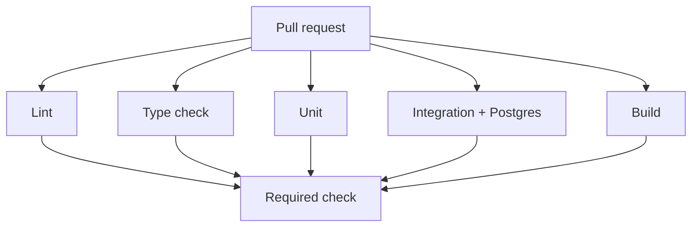

# Month 16 · Week 1 · Day 6
# Independent: A Full PR Pipeline, Then a Project 7 Checklist

**Program:** Full-Stack Mastery · 18 months  
**Phase:** 5 — Production engineering  
**Month index:** [../../README.md](../../README.md)  
**Week 1:** [1](day-01.md) · [2](day-02.md) · [3](day-03.md) · [4](day-04.md) · [5](day-05.md) · Day 6 (today) · [7](day-07.md)  
**Week rhythm today:** Independent implementation  
**Student state:** You practiced YAML, Postgres services, caches, artifacts, and protection **in labs**. Today one **lab repository** wears the whole Week 1 pipeline. Then you write a checklist for **your** product — you still do not paste Project 7 source into this textbook folder.  
**Study time:** 3–4 focused hours

Evidence notes: `~\fullstack-lab\month-16\week-01\day-06\`. The GitHub repo may live under your GitHub user. This textbook will **not** paste Project 7.

---

## How to use this textbook

1. Build or finish a **lab** app (desk holds or library holds). It may combine Days 2–4. It is still not the product.  
2. Make a PR pipeline that would embarrass a broken commit.  
3. Write `CHECKLIST.md` as **steps you will type in Project 7 tomorrow-or-soon**, not as copied handlers.  
4. Optional review links are for later rechecking.

---

## How to read this chapter

Week 1’s product skill is not “I have a gist of ci.yml.” It is: **a stranger’s Ubuntu VM** runs lint, types, unit tests, integration tests with Postgres, and a build, on every PR, and `main` cannot merge while that is red.



**Wrong belief:** “I’ll paste this textbook’s FastAPI holds app into the product repo and call CI done.”  
**Correct:** the product already has tests (Month 14). You attach **workflow + service + protection**. The lab is a gym.

**Wrong belief:** “I’ll skip the lab repo and only edit Project 7.”  
**Correct:** if the product pipeline is already perfect, **prove** it with a PR log and still write the checklist. If it is not, the gym repo is how you learn without wrecking `main`.

---

## Today's contract

1. Lab repo workflow on `pull_request`: **lint**, **type check** (or documented OWED if the gym is Python-only types via a stub), **unit**, **integration** (Postgres service), **build** (Python: `python -c "import app"` or a frontend `npm run build` if `web/` exists).  
2. Cache pip and/or npm.  
3. Artifact: junit or a note file.  
4. Branch protection requires the check — or `EQUIVALENT.md`.  
5. `CHECKLIST.md` for Project 7: file paths, commands, secrets **names** (not values), “do not commit `.env`.”

**Today's gate.** Closed-book:

> I have a lab PR pipeline that runs lint, tests, and a build on Ubuntu with a Postgres service. I wrote a checklist to add the same shape to my product. I did not paste product source into fullstack-lab.

---

## Time box

| Block | Minutes | Work |
|---|---|---|
| A | 25 | Inventory lab + product commands |
| B | 40 | Assemble workflow until green on a PR |
| C | 90 | Protection + evidence + CHECKLIST.md |
| D | 20 | Honest gaps |
| E | 15 | Recall |

---

# Block A — Inventory

Write `~\fullstack-lab\month-16\week-01\day-06\INVENTORY.md`.

**Lab repo**

| Question | Answer |
|---|---|
| GitHub URL (no secrets) | |
| Workflow path | |
| Lint command | |
| Typecheck command | |
| Unit command | |
| Integration command | |
| Build command | |
| Postgres service? | yes/no |

**Product (Project 7) — names only**

| Question | Answer |
|---|---|
| API repo path on disk | |
| Web repo path | |
| Existing workflow? | |
| Test DB env var name | |
| Can I name a 403 test? | |

If typecheck does not exist on the gym, add `mypy` on `rules.py` **or** write OWED and still run ruff + pytest. Product checklist must include **real** typecheck commands you already use (`mypy`, `ty`, `tsc --noEmit`).

---

# Block B — Assemble the lab pipeline

Minimum `ci.yml` shape (you type; match **your** files):

- `on: pull_request` and `push` to `main`  
- `permissions: contents: read`  
- `ubuntu-latest`  
- checkout, setup-python (cache pip), optional setup-node (cache npm)  
- `services.postgres` with health as Day 4  
- `env.DATABASE_URL` for the job  
- steps: lint, typecheck, unit, integration, build  
- upload-artifact `if: always()` for a report  

**Build** for a tiny FastAPI gym: a step `python -c "from app import app"` or compileall. For a `web/` folder: `npm ci` and `npm run build`.

Open a **pull request** (even `ci/pipeline` → `main`) so the event is `pull_request`, not only a push. Merge only when green.

Write `PR.md`: PR number, check name, conclusion.

Windows: you push with PowerShell. You do not run the workflow in PowerShell. Read the Linux log.

Kubernetes: do not add a cluster.

---

# Block C — Checklist for Project 7

Create `CHECKLIST.md` in the day-06 folder. This is the document you will follow **in the product repos**, not a paste of routers.

Required sections:

1. **Where YAML goes** — `.github/workflows/ci.yml` in API, web, or a monorepo. Pick **your** layout.  
2. **Commands** — exact `run:` lines you will type (ruff, pytest, eslint, tsc, vitest, playwright optional).  
3. **Postgres** — service container **or** equivalent you can defend (some teams use a hosted test DB; you must still isolate and refuse prod URLs).  
4. **Env names** — `DATABASE_URL`, `TEST_DATABASE_URL`, never values.  
5. **Caches** — lockfile paths.  
6. **Artifacts** — what you will upload (coverage HTML is optional; junit is enough).  
7. **Protection** — required check names to copy from a real PR.  
8. **Secrets** — “none in git.” Product secrets wait for Week 2.  
9. **Out of scope** — Kubernetes, AWS deploy, `create_all` on production.  
10. **Definition of done for the product attach** — a fresh PR goes red if you break a unit test on purpose.

Do **not** complete Project 7 source in this file. Do **not** dump `main.py`.

If you have time, **start** the product workflow on a branch. If you finish it, evidence goes in `PRODUCT-EVIDENCE.md` (log lines, not source). If you do not finish, the checklist must still be specific enough that Day 7 / Week 4 you can execute it.

---

# Block D — Honest gaps

`GAPS.md`:

- Playwright in CI: yes / not yet / too slow (document).  
- Typecheck: real / OWED.  
- Admin bypass still on: yes/no.  
- Monorepo vs two repos: how many workflows.

A gap is not a fail if it is dated. An invented green is a fail.

```powershell
cd ~\fullstack-lab
git add month-16
git commit -m "Month 16 Day 6: lab PR pipeline evidence and Project 7 CI checklist."
```

---

# Block E — Recall

1. Why the lab repo must not be a product paste.  
2. Which five verbs the pipeline must run.  
3. Why protection is part of “full pipeline.”  
4. What belongs in CHECKLIST vs in gitignored `.env`.  
5. Why `pull_request` evidence beats a screenshot of `pytest` on a laptop.

## Office hours

**Two repos.** Two workflows is normal. Checklist has two sections.

**Monorepo.** `working-directory` or two jobs with `needs`. Do not wait for Kubernetes namespaces.

**Minutes exhausted.** Public repo, shorter tests, cache. Do not steal minutes from other people’s orgs.

**I already had CI.** Still write CHECKLIST and prove required checks. Day 6 is **evidence**, not novelty.

**uv.lock.** `cache-dependency-path` can be `uv.lock` if you install uv on the runner. Pin the installer. pip + `requirements-dev.txt` remains valid.

---

## Definition of done

- [ ] Lab PR run executed lint + tests + build  
- [ ] Postgres service or documented equivalent  
- [ ] `PR.md` check name recorded  
- [ ] `CHECKLIST.md` is specific to **your** product commands  
- [ ] `GAPS.md` honest  
- [ ] No product source dump in fullstack-lab  
- [ ] Commit exists  

---

## Optional review links

Repair from this week’s chapters first.

- [GitHub Actions: Using jobs in a workflow](https://docs.github.com/en/actions/using-jobs/using-jobs-in-a-workflow)  
- [GitHub: About protected branches](https://docs.github.com/en/repositories/configuring-branches-and-merges-in-your-repository/managing-protected-branches/about-protected-branches)  

---

## Tomorrow

**Week review** — flaky tests, fail-fast versus matrix, debug five CI failures. Days 1–6 stay closed during the mini; repair from Day 7’s synthesis.
