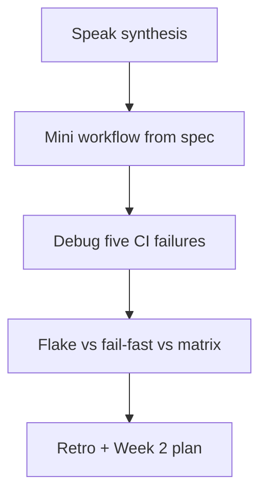
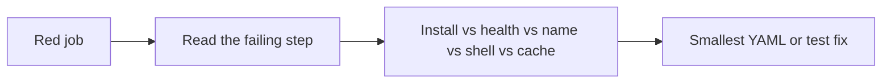

# Month 16 · Week 1 · Day 7
# Week Review — Flakes, Fail-Fast, Matrix, and Five Red Jobs

**Program:** Full-Stack Mastery · 18 months  
**Phase:** 5 — Production engineering  
**Month index:** [../../README.md](../../README.md)  
**Week 1:** [1](day-01.md) · [2](day-02.md) · [3](day-03.md) · [4](day-04.md) · [5](day-05.md) · [6](day-06.md) · Day 7 (today)  
**Week rhythm today:** Review, repair, plan Week 2  
**Student state:** You wrote YAML, ran Postgres on the runner, and drafted a product checklist. Today those ideas must still live in your head — from **this file**.  
**Study time:** 3–4 focused hours

Do not start Week 2 because the calendar moved. A CD story on a skippable badge is two problems.

Work in `~\fullstack-lab\month-16\week-01\day-07\`. Do not implement the mini-build inside Project 7.

---

## How to read this chapter

This is a **closed-book teaching day**. The synthesis **is** the Week 1 lesson.



Days 1–6 closed during mini-build. Repair from **this** recap.

---

## Week synthesis (the lesson, in this book)

**Continuous integration** is a **gate** on a proposed change. The unit is a **pull request** (and the commits on it), not a README badge. A badge you can ignore is decoration. `--no-verify` skips local hooks only. GitHub Actions still run unless you disable the workflow or the protection.

**GitHub Actions.** A **workflow** is YAML under `.github/workflows/`. An **event** (`on`) starts it: prefer `pull_request` plus `push` to `main`. A **job** runs on a **runner** (`ubuntu-latest` is **Linux** even when you edit on Windows PowerShell). A **step** is `uses` (an action: checkout, setup-python, setup-node) **or** `run` (bash on the runner). Pin action majors (`@v4`, `@v5`). `permissions: contents: read` is enough to test. No secrets in git.

**Pipeline this week.** Lint → type check → unit tests → integration tests → build. Integration uses a **Postgres service container**, job `env` `DATABASE_URL`, health `pg_isready`, pytest. That is not Kubernetes. That is not production RDS. Refuse production URLs in CI. `create_all` in a **test fixture** is not a production migration (Week 2).

**Cache** speeds pip/npm when lockfiles match. **Artifacts** store reports from a run (`if: always()`). Neither is a deploy. **Required status checks** on **protected `main`** are the gate. The check **name** must match the PR UI. Admin bypass is how gates die.

**Product.** Pipelines attach to **your** repos. Labs are gyms. This textbook does not paste Project 7. Day 6’s `CHECKLIST.md` is the attach plan.

**Wrong belief:** “CI is a green badge.”  
**Correct:** CI is a required machine that is not your laptop.

**Wrong belief:** “The workflow runs in PowerShell because I pushed from Windows.”  
**Correct:** GitHub-hosted jobs in this course are Linux. `curl.exe` is for your laptop.

---

## New today: flakes, fail-fast, matrix

### Flaky tests

A **flake** is a test that fails **without a product change**, then passes on retry. CI that “just rerun” as a lifestyle is a weather report with a refresh button.

Common CI flakes:

| Cause | What it looks like | Repair |
|---|---|---|
| Tests started before Postgres ready | Connection refused, then green on rerun | Healthcheck; do not `sleep` |
| Shared mutable state | Order-dependent pytest | Function-scoped fixtures; Month 14 isolation |
| Time / `sleep` | Timeouts in E2E | Assertions that wait on a condition |
| Cache of dirty extras | Works after “cache clear” | Key on lockfile; do not cache the test DB |
| `localhost` vs service hostname | Intermittent connect | One host, documented in HOST.txt |

**Wrong belief:** “I’ll add `retry: 3` on the pytest step and call it stable.”  
**Correct:** retries hide bugs. Find isolation or health. A single documented retry on a **known** infrastructure blip is a last resort, not a pyramid.

### Fail-fast

`fail-fast` is a **matrix** (and some job) setting. When one cell fails, GitHub **cancels** the other cells.

```yaml
strategy:
  fail-fast: true
  matrix:
    python-version: ["3.11", "3.12"]
```

**Fail-fast true (default on many matrices):** faster feedback; you may **miss** seeing that 3.11 and 3.12 both fail for different reasons.

**Fail-fast false:** all cells run; longer; better for “what is actually broken.”

This course’s **default learning job is one Python version**. You do not need a matrix to have CI. Add a matrix only if **your** product supports two versions and you will read two logs.

**Wrong belief:** “Professionals always matrix OS × Node × Python.”  
**Correct:** that is how you spend Actions minutes on a student repo. One honest Ubuntu job is a gate. Matrix is optional breadth.

Jobs without a matrix can still “fail fast” in the human sense: a failed **Lint** step skips later steps in the **same** job (the step chain stops). That is good. Separate jobs (`needs:`) can still run frontend if backend lint failed — or not, if you set `needs: backend`. Choose **consciously**. Day 6 checklists should say whether frontend CI is independent.

### Matrix (minimum you must own)

A matrix **expands** one job into many. `${{ matrix.python-version }}` goes into `setup-python`. Each cell is a different status check **name** (suffix). If you require checks, you must require the names that actually appear — or require a **single** aggregating job. Students who add a matrix and then require the old check name merge while half the cells are red.

This week you may **write** a matrix in the mini as an exercise, then **remove** it if it confuses protection.

---

## Today's contract

**Today's gate.** Closed-book:

> I can teach CI as a PR gate on Linux runners, write a small workflow from this spec, explain a flake versus a real fail, say what fail-fast does on a matrix, and debug five red-job stories without calling Kubernetes the answer.

---

## Time box

| Block | Minutes | Work |
|---|---|---|
| 1 | 35 | Speak the synthesis; write `exam-01.md` |
| 2 | 55 | Mini-build: cafeteria trays CI |
| 3 | 30 | Debug A–E |
| 4 | 20 | Review Day 6 checklist — one honest gap |
| 5 | 20 | Flake vs matrix worksheet |
| 6 | 20 | Design: what Week 2 CD is not |
| 7 | 15 | Retro + Week 2 plan |

---

# Block 1 — Speak

Out loud, no other day files: gate vs badge; workflow/job/step/runner/event; uses vs run; service container; cache vs artifact vs required check; Linux vs Windows. Then write `exam-01.md` (20–35 lines) in your words.

```powershell
cd ~\fullstack-lab
mkdir month-16\week-01\day-07 -Force
cd ~\fullstack-lab\month-16\week-01\day-07
```

---

# Block 2 — Mini-build from spec

Textbook closed except this file.

Domain: **cafeteria trays** (not Project 7, not desk holds copy-paste from memory of product).

```powershell
cd ~\fullstack-lab\month-16\week-01\day-07
mkdir mini -Force
cd mini
```

Must:

- `trays.py` with `can_take_tray(role: str, open_count: int) -> bool` — False if `open_count < 1` or role is blank; True for `student` or `staff`  
- `test_trays.py` with deny + allow tests  
- `requirements-dev.txt` with pytest and ruff  
- `.github/workflows/ci.yml`: `pull_request` + `push` `main`; `ubuntu-latest`; checkout v4; setup-python 3.12 v5; pip install; ruff; pytest  
- `FLAKES.md` (eight lines): one flake you have seen this week or a hypothetical Postgres-without-health flake  

Should if time: `strategy.matrix` with `python-version: ["3.12"]` only — a matrix of one is a teaching toy; write `MATRIX.txt` saying a one-cell matrix is not breadth.

Must not: Project 7 source, secrets, Kubernetes, `continue-on-error` on pytest, Windows `run:` PowerShell.

Push if you can. Local pytest must be green:

```powershell
pip install -r requirements-dev.txt
ruff check .
pytest -q
```

Use `uv run` locally if you prefer; YAML stays pip unless you also install uv in the job.

---

# Block 3 — Debug five CI failures

Write `DEBUG.md`. For each: **symptom**, **root cause**, **fix in one or two sentences**.

**A.** PR is green on the laptop (`uv run pytest`). GitHub job: `ruff: command not found`.  

**B.** Integration job: `Connection refused` to port 5432 on the first run, green after “Re-run jobs.” No health options on the service.  

**C.** Branch protection requires `CI`. The workflow was renamed to `CI Postgres`. Merges still go through while the new job is red.  

**D.** `runs-on: ubuntu-latest` with `run: pytest -q` using PowerShell here-strings and `Set-Location` copied from a blog.  

**E.** Cache key is a constant `pip-cache-v1`. Requirements changed; CI still “installs” in two seconds and then import errors appear for a new package.  

Worked answers wait at the end. Attempt first.

---

# Block 4 — Review the checklist

Open **only** `..\day-06\CHECKLIST.md`. Write `exam-04-gap.md`: one command the product still lacks in CI, or `MATCH` if the product PR is already gated. If the file is missing, the week is already in trouble — say so.

---

# Block 5 — Flake vs fail-fast vs matrix

`STRATEGY.md`:

1. Define flake in one sentence.  
2. Why `fail-fast: false` can be kinder when debugging a matrix.  
3. Why this course’s default is **one** Python version.  
4. What happens to required check **names** when you add a matrix.  
5. One flake repair that is **not** “retry the job.”

---

# Block 6 — Design

`DESIGN.md` (10–15 lines): Week 2 will promote **artifacts / images**. Why merging green CI is still not “git pull on the server.” Why Kubernetes is still optional.

---

# Block 7 — Retro

`retro.md`: weakest YAML key; whether you still want to skip protection; Week 2 question you will bring.

```powershell
cd ~\fullstack-lab
git add month-16
git commit -m "Month 16 Week 1 review: trays mini CI and five debugs."
```

---

## Office hours

**Matrix exploded check names.** Require a final job with `if: always()` that depends on the matrix and fails if any cell failed — or drop the matrix.

**Flaky Playwright in CI.** Not required this week. If you added it, isolate the test DB and drop `waitForTimeout`.

**I never pushed to GitHub.** The mini YAML still counts for the gym; the **month gate** still needs a real Actions run by Week 4.

---

## Definition of done

- [ ] `exam-01.md` teaches the week  
- [ ] Mini ruff + pytest green locally; YAML exists  
- [ ] `DEBUG.md` A–E attempted before the box  
- [ ] `STRATEGY.md` on flake / fail-fast / matrix  
- [ ] Checklist gap named  
- [ ] Commit exists  

---

## Optional review links

Repair from this synthesis first.

- [GitHub: Using a matrix](https://docs.github.com/en/actions/using-jobs/using-a-matrix-for-your-jobs)  
- [pytest: flaky tests](https://docs.pytest.org/en/stable/explanation/flaky.html)  

---

# Worked answers — check after you write DEBUG.md

**A.** ruff never installed on the runner. Add `pip install -r requirements-dev.txt` (include ruff) before the lint step. Local `uv run` hid the missing PATH.

**B.** Race: Postgres not ready. Add `pg_isready` health options. Do not sleep. Do not call the flake “GitHub being GitHub.”

**C.** Required check **name** must match. Update protection to the new check, or keep the old workflow `name:` / job name stable on purpose.

**D.** Runner shell is bash. PowerShell cmdlets are not there. Write POSIX commands. Edit YAML on Windows; execute on Linux.

**E.** A constant cache key **reuses stale files** and can skip seeing new deps depending on how you install. Key with `hashFiles('requirements-dev.txt')`. Then install must still run; cache only speeds downloads.

If your written answers disagree, fix them from this box **only after** you attempted A–E alone.



---

## Closed-book cards (write answers in retro.md)

1. PR as the unit of CI.  
2. `uses` vs `run`.  
3. Why ubuntu-latest when you use PowerShell.  
4. Service container in one sentence.  
5. Cache vs artifact vs required check.  
6. What `--no-verify` does not skip.  
7. Fail-fast on a matrix.  
8. One flake that healthchecks prevent.  
9. Why `create_all` in pytest is not production migrate.  
10. Kubernetes this week: required or not?

If you miss more than two, re-read the synthesis. Starting Week 2 with a skippable badge is how production becomes SSH folklore.

---

## Tomorrow

**Week 2 Day 1** — artifacts versus `git pull` on the server; environments; promotion. CI stays the gate. CD starts as a **known artifact**.
