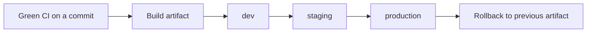
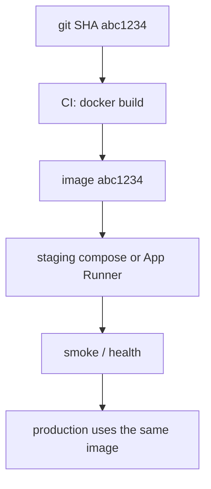

# Month 16 · Week 2 · Day 1
# Artifacts, Environments, and Promotion: Stop Pulling Git on the Server

**Program:** Full-Stack Mastery · 18 months  
**Phase:** 5 — Production engineering  
**Month index:** [../../README.md](../../README.md)  
**Week 2:** Day 1 (today) · [2](day-02.md) · [3](day-03.md) · [4](day-04.md) · [5](day-05.md) · [6](day-06.md) · [7](day-07.md)  
**Week rhythm today:** Learn + type-along  
**Student state:** Week 1’s gate is true enough to continue: a PR can run lint, tests, and a build on GitHub. Today you learn what **continuous delivery** is allowed to move — and why `git pull` on a box is not it.  
**Study time:** 3–4 focused hours

**This week covers:** artifacts vs snowflake servers, environments, promotion, image tags and digests, GHCR, expand/contract migrations, secrets, rollback rehearsal, a failed-release playbook.

Today: **artifact** versus **git pull on the server**; **dev / staging / production**; **promotion**. You will not paste Project 7. You will not need Kubernetes. Day 2 builds images.

Labs: `~\fullstack-lab\month-16\week-02\day-01\`. Product deploy config stays in **your** repos.

---

## How to use this textbook

1. Read a section. Close it. Say what would roll back if tonight’s release were wrong.  
2. Type the promotion table. Do not paste a “CD maturity model” from a vendor.  
3. Optional review links are for later rechecking.

---

## How to read this chapter

**Continuous integration** asks: may this change join `main`?  
**Continuous delivery / deployment** asks: may a **known package** of that `main` (or a release commit) run in an **environment**?

The package is an **artifact**: a container image, a tarball, a built frontend directory you **keep**. The environment is a **named place** with its own config: `dev`, `staging`, `production`.



**Wrong belief:** “I SSH in and `git pull && docker compose up -d`. That is CD.”  
**Correct:** that is a **snowflake**. The server compiles, fetches, and hopes. Two boxes will drift. Rollback means “remember which commit I pulled.” CD means a **byte-identical artifact** you already built in CI moves through environments.

**Wrong belief:** “CD means every green `main` goes to production with no person.”  
**Correct:** **continuous delivery** means production **could** be one click (or one merge) because the artifact is always ready. **Continuous deployment** means the click is automated. This course requires **repeatable** promotion and a rollback you have practiced. It does not require you to auto-deploy every commit on day one. Staging first is wisdom, not cowardice.

---

## Today's contract

By the end of this day you will be able to:

1. Define **artifact**, **environment**, **promotion**, and **snowflake server**.  
2. Explain why CI green is necessary and **not** sufficient for a production release.  
3. Draw a three-environment path for **your** Project 7 (names and URLs you invent or already have — fill **your** hostnames, not a textbook domain).  
4. Say what rollback targets (the previous **artifact**), not “yesterday’s vibe.”

**Today's gate.** Closed-book:

> CD moves a known artifact through named environments with different config. `git pull` on production is not CD. Green CI means the commit is eligible to *build* that artifact. Promotion is a deliberate step. Rollback is the previous artifact, not a frantic commit.

---

## Time box

| Block | Minutes | Work |
|---|---|---|
| A | 55 | Theory |
| B | 55 | Type-along: PROMOTION.md + a fake release ledger |
| C | 70 | Independent: map *your* product environments |
| D | 15 | Git |
| E | 15 | Recall |

---

# Block A — Theory

## 1. Why `git pull` feels productive and still fails

SSH into a box. The product “is the repo.” You pull, install, restart. It worked in 2014 for a blog. For a full-stack app with Postgres, Redis, a worker, and a frontend build, it fails in boring ways:

- The server’s Node version is not the runner’s.  
- `npm install` (not `ci`) floats a patch.  
- You forget `alembic upgrade`.  
- You pull **and** have uncommitted edits on the server (a file you “just tweaked”).  
- Two instances pull at different seconds.

Month 15 taught Compose as a **rehearsal**. Rehearsal is not “the same git remote on a bigger laptop.”

**Wrong belief:** “If I only pull tags, it is CD.”  
**Correct:** a git tag names a **commit**. An artifact names **bytes that were built**. You still need to **build** somewhere. Prefer: CI builds once; environments **pull the image** (Day 2).

## 2. What an artifact is

An artifact is a **file or image** produced from a commit, stored in a registry or GitHub Artifacts, **immutable** once published (practically: you do not overwrite the same name with different bytes).

| Kind | Example | Good for |
|---|---|---|
| Container image | `ghcr.io/you/api:abc1234` | API, worker, even nginx SPA |
| Frontend zip / `dist` | `web-dist-abc1234.tgz` | Static hosting later |
| Wheel | `app-1.2.3-py3-none-any.whl` | Less common for this course |

Week 1’s uploaded `junit.xml` is an artifact in the GitHub sense. It is **not** what you promote to production.

Immutability preview (Day 2 completes it): a **tag** that always means “latest” is a moving name. A **digest** (`sha256:…`) is the bytes. Promote **digests** or **git-SHA tags you never retag**.

## 3. Environments

An **environment** is not a vibe. It is:

1. A **name** (`dev`, `staging`, `production`).  
2. **Config** (database URL, cookie domain, log level, feature flags).  
3. **People rules** (who may promote).  
4. **Data** (production data is sacred; staging is similar-shaped and **not** a copy of real users unless you have a scrubbed process — this course prefers **synthetic** staging data).

| | dev | staging | production |
|---|---|---|---|
| Who breaks it | You, daily | The release candidate | Customers |
| Data | Disposable | Fake / scrubbed | Real |
| Secrets | Dev keys | Staging keys | Prod keys — never mixed |
| Promote from | Your laptop / CI | Artifact that passed staging checks | Artifact that passed staging |

**Wrong belief:** “Staging is production with `DEBUG=true`.”  
**Correct:** staging should resemble production **shape** (HTTPS, migrations, same image) with **different** secrets and data. Debug true in production is a different sin.

GitHub **Environments** (Settings → Environments) can require reviewers before a deploy job. That is a **promotion lock**. Use it when you have a second person; solo, still keep **two** AWS accounts or at least two stacks so you cannot “accidentally prod.”

## 4. Promotion

**Promotion** means: the **same artifact** that ran in staging is what production will run. You do **not** rebuild for production with “one extra flag” if that produces **different bytes**.



If production builds **again**, you have two artifacts and you will never know which one you tested.

**Wrong belief:** “I’ll rebuild on the server so it uses the server’s CPU architecture.”  
**Correct:** then build **in CI** for that architecture (`linux/amd64` on GitHub-hosted Ubuntu is the usual). Do not make production a compiler.

## 5. Config is not in the artifact (usually)

The **image** contains code. **Environment variables** and secrets contain config. The same image runs in staging and production with different `DATABASE_URL` values.

If you bake production URLs into the image, you cannot promote the same image. If you bake **no** config, you must inject it at **run** (Compose `env_file`, App Runner env, ECS task def). Week 2 Day 5 treats secrets. Today: **names** of variables, not values.

`.env` on the server that you edit by hand is a cousin of `git pull`. Prefer a secrets manager or platform env, documented, rotated.

## 6. Rollback is a promotion in reverse

Rollback: point the environment at the **previous artifact**. If you only have “whatever is on disk after pull,” rollback is archaeology.

Limits: a **forward** migration that destroyed a column may not reverse by switching images. Day 4 and Day 6 treat that honestly. Today you still **name** rollback as “previous image,” not “I’ll think of something.”

## 7. How this attaches to Project 7

Project 7 already asked for repeatable deployment, environment-specific config, secrets, migrations, rollback. This week gives the **vocabulary** and small labs. Week 4 runs it on **your** app (or an honest staging Compose plus AWS mapping if the account does not exist).

Kubernetes: still optional. Promotion does not require a cluster. Compose on one VM **can** be CD if the VM runs **images you built in CI**, not a git working tree.

## 8. Worked stories

**Story A.** Green CI. Engineer SSHs and pulls. Staging was never updated. Production runs an untested migrate.  
**Failure:** no promotion. Artifact never existed.

**Story B.** CI builds image `:latest` every time and overwrites. Rollback pulls `:latest` again — still broken.  
**Failure:** mutable tag (Day 2).

**Story C.** Staging runs image `abc1234`. Production **rebuilds** from the same git SHA with a different Dockerfile line someone edited on the server.  
**Failure:** not the same artifact.

**Story D.** Production `.env` still has staging `DATABASE_URL`.  
**Failure:** environment mixup (Week 2 Day 7). Config is part of the release.

## 9. What you will not do today

- You will not push to GHCR yet (Day 2).  
- You will not run Alembic in a deploy job yet (Day 4).  
- You will not open AWS yet (Week 3).  
- You will not paste product Dockerfiles into fullstack-lab as if they were the textbook.

## 10. Say it — closed-book drill

Artifact vs git tree; three environments; promotion of **same** bytes; why rebuild on the server breaks the story; rollback target.

---

# Block B — Type-along

```powershell
cd ~\fullstack-lab
mkdir month-16\week-02\day-01 -Force
cd ~\fullstack-lab\month-16\week-02\day-01
```

Write `SNOWFLAKE.md` (15–25 lines): a first-person story of `git pull` on a server going wrong. Include Node/Python drift **or** a forgotten migrate. This is fiction based on theory, not an exploit.

Write `LEDGER.md` — a fake release ledger you will keep filling this week:

| Release | Git SHA (fake 7 chars) | Artifact id | Env | Result |
|---|---|---|---|---|
| 1 | a1b2c3d | image:a1b2c3d | staging | healthy |
| 2 | a1b2c3d | image:a1b2c3d | production | (you decide) |
| 3 | e4e5e6f | image:e4e5e6f | staging | health fail |
| 4 | *(rollback)* | image:a1b2c3d | production | |

Fill the blank rows in your words. Release 3 must **not** promote.

Write `PROMOTION.md`:

1. Definition of artifact.  
2. Why CI green ≠ production.  
3. Rules: never overwrite a SHA tag; never promote a failed staging smoke; never use prod secrets in staging.  
4. Mermaid or ASCII of **your** intended path.

Write `WINDOWS.txt`: you will `docker` from PowerShell locally this week; the **build in CI** still runs on Linux. `curl.exe` to hit a **local** health endpoint later, not to attack anything.

---

# Block C — Independent

Open **your** Project 7. Do not copy source.

Write `MY-ENVIRONMENTS.md`:

1. **dev** — how you run today (Compose on Windows/WSL). URL if any (`localhost` is allowed here).  
2. **staging** — planned hostname **you** will own (even if it is `staging.example.test` as a placeholder you will replace in Week 4).  
3. **production** — planned hostname. If you have none, write `TBD` and that localhost is **not** production (Month 16 README).  
4. **Config names** — five env vars (no values): database, secret key, frontend origin, cookie flags, log level.  
5. **Promote rule** — one sentence: same image digest.  
6. **Rollback rule** — previous image; migrations TBD Day 4.  
7. **Not Kubernetes** — one sentence.

If AWS does not exist yet, staging may be “Compose on a VPS I will rent” or “Compose on this PC labeled staging.” Honesty beats a fake Route 53 paragraph.

---

# Block D — Git

```powershell
cd ~\fullstack-lab
git add month-16
git commit -m "Month 16 Week 2 Day 1: artifact promotion model and environment map."
```

---

# Block E — Recall

1. Snowflake vs artifact.  
2. Delivery vs deployment (one sentence each).  
3. Why rebuild on prod breaks promotion.  
4. What rollback points at.  
5. Why staging data should not be real users.

## Office hours

**“I only have one machine.”** Then **names** still exist: Compose project `staging` vs `prod` files, different `.env` names, never mix. Week 3 will still teach AWS as the real split.

**“Compose is CD if I pull images.”** Yes **if** the compose file pins a digest/SHA tag from CI. Compose that builds on the server is a snowflake with YAML.

**“Is a wheel an artifact?”** Yes. This course still prefers **images** because Month 15 already containerized you.

---

## Definition of done

- [ ] `SNOWFLAKE.md` and `LEDGER.md` exist  
- [ ] `PROMOTION.md` states same-bytes promotion  
- [ ] `MY-ENVIRONMENTS.md` uses *your* names without secrets  
- [ ] Gate paragraph speakable closed-book  
- [ ] Commit exists  

---

## Optional review links

The promotion model is explained in this chapter.

- [Maria Santos: Continuous Delivery](https://martinfowler.com/bliki/ContinuousDelivery.html)  
- [GitHub: Deploying with GitHub Actions](https://docs.github.com/en/actions/use-cases-and-examples/deploying)  
- [GitHub: Using environments for deployment](https://docs.github.com/en/actions/how-tos/write-workflows/choose-when-workflows-run/use-environments-in-workflows)  

---

## Tomorrow

**Images** — tag with git SHA, digest immutability, GHCR (or similar), build in CI. The artifact becomes real.
