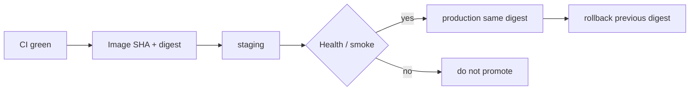

# Month 16 · Week 2 · Day 3
# From Memory: Promotion, Rollback, and the Image Ledger

**Program:** Full-Stack Mastery · 18 months  
**Phase:** 5 — Production engineering  
**Month index:** [../../README.md](../../README.md)  
**Week 2:** [1](day-01.md) · [2](day-02.md) · Day 3 (today) · [4](day-04.md) · [5](day-05.md) · [6](day-06.md) · [7](day-07.md)  
**Week rhythm today:** Implement from memory  
**Student state:** Day 2 gate passed. You have tagged an image. Today promotion and rollback must still live in your head — from **this file**.  
**Study time:** 3–4 focused hours  
**Prereq:** Day 2 gate passed.

Labs: `~\fullstack-lab\month-16\week-02\day-03\`. Days 1–2 stay **closed** during the drills. Do not paste Project 7.

---

## How Day 3 works

Days 1–2 stay closed. This recap is the teacher.

Allowed: this file; your fullstack-lab notes (not Day 1–2 textbook); docker output you produce today.

Not allowed: pasting a promotion diagram from AI; opening Day 1–2 during Blocks 1–3; vendor “golden path” blogs as the teacher.

Stuck more than 25 minutes: open **only** the matching Day 1 or Day 2 section, close it, continue. Record `lookups.txt`.

No answer key in the first half. Commit `PROMOTE.md` before the worked box.

---

## How to read this chapter

CD moves **bytes you already built**, not a git working tree on a server.



**Wrong belief:** “Memory day means I keep Day 2 on a second monitor.”  
**Correct:** the recap below is enough.

---

## Complete explanation (CD you must still own)

**Artifact.** A container image (this course) or a tarball. Built **once** in CI on Linux (`ubuntu-latest`). Not `git pull` on production. Not a pip install on the box as the release process.

**Tag.** Name: prefer **git SHA**. Never retag a SHA to different bytes. `:latest` is a moving sticker. Rollback of `:latest` is still `:latest`.

**Digest.** `sha256:…` of the image config/bytes. Immutable id. Promote **this**. Rebuilding the same SHA on the server can produce a **different** digest if the base image moved.

**Registry.** GHCR (`ghcr.io`) or similar (ECR). Login with platform tokens, not passwords in git. `GITHUB_TOKEN` + `packages: write` is a pattern, not a value you paste into a textbook.

**Environments.** `dev` (disposable), `staging` (production-shaped, fake data), `production` (real users). Different secrets. Staging is not production with `DEBUG=true` as the only difference.

**Promotion.** The **same** digest that passed staging smoke goes to production. You do not rebuild “for prod.” GitHub Environments can add approvals. Solo: still keep separate config.

**Snowflake.** SSH + `git pull` + compose build on the server. Drift. Hidden edits. No ledger.

**Rollback.** Point the platform at the **previous digest**. Limits: database migrations that cannot reverse — Day 4. Today you still **name** the previous image.

**CI vs CD.** Green PR means eligible to merge and **eligible to build**. It does not mean customers have the bits.

**Windows.** PowerShell and `curl.exe` locally. YAML `run:` is bash. Docker Desktop can build; CI is still the official build.

**Kubernetes.** Optional. Not required to promote an image to Compose, App Runner, or ECS.

**Secrets.** Not in the Dockerfile. Not in git. Day 5.

**Wrong belief:** “PR builds tagged as production SHA.”  
**Correct:** production images from `main` (or a release tag). PR may build to prove Docker.

**Wrong belief:** “Same git SHA means same digest always.”  
**Correct:** only if you run the **already pushed** image, not a fresh build against a moving base.

---

## Today's contract

1. Draw promotion and rollback from memory.  
2. Fill a ledger with SHA, tag, digest, environment, result.  
3. Classify five release stories.  
4. Rebuild a tiny Dockerfile from the recap (health JSON), not from Day 2’s file.

**Today's gate.** Closed-book:

> I promote a digest that already ran in staging. I roll back to the previous digest. I do not git pull production. I do not trust `:latest`.

---

## Time box

| Block | Minutes | Work |
|---|---|---|
| 1 | 25 | Speak; `exam-01.md` |
| 2 | 50 | `PROMOTE.md` diagram + rules |
| 3 | 45 | Mini image from memory |
| 4 | 30 | Debug A–E on paper |
| 5 | 20 | Worked box; `DIFF.md` |
| 6 | 20 | Project 7 names only |
| 7 | 15 | Retro |

---

# Block 1 — Speak

No Day 1–2 textbook. Cover: snowflake vs artifact; three environments; SHA tag; digest; same-bytes promotion; rollback; Linux CI build. Write `exam-01.md` (12–20 lines).

```powershell
cd ~\fullstack-lab
mkdir month-16\week-02\day-03 -Force
cd ~\fullstack-lab\month-16\week-02\day-03
```

---

# Block 2 — Draw and write

`PROMOTE.md` must include:

1. A mermaid or ASCII flowchart: CI → image → staging → smoke → production.  
2. A rollback arrow to a **previous** digest.  
3. Five rules in your words (SHA tags, no retag, no prod rebuild, no `:latest` as process, no git pull).  
4. Where config lives (runtime env), not in the image.

`LEDGER.md` — four rows you invent:

| id | git SHA | tag | digest (fake but well-formed idea) | env | smoke | action |
|---|---|---|---|---|---|---|

One row must be a **failed** staging smoke that is **not** promoted. One row must be a **rollback**.

---

# Block 3 — Mini-build from memory

Domain: **cafeteria tray health**, not Project 7.

`app.py`: GET returns JSON `{"ok": true, "service": "trays"}`.  
`Dockerfile`: `python:3.12-slim`, non-root, `CMD python app.py`, port 8000.  
`.dockerignore`: `.git`.

```powershell
docker build -t trays-health:memory .
```

If Docker is unavailable, type the files and write `NO-DOCKER.txt`. Still complete PROMOTE.md.

`WHY-SHA.txt`: one sentence — the tag `memory` is a lab sticker, not a release id.

---

# Block 4 — Debug

`DEBUG.md` — wrong story, correct story, why.

**A.** “Production does `git pull && docker compose build` so it matches git.”  
**B.** “We rolled back by deploying `:latest`.”  
**C.** “Staging passed on image `a1b2c3d`. Production rebuilt `a1b2c3d` overnight.”  
**D.** “The Dockerfile `ENV DATABASE_URL=postgresql://…` is convenient.”  
**E.** “Kubernetes is required to have environments.”  

---

# Block 5 — Worked box (after PROMOTE.md exists)

Compare. `DIFF.md` or `MATCH.txt`.

**Promotion shape:** build once → push SHA tag → record digest → deploy digest to staging → smoke → deploy **that digest** to production.

**Rollback shape:** production service/compose image line points at **previous digest**.

**A.** Snowflake; promote the CI image.  
**B.** `:latest` moved; pin SHA/digest.  
**C.** Rebuild can change bytes; promote the already pushed digest.  
**D.** Secret in image and git history; runtime env / secrets manager.  
**E.** Environments are names + config; Compose and App Runner suffice.

---

# Block 6 — Design

`DESIGN.md` (10–15 lines): **your** registry choice (GHCR or ECR); where staging will pull from; who is allowed to promote; Kubernetes still optional.

No product source.

---

# Block 7 — Retro

`retro.md`: whether you still want to SSH-pull; what Day 4 must add about migrations.

```powershell
cd ~\fullstack-lab
git add month-16
git commit -m "Month 16 Day 3: promotion diagram and rollback ledger from memory."
```

---

## Office hours

**Digest too long to type.** Store it in the ledger file; Compose can use tag **if** you never retag SHA. Digest is the exam answer.

**No second environment.** Two Compose projects on one machine still need two **config** files. Do not share `.env`.

---

## Definition of done

- [ ] `PROMOTE.md` committed before the worked box  
- [ ] Ledger has a failed smoke and a rollback  
- [ ] Mini Dockerfile typed  
- [ ] `DEBUG.md` A–E attempted  
- [ ] Commit exists  

---

## Optional review links

Repair from this recap first.

- [GitHub Container Registry](https://docs.github.com/en/packages/working-with-a-github-packages-registry/working-with-the-container-registry)  

---

# Lecture: how to read a release story

When a prompt says “we deployed main,” ask **which digest**. When it says “we rolled back the commit,” ask whether the **database** moved (Day 4). When it says “Compose on the server,” ask whether Compose **builds** or **pulls**.

Write `HEURISTIC.md` (six lines): your questions before every promote. Then Block 5 if you have not.

---

## Tomorrow

**Lab:** migrations during deploy — expand/contract, never `create_all` in production, a job that runs Alembic then starts the API.
