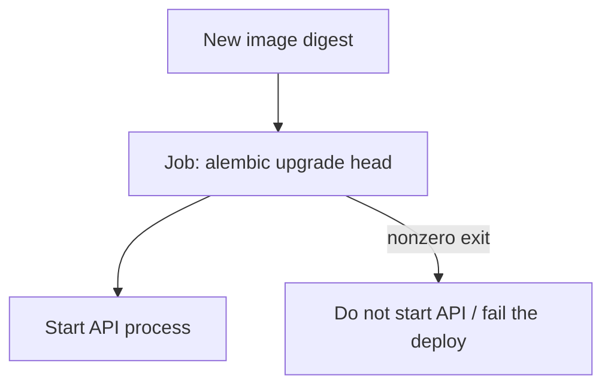
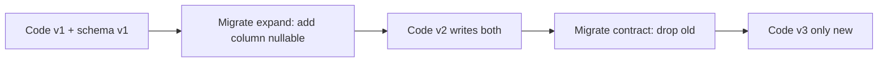

# Month 16 · Week 2 · Day 4
# Lab: Migrations in Deploy — Expand/Contract, Then Start the API

**Program:** Full-Stack Mastery · 18 months  
**Phase:** 5 — Production engineering  
**Month index:** [../../README.md](../../README.md)  
**Week 2:** [1](day-01.md) · [2](day-02.md) · [3](day-03.md) · Day 4 (today) · [5](day-05.md) · [6](day-06.md) · [7](day-07.md)  
**Week rhythm today:** Lab (type-along + independent)  
**Student state:** You can promote an image from memory. Today the database **schema** is part of the release — on purpose, not as `create_all` at import time.  
**Study time:** 3–4 focused hours

Labs: `~\fullstack-lab\month-16\week-02\day-04\`. Tiny Alembic gym. Do **not** paste Project 7 models. Do **not** point this lab at production RDS.

---

## How to use this textbook

1. Read expand/contract until you can give an example with a column add.  
2. Type a tiny app whose **start command** is not the migrate command.  
3. Predict what happens if migrate fails. Write it before you run.  
4. Optional review links are for later rechecking.

---

## How to read this chapter

A release that only replaces a container but leaves schema behind will 500. A release that only migrates but runs old code may also 500. You need a **deliberate order** and a **compatible window**.



**Wrong belief:** “SQLAlchemy `Base.metadata.create_all()` on startup is fine in production.”  
**Correct:** `create_all` does not replace Alembic. It will not alter columns the way your revision files do. It teaches the API to **invent schema** as a side effect of booting — unreviewable, unreversible, easy to run as the wrong user. Month 11 already chose Alembic. Production uses **`alembic upgrade head` as a step**.

**Wrong belief:** “I’ll SSH in and run migrate when I remember.”  
**Correct:** that is a snowflake cousin of `git pull`. The deploy job runs migrate with the **same image** that is about to serve traffic (same Alembic revisions).

---

## Today's contract

1. Explain **expand/contract** with one column example.  
2. Refuse `create_all` as a production migrate story.  
3. Type a lab where a script runs `alembic upgrade head`, then starts a tiny API — **two commands**, one wrapper.  
4. Show a failed migrate that **does not** boot the API.  
5. Write what rollback of **code** does not undo.

**Today's gate.** Closed-book:

> Production schema changes are Alembic revisions run as a deploy step, then the API starts. I do not `create_all` in production. Expand/contract keeps old and new code compatible. Rolling back an image does not magically roll back a destructive migration.

---

## Time box

| Block | Minutes | Work |
|---|---|---|
| A | 50 | Theory |
| B | 80 | Type-along: Alembic + wrapper script + Compose-shaped run |
| C | 50 | Independent: failed migrate; ROLLBACK-DB.md |
| D | 15 | Git |
| E | 15 | Recall |

---

# Block A — Theory

## 1. Why boot-time `create_all` is a trap

`create_all` creates **missing tables**. It does not:

- rename a column,  
- add a constraint in a controlled way,  
- stamp revision history,  
- stop two instances from racing.

If production has data, you need **migrations**. If you “only use create_all in empty labs,” students copy it into `lifespan`. This lab’s API **must not** call `create_all` on startup. Tests yesterday were allowed a fixture. Production is not a fixture.

## 2. Expand / contract (the idea)

You cannot always switch **code and schema** in one instant when two instances (or a rollback) still run.

**Expand (additive, compatible with old code):**

- Add a **nullable** column, or a new table.  
- Deploy code that **writes** the new column and still **reads** the old place if needed.  
- Backfill.

**Contract (after old code is gone):**

- Stop reading the old column.  
- Drop it in a later revision.  
- Deploy that later image.

**Dangerous middle:** rename a column in one revision while old instances still `SELECT` the old name. Old image + new schema = 500. New image + old schema = 500.



**Wrong belief:** “I’ll downtime the site for every column add.”  
**Correct:** small additive migrations plus a short window is the default. True downtime is for operations you cannot make compatible — and you **announce** it. This course still wants the **habit** of additive first.

You will not perform a live zero-downtime ballet on AWS today. You will **write** the sequence and practice migrate-then-start locally.

## 3. Order of operations in a deploy

Recommended pattern for this course (one API service):

1. Take a backup story seriously (Week 3 RDS snapshots conceptually; locally: you accept lab data is disposable).  
2. Run **`alembic upgrade head`** using the **new** image (it contains the revision files).  
3. If migrate **fails**, **stop**. Do not start the new API.  
4. If migrate **succeeds**, start (or restart) the API on the new image.  
5. Healthcheck the API (Month 15 `/health`).  

Multiple API replicas: migrate **once** (a job), then roll instances. Two replicas both running `upgrade` can work if Alembic locking is understood — still prefer **one migrate job**.

Kubernetes Jobs are optional. A Compose `migrate` service with `depends_on` + a script is enough. A shell wrapper is enough.

## 4. The wrapper (pattern)

Never: `CMD alembic upgrade head && uvicorn` **without thinking about failure**. `&&` is actually a reasonable **minimal** pattern **if** Alembic non-zero exit stops Uvicorn. Write it **explicitly**:

```text
set -e
alembic upgrade head
exec uvicorn app:app --host 0.0.0.0 --port 8000
```

`set -e` and `exec` are **Linux**. In the container that is correct. On Windows you may run the two commands **yourself** in PowerShell for the gym:

```powershell
alembic upgrade head
if ($LASTEXITCODE -ne 0) { exit $LASTEXITCODE }
# then start API
```

Do not put PowerShell in the Dockerfile `CMD` if the image is Linux (it is).

**Wrong belief:** “Migrate in a background thread while serving 500s.”  
**Correct:** fail the deploy.

## 5. Rollback and migrations

If you **expand** (add nullable column) and then roll back the **image**, old code usually **ignores** the extra column. Safe-ish.

If you **contract** (drop column) and then roll back the image, old code **selects a missing column**. Disaster.

If you `DROP TABLE`, rolling back the image will not resurrect data. **Backups** (Week 3) are the answer, not Docker tags.

Day 6’s `ROLLBACK.md` must include this paragraph. Start it today as `ROLLBACK-DB.md`.

## 6. Connection strings

Migrate and API should use the **same** `DATABASE_URL` for that environment. A migrate job that hits staging while the API hits production is a Day 7 defect.

Least privilege: a dedicated migrate role is a professional extra; not required this month if you can still **explain** why the API user maybe should not `DROP TABLE` in production. Do not practice attacking RDS.

## 7. What this lab is not

Not Project 7’s full schema. Not a load test. Not Kubernetes `initContainers` (optional reading later). Not `Base.metadata.drop_all`.

---

# Block B — Type-along

```powershell
cd ~\fullstack-lab
mkdir month-16\week-02\day-04 -Force
cd ~\fullstack-lab\month-16\week-02\day-04
uv init --name lab-migrate-then-start
uv add fastapi sqlalchemy alembic psycopg
uv add --dev pytest httpx
```

You may use **SQLite** for the gym if Postgres is heavy today — Alembic still runs. Prefer Postgres if Docker is already up (Day 4 Week 1 habits). Document the choice in `ENGINE.txt`.

**Domain:** cafeteria **tray** records: `id`, `label` unique.

Type:

- SQLAlchemy model `Tray`  
- Alembic `env.py` reading `DATABASE_URL`  
- Revision 1: create `trays`  
- FastAPI `POST /trays` 201, `GET /trays/{id}` 404  
- **No** `create_all` in the app module  

`start.sh` (Linux / container):

```bash
#!/bin/sh
set -e
alembic upgrade head
exec python -c "import uvicorn; uvicorn.run('app:app', host='0.0.0.0', port=8000)"
```

If you stay on Windows without WSL for the process: `migrate-then-start.ps1` that runs alembic, checks `$LASTEXITCODE`, then uvicorn. The **idea** is the same. The production image still uses `start.sh`.

Prove migrate:

```powershell
$env:DATABASE_URL = "sqlite:///./lab.db"
uv run alembic upgrade head
uv run pytest -q
```

Write `PREDICT.txt`: if you delete the revision file after a database already migrated, what fails? (Do not need to do that to production.)

Add a **second** revision that adds nullable `note` (expand). Upgrade. Old GET still works without selecting `note` if v1 code did not need it — in this tiny app, v2 can return `note`.

Write `EXPAND.md`: why `note` is nullable on add.

Compose **pattern** (optional type-along `compose.yml` — lab names only):

```yaml
services:
  api:
    build: .
    command: ["sh", "/app/start.sh"]
    environment:
      DATABASE_URL: sqlite:////data/lab.db
```

SQLite in Compose is a gym. Project 7 uses Postgres. Do not copy SQLite into production.

---

# Block C — Independent

**Failed migrate:** create revision 3 that executes invalid SQL (for example `ALTER TABLE trays ADD COLUMN` a duplicate name). Run upgrade. Confirm non-zero exit. Confirm you **do not** start uvicorn. Capture the error in `FAIL-MIGRATE.txt` (no secrets). Then `alembic downgrade` or delete the bad revision **in the lab only** so the folder is healthy. Never “fix” production by deleting `alembic_version` rows as a lifestyle.

Write `ROLLBACK-DB.md`:

1. Expand then roll back image — likely OK.  
2. Contract then roll back image — not OK.  
3. What a snapshot is for (preview Week 3).  
4. `create_all` is not the rollback tool.

Write `PROD-CHECKLIST.txt` (eight lines) for Project 7: migrate job, then start, health, who runs it (CI CD or platform).

---

# Block D — Git

```powershell
cd ~\fullstack-lab
git add month-16
git commit -m "Month 16 Day 4: migrate-then-start lab and expand/contract notes."
```

Do not commit `lab.db` if you can gitignore it.

---

# Block E — Recall

1. Why not `create_all` in production.  
2. Expand vs contract.  
3. Order: migrate, then API.  
4. Failed migrate: start or stop?  
5. Image rollback vs schema rollback.

## Office hours

**Alembic `Can't locate revision`.** The database stamp does not match files. Lab: empty SQLite and retry. Production: do not guess; restore from backup if you destroyed history.

**Two start.sh copies.** Windows ps1 is for the laptop. Linux sh is for the image.

**`exec`.** Replaces the shell with uvicorn so signals reach the server (Month 15 process idea).

**Running migrate on every replica.** Prefer one job.

---

## Definition of done

- [ ] App does not `create_all` on boot  
- [ ] `alembic upgrade head` then start is a typed wrapper  
- [ ] Expand revision (nullable column) documented  
- [ ] Failed migrate recorded; API not started  
- [ ] `ROLLBACK-DB.md` exists  
- [ ] Commit exists  

---

## Optional review links

- [Alembic tutorial](https://alembic.sqlalchemy.org/en/latest/tutorial.html)  
- [Expand/contract (Maria Santos / parallel change)](https://martinfowler.com/bliki/ParallelChange.html)  

---

## Tomorrow

**Secrets** — Actions secrets, OIDC-to-cloud as a concept, `.env.example` vs `.env`, rotation.
