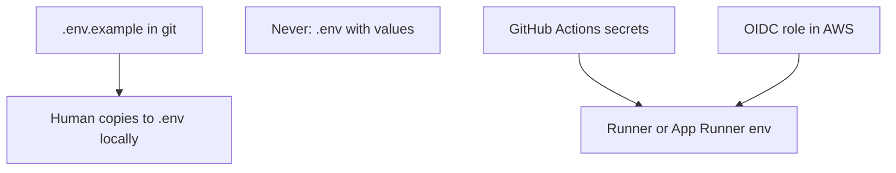

# Month 16 · Week 2 · Day 5
# Secrets in CI/CD: Names in Git, Values in the Platform

**Program:** Full-Stack Mastery · 18 months  
**Phase:** 5 — Production engineering  
**Month index:** [../../README.md](../../README.md)  
**Week 2:** [1](day-01.md) · [2](day-02.md) · [3](day-03.md) · [4](day-04.md) · Day 5 (today) · [6](day-06.md) · [7](day-07.md)  
**Week rhythm today:** Tests / docs (plus a tiny leak drill on a **lab** secret you invent)  
**Student state:** You can migrate then start. Today you stop putting **values** in git.  
**Study time:** 3–4 focused hours

Labs: `~\fullstack-lab\month-16\week-02\day-05\`. Do not paste Project 7 `.env`. Do not commit real tokens. Defense only: you will **prevent** leaks, not exploit other systems.

---

## How to use this textbook

1. Read `.env.example` vs `.env` vs Actions secrets vs OIDC until you can teach the split.  
2. Type example files with **fake** values clearly marked `not-a-real-secret`.  
3. Optional review links are for later rechecking.

---

## How to read this chapter

Git stores **what the program needs**. The platform stores **the values**.



**Wrong belief:** “Private repo means I can commit `.env`.”  
**Correct:** clones, forks, CI logs, screenshots, and future public history will still leak. Private is not a cryptographic control.

**Wrong belief:** “I’ll echo the secret in the Actions log to debug.”  
**Correct:** GitHub redacts some patterns; it does not save you. Debug with **names** and **lengths**, not values.

---

## Today's contract

1. Keep `.env` gitignored; commit `.env.example` with empty or dummy values.  
2. Explain **Actions secrets** (`secrets.NAME` in YAML — the value lives in Settings).  
3. Explain **OIDC to cloud** as “the job proves it is GitHub, AWS gives a short-lived role” — no long-lived access key in git.  
4. Write a **rotation** paragraph: revoke, replace, redeploy.  
5. `SECRETS.md` for Project 7: **names only**.

**Today's gate.** Closed-book:

> Values never live in git. `.env.example` documents names. Actions secrets and cloud secret stores inject at run. OIDC avoids long-lived keys in GitHub when I can use it. Rotation means the old value dies.

---

## Time box

| Block | Minutes | Work |
|---|---|---|
| A | 50 | Theory |
| B | 50 | Type-along: gitignore, example env, fake workflow snippet |
| C | 60 | Docs: inventory, rotation, leak drill |
| D | 15 | Git |
| E | 15 | Recall |

---

# Block A — Theory

## 1. Three files students mix up

| File | In git? | Contains |
|---|---|---|
| `.env` | **No** | Real local values |
| `.env.example` | **Yes** | Names, dummy values, comments |
| `.env.production` on a laptop | **No** | Temptation; use the platform instead |

If your framework needs `ENV=production`, that **word** can be in Compose. The **database password** cannot.

## 2. GitHub Actions secrets

Repository Settings → Secrets and variables → Actions.

YAML:

```yaml
env:
  DATABASE_URL: ${{ secrets.STAGING_DATABASE_URL }}
```

The YAML contains the **name**. The UI contains the **value**. Forks often **cannot** read secrets (good). Pull requests from forks should not get production secrets. This course’s CD jobs that deploy should run on `main` or `workflow_dispatch`, not on random PRs.

**Wrong belief:** “I’ll put the secret in `env:` as plaintext because it is staging.”  
**Correct:** staging passwords still get reused by tired humans.

Organization secrets exist. Least privilege: the **smallest** repo that needs them.

`GITHUB_TOKEN` is minted per job. Still do not echo it.

## 3. OIDC to AWS (concept)

Old shape: create an IAM **access key**, paste `AWS_ACCESS_KEY_ID` into GitHub. The key lives until someone remembers to rotate. A leaked key in a log is a bad week.

**OIDC:** GitHub presents a signed token saying “this job, this repo, this branch.” AWS **IAM role** trusts that identity. The job receives **temporary** credentials. No long-lived key in GitHub.

You do **not** need to finish the AWS role today (Week 3). You must **name** the pattern and prefer it when you attach CD to AWS.

**Wrong belief:** “OIDC means I can skip IAM.”  
**Correct:** you still write a role with **least privilege** (Week 3). OIDC is how the job **assumes** the role.

## 4. Runtime vs build

Build-time `ARG`/`ENV` in Docker can **bake** a secret into a layer. Anyone who pulls the image may extract it. Inject at **run**: Compose `environment`, App Runner env, ECS secrets from SSM / Secrets Manager.

Frontend: `VITE_*` variables are **not secrets**. They ship to the browser. Do not put a private API master key in `VITE_`.

## 5. Rotation

Rotation is a **process**, not a feeling:

1. Create the new value in the provider (RDS password, HMAC secret, GitHub secret).  
2. Deploy config that uses the new value (or dual-accept if the app supports it).  
3. **Invalidate** the old value.  
4. Watch auth failures; roll back **config** if you swapped wrong (Day 6).  
5. Record the date in a runbook — not the value.

If a secret **leaked** (committed, logged, screenshot): treat it as **public**. Rotate immediately. `git revert` does not un-leak. History still has it. Force-pushing is not a complete fix; assume copies exist.

This course: if you accidentally commit a **real** token, rotate it, then you may `git filter` later — do not practice rewriting `main` casually. Prefer **revoking** first.

## 6. Least privilege (preview)

A GitHub secret that is the **production** DB URL should not be available to a job that only lints. Split workflows: `ci.yml` needs a **test** DB (service container password is lab-grade). `deploy.yml` needs staging/prod secrets and should not run on untrusted PRs.

## 7. Defense, not offense

You will not write credential-stuffing scripts, steal tokens, or scan GitHub for other people’s keys. If you find **your** key in a log, you rotate **your** key.

---

# Block B — Type-along

```powershell
cd ~\fullstack-lab
mkdir month-16\week-02\day-05 -Force
cd ~\fullstack-lab\month-16\week-02\day-05
```

Create `.gitignore` containing `.env`.

Create `.env.example`:

```text
DATABASE_URL=
SECRET_KEY=
# Never put production values in this file.
```

Create `.env` locally with `not-a-real-secret` dummies. Confirm `git status` does **not** list `.env`.

Write `deploy-snippet.yml` (a **fragment** for notes, not a live prod deploy):

```yaml
# Teaching fragment — values come from GitHub secrets, not from this file.
jobs:
  deploy:
    runs-on: ubuntu-latest
    environment: staging
    env:
      DATABASE_URL: ${{ secrets.STAGING_DATABASE_URL }}
    steps:
      - run: echo "Would migrate then start. Not echoing secrets."
```

Write `OIDC.md` (10–15 lines): GitHub job → token → AWS role → temporary creds. Contrast with static keys. No AWS console clicks required today.

---

# Block C — Independent docs

`INVENTORY.md` for **your** Project 7 (names only):

| Secret / config | Where it should live | In git? |
|---|---|---|
| Postgres URL | | |
| Session / JWT secret | | |
| SMTP provider key | | |
| S3 bucket name | name may be in config | |
| S3 access key | prefer OIDC / instance role | |
| `VITE_API_URL` | build env; not a secret | |

`ROTATION.md`: pick **one** named secret (e.g. `SECRET_KEY`). Write the five rotation steps with **your** hosting guess (App Runner env vs Compose on EC2).

`LEAK-DRILL.md`: imagine `SECRET_KEY` was committed. What do you revoke, what do you redeploy, why `git revert` is not enough? Do not include a real key.

`CI-VS-CD.md`: which jobs get **no** prod secrets (lint) vs which might (`deploy` on `main`).

---

# Block D — Git

```powershell
cd ~\fullstack-lab
git add month-16
git commit -m "Month 16 Day 5: secret handling docs; .env gitignored."
```

If `git add` stages `.env`, **stop**. Fix gitignore. Do not commit it.

---

# Block E — Recall

1. `.env` vs `.env.example`.  
2. Why private repos still leak.  
3. OIDC in one sentence.  
4. Why `VITE_` is not a hiding place.  
5. Rotation vs revert.

## Office hours

**Secret in Actions log.** Rotate. Check GitHub’s secret scanning alerts if enabled.

**Need a value on Windows locally.** `.env` + direnv or your existing Month 15 Compose `env_file`. Still gitignored.

**OIDC too abstract.** You may use Actions secrets for AWS keys **temporarily** in Week 4 if OIDC setup blocks you — document it as **debt** and a rotation date. Prefer OIDC.

---

## Definition of done

- [ ] `.env` ignored; `.env.example` committed  
- [ ] `OIDC.md` and `ROTATION.md` exist  
- [ ] Product inventory is names only  
- [ ] No real secrets in git  
- [ ] Commit exists  

---

## Optional review links

- [GitHub: Using secrets in Actions](https://docs.github.com/en/actions/security-for-github-actions/security-guides/using-secrets-in-github-actions)  
- [GitHub: OIDC with AWS](https://docs.github.com/en/actions/how-tos/security-for-github-actions/security-hardening-your-deployments/configuring-openid-connect-in-amazon-web-services)  
- [12-factor config](https://12factor.net/config)  

---

## Tomorrow

**Independent rollback rehearsal** — two image tags locally, switch Compose, write `ROLLBACK.md` including migrations.
