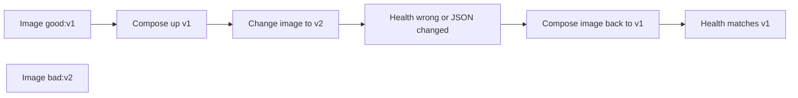

# Month 16 · Week 2 · Day 6
# Independent: Rollback Rehearsal with Two Image Tags

**Program:** Full-Stack Mastery · 18 months  
**Phase:** 5 — Production engineering  
**Month index:** [../../README.md](../../README.md)  
**Week 2:** [1](day-01.md) · [2](day-02.md) · [3](day-03.md) · [4](day-04.md) · [5](day-05.md) · Day 6 (today) · [7](day-07.md)  
**Week rhythm today:** Independent implementation  
**Student state:** You know promotion, SHA tags, migrate-then-start, and secrets. Today you **practice** rollback on a machine you own — two images, Compose switch, written consequences for migrations.  
**Study time:** 3–4 focused hours

Labs: `~\fullstack-lab\month-16\week-02\day-06\`. Not a Project 7 paste. Evidence may cite **your** product compose **paths** only.

---

## How to use this textbook

1. Build two tags of a **tiny** API (or reuse Day 2/4 gym).  
2. Switch Compose from “bad” to “good.”  
3. Write `ROLLBACK.md` that includes **what about the migration**.  
4. Optional review links are for later rechecking.

---

## How to read this chapter

A rollback you have not run is a wish. Tonight you run one.



**Wrong belief:** “I’ll roll back by `git revert` on the server.”  
**Correct:** the server should not have a git checkout as the runtime. Switch the **image**. Revert is for the **repository**, then CI builds a new digest.

**Wrong belief:** “Compose down/up is rollback.”  
**Correct:** only if the compose file (or override) points at the **previous image**. Recreating the same `:latest` is not a rollback.

---

## Today's contract

1. Two local tags: `holds-rollback:v1` and `holds-rollback:v2` (names may be `trays-rollback`).  
2. Compose (or `docker run`) switches from v2 → v1.  
3. `curl.exe` evidence of the JSON or health body changing back.  
4. `ROLLBACK.md` covers **expand** vs **contract** migrations.  
5. `PRODUCT-ROLLBACK.md` for Project 7: steps **you** would type (no source dump).

**Today's gate.** Closed-book:

> I rolled back by running the previous image. I can say when that is safe for the database and when it is not. I did not git pull to undo production.

---

## Time box

| Block | Minutes | Work |
|---|---|---|
| A | 25 | Plan tags and compose file |
| B | 40 | Build v1 and v2; prove both run |
| C | 90 | Switch, roll back, write ROLLBACK.md |
| D | 20 | Product mapping |
| E | 15 | Recall |

---

# Block A — Plan

Write `PLAN.md`:

- v1 JSON body includes `"version": "1"`  
- v2 JSON body includes `"version": "2"` (the “bad” release — maybe you also change health to lie)  
- Compose service name `api`  
- How you will tell them apart with `curl.exe`  
- Database: **none required** for the JSON version switch; migration paragraphs still required in ROLLBACK.md as **theory you own** from Day 4

If Docker Desktop is down, write `BLOCKED.md` and still complete ROLLBACK.md from Day 4 knowledge. The month gate still wants a real rehearsal before Week 4 Day 7.

---

# Block B — Two images

```powershell
cd ~\fullstack-lab
mkdir month-16\week-02\day-06\rehearsal -Force
cd ~\fullstack-lab\month-16\week-02\day-06\rehearsal
```

Type a tiny HTTP app that reads `APP_VERSION` from the environment **or** two slightly different `app.py` files you copy at build time. Prefer **one** Dockerfile and:

```powershell
docker build -t holds-rollback:v1 --build-arg APP_VERSION=1 .
docker build -t holds-rollback:v2 --build-arg APP_VERSION=2 .
```

`ARG`/`ENV APP_VERSION` is not a secret. It is a lab sticker.

`compose.yml`:

```yaml
services:
  api:
    image: holds-rollback:v1
    ports:
      - "8016:8000"
```

```powershell
docker compose up -d
curl.exe http://127.0.0.1:8016/
```

Record bodies in `V1.txt`. Switch the image line to `v2`, `docker compose up -d`, record `V2.txt`.

Windows: `docker compose` (space) is the current plugin. `docker-compose` hyphen may still exist. Use what `docker compose version` shows.

---

# Block C — Rollback and write the book

Change compose back to `holds-rollback:v1`. Recreate. `curl.exe` again. Save `AFTER-ROLLBACK.txt`. The body must match `V1.txt`.

Write `ROLLBACK.md` in `day-06` (not only in rehearsal):

1. **Commands you actually ran** (PowerShell).  
2. **Evidence** — version 2 then version 1.  
3. **What you did not do** — `git pull`, retag `:latest`, rebuild on the fly.  
4. **What about the migration**  
   - If v2 only changed JSON: image rollback is enough.  
   - If v2 ran **expand** (nullable column): rolling back code is usually OK; leftover column remains.  
   - If v2 ran **contract** (dropped column): rolling back code is **not** enough; you need a forward fix or a restore.  
   - If v2 migrate **failed** halfway: do not start API; repair schema (Alembic, do not invent DROP DATABASE on prod).  
5. **Secrets** — rollback of images does not rotate a leaked secret; Day 5 still applies.  
6. **Kubernetes** — not required for this rehearsal.

Write `HEALTH.md`: if v2’s health endpoint still returned 200 while JSON was wrong, a “healthcheck too dumb” defect (Day 7). Optionally make v2 return 200 with `"ok": true` while version is 2 — health is not a product test.

---

# Block D — Product mapping

`PRODUCT-ROLLBACK.md`:

| Step | Your Project 7 (names / paths) |
|---|---|
| Where images live | GHCR / ECR / local |
| How you pin tag | |
| Compose or App Runner | |
| Migrate job | |
| Previous digest stored where | ledger / Actions log |
| Who may roll back | |

No handlers pasted. No production passwords.

```powershell
cd ~\fullstack-lab
git add month-16
git commit -m "Month 16 Day 6: two-tag Compose rollback rehearsal."
```

---

# Block E — Recall

1. Rollback target.  
2. Why `:latest` fails this rehearsal.  
3. Expand vs contract on rollback.  
4. `curl.exe` vs Linux `curl`.  
5. Why health 200 can still be a bad release.

## Office hours

**Port in use.** Change `8016`. Do not fight Month 15 stacks on 8000 if they are running.

**Compose did not recreate.** `docker compose up -d --force-recreate`.

**I used `docker run` only.** Acceptable if you still switched tags and wrote Compose as the **documented** product path.

---

## Definition of done

- [ ] Two tags exist locally (or BLOCKED.md)  
- [ ] Evidence files show v2 then v1  
- [ ] `ROLLBACK.md` includes migrations  
- [ ] Product mapping without source dump  
- [ ] Commit exists  

---

## Optional review links

- [Docker Compose: image](https://docs.docker.com/reference/compose-file/services/#image)  
- [Alembic: downgrade](https://alembic.sqlalchemy.org/en/latest/tutorial.html#running-our-second-migration) — downgrade is not always safe in production; read Day 4 again in your notes, not as a license to drop data  

---

# Lecture: what “previous” means on disk

`holds-rollback:v1` on your laptop is **not** a registry digest. It is a local name. If you `docker image rm` it, the rehearsal cannot roll back. Production must store previous in GHCR/ECR **and** in `RELEASES.md`. Write `WHERE-PREVIOUS.md`: local tag vs registry tag vs digest.

Compose `image: holds-rollback:v1` without a `pull_policy` may keep a **stale** local v1 if you later retag v1 by accident. That is the `:latest` lesson in miniature. Never retag `v1` after you called it good.

If you use `docker run` instead of Compose, write the exact `docker stop` / `docker run` pair you used. The product path is still Compose or App Runner in `PRODUCT-ROLLBACK.md`.

**Migration paragraph you must not skip even if this gym has no database:** rolling back v2→v1 does not run `alembic downgrade` unless **you** run it. Prefer **not** to downgrade production casually. Expand-safe releases make image rollback enough. Contract releases need a plan **before** you ship.

Write `COMPOSE-PIN.md` (six lines): the exact `image:` line before and after rollback.

---

## Tomorrow

**Week review** — failed release playbook; debug five CD defects (wrong secret, old image, half-applied migration, dumb healthcheck, env mixup).
