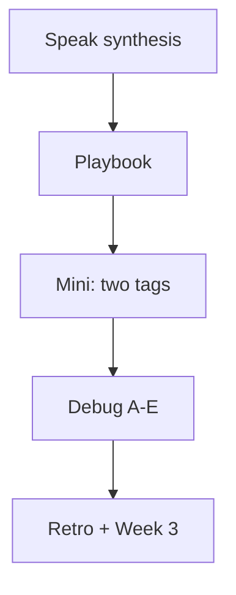
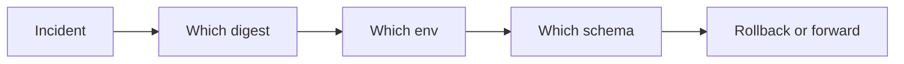

# Month 16 · Week 2 · Day 7
# Week Review — Failed Release Playbook and Five CD Defects

**Program:** Full-Stack Mastery · 18 months  
**Phase:** 5 — Production engineering  
**Month index:** [../../README.md](../../README.md)  
**Week 2:** [1](day-01.md) · [2](day-02.md) · [3](day-03.md) · [4](day-04.md) · [5](day-05.md) · [6](day-06.md) · Day 7 (today)  
**Week rhythm today:** Review, repair, plan Week 3  
**Student state:** You promoted on paper, tagged images, migrated on purpose, hid secrets, and rehearsed a Compose rollback. Today that must live in this file.  
**Study time:** 3–4 focused hours

Do not start Week 3 because the calendar moved. An AWS account on a `git pull` production is two problems.

Work in `~\fullstack-lab\month-16\week-02\day-07\`. Do not implement the mini inside Project 7.

---

## How to read this chapter

This is a **closed-book teaching day**. The synthesis **is** the Week 2 lesson.



Days 1–6 closed during the mini. Repair from **this** recap.

---

## Week synthesis (the lesson, in this book)

**CD** moves a **known artifact** through **named environments**. CI green means the commit may be **built**. It does not mean customers run it.

**Snowflake:** SSH, `git pull`, build on the box, hand-edited files. Drift. Rollback is folklore.

**Artifact:** container image preferred (Month 15). Built **once** on the Linux runner. Tagged with **git SHA**. Never retag a SHA. `:latest` is not a process. **Digest** (`sha256:`) is the immutable id. Promote the digest that **already** ran in staging. Rebuilding the same SHA on production can yield different bytes (moving base image).

**Environments:** `dev` disposable; `staging` production-shaped with fake data; `production` real users. Different secrets. Staging is not “prod + DEBUG.”

**Registry:** GHCR or ECR. Auth via `GITHUB_TOKEN` / OIDC / platform secrets — **not** passwords in git.

**Migrations:** `alembic upgrade head` as a **step**, then start the API. **Never** `create_all` in production. **Expand** (nullable add) then later **contract** (drop). Failed migrate: **do not** start the new API. Image rollback after **expand** is often OK; after **contract** or DROP is not — you need backups (Week 3) or a forward fix.

**Secrets:** `.env` gitignored; `.env.example` in git. Actions `${{ secrets.NAME }}`. OIDC: GitHub proves identity, AWS issues short-lived creds. `VITE_*` is public. Rotation: new value, deploy, kill old value. Revert does not un-leak.

**Rollback rehearsal:** two tags, switch Compose, `curl.exe` evidence. Health 200 can still be a bad release.

**Kubernetes:** optional. Not required for promotion.

**Wrong belief:** “CD is git pull on a bigger laptop.”  
**Correct:** CD is the same digest, new env config, migrate step, health, rollback plan.

---

## Failed release playbook (learn it here)

When production is wrong, do not invent a new architecture in the incident.

1. **Stop making it worse.** Do not push random commits to `main` without CI. Do not `create_all`. Do not drop the database.  
2. **Name the artifact.** Which digest is running? Which was previous? Actions log, ledger, platform UI.  
3. **Name the config.** Staging URL accidentally in prod? Secret wrong?  
4. **Name the schema.** Did migrate run? Expand or contract?  
5. **Choose a move:**  
   - **Roll back the image** if schema is compatible.  
   - **Forward fix** (new image through CI) if rollback is unsafe.  
   - **Restore from backup** only if data is gone — Week 3, not a guess today.  
6. **Health is not enough.** Hit one real read/write path (your nouns).  
7. **Write the timeline** in `incident.md` (facts, no blame theater).  
8. **Rotate** if logs leaked secrets.

This is **defense** of **your** system. You do not probe other people’s apps.

---

## Today's contract

**Today's gate.** Closed-book:

> I can teach promotion of a digest, SHA tags, migrate-then-start, secrets not in git, and a rollback that mentions migrations. I can debug five CD defects from this file and I wrote a failed-release playbook in my words.

---

## Time box

| Block | Minutes | Work |
|---|---|---|
| 1 | 35 | Speak; `exam-01.md` |
| 2 | 45 | Playbook + mini two-tag note |
| 3 | 30 | Debug A–E |
| 4 | 20 | Day 6 ROLLBACK gap |
| 5 | 25 | Five defects worksheet |
| 6 | 20 | Design: AWS will not replace a snowflake |
| 7 | 15 | Retro |

---

# Block 1 — Speak

Out loud: artifact vs git pull; SHA vs digest vs latest; three envs; migrate then start; expand/contract; secrets; OIDC sentence; rollback + DB. Write `exam-01.md` (25–40 lines).

```powershell
cd ~\fullstack-lab
mkdir month-16\week-02\day-07 -Force
cd ~\fullstack-lab\month-16\week-02\day-07
```

---

# Block 2 — Playbook and mini

Write `PLAYBOOK.md` — the eight steps in **your** words, with a fictional **tray** or **holds** gym (not product source).

Mini (files only if Docker is available; otherwise paper):

- `GOOD.txt` / `BAD.txt` — what `curl.exe` showed on Day 6, copied, or a honest “I will re-run this weekend.”  
- `WHY-NOT-GIT-PULL.txt` — five lines.

Must not: Project 7 dump, real secrets, Kubernetes manifest as a requirement.

---

# Block 3 — Debug five CD defects

Write `DEBUG.md`. Symptom, root cause, fix. These five are **required**:

**A. Wrong secret.** Staging works. Production 500s on database auth after “promote.” Compose/App Runner still has `DATABASE_URL` from staging, or a typo in the GitHub Environment secret name (`PROD_DATABASE_URL` unset, empty string).  

**B. Old image.** You “deployed main” but the service still runs last week’s digest because the platform pulled `:latest` that was not updated, or Compose did not `--force-recreate`, or CD built a new SHA but the run command pinned an old tag.  

**C. Migration half-applied.** Alembic failed mid-revision (lock, timeout). New API started anyway (wrapper without `set -e`). Some tables new, some not. Rollback of **image** leaves schema dirty.  

**D. Healthcheck too dumb.** `/health` returns 200 if the process is up. Postgres is down; list page 500s. Load balancer is happy. Customers are not.  

**E. Env mixup.** Production `CORS` / cookie `Secure` / `FRONTEND_ORIGIN` still `http://localhost:5173`. Login “works” on the engineer’s laptop via tunnel folklore; browsers on the real domain fail. Image is correct.

Attempt before the worked box.

---

# Block 4 — Review Day 6

Open **only** `..\day-06\ROLLBACK.md`. `exam-04-gap.md`: does it mention contract migrations? If the file is missing, say the rehearsal is OWED.

---

# Block 5 — Worksheet

`DEFECTS.md` — one **prevention** per A–E (CI check, compose pin, migrate job, health that checks DB, env lint).

Example prevention for D: health/readiness that **pings Postgres** (Month 15). CI cannot catch a prod secret typo unless you have a **post-deploy smoke** (Week 4).

---

# Block 6 — Design

`DESIGN.md` (10–15 lines): Week 3 AWS (IAM, RDS, App Runner) will host the **same** digest story. If you still git pull on EC2, AWS was only a rental laptop. Kubernetes still optional.

---

# Block 7 — Retro

`retro.md`: weakest defect; whether `:latest` still tempts you.

```powershell
cd ~\fullstack-lab
git add month-16
git commit -m "Month 16 Week 2 review: CD playbook and five defects."
```

---

## Office hours

**Half-applied migrate.** Stop traffic if you can; inspect `alembic_version`; do not DELETE from that table as a reflex; restore or complete the revision in a controlled way. Lab only for experiments.

**No second environment.** Two Compose files still prevent env mixup if you never copy-paste `.env`.

---

## Definition of done

- [ ] `exam-01.md` and `PLAYBOOK.md` exist  
- [ ] `DEBUG.md` A–E attempted before the box  
- [ ] `DEFECTS.md` preventions  
- [ ] Rollback gap named  
- [ ] Commit exists  

---

## Optional review links

Repair from this synthesis first.

- [GitHub Environments](https://docs.github.com/en/actions/how-tos/write-workflows/choose-when-workflows-run/use-environments-in-workflows)  
- [Alembic](https://alembic.sqlalchemy.org/en/latest/)  

---

# Worked answers — after DEBUG.md

**A.** Inject env from the **production** secret store; GitHub Environment `production`; never reuse staging URL. Smoke: a migrate or `SELECT 1` with the intended URL **name** logged, not the password.

**B.** Pin digest or SHA tag in the platform; `docker compose up -d --force-recreate`; CD prints `docker image inspect` digest into the ledger.

**C.** Wrapper `set -e`; migrate **job** separate; do not start API on failure; readiness fails until schema matches. Rollback **code** may be wrong — forward or restore.

**D.** Readiness checks DB (and Redis if you use it). Liveness ≠ readiness. Add a smoke request to a real route after deploy.

**E.** Production config reviewed in the deploy checklist; never copy `.env` from dev; cookie and CORS use the real origin. Catch with a staging site on **HTTPS hostname**, not only localhost.

If your answers disagree, fix them from this box **only after** you attempted A–E.



---

## Closed-book cards (retro.md)

1. Snowflake vs artifact.  
2. Why `:latest` is not rollback.  
3. Digest vs SHA tag.  
4. Why rebuild on prod breaks promotion.  
5. Why not `create_all`.  
6. Expand then rollback image — usually OK?  
7. Contract then rollback image — OK?  
8. OIDC in one sentence.  
9. Dumb healthcheck.  
10. Kubernetes required this week?

Miss more than two: re-read the synthesis. Week 3 without this is how IAM never saves a git-pull box.

---

# Lecture: the five minutes after “it’s down”

Write `TIMELINE.md` as a template you will copy in an incident (gym nouns: trays/holds, not product dumps):

1. Time you noticed (user report, alarm, your curl).  
2. URL and **digest** you believe is running.  
3. Last green CI SHA.  
4. Did migrate run for that SHA? Yes / no / unknown.  
5. First action: rollback image / revert env / stop deploy / nothing yet.  
6. First curl after the action.  
7. When you will post a follow-up (schema, leak, why health lied).

That template is the playbook in checklist form. Week 3 will not write it for you. Week 4 Day 7 will ask you to **use** it.

**Wrong belief:** “I’ll add Kubernetes so rollback is `kubectl rollout undo`.”  
**Correct:** undo still needs a previous **image** and a story about migrations. Compose and App Runner already undo **if** you recorded the digest.

**Windows.** During an incident you will mix PowerShell `curl.exe` with a Linux log. Read timestamps. Do not paste logs that contain tokens into git.

**Half-applied migrate (more).** Alembic stamps `alembic_version`. If a revision failed mid-transaction, Postgres may have rolled back that transaction **or not**, depending on the statement. The playbook is: stop new API, inspect the stamp, restore from snapshot if you do not understand the half, **or** complete a known-good revision in a maintenance window. Labs may experiment. Production does not `DELETE FROM alembic_version` as a reflex.

Write `MIGRATE-INCIDENT.md` (ten lines): stamp, logs, snapshot age — first looks.

**Wrong belief:** “I’ll kubectl now so this never happens.”  
**Correct:** you still need a digest and a schema story. Kubernetes remains optional.

Write `PLAYBOOK-DRILL.txt`: the first three steps you would take at 11 p.m. without opening Days 1–6.

Write `NOT-LATEST.txt`: one sentence you will not deploy `:latest` in Week 3.

## Closed-book

Name the five CD defects without looking. If you miss env mixup, re-read defect E.

---

## Tomorrow

**Week 3 Day 1** — AWS account, region, AZ, root vs IAM vs role, least privilege. **Billing alarm first.**
