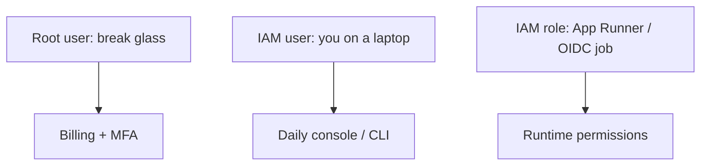

# Month 16 · Week 3 · Day 1
# AWS Accounts: Identity, Regions, and a Billing Alarm First

**Program:** Full-Stack Mastery · 18 months  
**Phase:** 5 — Production engineering  
**Month index:** [../../README.md](../../README.md)  
**Week 3:** Day 1 (today) · [2](day-02.md) · [3](day-03.md) · [4](day-04.md) · [5](day-05.md) · [6](day-06.md) · [7](day-07.md)  
**Week rhythm today:** Learn + type-along  
**Student state:** Week 2’s CD story is true on paper and in a Compose rehearsal. Today you meet **AWS** as an account you can **owe money** to — so the first lab is a **billing alarm**, not a server.  
**Study time:** 3–4 focused hours

**This week covers:** IAM, regions, VPC lite, security groups, compute choices (this course’s default: **App Runner**), RDS, S3, DNS, TLS, CloudFront, CloudWatch, threat model, teardown.

If you **cannot** create an AWS account this month, you still **write every diagram and policy from this textbook**. You do not pretend localhost is production (Month 16 README). Skip console clicks; do not skip the writing.

Labs: `~\fullstack-lab\month-16\week-03\day-01\`. Do not paste Project 7. Kubernetes remains optional and **not required**.

---

## How to use this textbook

1. Read identity and geography until you can teach them.  
2. Create the billing alarm **before** any compute (or write why the console blocked you).  
3. Optional review links are for later rechecking.

---

## How to read this chapter

AWS is a **collection of APIs** billed to an **account**. A region is a geography. An availability zone is a building-group inside a region. A **root user** is the account owner — too powerful for daily work. An **IAM user** is a long-lived person identity. An **IAM role** is something a **service or job assumes**. **Least privilege** means the policy allows only what the job needs.



**Wrong belief:** “I’ll use the root user for everything because it just works.”  
**Correct:** root is for account recovery, billing setup, and emergencies. Daily root is how a leaked password becomes a **bill shock**. Enable **MFA** on root today.

**Wrong belief:** “I’ll start an EC2 instance first so I have something to see.”  
**Correct:** the first lab is a **budget or billing alarm**. Compute waits until you can hear money moving.

---

## Today's contract

1. Define **account**, **region**, **AZ**, **root**, **IAM user**, **IAM role**.  
2. Enable MFA on root (or document the blocker).  
3. Create a **billing alarm** or **AWS Budget** that emails you.  
4. Write `LEAST-PRIVILEGE.md` with an example of too much (`s3:*` on `*`).  
5. Do **not** create App Runner, RDS, or a public SSH box today.

**Today's gate.** Closed-book:

> I can explain region vs AZ, why root is not daily, what a role is for, and I created a billing alarm before compute. Least privilege is a policy shape, not a slogan.

---

## Time box

| Block | Minutes | Work |
|---|---|---|
| A | 55 | Theory |
| B | 55 | Billing alarm lab (or written equivalent) |
| C | 70 | Identity map for *your* future app |
| D | 15 | Git |
| E | 15 | Recall |

---

# Block A — Theory

## 1. Account

An AWS **account** has a 12-digit id. Everything you create is inside it (or in an organization of accounts — extra). Billing is attached here. Free Tier is a **discount**, not a promise of zero. **Delete what you create** (Day 7).

Do not share root credentials with a classmate. Do not paste access keys into chat.

## 2. Region and availability zone

A **region** (`us-east-1`, `eu-west-1`) is a cluster of data centers you **choose**. Latency, data residency, and **which services exist** depend on region. **Use one region** this month. Switching regions duplicates resources and bills.

An **availability zone** (AZ) is an isolated location **inside** a region (`us-east-1a`). RDS multi-AZ is a **reliability** product (costs more). This course does not require multi-AZ. You still must **know the word** so “the AZ is down” is not mystical.

**Wrong belief:** “I’ll deploy in every region for ‘global.’”  
**Correct:** that is how students leave eight load balancers running. One region. CloudFront (Day 5) is how static content sits at the edge **without** eight APIs.

## 3. Root user versus IAM user versus role

| Identity | Lifetime | Use |
|---|---|---|
| **Root** | The account | MFA, billing, break-glass; not App Runner clicks daily |
| **IAM user** | Long-lived password / access keys | A human. Prefer **one user for you**, MFA, **no** `AdministratorAccess` if you can avoid it — many students still attach it **briefly** while learning; if you do, write a date to **remove** it |
| **IAM role** | Temporary session | App Runner instance role, GitHub OIDC, EC2 instance profile |

**Access keys** on an IAM user are the Week 2 “static key” smell. Prefer **console + MFA** for humans and **roles** for machines.

**Wrong belief:** “A role is a user without a password.”  
**Correct:** a role is **assumed**. Nothing is “logged in as the role” forever. Policies on the role say what the session may do.

## 4. Least privilege

A policy is JSON (Day 3 you will write one from memory). Effect Allow or Deny. Actions like `s3:GetObject`. Resources like a single bucket ARN.

Too much: `Action: "*"` on `Resource: "*"`.  
Better: `s3:GetObject` on `arn:aws:s3:::your-bucket/prefix/*`.

You will not write exploit payloads. You will **refuse** policies that say “because I might need it later.”

## 5. Billing alarm MUST be first

AWS charges for: compute hours, load balancers (easy to forget), NAT gateways (expensive surprise), RDS, data transfer, unused Elastic IPs in some cases.

**Today’s lab:** an **AWS Budget** (or CloudWatch billing alarm in `us-east-1`, where billing metrics traditionally live) that emails you at a threshold you can afford — for a student, **$5** or **$10** is a sane first tripwire, not because AWS is always cheap, but because you want a **letter** before a disaster.

Confirm the email **subscription**. An alarm nobody confirms is decoration — like a CI badge.

**Wrong belief:** “Free Tier means I cannot be billed.”  
**Correct:** wrong region, wrong instance size, a forgotten NAT, or leaving App Runner on, will bill. The alarm is the gate to the rest of the week.

## 6. What we will run later (preview)

This course’s **default compute** is **AWS App Runner** for the API container (Day 4 justifies vs EC2, ECS Fargate, Elastic Beanstalk). RDS PostgreSQL for data. S3 for uploads. You do not need those objects **today**.

## 7. Windows

Console is a browser. Optional CLI is Day 6: `aws` in PowerShell **after** install. Today: browser + notes. `curl.exe` is not an AWS API client.

## 8. If you have no account

Write `NO-ACCOUNT.md`: what you would click; that Week 4 production URL waits; staging Compose remains honest. Still write today’s identity table.

---

# Block B — Type-along (billing first)

```powershell
cd ~\fullstack-lab
mkdir month-16\week-03\day-01 -Force
cd ~\fullstack-lab\month-16\week-03\day-01
```

If you have an account:

1. Root: enable **MFA**. Record in `MFA.txt`: “enabled” or the error, **no** serial numbers you do not need.  
2. Create an **IAM user** for daily work (or IAM Identity Center if your account already uses it — write which). Do not create access keys today unless the CLI is the only path; prefer console.  
3. **Billing alarm / Budget:**  
   - Budgets: a monthly cost budget, email at 50% and 100% of **your** cap.  
   - Or CloudWatch billing alarm.  
4. Confirm the email if AWS sends a subscription link.

Write `BILLING.md`: threshold, metric, email **domain** (not a dox of a private inbox if you prefer `my-school-email`), date created.

If AWS requires a credit card: that is normal. This book will not ask you to publish the card number. If you cannot complete signup, `NO-ACCOUNT.md`.

**Do not** launch EC2, App Runner, RDS, or Lightsail today.

---

# Block C — Independent

`IDENTITY.md`:

| Question | Answer |
|---|---|
| Account alias or last 4 of id | not the root password |
| Home region this month | pick one |
| Root MFA | yes/no |
| Daily identity | IAM user / Identity Center |
| First compute this course (preview) | App Runner |
| Kubernetes this month | not required |

`LEAST-PRIVILEGE.md` (15–25 lines): rewrite this bad idea in words: “The API role has `AdministratorAccess` so RDS works.” Correct: RDS connect is **network + DB password/IAM auth**, not AdministratorAccess. The instance role might need `s3:PutObject` on one prefix if you upload.

`COST-WATCH.md`: three things that surprise students (NAT, idle RDS, forgotten load balancer). You do not have them yet. You will delete them on Day 7.

Project 7: `MY-REGION.md` — which region **you** pick and why (latency to you, not “because a YouTube thumbnail said us-east-1 only”). `us-east-1` is valid if you understand it.

---

# Block D — Git

```powershell
cd ~\fullstack-lab
git add month-16
git commit -m "Month 16 Week 3 Day 1: IAM model and billing alarm evidence."
```

No keys in the commit.

---

# Block E — Recall

1. Region vs AZ.  
2. Root vs user vs role.  
3. Why billing before compute.  
4. Least privilege in one example.  
5. Why Free Tier is not a force field.

## Office hours

**Student account / sandbox.** Follow school rules. Still write the alarm.

**MFA device lost.** Root recovery is painful — store backup codes **offline**, not in git.

**I created access keys by habit.** Delete them if unused. Week 2 OIDC.

---

## Definition of done

- [ ] Identity table written  
- [ ] Billing alarm/budget created **or** NO-ACCOUNT.md  
- [ ] MFA on root attempted  
- [ ] No compute launched  
- [ ] No secrets in git  
- [ ] Commit exists  

---

## Optional review links

- [AWS: Account root user](https://docs.aws.amazon.com/IAM/latest/UserGuide/id_root-user.html)  
- [AWS: Regions and AZs](https://docs.aws.amazon.com/global-infrastructure/latest/regions/aws-regions.html)  
- [AWS Budgets](https://docs.aws.amazon.com/cost-management/latest/userguide/budgets-managing-costs.html)  
- [IAM: Users, groups, and roles](https://docs.aws.amazon.com/IAM/latest/UserGuide/id.html)  

---

# Lecture: money, MFA, and the first hour

The billing alarm is not a personality test. It is how you notice a NAT Gateway, a forgotten RDS, or an App Runner service left on over a holiday. Confirm the **email subscription**. Until you click the confirm link, AWS is shouting into a void.

If the console offers **AWS Organizations**, ignore it this month unless school IT already placed you in a sandbox. Organizations are how companies split prod from play. You still need MFA on **your** root or on the Identity Center user you actually use.

**Access keys** are two strings. They are not “more professional” than the console. They are a Week 2 smell: long-lived, easy to paste into git, easy to leave on a USB. Prefer console today. Prefer **OIDC roles** when GitHub must call AWS. If you already created keys “just to see,” delete them in IAM → Users → Security credentials after you confirm you can still log in with MFA.

**Wrong belief:** “I’ll attach `AdministratorAccess` until Friday.”  
**Correct:** Friday becomes never. If you must unstick hour one, write `ADMIN-DEBT.md` with a delete date this week.

**Organizations.** Ignore AWS Organizations this month unless school IT already placed you in a sandbox. You still need MFA on the identity you actually use.

**Access keys.** Two strings, easy to paste into git. Prefer the console today. Prefer OIDC when GitHub must call AWS. Delete unused keys after you confirm MFA login still works.

**Region lock.** Do not open a second region “to compare latency.” Two regions means two places to forget RDS.

Write `HOUR-ONE.md` (ten lines): MFA, budget threshold, daily identity, region, “no compute yet.”

**SCP / service control.** If school IT blocks `iam:CreateUser`, write `SANDBOX.md`. The billing alarm may still be allowed.

**Wrong belief:** “CloudTrail is required before a budget.”  
**Correct:** CloudTrail is wise later. The **budget email** is the first control this course demands.

Write `ROOT-CHECK.md`: MFA on, no access keys on root, billing alarm confirmed, no EC2 yet.

**Console regions.** The region dropdown in the top-right is how students create RDS in `ap-southeast-2` while App Runner is in `us-east-1`. They cannot talk without extra work. Pick **one** region and screenshot the dropdown into your notes (no account ids required).

**IAM Identity Center** vs IAM user: either is fine. Do not create both and lose track of keys.

**Wrong belief:** “A sandbox account cannot have a billing alarm.”  
**Correct:** if billing is fully blocked, write who pays (school) in `SANDBOX.md`. You still must not launch unused compute.

Write `NO-COMPUTE-YET.md`: one sentence that App Runner and RDS wait until Day 4 at earliest.

## Closed-book

Root is not daily. Billing alarm exists. One region. No EC2 today. Least privilege is a JSON shape.

Write `SAY-IT.txt`: that paragraph in your words.

---

## Tomorrow

**VPC lite** — public/private subnets, security groups as firewalls, and why `0.0.0.0/0` on SSH is a story you **refuse**.
