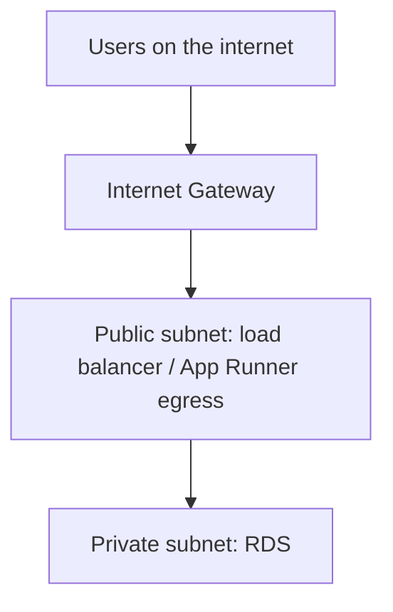

# Month 16 · Week 3 · Day 2
# VPC Lite: Subnets, Security Groups, and Refusing SSH to the World

**Program:** Full-Stack Mastery · 18 months  
**Phase:** 5 — Production engineering  
**Month index:** [../../README.md](../../README.md)  
**Week 3:** [1](day-01.md) · Day 2 (today) · [3](day-03.md) · [4](day-04.md) · [5](day-05.md) · [6](day-06.md) · [7](day-07.md)  
**Week rhythm today:** Exercises + diagrams  
**Student state:** Billing alarm exists (or is documented). Today you learn enough **network** to place an API and RDS without opening the database to the internet.  
**Study time:** 3–4 focused hours

Labs: `~\fullstack-lab\month-16\week-03\day-02\`. Diagrams and a refused story. You will **not** write an exploit against anyone’s SSH. You will **not** publish a 5432 listener on `0.0.0.0/0`.

---

## How to use this textbook

1. Draw public vs private.  
2. Treat a **security group** as a stateful firewall attached to a **network interface**, not as “the VPC’s mood.”  
3. Optional review links are for later rechecking.

---

## How to read this chapter

A **VPC** is your private network in a region. **Subnets** slice it. A **public** subnet has a route to an **Internet Gateway**. A **private** subnet does not; it might use a NAT gateway for **outbound** (NAT costs money — do not create one “just in case”). A **security group** allows traffic **to/from** an ENI (instance, RDS, App Runner VPC connector, etc.).



App Runner can sit **outside** your VPC and still reach RDS via a **VPC connector** (Day 4). The **idea** remains: **RDS is not public**.

**Wrong belief:** “I’ll put RDS in a public subnet with security group `0.0.0.0/0` on 5432 so TablePlus at home works.”  
**Correct:** that is how databases get scanned. Use a VPN, an SSM tunnel, or a short-lived bastion you **do not** leave open. This course: **RDS not publicly accessible**. TablePlus via SSH to a locked-down host is a later, careful choice — **not** `0.0.0.0/0`.

**Wrong belief:** “`0.0.0.0/0` on port 22 is fine if my password is strong.”  
**Correct:** you **refuse** that story. Password SSH to the world is a gift to bots. If you ever use EC2, SSH from **your IP** (`/32`) or, better, **SSM Session Manager** with no public 22. You will not practice brute-forcing SSH.

---

## Today's contract

1. Define VPC, subnet public/private, Internet Gateway, security group.  
2. Draw where **RDS** lives (private) and where **users** talk (HTTPS to the app, not to 5432).  
3. Write a **refusal** paragraph for world-open SSH and world-open Postgres.  
4. Name one **allowed** admin path that is not “open 22 to the world.”

**Today's gate.** Closed-book:

> RDS is not on 5432/tcp to the internet. Security groups are allow-lists. I refuse `0.0.0.0/0` on SSH. Users reach HTTPS on the app, not the database.

---

## Time box

| Block | Minutes | Work |
|---|---|---|
| A | 50 | Theory |
| B | 70 | Draw + SG tables |
| C | 50 | Exercises: five network stories |
| D | 15 | Git |
| E | 15 | Recall |

---

# Block A — Theory

## 1. Why Month 15 is not enough

You already know Docker ports and `127.0.0.1`. AWS adds **routing**: a packet must have a **route table** entry. “I opened the port in Compose” does not open a security group.

## 2. Public versus private (lite)

**Public subnet:** route `0.0.0.0/0` → Internet Gateway. Instances **may** have public IPs. Still not a reason to expose 5432.

**Private subnet:** no direct IGW route. RDS belongs here. App Runner’s VPC connector targets private subnets to **reach** RDS.

You do **not** need to build a three-tier textbook VPC with six subnets this month if App Runner + RDS wizard creates a **sane** private RDS. You **must** be able to **read** the result: is `Publicly accessible` on RDS **No**?

## 3. Security group as firewall

Rules: protocol, port, **source** (CIDR or another security group).

**Better than CIDR soup:** App Runner / EC2 SG as **source** of RDS SG port 5432. Then the database accepts Postgres only from the app, not from “my house plus the app plus leftover.”

Stateful: return traffic is allowed. You still do not “open all ports to be simple.”

**Wrong belief:** “NACLs are the firewall I should edit first.”  
**Correct:** NACLs are stateless, easy to break, and optional for this course. **Security groups** are the daily tool.

## 4. The story you refuse (SSH)

A blog says: create EC2, security group `22` from `0.0.0.0/0`, user `ubuntu`, password or a key sitting in Discord.

You **refuse**:

- World-open 22.  
- Password auth as the plan.  
- Sharing `.pem` in git (Week 2 secrets).  

**Allowed learning path:** no EC2 at all (App Runner default). Or EC2 **without** public SSH: SSM. Or SSH from **your** `/32` only, key-only, and you **delete** the rule when class ends.

This is **defense of your account**. You do not scan the internet for open 22.

## 5. 5432 is not “like 8000”

Port 8000 on a toy container at home is not a production database. **Never** `0.0.0.0/0` on 5432. RDS **publicly accessible = No**.

## 6. App Runner and “where is the box?”

App Runner does not give you a cozy SSH. That is a **feature**. Logs go to CloudWatch (Day 6). If you chose EC2+Compose instead (Day 4 fallback), you inherit SSH temptation — then today’s refusal still applies.

## 7. Cost

NAT Gateway for private-subnet outbound is **easy to forget** and **not free**. App Runner without a NAT-heavy design is part of why this course defaults to App Runner. If you create a NAT, write it on the **delete list** (Day 7).

---

# Block B — Type-along diagrams

```powershell
cd ~\fullstack-lab
mkdir month-16\week-03\day-02 -Force
cd ~\fullstack-lab\month-16\week-03\day-02
```

Write `VPC.mmd` (mermaid in a file) **and** `VPC.md` with the same picture in prose.

Required boxes: users, HTTPS, App Runner (or EC2), RDS private, no user arrow to 5432.

Write `SG.md` tables:

**SG-app** (concept)

| Direction | Port | Source/dest | Why |
|---|---|---|---|
| Inbound | 443 | 0.0.0.0/0 | public HTTPS if the platform uses it |
| Outbound | 5432 | SG-db | API to RDS |

**SG-db**

| Direction | Port | Source | Why |
|---|---|---|---|
| Inbound | 5432 | SG-app | only the app |
| Inbound | 5432 | 0.0.0.0/0 | **REFUSED** |

**SG-ssh** (if EC2 exists)

| Rule | Verdict |
|---|---|
| 22 from 0.0.0.0/0 | Refuse |
| 22 from your /32 | Only if you must, temporary |
| No 22, SSM instead | Preferred |

Write `REFUSAL.md` (a full page): first person, you decline a classmate’s “just open SSH to the world for the demo.” Offer SSM or App Runner logs instead. No attack steps.

If you have an account, **look** at default VPC (every region has one) and write `DEFAULT-VPC.txt`: it exists, it is often **public subnets**, therefore **RDS public=No still matters**. Do not delete the default VPC today.

---

# Block C — Exercises

`STORIES.md` — for each, **allowed?** yes/no, **why**.

1. RDS publicly accessible, SG 5432 from your home `/32` only.  
2. RDS private, SG 5432 from SG-app.  
3. EC2 22 from `0.0.0.0/0`.  
4. App Runner + RDS connector, no EC2.  
5. NAT Gateway created “for later” with no delete date.

Hints: (1) better than the world but still a public DB — this course still says **not public**; (2) yes; (3) refuse; (4) yes, default path; (5) cost smell.

`PROJECT-NET.md`: **your** product — users hit HTTPS; uploads go to S3 (Day 5); Postgres not public. Names only.

---

# Block D — Git

```powershell
cd ~\fullstack-lab
git add month-16
git commit -m "Month 16 Day 2: VPC lite diagrams and SSH refusal."
```

---

# Block E — Recall

1. Public vs private subnet.  
2. Security group vs “the VPC firewall blob.”  
3. Why RDS is not public.  
4. Why you refuse world SSH.  
5. NAT cost one-liner.

## Office hours

**I already opened 22 to the world.** Close it now. That is the lab. Rotate keys if the `.pem` leaked.

**App Runner has no SG I understand yet.** Day 4. Today the **RDS** side still must not be public.

**School blocks AWS networking labs.** Diagrams still count.

---

## Definition of done

- [ ] VPC diagram with private RDS  
- [ ] SG tables include a refused row  
- [ ] `REFUSAL.md` written  
- [ ] Five stories classified  
- [ ] Commit exists  

---

## Optional review links

- [AWS: VPCs and subnets](https://docs.aws.amazon.com/vpc/latest/userguide/configure-subnets.html)  
- [AWS: Security groups](https://docs.aws.amazon.com/vpc/latest/userguide/vpc-security-groups.html)  
- [AWS: Systems Manager Session Manager](https://docs.aws.amazon.com/systems-manager/latest/userguide/session-manager.html)  

---

## Tomorrow

**Memory** — read and write a small IAM policy from this file (Days 1–2 closed).
