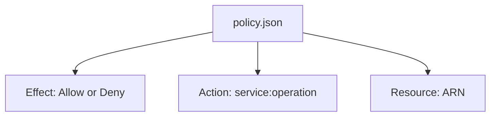

# Month 16 · Week 3 · Day 3
# From Memory: Read and Write a Small IAM Policy

**Program:** Full-Stack Mastery · 18 months  
**Phase:** 5 — Production engineering  
**Month index:** [../../README.md](../../README.md)  
**Week 3:** [1](day-01.md) · [2](day-02.md) · Day 3 (today) · [4](day-04.md) · [5](day-05.md) · [6](day-06.md) · [7](day-07.md)  
**Week rhythm today:** Implement from memory  
**Student state:** Day 2 gate passed. You can refuse world-open SSH. Today IAM JSON must live in your head — from **this file**.  
**Study time:** 3–4 focused hours  
**Prereq:** Day 2 gate passed.

Labs: `~\fullstack-lab\month-16\week-03\day-03\`. Days 1–2 textbook **closed** during drills. Do not paste Project 7. Do not attach `AdministratorAccess` to a lab role “to move on.”

---

## How Day 3 works

This recap is the teacher. Stuck > 25 minutes: open only the matching Day 1 or Day 2 section, then close it. `lookups.txt`.

Commit `policy.json` **before** the worked box.

---

## How to read this chapter

An IAM **policy** is a JSON document. A **statement** has `Effect`, `Action`, `Resource`, optional `Sid` and `Condition`. **Allow** is not the same as “the security group also allows it.” IAM is **who may call AWS APIs**. Security groups are **which packets**. You need both for RDS+S3 stories.



**Wrong belief:** “I’ll copy `AdministratorAccess` into my notes as the policy.”  
**Correct:** that is the anti-lesson. Today you write **GetObject** on **one** bucket prefix.

---

## Complete explanation (IAM and network you must still own)

**Account.** 12-digit payer. **Region.** Choose one this month. **AZ.** Building-group inside a region.

**Root.** Break-glass + billing; MFA; not daily. **IAM user.** Human, long-lived. **Role.** Assumed, temporary (App Runner, OIDC, EC2 profile).

**Least privilege.** Smallest actions and resources. Not `*` on `*`.

**Billing alarm first.** You do not “just launch” without a budget email.

**VPC lite.** Public subnet reaches IGW. Private subnet holds RDS. **Security group** = stateful allow-list. RDS **not** publicly accessible. **Refuse** `0.0.0.0/0` on SSH and on 5432. Prefer App Runner (no SSH) or SSM.

**NAT.** Costs money; do not create “for later.”

**IAM policy shape:**

```json
{
  "Version": "2012-10-17",
  "Statement": [
    {
      "Sid": "ReadUploadsPrefix",
      "Effect": "Allow",
      "Action": ["s3:GetObject"],
      "Resource": "arn:aws:s3:::example-app-uploads/prod/*"
    }
  ]
}
```

`Version` is the **policy language** date `2012-10-17` (you will see it everywhere; it is not “your app’s version”).

ARN pattern: `arn:aws:s3:::bucket` for bucket-level actions (`s3:ListBucket`) vs `arn:aws:s3:::bucket/key` for object actions (`s3:GetObject`). Mixing these up is a classic “AccessDenied.”

**Wrong belief:** “`s3:*` on the bucket ARN is least privilege because it is one bucket.”  
**Correct:** that includes `DeleteBucket` and more. List the **verbs** you need (`PutObject`, `GetObject`).

**Wrong belief:** “This policy lets the internet download objects.”  
**Correct:** IAM allows **a principal** (role/user) to call APIs. A **public bucket ACL** is a different, refused story (Day 5). Private bucket + IAM is the default.

**Kubernetes.** Not required. IAM still exists without a cluster.

**Secrets.** Access keys are not in git. OIDC assumes a role.

**Windows.** You may type JSON in VS Code. CLI is optional Day 6.

---

## Today's contract

1. Write `policy.json` from the spec.  
2. Read a second policy and mark too-wide actions.  
3. Explain SG vs IAM in six lines.  
4. Classify five identity stories.

**Today's gate.** Closed-book:

> I can write an Allow statement with Action and Resource. I do not use AdministratorAccess as a lifestyle. IAM is not a security group. RDS stays private. Root is not daily.

---

## Time box

| Block | Minutes | Work |
|---|---|---|
| 1 | 25 | Speak; `exam-01.md` |
| 2 | 50 | Write `policy.json` from spec |
| 3 | 45 | Read/mark the wide policy; SG vs IAM |
| 4 | 30 | Debug A–E |
| 5 | 20 | Worked box |
| 6 | 20 | Project 7 role sketch (names) |
| 7 | 15 | Retro |

---

# Block 1 — Speak

Cover: root/user/role; region; billing first; public/private; SG; refuse world SSH; policy Version/Statement/Effect/Action/Resource. `exam-01.md` 12–20 lines.

```powershell
cd ~\fullstack-lab
mkdir month-16\week-03\day-03 -Force
cd ~\fullstack-lab\month-16\week-03\day-03
```

---

# Block 2 — Write from spec

**Spec:** a role used by the **API** to read uploaded objects.

- Policy language version `2012-10-17`  
- One statement `Sid`: `GetLessonUploads` (or `GetTrayUploads` if you prefer gym nouns)  
- `Effect`: Allow  
- `Action`: only `s3:GetObject`  
- `Resource`: `arn:aws:s3:::lab-month16-uploads/lessons/*`  
- No `s3:DeleteBucket`, no `*`  

Save as `policy.json`. Write `ANNOTATE.md`: one sentence per key.

Do not attach it in the console until you have compared to the box **unless** you are sure. Attaching a tight policy is fine; attaching `*/*` is not.

---

# Block 3 — Read a wide policy

This policy is **deliberately bad**. Write `WIDE.md`: list three verbs that are too broad and what they could destroy **in your own account** (defense: you are not attacking others).

```json
{
  "Version": "2012-10-17",
  "Statement": [
    {
      "Effect": "Allow",
      "Action": "s3:*",
      "Resource": "*"
    }
  ]
}
```

Then `IAM-VS-SG.md`: why allowing `s3:GetObject` does **not** open port 5432, and why SG 5432 from SG-app does **not** grant `s3:PutObject`.

---

# Block 4 — Debug

**A.** Root user used for `aws s3 cp` daily, no MFA.  
**B.** App role has `AdministratorAccess` “so RDS works.”  
**C.** Security group 5432 `0.0.0.0/0` because IAM is tight.  
**D.** Policy `GetObject` on `arn:aws:s3:::lab-month16-uploads` (bucket ARN only).  
**E.** World-open SSH “just for the IAM lab.”  

---

# Block 5 — Worked box (after policy.json exists)

`DIFF.md` or `MATCH.txt`.

Valid `policy.json` shape:

```json
{
  "Version": "2012-10-17",
  "Statement": [
    {
      "Sid": "GetLessonUploads",
      "Effect": "Allow",
      "Action": ["s3:GetObject"],
      "Resource": "arn:aws:s3:::lab-month16-uploads/lessons/*"
    }
  ]
}
```

If you used a string Action instead of a list, that can still be valid JSON — note it; lists are clearer.

**A.** IAM user + MFA; root break-glass.  
**B.** RDS needs network + DB creds, not AWS admin.  
**C.** IAM ≠ packets; close 5432.  
**D.** Object actions need `/key` resource. May also need `ListBucket` on bucket ARN **if** listing — not asked today.  
**E.** Refuse; IAM lab needs no EC2.

---

# Block 6 — Design

`DESIGN.md`: roles you expect — `api-runtime` (S3 put/get prefix), `github-oidc-deploy` (update App Runner), human `you`. Names only. Kubernetes not required.

---

# Block 7 — Retro

`retro.md`: which ARN mix-up you still fear.

```powershell
cd ~\fullstack-lab
git add month-16
git commit -m "Month 16 Day 3: IAM policy from memory."
```

---

## Office hours

**JSON comma errors.** Validate in an editor. AWS console policy editor is optional.

**I have no AWS account.** The JSON still grades. Do not invent live ARNs of other people.

---

## Definition of done

- [ ] `policy.json` before the box  
- [ ] `WIDE.md` and `IAM-VS-SG.md`  
- [ ] Debug A–E attempted  
- [ ] Commit exists  

---

## Optional review links

Repair from this recap first.

- [IAM JSON policy language](https://docs.aws.amazon.com/IAM/latest/UserGuide/reference_policies_grammar.html)  
- [IAM: S3 actions and resources](https://docs.aws.amazon.com/service-authorization/latest/reference/list_amazons3.html)  

---

# Lecture: how to read a policy

When `Resource` is `*`, ask “could this delete the account’s buckets?” When `Action` is `s3:*`, list three verbs you did not want. When someone says “RDS IAM,” distinguish **IAM database authentication** (optional extra) from **security groups**.

`HEURISTIC.md` (six lines). Then Block 5 if needed.

---

## Tomorrow

**Lab:** compute honestly compared; **App Runner** as this course’s default; **RDS PostgreSQL** managed, backed up, not public 5432.
