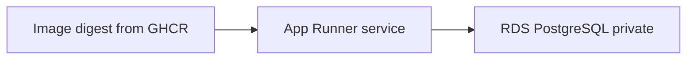
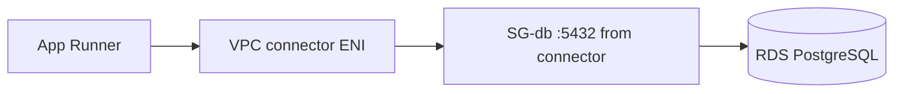

# Month 16 · Week 3 · Day 4
# Lab: Choose Compute Honestly, Then Place Managed PostgreSQL

**Program:** Full-Stack Mastery · 18 months  
**Phase:** 5 — Production engineering  
**Month index:** [../../README.md](../../README.md)  
**Week 3:** [1](day-01.md) · [2](day-02.md) · [3](day-03.md) · Day 4 (today) · [5](day-05.md) · [6](day-06.md) · [7](day-07.md)  
**Week rhythm today:** Lab (type-along + independent)  
**Student state:** You can write a tight IAM policy from memory. Today you **pick a compute service** for this course and you **understand RDS** as a managed database — backups, not public 5432.  
**Study time:** 3–4 focused hours

Labs: `~\fullstack-lab\month-16\week-03\day-04\`. You may **create** RDS only if the billing alarm exists and you will **delete** it on Day 7 if it is a toy. Prefer a **written** RDS design plus a **free-tier-sized** instance if you create one. Do not paste Project 7. Kubernetes is **not required**.

---

## How to use this textbook

1. Read the four compute options. Close it. Say why **this course defaults to App Runner**.  
2. Type `COMPUTE.md` and `RDS.md`.  
3. If you create AWS resources, write their **ids** and a **delete date**.  
4. Optional review links are for later rechecking.

---

## How to read this chapter

Compute is **where the container runs**. Data is **where Postgres runs**. Mixing them into “one EC2 that is app+db+git” returns you to a snowflake.



**Wrong belief:** “I must learn Kubernetes this month to be employable.”  
**Correct:** Kubernetes is optional on the roadmap. A container you can **promote** and a database you can **restore** beat a cluster you cannot explain.

---

## Today's contract

1. Compare **EC2**, **ECS on Fargate**, **App Runner**, **Elastic Beanstalk** in honest sentences.  
2. Justify **App Runner** as this course’s **default learning path**.  
3. Define **managed PostgreSQL**: who patches the OS, what a snapshot is, why 5432 is not public.  
4. Sketch VPC connector / SG: app to RDS only.  
5. Optional: create a **small** RDS instance **or** document the console clicks you would take.

**Today's gate.** Closed-book:

> This course’s default is App Runner running my SHA-tagged image, plus RDS PostgreSQL that is not publicly accessible, with backups I can name. EC2+Compose is a documented fallback. ECS Fargate is what many teams use at scale. Beanstalk is a PaaS I can explain but not our default. Kubernetes is not required.

---

## Time box

| Block | Minutes | Work |
|---|---|---|
| A | 55 | Theory: four computes + RDS |
| B | 70 | Write designs; optional tiny RDS or App Runner **read-only** console tour |
| C | 55 | Independent: Project 7 mapping |
| D | 15 | Git |
| E | 15 | Recall |

---

# Block A — Theory

## 1. Four options, without marketing

| Service | You manage | Feels like | Honest cost/complexity |
|---|---|---|---|
| **EC2 + Compose** | VM, OS patches, Docker engine, SSH temptation, nginx, TLS (or a companion ALB) | Your Month 15 laptop, rented | Cheap **if** tiny; easy to snowflake (`git pull`); you already know Compose |
| **ECS Fargate** | Task definition, cluster, service, often an **Application Load Balancer** | “Production containers” in job ads | More IAM and networking; no SSH; image-native; **more moving parts** than this month needs |
| **App Runner** | A service pointed at an image (or source — **prefer image**) | Heroku-shaped, but AWS | HTTPS on a `*.awsapprunner.com` hostname; scale-to-one; VPC connector to RDS can be fiddly; **least SSH**; matches Week 2 digest promotion |
| **Elastic Beanstalk** | An “environment” that may provision EC2/ELB for you | Upload a zip, hope | Easy until it hides the instance; less aligned with “promote this digest” |

## 2. Why App Runner is the default **in this book**

1. Week 2 already produces a **container digest**. App Runner **runs an image**.  
2. TLS to a default hostname is included — Week 4 still teaches **your** DNS and certificates, but you can **see HTTPS** early.  
3. No world-open SSH because there is **no SSH**. Day 2’s refusal becomes easy.  
4. Kubernetes not required. ECS not required.  
5. Rollback is “deploy previous image” in the console or API — the same story as Compose tag switch.

**Honest downsides:** VPC connector + RDS is a known sharp edge (subnets, SG, ENI). Cost is not zero when idle depending on settings. Custom domain needs ACM in the **right region**. Debugging is **logs**, not `docker logs` on a box (Day 6).

**Fallback (document if you choose it):** **one EC2 + Compose** pulling **CI images**, RDS separate (or Compose Postgres **only** for staging, never as the production story if you can afford RDS). You must still refuse `0.0.0.0/0` SSH and public 5432. This fallback is for when App Runner+RDS connector blocks you — not because git-pull is nostalgic.

**Not the default:** ECS Fargate — **respect it**; read a task definition later in your career. Beanstalk — know the name for interviews; do not hide from images.

## 3. What “managed DB” means (RDS PostgreSQL)

On Compose, **you** patch Postgres, take dumps, replace the volume, and cry.

On **RDS**:

- AWS runs the **database engine** on hosts you do not SSH into.  
- You choose engine version, size (`db.t3.micro` class is the usual student starting point — **check current Free Tier** in the console, it changes).  
- **Backups:** automatic snapshots + retention (e.g. 7 days). You can trigger a snapshot before a scary migrate.  
- **Restore:** new instance from snapshot (new endpoint — **update** `DATABASE_URL`).  
- **Multi-AZ:** extra money, extra reliability; **not required** this month.  
- **Maintenance windows:** AWS may patch; you pick a window.  
- You still **design schema** (Alembic). Managed is **not** “no migrations.”

**Wrong belief:** “RDS means I can `create_all` because AWS is professional.”  
**Correct:** Week 2 still applies. Alembic is yours.

**Wrong belief:** “I’ll expose 5432 so I can use TablePlus from the train.”  
**Correct:** `Publicly accessible: No`. Admin access via bastion/SSM/VPN — or use `psql` from a **one-off** task in the VPC. Not from the internet.

## 4. Connecting App Runner to RDS

Shape:

- RDS in **private** subnets.  
- Security group **SG-db** allows 5432 from **SG-connector** (or the SG AWS attaches to the connector).  
- App Runner VPC connector in those subnets (enough IPs).  
- `DATABASE_URL` in App Runner **environment** or Secrets Manager — **not** in the image.

If this fails in Week 4, the fallback is EC2 in the same VPC as RDS (private RDS, app SG → db SG). Still **images from CI**.

## 5. Redis, workers

If Project 7 uses Redis, options: **ElastiCache** (managed, also not public), or a container beside the API (less ideal in prod). Do not start ElastiCache today unless you will delete it. Document **OWED**.

## 6. What not to create today if money is scary

NAT Gateway, Application Load Balancer “to try,” `db.m5.large`, multi-AZ, public RDS. A single micro RDS is the maximum optional create. App Runner service can wait for Week 4 **first deploy** if you only **design** today.

---

# Block B — Type-along

```powershell
cd ~\fullstack-lab
mkdir month-16\week-03\day-04 -Force
cd ~\fullstack-lab\month-16\week-03\day-04
```

Write `COMPUTE.md` — one paragraph per row of the table **in your words**, then a section **“Default: App Runner because…”** (five bullets). Then **“I will use fallback EC2+Compose if…”** (connector/time/account).

Write `RDS.md`:

1. Engine: PostgreSQL (version you already use locally — do not jump major without a reason).  
2. Publicly accessible: **No**.  
3. Backup retention: a number you choose.  
4. Who runs `alembic` (Week 2 wrapper / a one-off App Runner job / CI OIDC).  
5. Restore concept: snapshot → new instance → new URL.  
6. SG: only app.  

**Optional console lab (account required):**

- Do **not** skip re-reading `BILLING.md`.  
- Create RDS PostgreSQL, smallest class, 20 GiB gp3 or whatever the wizard defaults that is still small, **not** public, strong master password in a **password manager**, not in git.  
- Save **endpoint hostname** in `RDS-ENDPOINT.txt` (hostname is not a password).  
- Add to `DELETE-ME.md` for Day 7.

If you do not create RDS, write `CLICKS.md`: the wizard screens you **would** see (engine, class, public access, VPC, SG, backup). That document is the lab.

**Optional:** open App Runner console, read “container registry” vs “source code.” Write `APP-RUNNER-SOURCE.txt`: this course uses **registry / image**, not “connect GitHub and hope a buildpack.” Builds belong to **your** CI.

---

# Block C — Independent

`MY-COMPUTE.md` for Project 7:

| Piece | Choice | Why |
|---|---|---|
| API process | App Runner (default) or EC2+Compose | |
| Web SPA | App Runner too, **or** S3+CloudFront (Day 5) | |
| Postgres | RDS | |
| Redis | ElastiCache / compose / OWED | |
| Worker | second App Runner / same Compose / OWED | |
| Kubernetes | no | |

`COST.md`: RDS micro monthly ballpark **as a range you looked up** (numbers change — write the date). App Runner: write “I will watch the billing alarm.”

`MIGRATE-ON-AWS.md`: eight lines — still migrate then start; never create_all; image contains Alembic revisions.

---

# Block D — Git

```powershell
cd ~\fullstack-lab
git add month-16
git commit -m "Month 16 Day 4: App Runner default, RDS design, no public 5432."
```

No master passwords in git.

---

# Block E — Recall

1. Why App Runner is the course default.  
2. One reason to fall back to EC2+Compose.  
3. What managed Postgres still leaves you.  
4. Public RDS: yes/no.  
5. Kubernetes required?

## Office hours

**Free Tier RDS not available.** Do not create a huge instance. Design-only is valid; Week 4 staging Compose remains honest.

**App Runner “easy connect to RDS” failed.** Fallback path. Do not open RDS to the world to “unblock.”

**Beanstalk in a job interview.** You can say: PaaS that often wraps EC2; we promoted **images** on App Runner instead.

---

## Definition of done

- [ ] Four compute options described honestly  
- [ ] App Runner justified as default  
- [ ] RDS.md says not public + backups  
- [ ] Optional resource on DELETE-ME.md or CLICKS.md  
- [ ] No secrets in git  
- [ ] Commit exists  

---

## Optional review links

- [AWS App Runner](https://docs.aws.amazon.com/apprunner/latest/dg/what-is-apprunner.html)  
- [Amazon RDS for PostgreSQL](https://docs.aws.amazon.com/AmazonRDS/latest/UserGuide/CHAP_PostgreSQL.html)  
- [Amazon ECS on Fargate](https://docs.aws.amazon.com/AmazonECS/latest/developerguide/AWS_Fargate.html)  
- [AWS Elastic Beanstalk](https://docs.aws.amazon.com/elasticbeanstalk/latest/dg/Welcome.html)  
- [Amazon EC2](https://docs.aws.amazon.com/AWSEC2/latest/UserGuide/concepts.html)  

---

# Lecture: App Runner, RDS, and the sharp edges

App Runner **source code** mode (connect a GitHub repo, let AWS build) fights this course. Week 2 already built an image in **your** CI. Registry mode keeps one digest across staging and production. If the console looks easier with “from code,” close it. You would skip ruff, pytest, and the SHA tag.

**VPC connector.** App Runner’s service lives in an AWS-owned network. RDS in **your** VPC is not reachable until a connector ENI appears in **private** subnets that can route to the database subnet. The security group on RDS must allow **5432 from the connector’s SG**, not from `0.0.0.0/0`. If the wizard creates public RDS to “help,” change it before you load data.

**Restore.** A snapshot restore creates a **new** instance with a **new** endpoint. `DATABASE_URL` must change. DNS that still points at the old endpoint is a silent fail. Practice that sentence; you may not restore today.

**EC2 fallback, honestly.** You already know Compose. The failure mode is SSH + `git pull`. The success mode is: instance in a public subnet (or private + SSM), **no** world-open 22, Compose file with `image: ghcr.io/you/api:abc1234`, RDS private, env from a file that is **not** git. TLS then becomes **your** Caddy/nginx or an ALB (ALB costs money — on the delete list if you are only experimenting).

**Workers.** A second App Runner service or a Compose `worker` profile. Do not hide a beat scheduler on the API container if health then depends on the worker. Document OWED.

**Fargate later.** Many services, sidecars, a team already on ECS: then Fargate earns the extra YAML. This month, one App Runner service plus RDS is the learning path. Write why in `SHARP.md` (12–20 lines): connector SG, restore endpoint, registry mode, when Fargate would win.

**Beanstalk zip.** Uploading application.zip skips your GitHub SHA image. Interview sentence: “I can explain Beanstalk; I shipped a digest on App Runner.”

**RDS sizing.** `db.t3.micro` (or current free-tier class) with 20 GiB is enough for Project 7 homework data. Multi-AZ doubles cost. Storage autoscaling can surprise a budget — know whether you enabled it.

**Wrong belief:** “I’ll use Aurora because it is what serious people use.”  
**Correct:** Aurora is another product and another bill. PostgreSQL on RDS is the subset.

Write `CONNECT.md`: App Runner → connector SG → RDS SG → port 5432.



**Parameter groups.** Leave defaults this month. RDS is not a VM you SSH into.

Write `BACKUP-WINDOW.md`: the retention days you chose (or would choose) and whether you will snapshot before the first production migrate.

Write `ENGINE-VERSION.txt`: the Postgres major you run locally and the RDS major you intend — they should match.

## Closed-book

App Runner default. RDS not public. Alembic still yours. Kubernetes not required.

---

## Tomorrow

**S3** (private bucket), **Route 53** concepts, **ACM** certificates, **CloudFront** as edge cache — storage, DNS, HTTPS, CDN.
