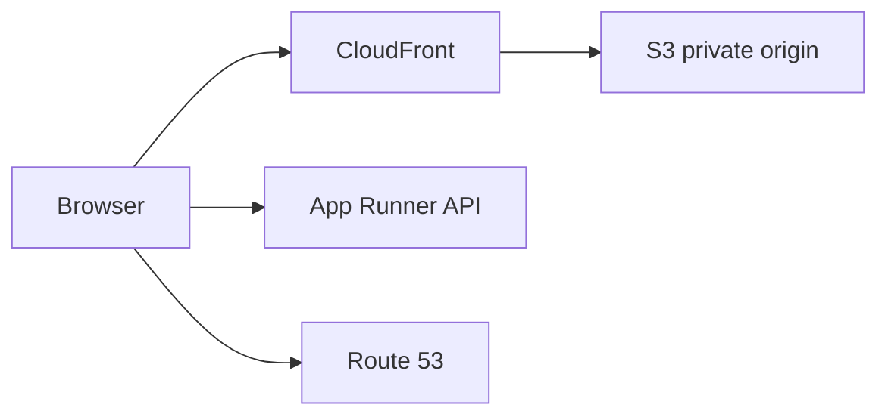

# Month 16 · Week 3 · Day 5
# S3, DNS, HTTPS, and CloudFront: Objects at Rest, Names, and the Edge

**Program:** Full-Stack Mastery · 18 months  
**Phase:** 5 — Production engineering  
**Month index:** [../../README.md](../../README.md)  
**Week 3:** [1](day-01.md) · [2](day-02.md) · [3](day-03.md) · [4](day-04.md) · Day 5 (today) · [6](day-06.md) · [7](day-07.md)  
**Week rhythm today:** Tests / docs (diagrams and a private-bucket checklist)  
**Student state:** App Runner + RDS is the default design. Today **uploads**, **names**, **certificates**, and **edge caches**.  
**Study time:** 3–4 focused hours

Labs: `~\fullstack-lab\month-16\week-03\day-05\`. Do not make a **public** bucket “to see the file in a browser” as the product pattern. Do not paste Project 7. Defense: private objects, signed access **ideas**, no exploit PoCs against other buckets.

---

## How to use this textbook

1. Read S3 privacy, DNS records, certificate lifecycle, CDN purpose.  
2. Type checklists. Create a **private** bucket only if you will delete it Day 7.  
3. Optional review links are for later rechecking.

---

## How to read this chapter

**S3** stores **objects** (bytes + key). **Route 53** answers **DNS** questions (names → IPs or aliases). **ACM** issues **certificates** for TLS. **CloudFront** is a **CDN**: caches at edge locations so users are not all hitting your origin.



**Wrong belief:** “I’ll tick public ACL so the avatar URL is easy.”  
**Correct:** public ACLs are how buckets leak. Default: **Block Public Access** on. The API returns a **short-lived** URL or proxies the file for authorized users (Month 13 authz still applies).

**Wrong belief:** “HTTPS is a padlock I screenshot.”  
**Correct:** a certificate has a **lifecycle**: issue, attach, renew, revoke. Week 4 types the checklist. Today you learn **what ACM is**.

---

## Today's contract

1. Describe a **private** S3 bucket: no public ACL, IAM from Day 3, Block Public Access.  
2. Explain **A / AAAA / CNAME / alias** at a conceptual level for **your** future hostname.  
3. Explain **ACM** in the region CloudFront vs App Runner need (CloudFront certs live in `us-east-1`).  
4. Explain CloudFront as **cache**, not as a database.  
5. Write `STORAGE-DNS.md` for Project 7 (your hostnames as placeholders you own).

**Today's gate.** Closed-book:

> Uploads go to a private bucket. DNS names the service. ACM (or equivalent) provides TLS. CloudFront caches static bytes at the edge. I do not open the bucket to the world to save a day of authz.

---

## Time box

| Block | Minutes | Work |
|---|---|---|
| A | 50 | Theory |
| B | 55 | Checklists + optional private bucket |
| C | 55 | Project 7 mapping |
| D | 15 | Git |
| E | 15 | Recall |

---

# Block A — Theory

## 1. S3 without folklore

- A **bucket** has a globally unique name.  
- An **object** has a key (`lessons/abc.pdf`).  
- **Region** of the bucket matters for latency and for some features.  
- **Encryption at rest** (SSE-S3) is a default you should leave on.  
- **Versioning** is optional; useful before you trust deletes.

**Block Public Access** (four settings) should stay **on** for product buckets.

IAM: the API role `s3:PutObject` / `GetObject` on `arn:aws:s3:::bucket/prefix/*`. Users do not get your AWS keys in React.

**Wrong belief:** “The frontend uploads straight to a public bucket with a hardcoded key.”  
**Correct:** either the **API** uploads, or the API mints a **presigned** PUT for that user after authz. Presign is a **time-limited** URL. You will not turn this chapter into an attack lab against other accounts.

Never commit AWS keys in Vite.

## 2. DNS (Route 53 concepts)

DNS is a tree of **records**. You do not need to operate BIND.

| Type | Typical use |
|---|---|
| **A** | Name → IPv4 |
| **AAAA** | Name → IPv6 |
| **CNAME** | Name → another name |
| **Alias** (Route 53) | Name → AWS resource (CloudFront, ALB, **sometimes** App Runner via custom domain flow) |

**Apex** (`example.com`) often cannot be a CNAME; Route 53 **alias** solves that for AWS targets.

**TTL** is how long resolvers cache the answer. Low TTL helps rollback of **DNS**, not of **images**. Image rollback is still Week 2.

You may buy a domain **outside** Route 53 and only set nameservers — or use Route 53 as registrar. This course needs the **record** idea, not a shopping guide.

## 3. HTTPS and ACM

**TLS** wraps HTTP. Browsers require a certificate the client trusts.

**ACM** (AWS Certificate Manager) can issue public certs if you prove domain control (DNS validation: a CNAME ACM asks for).

**Lifecycle:**

1. Request cert for `app.example.com` (and maybe `www`).  
2. Create the validation record.  
3. ACM **issues**.  
4. **Attach** to CloudFront / App Runner custom domain / ALB.  
5. ACM **renews** if DNS validation remains.  
6. If you **lose** DNS validation, renewal fails — site becomes untrusted.

**Region trap:** CloudFront requires the certificate in **`us-east-1`**. App Runner custom domains use ACM in the **service region**. Two certs if you use both. Write that down.

Let’s Encrypt exists off AWS. Fine if you are on EC2+Compose — then **you** renew (certbot). App Runner default hostname already has TLS.

## 4. CloudFront as CDN

A **CDN** stores copies of **cacheable** responses near users. Good for: hashed JS/CSS, public marketing pages, **maybe** avatars **if** they are meant to be public (Project 7 uploads often are **not**).

For a **private** SPA: CloudFront can still front **S3** as origin with **Origin Access Control** so the bucket stays private. The **distribution** is the public HTTPS. That is the opposite of a public ACL.

Cache **keys** and TTLs: a new `index.html` can stick if you cache HTML too long. APIs with cookies are often **not** cached. Do not cache authenticated API GETs by accident.

**Wrong belief:** “CloudFront is my database replica.”  
**Correct:** it is a cache. Invalidation is a tool; hashed filenames (Vite) are better.

## 5. How this fits App Runner default

- **API:** App Runner, custom domain later.  
- **SPA:** either a second App Runner service, or **S3 + CloudFront** (classic static). Pick one in `SPA.md`.  
- **Uploads:** private S3, never public ACL.

Kubernetes: still not required.

---

# Block B — Type-along

```powershell
cd ~\fullstack-lab
mkdir month-16\week-03\day-05 -Force
cd ~\fullstack-lab\month-16\week-03\day-05
```

Write `S3-PRIVATE.md` — checklist:

- [ ] Block Public Access on  
- [ ] No public ACL  
- [ ] Encryption on  
- [ ] IAM prefix, not `*`  
- [ ] Bucket name in notes, keys not in git  

Optional: create a bucket `lab-m16-…` with public access **blocked**. Put a dummy object. Confirm the object URL **does not** serve to the anonymous internet. Delete object later. Add bucket to `DELETE-ME.md`.

Write `DNS.md`: five records you will need (apex optional, `api.`, `www.`, ACM validation, maybe `staging.`). Use **your** future domain or `example.test` placeholders you will replace in Week 4.

Write `ACM.md`: region for CloudFront vs App Runner; validation method DNS; renewal depends on the CNAME staying.

Write `CDN.md`: what you will cache (hashed assets) vs not (authenticated JSON).

---

# Block C — Independent

`STORAGE-DNS.md` for Project 7:

1. Upload flow in **words** (API or presign) — no source.  
2. SPA hosting choice.  
3. Hostnames you intend to type in Week 4.  
4. Whether CloudFront is in v1 of production or OWED.  
5. Authz: a Workspace A object is not world-readable.

`THREAT-PREVIEW.md` (eight lines): stolen AWS key vs public bucket vs expired cert. Full threat model is Day 7.

---

# Block D — Git

```powershell
cd ~\fullstack-lab
git add month-16
git commit -m "Month 16 Day 5: private S3, DNS, ACM, CloudFront notes."
```

---

# Block E — Recall

1. Why Block Public Access.  
2. IAM vs public ACL.  
3. Why CloudFront certs in us-east-1.  
4. CDN vs database.  
5. Apex CNAME problem (alias).

## Office hours

**Bucket name taken.** Pick another. Globally unique.

**I made it public to test.** Turn Block Public Access back on. That was the lesson.

**No domain money.** Use App Runner default hostname in Week 4 and still write the DNS checklist.

---

## Definition of done

- [ ] Private bucket checklist  
- [ ] DNS record list  
- [ ] ACM region trap written  
- [ ] CDN cache vs no-cache  
- [ ] Product mapping without source  
- [ ] Commit exists  

---

## Optional review links

- [S3 Block Public Access](https://docs.aws.amazon.com/AmazonS3/latest/userguide/access-control-block-public-access.html)  
- [Route 53 record types](https://docs.aws.amazon.com/Route53/latest/DeveloperGuide/ResourceRecordTypes.html)  
- [ACM](https://docs.aws.amazon.com/acm/latest/userguide/acm-overview.html)  
- [CloudFront](https://docs.aws.amazon.com/AmazonCloudFront/latest/DeveloperGuide/Introduction.html)  

---

## Tomorrow

**CloudWatch** — logs, metrics, alarms. Sketch `MONITORING.md` for Project 7. Optional AWS CLI in PowerShell.
