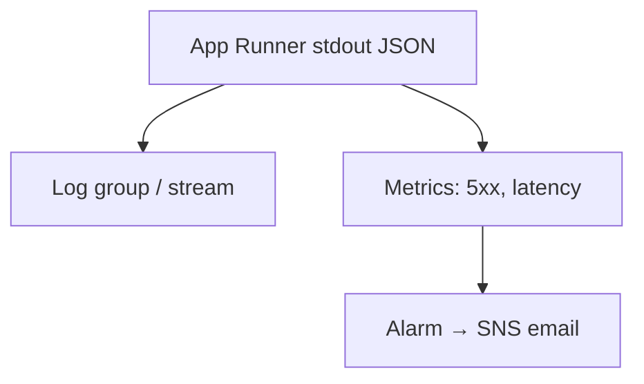

# Month 16 · Week 3 · Day 6
# Independent: CloudWatch Principles and a Project 7 MONITORING.md

**Program:** Full-Stack Mastery · 18 months  
**Phase:** 5 — Production engineering  
**Month index:** [../../README.md](../../README.md)  
**Week 3:** [1](day-01.md) · [2](day-02.md) · [3](day-03.md) · [4](day-04.md) · [5](day-05.md) · Day 6 (today) · [7](day-07.md)  
**Week rhythm today:** Independent implementation (docs + optional CLI)  
**Student state:** You designed App Runner, RDS, private S3, DNS, TLS, CDN. Today **observability on AWS**: logs, metrics, alarms — principles you already met in Month 15, now named **CloudWatch**.  
**Study time:** 3–4 focused hours

Labs: `~\fullstack-lab\month-16\week-03\day-06\`. Sketch `MONITORING.md` for **your** product. Optional: `aws` in PowerShell after install. Do not paste Project 7 source. Do not attack other accounts’ log groups.

---

## How to use this textbook

1. Map Month 15 logs/metrics/health onto CloudWatch words.  
2. Write alarms that mean **something** (billing you already have; 5xx; RDS storage).  
3. Optional CLI: `aws sts get-caller-identity` only after you understand IAM.  
4. Optional review links are for later rechecking.

---

## How to read this chapter

**CloudWatch Logs:** streams of stdout from App Runner / ECS / EC2 agent.  
**CloudWatch Metrics:** numbers over time (CPU, 5xx, connections).  
**Alarms:** a threshold that notifies (SNS email).  
**Dashboards:** optional pictures. Not a substitute for an alarm.



**Wrong belief:** “I’ll SSH and tail -f in production.”  
**Correct:** App Runner has no SSH. Even on EC2, SSH-as-logger does not scale and fights Day 2. Logs go to CloudWatch (or equivalent).

**Wrong belief:** “A dashboard is monitoring.”  
**Correct:** a dashboard you never open is art. An **alarm** you confirmed (like the billing budget) is a gate.

---

## Today's contract

1. Explain log group vs stream vs metric vs alarm.  
2. Sketch `MONITORING.md`: what you log (request id from Month 15), what you alarm, who is paged (email is enough).  
3. Tie health/readiness (Month 15) to **dumb health** (Week 2 Day 7).  
4. Optional CLI identity check — no `*` IAM experiments.

**Today's gate.** Closed-book:

> CloudWatch holds logs and metrics. Alarms notify. I will not use world SSH as my log viewer. My MONITORING.md names a 5xx alarm, a billing alarm, and a log query I would run after a failed release.

---

## Time box

| Block | Minutes | Work |
|---|---|---|
| A | 25 | Inventory Month 15 observability |
| B | 40 | CloudWatch vocabulary + alarm list |
| C | 90 | MONITORING.md for Project 7 |
| D | 20 | Optional AWS CLI |
| E | 15 | Recall |

---

# Block A — Inventory

From memory of Month 15 (this file may remind): structured JSON logs, request id, `/health` vs `/ready`, metrics as **numbers**, traces as **optional**. Write `INVENTORY.md`: what **your** app already prints. Paths only.

If logs are still pretty print, write OWED: JSON in production.

---

# Block B — Vocabulary

Write `CLOUDWATCH.md`:

| Word | Meaning | Example |
|---|---|---|
| Log group | Folder of logs | `/aws/apprunner/my-api` |
| Log stream | One instance’s pipe | a revision id |
| Metric | Number | `5XXError` |
| Namespace | Metric family | AWS/AppRunner |
| Alarm | Threshold + action | 5xx > 5 for 5 minutes |
| SNS | Notify | email |
| Retention | Days logs kept | 14 (cost) |

**Principles:**

1. **Alarm on symptoms customers feel** (5xx, p99 latency if you have it) and **money** (billing).  
2. **Alarm on disk** for RDS (free storage).  
3. Do not alarm on CPU 1% — noise.  
4. Logs need **request id** so a 500 in the browser matches a line.  
5. Never log passwords, cookies, `Authorization` headers, or upload contents.

**Wrong belief:** “I’ll log every SQL bind parameter in production.”  
**Correct:** that leaks PII. Log **statement name** and duration.

---

# Block C — MONITORING.md

Create `~\fullstack-lab\month-16\week-03\day-06\MONITORING.md` **and** a copy you will later put in the **product** repo (you may wait to copy). Sections:

1. **Goals** — detect failed release (Week 2 playbook) within N minutes.  
2. **Logs** — JSON fields you already have; CloudWatch group name you **intend**.  
3. **Metrics** — request count, latency, errors (Project 7 observability section).  
4. **Alarms**  
   - Billing (exists)  
   - App 5xx  
   - RDS low storage **or** high connections  
   - Optional: App Runner 4xx spike (careful: bots)  
5. **Health** — liveness vs readiness that checks Postgres.  
6. **Failed release** — which log query (in words): filter `request_id` or `status=500`.  
7. **On-call** — your email.  
8. **Not Kubernetes** — no Prometheus required this month (concept in Month 15 is enough).  
9. **Retention / cost** — do not keep logs forever on a student account.

Write `SMOKE.md`: after deploy, `curl.exe` **your** `/health` and one authenticated path (Week 4). Monitoring does not replace smoke.

---

# Block D — Optional AWS CLI in PowerShell

If the CLI is not installed, you may skip running it. Write `CLI-OWED.md` or install from AWS’s current Windows instructions (optional review link). Then:

```powershell
aws --version
```

Configure a **named profile** with a **low-privilege** IAM user or SSO — **not** root keys.

```powershell
aws sts get-caller-identity --profile yourprofile
```

Expected: Account, Arn, UserId. Save in `WHOAMI.txt` (ARN is OK; no secret keys).

Do **not** run `aws iam create-user` experiments. Do **not** dump secrets.

If `aws` is not found, PowerShell is telling you PATH. Install + new session.

---

# Block E — Recall + git

1. Log group vs metric.  
2. Why dashboards are not enough.  
3. What never to log.  
4. Readiness vs dumb 200.  
5. Why App Runner pushes you to CloudWatch.

```powershell
cd ~\fullstack-lab
git add month-16
git commit -m "Month 16 Day 6: CloudWatch principles and MONITORING.md."
```

## Office hours

**No account.** MONITORING.md still required. CLI skip.

**Log cost.** Short retention. Do not enable every debug agent.

**SNS never arrives.** Confirm the subscription (like billing email).

---

## Definition of done

- [ ] `CLOUDWATCH.md` vocabulary  
- [ ] `MONITORING.md` with alarms  
- [ ] No secrets in logs examples  
- [ ] CLI identity **or** CLI-OWED  
- [ ] Commit exists  

---

## Optional review links

- [CloudWatch Logs](https://docs.aws.amazon.com/AmazonCloudWatch/latest/logs/WhatIsCloudWatchLogs.html)  
- [CloudWatch alarms](https://docs.aws.amazon.com/AmazonCloudWatch/latest/monitoring/AlarmThatSendsEmail.html)  
- [AWS CLI](https://docs.aws.amazon.com/cli/latest/userguide/getting-started-install.html)  
- [sts get-caller-identity](https://docs.aws.amazon.com/cli/latest/reference/sts/get-caller-identity.html)  

---

# Lecture: alarms that lie, logs that leak

An alarm on **CPU > 80%** on a tiny App Runner instance may fire because of a single deploy. An alarm on **5xx ≥ 1** may fire because you curled a missing favicon. Prefer: 5xx **rate** or count over **five minutes**, plus a **billing** alarm you already have, plus **RDS free storage**. Write the threshold in `MONITORING.md` as a number you will revisit, not “alert me if anything happens.”

**Insights queries** (concept): filter `@message like /ERROR/` and your `request_id`. You do not need a novel of query language today. You need to know the log group **name** you will type in Week 4.

**Wrong belief:** “I’ll set `DEBUG=true` in production so CloudWatch is complete.”  
**Correct:** DEBUG logs PII and secrets. Production `INFO`/`ERROR` with request ids. Staging may be louder.

**CLI profile.** `aws configure` writes credentials under your user profile directory. That file is **not** for git. SSO: `aws sso login --profile …`. Root keys in `~/.aws/credentials` violate Day 1 — delete them.

Write `ALARM-LIE.md` (eight lines): one noisy alarm you refuse; one silent failure (dumb health) CloudWatch will not see unless you measure 5xx.

**Retention.** Fourteen days of logs is enough for this course. Forever is how a student bill grows in silence.

Write `LOG-GROUP.txt`: the intended CloudWatch group name for **your** API, even if it does not exist yet.

Write `CLI-SAFETY.md`: never `aws s3 rb` on a bucket you did not create today.

---

## Tomorrow

**Week review** — threat-model your AWS sketch (IAM, data, network). **Cost:** how to delete everything you created.
