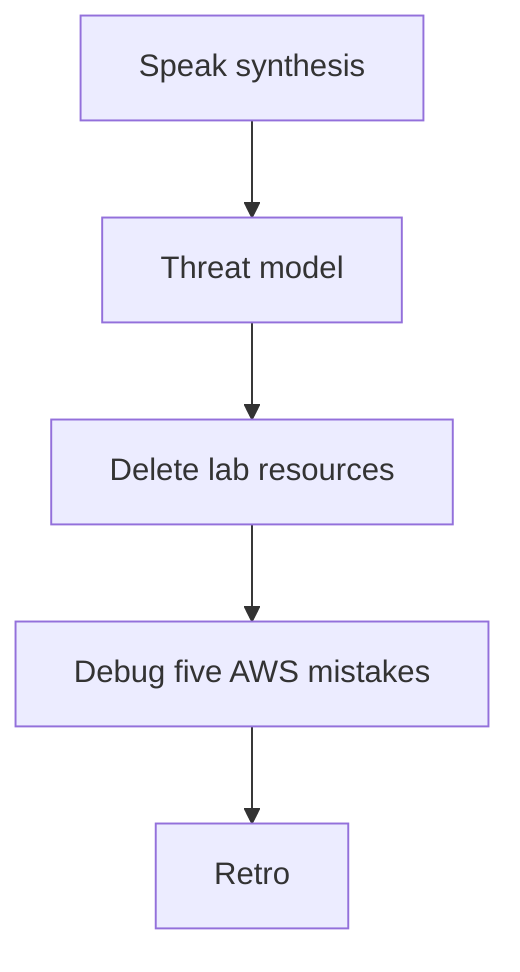
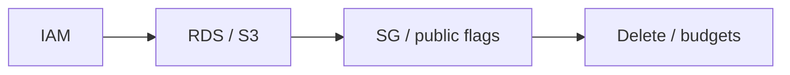

# Month 16 · Week 3 · Day 7
# Week Review — Threat Model Your Sketch, Then Delete What You Created

**Program:** Full-Stack Mastery · 18 months  
**Phase:** 5 — Production engineering  
**Month index:** [../../README.md](../../README.md)  
**Week 3:** [1](day-01.md) · [2](day-02.md) · [3](day-03.md) · [4](day-04.md) · [5](day-05.md) · [6](day-06.md) · Day 7 (today)  
**Week rhythm today:** Review, repair, plan Week 4  
**Student state:** You chose App Runner + RDS, private S3, DNS/TLS/CDN ideas, CloudWatch. Today you **threat-model** that sketch and you **tear down** lab resources so the billing alarm stays quiet.  
**Study time:** 3–4 focused hours

Do not start Week 4 because the calendar moved if you cannot explain IAM vs SG. Work in `~\fullstack-lab\month-16\week-03\day-07\`.

---

## How to read this chapter

This is a **closed-book teaching day**. The synthesis **is** the Week 3 lesson.



Days 1–6 closed during the threat model first draft. Repair from **this** recap.

---

## Week synthesis (the lesson, in this book)

**Account / region / AZ.** One region this month. AZ is isolation inside a region. Billing is real. **Budget/alarm first.** Free Tier is not armor.

**Root vs IAM user vs role.** Root + MFA, break-glass. Humans: IAM user or Identity Center + MFA. Machines: **roles** (App Runner, GitHub OIDC). No access keys in git.

**Least privilege.** JSON policy: `Version`, `Statement`, `Effect`, `Action`, `Resource`. `GetObject` on a prefix, not `s3:*` on `*`. `AdministratorAccess` is not how RDS “works.”

**VPC lite.** Public subnet + IGW vs private subnet. **Security groups** are stateful allow-lists. **RDS not public.** **Refuse** `0.0.0.0/0` on SSH and 5432. NAT costs money.

**Compute default: AWS App Runner** running a **CI image digest**, HTTPS hostname included, no SSH. Fallback: **EC2 + Compose** pulling the same images, still no git-pull snowflake, still locked SSH. ECS Fargate: industry common, more moving parts. Elastic Beanstalk: PaaS, not our default. **Kubernetes: not required.**

**RDS PostgreSQL.** Managed engine, snapshots, restore = new endpoint. You still Alembic. No `create_all`. No public 5432. SG from app only.

**S3.** Private, Block Public Access, no public ACL. IAM on prefix. Presign or API upload. `VITE_` is not a secret store.

**DNS / ACM / CloudFront.** Records name things. ACM lifecycle; CloudFront certs in **us-east-1**. CDN caches static bytes; not a database.

**CloudWatch.** Logs, metrics, alarms. Confirmed email. No passwords in logs. Dumb health is still dumb.

**Wrong belief:** “AWS is the production process.”  
**Correct:** AWS **hosts** the artifact you already learned to promote. A git-pull EC2 in AWS is still a snowflake.

---

## Threat model (this course’s shape)

You already wrote a product threat model in Month 13. Today you add **AWS**.

**Assets:** customer data in RDS; objects in S3; source in GitHub; ability to **spend money**; session secrets.

**Trust boundaries:** browser | internet | App Runner | VPC | RDS; GitHub Actions | OIDC | AWS APIs.

**Attack surfaces (defense — you harden yours):** leaked IAM key; public bucket; public RDS; world SSH; over-privileged role; logs with tokens; abandoned NAT/ALB.

**Mitigations:** MFA; tight policies; private data stores; required CI; secrets in platform; billing alarm; delete unused.

You will **not** write exploit PoCs, port scans of third parties, or ransomware playbooks. If a row says “attacker does X,” the next sentence is **your control**, not a how-to.

---

## Cost: how to delete everything

Order matters. Examples:

1. App Runner service (stop compute).  
2. RDS instance (snapshots: delete **or** keep one with a date — snapshots **cost**).  
3. S3: empty bucket **then** delete bucket.  
4. CloudFront distribution: disable, wait, delete (slow).  
5. Load balancers, NAT gateways, Elastic IPs, unused EBS.  
6. VPC connectors.  
7. IAM lab users you do not need (not your only MFA user).  
8. Budgets: you may **keep** the billing alarm.

Write what you actually deleted. The console **Billing → Bills** tomorrow morning is the exam.

**Wrong belief:** “Stopping EC2 always zeros the bill.”  
**Correct:** EBS volumes, snapshots, ALB, NAT, IPs can continue.

---

## Today's contract

**Today's gate.** Closed-book:

> I can threat-model IAM, data, and network on my App Runner + RDS + private S3 sketch. I refuse public 5432 and world SSH. I deleted lab resources or listed why they remain. Kubernetes is still optional.

---

## Time box

| Block | Minutes | Work |
|---|---|---|
| 1 | 35 | Speak; `exam-01.md` |
| 2 | 50 | Threat model |
| 3 | 30 | Debug A–E |
| 4 | 40 | Teardown + DELETE-LOG.md |
| 5 | 20 | MONITORING gap |
| 6 | 20 | Week 4 design |
| 7 | 15 | Retro |

---

# Block 1 — Speak

Root/role/region; billing first; SG vs IAM; App Runner default; RDS backups; private S3; ACM region trap; CloudWatch alarm vs dashboard. `exam-01.md` 20–35 lines.

```powershell
cd ~\fullstack-lab
mkdir month-16\week-03\day-07 -Force
cd ~\fullstack-lab\month-16\week-03\day-07
```

---

# Block 2 — Threat model

`THREAT.md` required table:

| Asset | Threat | Boundary | Mitigation |
|---|---|---|---|
| RDS data | Public 5432 / leaked URL | Network | Private + SG |
| S3 objects | Public ACL | Data | Block Public Access + authz |
| AWS spend | Forgotten NAT | Account | Budget + delete |
| Deploy | Stolen GitHub secret | CI | OIDC, no prod secrets on PRs |
| SSH | 0.0.0.0/0 | Network | Refuse / SSM / no EC2 |
| Logs | Token in JSON | App | Redaction |

Add two rows using **your** product nouns (workspace files, etc.).

---

# Block 3 — Debug

**A.** Student used root access keys on a laptop, keys committed “temporarily.”  
**B.** RDS public, SG `/32` home IP, screenshot on Twitter.  
**C.** Bucket public so `` works.  
**D.** App role `AdministratorAccess`.  
**E.** “Kubernetes next week so we can skip SG.”  

---

# Block 4 — Teardown

Open every `DELETE-ME.md` from this week. Delete or justify. `DELETE-LOG.md`: resource, region, time, result.

If **no** resources: write `NONE.txt`. Still walk Billing.

Keep: billing alarm, IAM user with MFA, maybe a domain.

---

# Block 5 — Monitoring gap

Open `..\day-06\MONITORING.md`. `exam-05-gap.md`: one alarm still missing.

---

# Block 6 — Design

`WEEK4.md`: deploy plan will fill **your** URLs. If no AWS account, staging Compose + AWS mapping. Localhost is not production.

---

# Block 7 — Retro

```powershell
cd ~\fullstack-lab
git add month-16
git commit -m "Month 16 Week 3 review: threat model and teardown log."
```

---

## Office hours

**RDS delete protection.** Disable protection, then delete. Snapshots: explicit delete.

**CloudFront takes an hour.** Start disable early in the block.

---

## Definition of done

- [ ] `THREAT.md` table  
- [ ] Debug before the box  
- [ ] `DELETE-LOG.md` or NONE  
- [ ] Billing alarm still on  
- [ ] Commit exists  

---

## Optional review links

- [AWS: Shared Responsibility Model](https://aws.amazon.com/compliance/shared-responsibility-model/)  
- [AWS: How to delete resources](https://docs.aws.amazon.com/accounts/latest/reference/manage-acct-resources.html)  

---

# Worked answers — after DEBUG.md

**A.** Rotate/disable keys; remove from git history as best you can; MFA user; never root keys.  
**B.** Publicly accessible No; rotate DB password; treat screenshot as leak.  
**C.** Private bucket; presign or authenticated proxy; Block Public Access.  
**D.** Replace with prefix S3 + no admin. RDS is not IAM admin.  
**E.** Kubernetes would add more IAM and network, not less. Optional, not a skip.



---

## Closed-book cards

1. Why billing first.  
2. Role vs user.  
3. GetObject resource ARN shape.  
4. Why refuse world SSH.  
5. Why App Runner default.  
6. What managed Postgres still needs from you.  
7. CloudFront cert region.  
8. Dumb healthcheck.  
9. Snapshot restore changes the endpoint.  
10. Kubernetes required?

---

# Lecture: teardown order and leftover bills

Students delete the EC2 instance and keep the **EBS volume**. They delete App Runner and keep a **VPC connector**. They delete RDS and keep **snapshots** “in case.” Snapshots are not free. If the lab RDS never had real data, delete the snapshots too. If it had a migrate drill you care about, keep **one** snapshot, name it `lab-keep-YYYYMMDD`, and put it on next month’s delete calendar.

**Load balancers and NAT** are the classic surprise. This course tried to avoid them by choosing App Runner. If you created either while clicking, they are first on `DELETE-LOG.md`.

**IAM leftover.** A lab user with `AdministratorAccess` and an access key is worse than a running micro RDS. Delete the keys, then the user, or strip the policy. Do not delete the **only** MFA human user so you are locked to root.

**S3.** Empty the bucket (including versioned delete markers if versioning is on) **then** delete the bucket.

**CloudWatch log groups** can linger and cost a little. Delete lab groups or set retention to 1 day.

Write `LEFTOVER.md`: three resource types you will check in Billing 48 hours from now. If you have no account, write the same three as a future checklist.

**Wrong belief:** “I’ll leave RDS running so Week 4 is faster.”  
**Correct:** only if it is on `DELETE-ME.md` with a reason and a confirmed billing alarm.

**Shared responsibility (one sentence).** AWS secures the building; you secure IAM, SG, public flags, and application authz. A private RDS with `AdministratorAccess` on the human user is still your hole.

Write `RESPONSIBILITY.md` (eight lines): three things AWS patches (RDS engine host), three things you own (Alembic, bucket ACL, root MFA).

**Cost explorer.** Open it once. If it is empty, good. If a NAT is there, delete the NAT.

Write `KEEP.md`: billing alarm, MFA user, maybe the domain — everything else from this week’s labs is guilty until listed.

**Wrong belief:** “Terminated means deleted.”  
**Correct:** EC2 terminated can leave EBS. RDS deleted can leave snapshots. Check both lists.

Write `BILL-TOMORROW.md`: you will open Billing in 48 hours and write the amount, even if zero.

## Closed-book

IAM, data, network: one mitigation each. Then delete what you created.

---

## Tomorrow

**Week 4 Day 1** — written deploy plan for **your** Month-12 / Project 7 app: DNS, TLS, env, migrations, logs, rollback. You fill **your** URLs.
