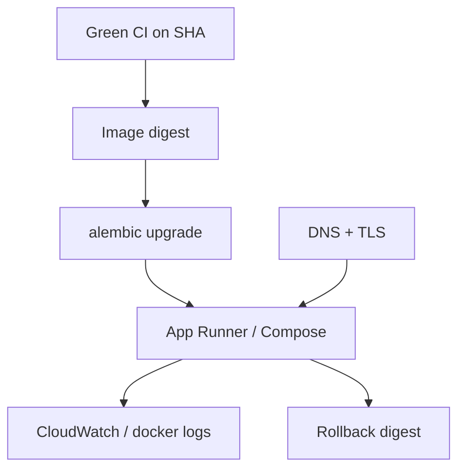

# Month 16 · Week 4 · Day 1
# Written Deploy Plan: DNS, TLS, Env, Migrations, Logs, Rollback

**Program:** Full-Stack Mastery · 18 months  
**Phase:** 5 — Production engineering  
**Month index:** [../../README.md](../../README.md)  
**Week 4:** Day 1 (today) · [2](day-02.md) · [3](day-03.md) · [4](day-04.md) · [5](day-05.md) · [6](day-06.md) · [7](day-07.md)  
**Week rhythm today:** Learn + write the plan  
**Student state:** Month 15 containerized you. Weeks 1–3 gave CI, artifacts, and an AWS sketch (App Runner + RDS by default). Today you write the **deploy plan for your Month-12 / Project 7 app**. You fill **your** URLs. This textbook will not invent a fake company domain as if it were yours.  
**Study time:** 3–4 focused hours

Labs: `~\fullstack-lab\month-16\week-04\day-01\`. Product config lives in **your** repos. Do not paste application source. Kubernetes is not required.

If you have **no AWS account**, you still write the plan with **intended** hostnames and an honest **staging Compose** path. Localhost is **not** production (Month 16 README). The gate stays honest.

---

## How to use this textbook

1. Read what a deploy plan must name.  
2. Fill every blank with **your** nouns and hostnames (or `TBD` plus why).  
3. Optional review links are for later rechecking.

---

## How to read this chapter

A deploy plan is not a mood. It is a document another engineer (future you) could execute on a bad day.



**Wrong belief:** “I’ll figure out DNS when the console asks.”  
**Correct:** Week 4 Day 2 is a checklist. Today you **name** `api.yourdomain` and `yourdomain` so Day 2 is typing, not inventing.

**Wrong belief:** “The plan is the AWS getting-started wizard.”  
**Correct:** the wizard does not know your Alembic, your cookie domain, or your previous digest.

---

## Today's contract

1. Write `DEPLOY-PLAN.md` covering DNS, TLS, env, migrations, logs, rollback.  
2. Fill **your** URLs (or TBD + Compose mapping).  
3. Name the **exact** GitHub workflow that must be green.  
4. Name where secrets live (platform), not values.  
5. State App Runner default or EC2 fallback **explicitly**.

**Today's gate.** Closed-book:

> I have a written plan for my app: a digest from CI, migrate then start, HTTPS on my hostname (or an honest App Runner URL plus DNS TBD), env from the platform, logs I can open, rollback to the previous digest with a migration caveat. Localhost is not production.

---

## Time box

| Block | Minutes | Work |
|---|---|---|
| A | 50 | Theory: what the plan must contain |
| B | 60 | Type the plan template **with your URLs** |
| C | 70 | Gaps, risks, mapping if no AWS |
| D | 15 | Git |
| E | 15 | Recall |

---

# Block A — Theory

## 1. Why Month 12’s app is the target

Project 7 is the long-lived product. Month 12 made it a full stack. Months 13–15 added authz, tests, containers. Month 16 attaches **the path to a URL other people could type**.

You will not paste that product into fullstack-lab. You will **reference** repo names, image names, and hostnames.

## 2. The six sections the plan must have

### DNS

Who owns the domain? Which records (A/alias/CNAME) for:

- production web  
- production API (if separate host)  
- staging (recommended)  

TTL: start moderate. Do not pretend DNS rollback replaces image rollback.

### TLS

ACM (region!) or Let’s Encrypt on EC2. Validation CNAMEs. What users type: `https://…`. HTTP should redirect. Cookie `Secure` in production (Month 13).

### Env / secrets

Table of **names**: `DATABASE_URL`, `SECRET_KEY`, frontend origin, email provider, Redis URL if any, S3 bucket. Values in App Runner env / SSM / Secrets Manager / GitHub Environments. `.env` not in git.

### Migrations

Command: `alembic upgrade head` in the **new** image. Failure: do not start (or do not switch traffic). Expand/contract reminder. Snapshot before a scary revision if RDS exists.

### Logs

Where: CloudWatch group name **you** intend, or `docker compose logs` on the fallback VM. Request id. Who looks after a 500.

### Rollback

Previous digest stored in `RELEASES.md` (start it today). Image rollback vs contract migration. Playbook from Week 2 Day 7.

## 3. Two honest topologies

**Default:** GHCR/ECR image → App Runner (API) → RDS private → S3 private → optional CloudFront SPA → Route 53.

**Fallback:** same image → Docker Compose on one EC2 → RDS (or Compose Postgres **only** if you document it as not the preferred prod DB) → nginx/Caddy for TLS.

**No account:** Compose `staging` project on your PC or a cheap VPS you already have; `AWS-MAPPING.md` maps each Compose service to the AWS name. The **production URL** row in the Month 16 gate stays **false** until the account exists. Do not mark it true on `http://127.0.0.1`.

## 4. Frontend and API origins

If the SPA is on `https://app.example.com` and the API on `https://api.example.com`, CORS and cookie `Domain` must match **your** plan. If you serve both from one host (API + static), say so. Wrong origin is CD defect E (Week 2).

## 5. What “repeatable” means

A **fresh commit** on `main` (Week 4 Day 7): CI green → image tagged with SHA → migrate → service points at new digest → curl health. If any step is “I clicked around until it worked,” write that as a **risk** today and kill it by Day 4.

## 6. Kubernetes

Still optional. If your plan says “EKS,” you are off this course’s default. Bring it back to App Runner or Compose unless you can already debug a cluster — this month’s gate does not require it.

---

# Block B — Type-along plan

```powershell
cd ~\fullstack-lab
mkdir month-16\week-04\day-01 -Force
cd ~\fullstack-lab\month-16\week-04\day-01
```

Create `DEPLOY-PLAN.md`. Fill **every** field. Use `TBD` only with a sentence.

```markdown
# Deploy plan — Project 7 (my product name)

## Identity
- Repos:
- Home AWS region:
- Compute: App Runner / EC2+Compose (circle one)
- Registry:

## URLs (mine)
- Production web:
- Production API:
- Staging web:
- Staging API:
- Health path:

## CI gate
- Workflow file:
- Required check name:
- Branch protection: yes/no/equivalent

## Artifact
- Image name:
- Tag scheme: git SHA
- Where digest is recorded:

## DNS
- Registrar:
- Records I will create:

## TLS
- Issuer: ACM / Let's Encrypt / platform default
- ACM region notes:

## Env names (no values)
-

## Migrations
- Command:
- When:
- Snapshot?:

## Logs
- System:
- Group or command:

## Rollback
- Previous digest location:
- Migration caveat:

## Kubernetes
- Required? no
```

Also start `RELEASES.md` with a header row: date, git SHA, digest, env, who, result.

Write `URL-RULES.txt`: localhost is not production; App Runner default hostname **may** count as a public HTTPS URL you can repeat — custom DNS is still owed for the full Day 2 skill.

---

# Block C — Independent

`RISKS.md` — top five ways this plan fails (wrong secret, RDS public, forgotten migrate, cached `index.html`, cookie domain). Mitigations from earlier weeks.

`NO-AWS.md` **or** `ACCOUNT.md`: which is true. If no AWS: `AWS-MAPPING.md` table:

| Plan item | Staging Compose today | AWS later |
|---|---|---|
| API process | compose service | App Runner |
| Postgres | compose volume | RDS |
| Uploads | local disk / minio | S3 |
| TLS | mkcert / none | ACM |
| Logs | docker compose logs | CloudWatch |

`COOKIE-CORS.md`: three lines using **your** two hostnames.

Do not start the live deploy until Day 4. Today is the **plan**.

---

# Block D — Git

```powershell
cd ~\fullstack-lab
git add month-16
git commit -m "Month 16 Week 4 Day 1: Project 7 deploy plan with my URLs."
```

If you also add `DEPLOY-PLAN.md` in the **product** repo, do that there with a message you own. Still no secrets.

---

# Block E — Recall

1. Six sections of the plan.  
2. Why TBD localhost is dishonest as production.  
3. Migrate then start.  
4. Where the previous digest lives.  
5. App Runner vs fallback.

## Office hours

**One repo vs two.** The plan has one section per deployable. Fine.

**No domain.** App Runner URL + mapping; Day 2 still teaches certificates.

**Plan longer than the app.** Good. Production is the boring document.

---

## Definition of done

- [ ] `DEPLOY-PLAN.md` filled with *your* URLs or honest TBD  
- [ ] `RELEASES.md` started  
- [ ] Risks listed  
- [ ] Mapping if no AWS  
- [ ] No secret values  
- [ ] Commit exists  

---

## Optional review links

The plan structure is this chapter.

- [AWS App Runner custom domain](https://docs.aws.amazon.com/apprunner/latest/dg/manage-custom-domains.html)  
- [AWS: Setting up a custom domain name for CloudFront](https://docs.aws.amazon.com/AmazonCloudFront/latest/DeveloperGuide/CNAMEs.html)  

---

## Tomorrow

**DNS + HTTPS** — a typed checklist and certificate lifecycle. You will wire names conceptually (and in the registrar if you own them).
