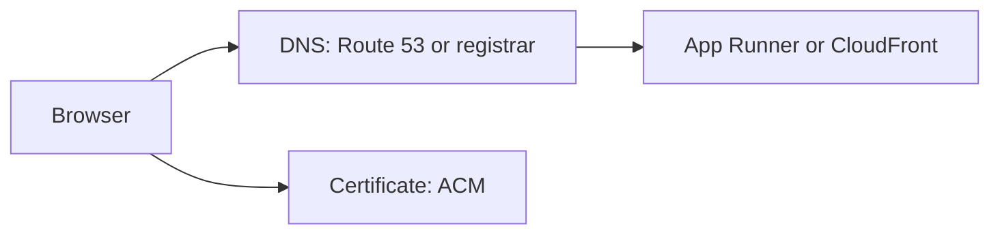

# Month 16 · Week 4 · Day 2
# DNS and HTTPS: A Typed Checklist and Certificate Lifecycle

**Program:** Full-Stack Mastery · 18 months  
**Phase:** 5 — Production engineering  
**Month index:** [../../README.md](../../README.md)  
**Week 4:** [1](day-01.md) · Day 2 (today) · [3](day-03.md) · [4](day-04.md) · [5](day-05.md) · [6](day-06.md) · [7](day-07.md)  
**Week rhythm today:** Exercises + checklist  
**Student state:** `DEPLOY-PLAN.md` names **your** hostnames. Today you turn DNS and TLS into **typed steps** and you learn the **certificate lifecycle** so a padlock screenshot is not the whole skill.  
**Study time:** 3–4 focused hours

Labs: `~\fullstack-lab\month-16\week-04\day-02\`. You may click in Route 53 / your registrar. You will not attack someone else’s domain. Do not paste Project 7.

---

## How to use this textbook

1. Read records and cert lifecycle.  
2. Type `DNS-CHECKLIST.md` and `TLS-CHECKLIST.md` using **your** names.  
3. If you have no domain, complete the checklists with App Runner’s default hostname and mark custom DNS **OWED**.  
4. Optional review links are for later rechecking.

---

## How to read this chapter

Users type a **name**. DNS returns an **answer**. TLS proves the server is allowed to use that name.



**Wrong belief:** “I’ll add an A record to a random IP I saw in the console once.”  
**Correct:** App Runner and CloudFront want **their** custom-domain / alias flow. A leftover Elastic IP from a deleted EC2 is how students hijack themselves.

**Wrong belief:** “The certificate is done when the console says Issued.”  
**Correct:** it is done when it is **attached** to the service users hit, the browser trusts it, **and** renewal will still succeed (DNS validation record still there).

---

## Today's contract

1. List the records you will create (type, name, target).  
2. Walk certificate lifecycle: request → validate → attach → renew → (rare) revoke.  
3. Note the **us-east-1** trap for CloudFront ACM.  
4. Check CORS/cookies against the **https** origins in the plan.  
5. `curl.exe` a health URL when one exists (even App Runner default).

**Today's gate.** Closed-book:

> DNS names the service. ACM (or Let’s Encrypt) issues a cert after I prove the name. I attach it. Renewal needs the validation record to remain. CloudFront certs are requested in us-east-1. I do not call HTTP localhost production.

---

## Time box

| Block | Minutes | Work |
|---|---|---|
| A | 45 | Theory |
| B | 70 | Type checklists; create records if you can |
| C | 55 | Lifecycle worksheet + curl |
| D | 15 | Git |
| E | 15 | Recall |

---

# Block A — Theory

## 1. Record types you will actually use

| Type | When |
|---|---|
| **CNAME** | `www` or `api` → App Runner / CloudFront hostname |
| **Alias** (Route 53) | Apex or AWS targets that refuse a naked CNAME |
| **A/AAAA** | Only if you truly have a stable IP (EC2 fallback with Elastic IP — remember to **delete** it Day 7 of last week if unused) |
| **CNAME** (ACM) | `_something.acm-validations.aws` style validation |

Do not create ten leftover records “for later.”

## 2. App Runner custom domain (default path)

AWS will ask you to create specific records. Type them into your checklist **from the console**, not from memory of a blog. Propagation is not instant. `nslookup` or `Resolve-DnsName` in PowerShell:

```powershell
Resolve-DnsName api.YOUR_DOMAIN
```

Windows: that cmdlet is the analog of `dig`. `curl.exe https://api.YOUR_DOMAIN/health` after TLS works.

## 3. Certificate lifecycle (full sentences)

1. **Request.** You name `app.example.com` (SANs for `www` if needed).  
2. **Prove.** DNS validation: ACM gives a CNAME. You publish it. Email validation exists; this course prefers **DNS**.  
3. **Issue.** ACM status becomes issued.  
4. **Attach.** App Runner custom domain, CloudFront viewer certificate, or load balancer listener. Unattached certs do not protect users.  
5. **Serve.** Browser shows trusted HTTPS. Redirect HTTP → HTTPS.  
6. **Renew.** ACM renews if validation still succeeds. If you deleted the CNAME, renewal **fails** weeks later — a time bomb.  
7. **Revoke.** Rare; stolen private key (ACM holds keys for ACM certs — still rotate if you leaked something else). Let’s Encrypt on EC2: **you** hold keys — do not commit them.

**Wrong belief:** “I’ll download the ACM private key to put on nginx.”  
**Correct:** ACM public certificates generally **do not** export private keys. Terminate TLS at CloudFront / ALB / App Runner, or use Let’s Encrypt **on** the box for the EC2 fallback.

## 4. Staging certificates

`staging.example.com` gets its **own** cert or a SAN. Do not reuse production secrets. Do not point staging DNS at production.

## 5. Mixed content and cookies

A page on HTTPS that calls `http://api…` will fail. Vite `VITE_API_URL` for the **production build** must be the https API. Rebuild the frontend artifact when the URL changes — it is baked at **build** time.

Cookies: `Secure`, `SameSite` as you designed in Month 13. Wrong site for SameSite is not a DNS bug.

---

# Block B — Type-along checklists

```powershell
cd ~\fullstack-lab
mkdir month-16\week-04\day-02 -Force
cd ~\fullstack-lab\month-16\week-04\day-02
```

`DNS-CHECKLIST.md`:

| # | Record type | Host | Target / value | Done? |
|---|---|---|---|---|
| 1 | | | | |
| 2 | ACM validation | | | |
| 3 | staging | | | |

`TLS-CHECKLIST.md`:

- [ ] Cert requested for **my** names  
- [ ] Region correct (us-east-1 if CloudFront)  
- [ ] Validation record present  
- [ ] Status issued  
- [ ] Attached to the service  
- [ ] `curl.exe -I https://…` shows TLS (or documented wait)  
- [ ] HTTP redirect (or OWED)  
- [ ] Validation record will **not** be deleted  

If no domain: fill the tables with App Runner default `*.awsapprunner.com` and write `CUSTOM-DNS-OWED.md`.

Open Day 1 `DEPLOY-PLAN.md` and **update** DNS/TLS rows with what you learned. Do not copy product source.

---

# Block C — Exercises

`LIFECYCLE.md` — one sentence per step request → revoke, using **your** hostname.

`FAILURES.md`:

1. Validation CNAME deleted after issue. What breaks later?  
2. Cert in `eu-west-1` attached to CloudFront. What happens?  
3. DNS still points at an old EC2. New App Runner is healthy. Users see old app.  

`curl.exe` evidence in `CURL.txt` (headers only, no cookies that are secrets). If DNS is not ready, curl the App Runner URL.

`CORS-HTTPS.md`: production `VITE_API_URL` and cookie domain — names only.

---

# Block D — Git

```powershell
cd ~\fullstack-lab
git add month-16
git commit -m "Month 16 Day 2: DNS and TLS checklists for my hostnames."
```

---

# Block E — Recall

1. Why issued ≠ attached.  
2. CloudFront ACM region.  
3. Why validation CNAMEs must stay.  
4. `Resolve-DnsName` vs guessing.  
5. Why frontend env is a rebuild.

## Office hours

**Pending validation.** Typo in the CNAME. Wait for TTL. Do not spam ten certs.

**Registrar vs Route 53.** Nameservers must match where you create records.

**Let’s Encrypt rate limits.** Do not loop certbot as a test.

---

## Definition of done

- [ ] DNS and TLS checklists typed  
- [ ] Lifecycle written  
- [ ] Three failure stories  
- [ ] curl or honest wait  
- [ ] Commit exists  

---

## Optional review links

- [ACM: DNS validation](https://docs.aws.amazon.com/acm/latest/userguide/dns-validation.html)  
- [App Runner custom domains](https://docs.aws.amazon.com/apprunner/latest/dg/manage-custom-domains.html)  
- [PowerShell Resolve-DnsName](https://learn.microsoft.com/powershell/module/dnsclient/resolve-dnsname)  

---

# Lecture: validation records and the week-later outage

The cruel TLS bug is not “pending validation.” It is **Issued**, site works, someone “cleans unused CNAMEs” in the DNS panel, ACM cannot renew, and three months later browsers scream. Your checklist’s last box — **do not delete the validation record** — is the whole lifecycle in one habit.

**Wrong belief:** “I’ll use the same ACM cert for CloudFront and App Runner in eu-west-1.”  
**Correct:** CloudFront’s cert lives in **us-east-1**. App Runner wants a cert in the **service region**. Two requests, two validation CNAMEs if the names differ, or one name with two certs.

**Apex.** `example.com` → CloudFront often uses Route 53 **alias**. A CNAME on the apex is invalid in classic DNS. If your registrar is not Route 53, read **their** alias/ANAME feature or put the app on `www` and redirect the apex.

**Staging vs prod.** Two hostnames, two certs (or one cert with two SANs). Do not share the production `SECRET_KEY` with staging because “the cert is the same.” Certificates are not secrets in the cookie sense; **session keys** still split.

Write `TTL.md`: what TTL you chose and why a 48-hour TTL makes a bad A record linger. Image rollback is still faster than DNS rollback.

`curl.exe -vI https://YOUR_HOST/health` shows the certificate subject in the verbose TLS handshake. Save a redacted snippet in `CERT-SUBJECT.txt` (names, not keys).

---

## Tomorrow

**Memory** — closed-book deploy checklist from this week’s recap (Days 1–2 closed).
