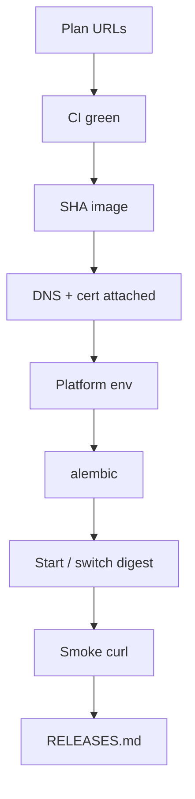

# Month 16 · Week 4 · Day 3
# From Memory: The Closed-Book Deploy Checklist

**Program:** Full-Stack Mastery · 18 months  
**Phase:** 5 — Production engineering  
**Month index:** [../../README.md](../../README.md)  
**Week 4:** [1](day-01.md) · [2](day-02.md) · Day 3 (today) · [4](day-04.md) · [5](day-05.md) · [6](day-06.md) · [7](day-07.md)  
**Week rhythm today:** Implement from memory  
**Student state:** Day 2 checklists exist. Tomorrow you deploy. Today the **order of operations** must live in your head — from **this file**.  
**Study time:** 3–4 focused hours  
**Prereq:** Day 2 gate passed.

Labs: `~\fullstack-lab\month-16\week-04\day-03\`. Days 1–2 textbook **closed** during Blocks 1–3. Do not paste Project 7.

---

## How Day 3 works

This recap is the teacher. Stuck > 25 minutes: peek at Day 1 or Day 2 **one section**, close it, `lookups.txt`.

Commit `CHECKLIST.md` **before** the worked box.

---

## How to read this chapter

A deploy is a **sequence**. Skipping migrate or DNS does not make you faster. It makes Day 5’s logs interesting for the wrong reason.



**Wrong belief:** “Memory day is rereading Day 1 in a split editor.”  
**Correct:** the recap below is the exam paper.

---

## Complete explanation (deploy you must still own)

**CI gate.** PR workflow: lint, types, tests (Postgres service), build. Required check on `main`. Badge is not a gate. Linux runner; you edit on Windows.

**Artifact.** Image tagged with git SHA. Digest immutable. No `:latest` process. No git pull on the server. Promote the digest that passed staging.

**Compute default.** App Runner runs the image. Fallback: EC2+Compose **pulls** the image. Kubernetes not required.

**RDS.** Managed Postgres, not public 5432. Backups/snapshots. Alembic is yours. No `create_all`.

**Secrets.** `.env` ignored. Platform env. OIDC preferred over static keys.

**DNS.** CNAME/alias to the platform hostname. `Resolve-DnsName`. Do not point at a dead Elastic IP.

**TLS.** Request → DNS validate → issue → **attach** → renew (keep validation record). CloudFront certs in **us-east-1**. Issued ≠ attached.

**Env.** `DATABASE_URL`, `SECRET_KEY`, https origins. Frontend `VITE_*` baked at build — rebuild when URL changes.

**Migrate then start.** Failure stops the release. Expand vs contract vs image rollback.

**Logs.** CloudWatch or compose logs. Request id. No secrets in logs.

**Smoke.** `curl.exe` health **and** a real path. Dumb `/health` is not enough.

**Rollback.** Previous digest. Migration caveat. Playbook: stop making it worse; name artifact, config, schema.

**Localhost.** Not production. No AWS account: staging Compose + AWS mapping; gate URL row stays false.

**Wrong belief:** “Cert issued means users have HTTPS.”  
**Correct:** attach to the service they hit.

**Wrong belief:** “I’ll migrate after the party when the API 500s.”  
**Correct:** migrate in the new image **before** serving.

---

## Today's contract

1. Write a closed-book **ordered** checklist (≥ 12 steps).  
2. Include DNS, TLS, env, migrate, smoke, ledger.  
3. Mark three **stop** conditions (red CI, migrate fail, health fail).  
4. Mini: `RELEASES` row format from memory.

**Today's gate.** Closed-book:

> I can list the deploy order without Day 1 open: green CI, SHA image, DNS/TLS, env, migrate, start, smoke, record digest. I know issued ≠ attached. I know localhost is not production.

---

## Time box

| Block | Minutes | Work |
|---|---|---|
| 1 | 25 | Speak; `exam-01.md` |
| 2 | 50 | `CHECKLIST.md` ordered steps |
| 3 | 45 | Stop conditions + CORS/cookie lines |
| 4 | 30 | Debug A–E |
| 5 | 20 | Worked box |
| 6 | 20 | Your URLs recopied from memory |
| 7 | 15 | Retro |

---

# Block 1 — Speak

Cover: CI gate, digest, App Runner, private RDS, DNS+ACM lifecycle, migrate, smoke, rollback, no Kubernetes required. `exam-01.md` 12–20 lines.

```powershell
cd ~\fullstack-lab
mkdir month-16\week-04\day-03 -Force
cd ~\fullstack-lab\month-16\week-04\day-03
```

---

# Block 2 — Checklist from spec

**Spec:** an ordered checklist titled `Production deploy — library of steps`. It must include, in **sensible** order (you choose, you defend):

- Confirm billing alarm still exists  
- Confirm CI required check green on the SHA  
- Confirm image digest in registry  
- DNS records  
- ACM validation + attach  
- Platform env names set (not echoed)  
- Snapshot if migrate is scary  
- `alembic upgrade head`  
- Point App Runner / Compose at digest  
- `curl.exe` health  
- One real GET/POST smoke (your nouns)  
- Append `RELEASES.md`  
- Watch CloudWatch for 5 minutes  

Write `CHECKLIST.md`. No product handlers.

---

# Block 3 — Stops and origins

`STOPS.md`: three conditions that **abort** the release.

`ORIGINS.md`: https web origin, https API origin, why HTTP API on an HTTPS page fails.

---

# Block 4 — Debug

**A.** Cert Issued; custom domain not associated; users get the default hostname mismatch warning.  
**B.** Migrated after traffic switch; old and new instances mixed.  
**C.** `VITE_API_URL` still localhost in the production SPA image.  
**D.** `curl.exe http://127.0.0.1:8000/health` as production evidence.  
**E.** Rolled back `:latest`.  

---

# Block 5 — Worked box (after CHECKLIST.md)

A valid order (yours may swap DNS and image build if CI already built): **CI green → digest exists → DNS/TLS attached → env → snapshot → migrate → switch compute → smoke → ledger → logs**.

Stops: red CI; migrate nonzero; smoke fail (and dumb health with 500 list is still a fail).

**A.** Attach domain / wait for cert on **that** hostname.  
**B.** Migrate job first; one digest.  
**C.** Rebuild frontend with production https API.  
**D.** Localhost is not production.  
**E.** Pin SHA/digest.

`DIFF.md` or `MATCH.txt`.

---

# Block 6 — Design

`MY-URLS.md`: production web/API from **memory** of your plan. If you cannot remember, that is the lesson — then look at Day 1 **after** this block and note it in `lookups.txt`.

---

# Block 7 — Retro

```powershell
cd ~\fullstack-lab
git add month-16
git commit -m "Month 16 Day 3: closed-book deploy checklist."
```

---

## Office hours

**Order fights.** DNS can overlap with image build. **Migrate before switch** is the hill to die on.

**No domain.** Checklist still includes “platform default HTTPS URL” as a row.

---

## Definition of done

- [ ] `CHECKLIST.md` before the box  
- [ ] Stops and origins  
- [ ] Debug attempted  
- [ ] Commit exists  

---

## Optional review links

Repair from this recap first.

- [ACM DNS validation](https://docs.aws.amazon.com/acm/latest/userguide/dns-validation.html)  

---

# Lecture: how to read a deploy spec

When a spec says “production,” ask for **hostname**, **digest**, and **alembic**. When it says “it’s up,” ask **curl evidence** and **which digest**. When it says “rolled back,” ask **schema**.

`HEURISTIC.md` (six lines). Then Block 5 if needed.

---

## Tomorrow

**First deploy lab** — you deploy **your** app (instructions, commands, expected evidence). If no AWS account: staging Compose + AWS mapping. The gate remains honest.
