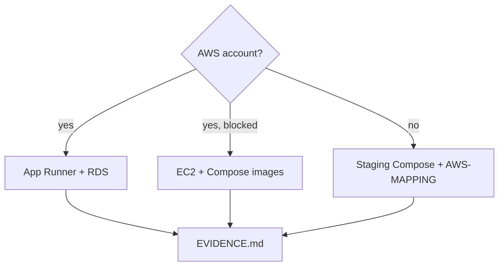

# Month 16 · Week 4 · Day 4
# Lab: First Deploy of *Your* App

**Program:** Full-Stack Mastery · 18 months  
**Phase:** 5 — Production engineering  
**Month index:** [../../README.md](../../README.md)  
**Week 4:** [1](day-01.md) · [2](day-02.md) · [3](day-03.md) · Day 4 (today) · [5](day-05.md) · [6](day-06.md) · [7](day-07.md)  
**Week rhythm today:** Lab (guided procedure + independent evidence)  
**Student state:** You can recite the deploy checklist. Today you **run** it against **your** Project 7 (Month-12 app), not a textbook paste. If you have **no AWS account**, you deploy a **staging Compose** stack and write the AWS mapping — the Month 16 production-URL gate stays **false** until the account exists.  
**Study time:** 3–4 focused hours (longer if the connector fights you; still stop rather than open RDS to the world)

Labs: `~\fullstack-lab\month-16\week-04\day-04\` for **evidence**. The app stays in **your** repos. This textbook will **not** complete Project 7 source. Kubernetes is not required.

---

## How to use this textbook

1. Follow the **path that matches your Day 1 plan** (App Runner default, or EC2+Compose fallback, or Compose-only staging).  
2. Record evidence: SHA, digest, URLs, curl, migrate output (no passwords).  
3. If you are stuck > 40 minutes on VPC connector, switch to the **documented fallback** — do not “temporarily” public RDS.  
4. Optional review links are for later rechecking.

---

## How to read this chapter

The first production-shaped deploy is allowed to be slow. It is not allowed to be **dishonest**.



**Wrong belief:** “I’ll mark production done on localhost and move to Month 17.”  
**Correct:** the [Month 16 README](../../README.md) says not to pretend. Staging Compose is **real work**. It is **not** the production URL row.

**Wrong belief:** “I’ll paste a classmate’s FastAPI main into a new repo to have something to deploy.”  
**Correct:** deploy **your** product. If the product cannot boot in Compose, that is Month 15 debt — fix it rather than inventing a second app.

---

## Today's contract

1. A **public HTTPS URL** (App Runner default, custom domain, or VPS) **or** an honest staging Compose plus mapping.  
2. Image from CI (or a local build you still **tag with git SHA** if CI push is OWED — then write the OWED).  
3. Migrations ran as a **step**.  
4. `curl.exe` health evidence.  
5. `RELEASES.md` row.  
6. RDS (or Compose Postgres) **not** opened to `0.0.0.0/0`.

**Today's gate.** Closed-book:

> I deployed my app through the plan: digest, migrate, start, curl. If I lack AWS, I said so and mapped Compose to AWS. I did not open 5432 to the world. I did not git pull on a box as the process.

---

## Time box

| Block | Minutes | Work |
|---|---|---|
| A | 30 | Theory: expected evidence |
| B | 100 | Deploy path (A, B, or C) |
| C | 50 | Evidence pack + smoke |
| D | 15 | Git |
| E | 15 | Recall |

---

# Block A — Theory: what “deployed” means today

Minimum **evidence** (files in the lab folder):

| File | Content |
|---|---|
| `SHA.txt` | git SHA you released |
| `DIGEST.txt` | image digest or `local-only` + why |
| `URL.txt` | URL you curl (https preferred) |
| `MIGRATE.txt` | alembic output snippet, no URL passwords |
| `CURL.txt` | `curl.exe -i` health headers/body |
| `RELEASES.md` | appended row |
| `SECRETS.txt` | “values in platform, not git” plus **names** set |

Smoke: health **and** one product path (login page GET, or `/docs` if that is public, or an API 401 that proves the API is **yours**). A 401 on a protected route can be **good** evidence the server is the real app.

**Windows:** `curl.exe` not the alias that might be Invoke-WebRequest. Add `-i`. Do not print `Set-Cookie` values into git if they look like sessions — headers names are enough.

---

# Block B — Pick one path and type it

## Path A — App Runner (course default)

Commands are **yours** to adapt. Shape:

1. Confirm billing alarm.  
2. Confirm `main` CI green for this SHA.  
3. Image in GHCR or ECR: `owner/app:SHA`.  
4. RDS exists, **not public**, SG from connector only. Password in App Runner secrets, not in git.  
5. Create App Runner service from **container registry**, port matching your Dockerfile (`8000` or what you used).  
6. Env names from the plan.  
7. **Migrate:** a one-off you run **with the same image** (a separate App Runner job, a CI job with OIDC onto a private network, or — fallback — a short-lived task). If the only way you have is `docker run --rm $IMAGE alembic upgrade head` **from a machine that can reach RDS**, that machine must not be your laptop on the public internet talking to a public RDS. Prefer a jump via SSM. If you cannot reach RDS privately today, **do not open 5432**. Use Path C for schema on Compose Postgres and keep RDS as OWED.  
8. Deploy the service revision.  
9. `curl.exe` the App Runner URL.  
10. Optional: custom domain from Day 2.

Write `PATH.txt` = `A`.

## Path B — EC2 + Compose fallback

1. One small instance in **your** region. SSH **not** `0.0.0.0/0`. SSM preferred.  
2. Install Docker only as needed (Month 15 skills on Linux).  
3. Compose **pulls** `image: registry/app:SHA` — `build:` on the server is a snowflake.  
4. RDS in the same VPC, SG locked, or Compose Postgres **documented** as staging-grade.  
5. `docker compose up -d` after migrate container/service.  
6. TLS: Caddy/nginx or a small ALB — if TLS is too much today, you may evidence HTTP **on a private IP** and write TLS OWED, but then you **cannot** claim the full public HTTPS gate yet.  
7. curl from your PC only if you **intentionally** published 443 to the world on the **app**, not on 5432.

Write `PATH.txt` = `B`.

## Path C — No AWS (or RDS unreachable without going public)

1. On Windows with Docker Desktop, from **your** product compose directory (you type, this book does not paste it):

```powershell
git rev-parse --short HEAD
docker compose -f docker-compose.yml -f docker-compose.staging.yml up -d --build
```

If you do not have a staging overlay, use the compose file you already own and **name** the project `staging`. Tag images with the SHA if you can.

2. Run migrate the way Month 15 / Week 2 taught — **your** command, for example:

```powershell
docker compose exec api alembic upgrade head
```

(Service name `api` might differ — use yours.)

3. `curl.exe http://127.0.0.1:YOURPORT/health` — this is **staging evidence**, not production.  
4. Fill `AWS-MAPPING.md` (from Day 1) with **today’s** actual ports.  
5. Write `GATE-HONESTY.md`: production URL row is **false**.

Write `PATH.txt` = `C`.

**All paths:** never `create_all` as the production migrate. Never commit `.env`. Never Kubernetes-required.

If Path A/B fails, **downgrade to C for the day** and keep a repair list. That is professionalism.

---

# Block C — Independent evidence pack

In `~\fullstack-lab\month-16\week-04\day-04\`:

Copy/create the evidence files from Block A. Add `SMOKE.md`: which product route you hit and the status code.

Add `WHAT-BROKE.md` — even if nothing broke, write “none.” First deploys that claim perfection without a scar are often incomplete.

Update parent `..\day-01\RELEASES.md` (or copy the row).

`HEALTH-QUALITY.md`: does `/health` touch Postgres? If not, Day 5 will fail a health on purpose.

---

# Block D — Git

```powershell
cd ~\fullstack-lab
git add month-16
git commit -m "Month 16 Day 4: first deploy evidence for my app."
```

Product repo: commit only workflow/compose **you** added, not secrets.

---

# Block E — Recall

1. Three paths.  
2. Why public RDS is not a connector fix.  
3. What CURL.txt must show.  
4. Path C and the gate.  
5. Why the image should come from CI.

## Office hours

**App Runner fails to pull GHCR.** Package permissions; image private; service role. Do not make the image world-public if it contains leftover env — fix `.dockerignore` first.

**Alembic cannot connect.** Wrong URL, SG, or RDS still creating. Wait; do not 0.0.0.0/0.

**Frontend blank.** `VITE_API_URL` baked wrong; CORS; mixed content. Rebuild.

**Windows port already used.** Change the published port; do not kill random containers you do not own without looking.

**curl.exe 404 on `/health`.** Your path might be `/healthz` — use **your** Month 15 path.

---

## Definition of done

- [ ] `PATH.txt` is A, B, or C  
- [ ] SHA, URL, migrate, curl evidence  
- [ ] RELEASES row  
- [ ] No public 5432  
- [ ] Gate honesty if Path C  
- [ ] Commit exists  

---

## Optional review links

- [App Runner: deploying from a registry](https://docs.aws.amazon.com/apprunner/latest/dg/manage-create.html)  
- [Docker Compose exec](https://docs.docker.com/reference/cli/docker/compose/exec/)  

---

# Lecture: expected scars on a first deploy

First deploys fail in a short list. Write `SCARS.md` with which you hit (or “none, but I read them”):

| Scar | What it looks like | Repair |
|---|---|---|
| Image pull denied | App Runner / Compose cannot fetch GHCR | package permission; `GITHUB_TOKEN` for CI push; do not make a secret-laden image public |
| RDS not ready | migrate `connection refused` | wait; check SG; **not** public 5432 |
| Env missing | API boot error `SECRET_KEY` | platform env; restart so the process rereads |
| Frontend 404 | App Runner only has API | deploy SPA (S3+CloudFront or second service) |
| CORS | browser blocks, curl works | origin env + rebuild if Vite |
| Health 404 | wrong path | use **your** Month 15 route |
| Mixed content | HTTPS page, HTTP API | `VITE_API_URL` https, rebuild |

**Expected evidence sample** (invented — yours will differ):

```text
SHA: a1b2c3d
URL: https://xxxxx.us-east-1.awsapprunner.com/health
MIGRATE: INFO [alembic.runtime.migration] Running upgrade -> 0001
CURL: HTTP/1.1 200
PATH: A
```

Path C sample uses `http://127.0.0.1:8000/health` and **must** include `GATE-HONESTY.md`.

**SPA + API.** If users load a Vite app from `localhost:5173` against an App Runner API, cookies and CORS will lie. Either deploy the SPA (S3+CloudFront or a second service) or accept that today’s evidence is **API-only** and write `SPA-OWED.md`.

**Migrate one-off.** `docker run --rm $IMAGE alembic upgrade head` only from a place that can reach RDS **privately**. If you cannot, Path C for schema — never public 5432.

Write `POST-DEPLOY.md` (eight lines): who can curl this URL; cookies Secure?; custom DNS OWED?

**Health vs product.** A 200 on `/health` plus a 401 on a protected route is better evidence than health alone. Save both status codes.

**Frontend rebuild.** If you change API URL, rebuild the SPA image. Do not edit `dist` on the server.

Write `SMOKE-TABLE.md`:

| Check | Command | Expected |
|---|---|---|
| Health | `curl.exe -i URL/health` | 200 |
| Protected route | `curl.exe -i URL/...` | 401 or 200 with cookie |
| Frontend | browser or curl index | HTML, not API JSON by accident |

**Rollback ready.** Record the **previous** digest in RELEASES **before** you switch. Day 6 is config; Day 7 is a new SHA. Today you need a place to write “what we just replaced.”

Write `PATH-JUSTIFY.md`: why A, B, or C — one paragraph, including the public-5432 refusal.

## Closed-book

Digest, migrate, curl, ledger. Localhost is not production. Path C stays honest. Public 5432 stays refused.

Write `SAY-IT.txt`: that paragraph in your words.

---

## Tomorrow

**Logs, restart/redeploy, a failed health** — you will inspect what you deployed and break health on purpose.
