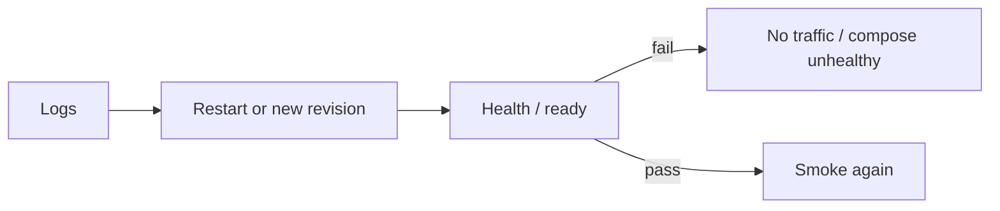

# Month 16 · Week 4 · Day 5
# Logs, Redeploy, and a Failed Health

**Program:** Full-Stack Mastery · 18 months  
**Phase:** 5 — Production engineering  
**Month index:** [../../README.md](../../README.md)  
**Week 4:** [1](day-01.md) · [2](day-02.md) · [3](day-03.md) · [4](day-04.md) · Day 5 (today) · [6](day-06.md) · [7](day-07.md)  
**Week rhythm today:** Tests / docs (and a live inspect of **your** stack)  
**Student state:** Something is running (Path A, B, or C). Today you **prove** you can read logs, restart or redeploy, and recognize a **failed health**.  
**Study time:** 3–4 focused hours

Evidence: `~\fullstack-lab\month-16\week-04\day-05\`. Operate **your** app. Do not paste source. Do not scan other people’s App Runner URLs.

---

## How to use this textbook

1. Open logs **before** you change anything. Save a baseline snippet.  
2. Redeploy or restart using the **platform** (App Runner deploy, `docker compose restart` / `up -d`).  
3. Fail health **on purpose** in a controlled way, then restore.  
4. Optional review links are for later rechecking.

---

## How to read this chapter

Operations is not SSH folklore. It is: **find the log line**, **change the running digest or process**, **know when the platform should stop sending traffic**.



**Wrong belief:** “Restart fixes production.”  
**Correct:** restart fixes a **stuck process**. It does not fix a bad digest, a wrong secret, or a contract migration. If the app 500s after every boot, restart is a loop.

**Wrong belief:** “`/health` returned 200 once on Day 4, so I never need logs.”  
**Correct:** Day 4 was a photograph. Today you watch the **stream**.

---

## Today's contract

1. Save a log excerpt with a **request id** (or honest “we still lack request id — OWED”).  
2. Perform one **restart** or **redeploy** of the running service.  
3. Make health **fail**, capture evidence, **restore**.  
4. Write `RUNBOOK-OPS.md`: where logs live, how to restart, how to tell failed health.  
5. Do not leave production broken.

**Today's gate.** Closed-book:

> I can open logs for my deployed app, restart or redeploy it, and show a failed health then a restored one. Restart is not a substitute for rollback. I do not log secrets.

---

## Time box

| Block | Minutes | Work |
|---|---|---|
| A | 40 | Theory |
| B | 50 | Baseline logs + restart |
| C | 70 | Failed health drill |
| D | 15 | Git |
| E | 15 | Recall |

---

# Block A — Theory

## 1. Where logs are

| Path | How you read them |
|---|---|
| A App Runner | CloudWatch log group the service created; console “Logs” |
| B EC2 Compose | `docker compose logs --tail=100 api` on the instance (SSM), or CloudWatch agent if you set it |
| C Local Compose | PowerShell: `docker compose logs --tail=100` |

JSON logs (Month 15) grep by `request_id` / `level`. Pretty logs are harder; still save a snippet.

Never paste `DATABASE_URL` from a mistaken debug log into git. Redact.

## 2. Restart versus redeploy

**Restart:** same image, new process. Clears a deadlock, a leaked connection, a wedged worker.

**Redeploy:** new **revision** (same or new digest). App Runner “deploy”; Compose `up -d` after tag change.

You need both verbs in the runbook.

## 3. Failed health

Month 15: liveness vs readiness. Week 2: dumb health.

Today, **cause** a fail without dropping RDS public:

- Stop Postgres **in Compose** (`docker compose stop db`) on Path C — API ready should fail if you wired it.  
- Path A: do **not** delete RDS. You may deploy a revision with a **wrong** `HEALTH_PATH` or temporarily point `DATABASE_URL` at an invalid **host** **only if** you can revert in five minutes — easier drill: use Compose locally for the fail, and on App Runner only **read** how failed health appears in the console (service event). Write both.  
- Break `/ready` in **staging**, not by corrupting customer data.

Capture: health status code, platform “unhealthy,” log line.

Restore: start db again; or revert env; wait until healthy.

**Wrong belief:** “I’ll fail health by exposing 5432 and waiting for scanners.”  
**Correct:** refuse. Stop the db container or use a staging env var.

## 4. Tests today

The “test” is operational: after restart, smoke still works. After failed health, the platform **notices**. After restore, smoke works. Document expected codes.

---

# Block B — Type-along ops

```powershell
cd ~\fullstack-lab
mkdir month-16\week-04\day-05 -Force
cd ~\fullstack-lab\month-16\week-04\day-05
```

Copy `URL.txt` from Day 4. `curl.exe -i` health again. Save `BASELINE-CURL.txt`.

Save `BASELINE-LOG.txt` (redacted).

Restart:

- Path A: App Runner → Pause/Resume **or** Deploy (same digest).  
- Path B/C:

```powershell
docker compose restart
```

Use **your** compose file path. Wait. Curl again. `AFTER-RESTART.txt`.

Write `RESTART-VS-REDEPLOY.md` (eight lines).

---

# Block C — Failed health

Execute the drill that matches your path **safely**.

`FAIL-HEALTH.md`: what you did, status code, whether Compose showed `unhealthy` or App Runner showed a failed check, timestamp.

Restore. `RESTORE-CURL.txt`.

`RUNBOOK-OPS.md`:

1. Logs command or console path  
2. Restart  
3. Redeploy (new SHA — tomorrow you may roll config; today name the click)  
4. Failed health meaning  
5. Escalate to Week 2 playbook when restart is not enough  

`DUMB.md`: if health still 200 with db down, you found the Week 2 defect. Fix `/ready` **or** date the OWED. Do not pretend.

---

# Block D — Git

```powershell
cd ~\fullstack-lab
git add month-16
git commit -m "Month 16 Day 5: logs, restart, failed health evidence."
```

---

# Block E — Recall

1. Restart vs redeploy.  
2. Where your logs are.  
3. A safe way to fail health.  
4. Why restart does not fix a bad secret.  
5. Redaction.

## Office hours

**No request id.** OWED from Month 15. Still save a timestamped line.

**App Runner health too slow to fail.** Use Path C for the drill and write how App Runner **would** show it.

**compose restart did nothing.** Wrong project directory (`Get-Location`).

---

## Definition of done

- [ ] Baseline log + curl  
- [ ] Restart evidence  
- [ ] Failed health + restore  
- [ ] `RUNBOOK-OPS.md`  
- [ ] Production not left broken  
- [ ] Commit exists  

---

## Optional review links

- [App Runner health check](https://docs.aws.amazon.com/apprunner/latest/dg/manage-configure-healthcheck.html)  
- [Docker Compose restart](https://docs.docker.com/reference/cli/docker/compose/restart/)  
- [CloudWatch Logs Insights](https://docs.aws.amazon.com/AmazonCloudWatch/latest/logs/AnalyzingLogData.html)  

---

# Lecture: what a restart cannot fix

Make a table in `CANNOT-FIX.md`:

| Symptom | Restart helps? | What actually helps |
|---|---|---|
| Wedged worker / leaked pool | often | restart, then find the leak |
| Wrong `DATABASE_URL` | no | config rollback (Day 6) |
| Bad digest | no | previous image |
| Contract migration | no | forward fix or restore |
| Disk full on RDS | no | storage / vacuum / snapshot plan |
| Expired cert | no | ACM/DNS validation |

If today’s restart made a 500 **go away** without you knowing why, write that as a **risk**. Flaky 500s that vanish on restart belong in MONITORING (connection pool, timeout). Do not call the gate done because the site is green **now**.

**App Runner events.** The service timeline (deploy started, health failed, deploy succeeded) is part of the log story. Save one event line in `EVENTS.txt`.

**Compose `unhealthy`.** If you never defined a Compose `healthcheck`, the UI will not show unhealthy when Postgres dies. That is Month 15 debt. Add it or write OWED. `curl.exe` is still the human healthcheck.

---

## Tomorrow

**Independent:** roll back a **bad config**; document it. Image may stay the same; env is the bug.
