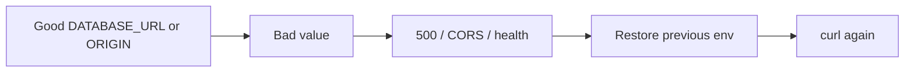

# Month 16 · Week 4 · Day 6
# Independent: Roll Back a Bad Config and Write It Down

**Program:** Full-Stack Mastery · 18 months  
**Phase:** 5 — Production engineering  
**Month index:** [../../README.md](../../README.md)  
**Week 4:** [1](day-01.md) · [2](day-02.md) · [3](day-03.md) · [4](day-04.md) · [5](day-05.md) · Day 6 (today) · [7](day-07.md)  
**Week rhythm today:** Independent implementation  
**Student state:** You can read logs and fail health. Today the bug is **configuration**: a wrong env value, then a **rollback of config** (and image if you choose). Tomorrow is the month exam.  
**Study time:** 3–4 focused hours

Work on **your** staging or lab stack first. Production users are not a playground. Evidence: `~\fullstack-lab\month-16\week-04\day-06\`. No Project 7 source dumps. No real secret values in git.

---

## How to use this textbook

1. Pick a **safe** environment (Compose staging or App Runner staging).  
2. Break **one** config. Watch it fail. Restore **config**, not folklore.  
3. Write `CONFIG-ROLLBACK.md` including “what if the image also changed” and “what about the migration.”  
4. Optional review links are for later rechecking.

---

## How to read this chapter

Week 2 Day 6 rolled back **images**. Week 2 Day 7 defect A was **wrong secret**. Today you **rehearse A**.



**Wrong belief:** “I’ll fix config by editing files on the server and hoping git matches.”  
**Correct:** change the **platform env** (App Runner configuration, Compose `env_file` that is not committed, GitHub Environment secret) and **redeploy/restart** so the process **reads** it.

**Wrong belief:** “Rolling back the image always undoes a bad URL.”  
**Correct:** if the bad URL is in **platform env**, the old image will still read the bad URL. Config rollback is its own lever.

---

## Today's contract

1. Introduce **one** bad config on staging (wrong `DATABASE_URL` host, or `FRONTEND_ORIGIN` / CORS origin, or `VITE_API_URL` on a **rebuild** — pick one).  
2. Evidence of failure (`curl.exe`, log line redacted).  
3. Restore the previous value. Evidence of success.  
4. Document image vs config vs schema levers.  
5. Do not leave staging broken. Do not touch production unless you have no staging **and** you accept the risk in writing.

**Today's gate.** Closed-book:

> I rolled back a bad config without git-pulling a box. I know env rollback is not the same as image rollback. I still mention migrations. Secrets never landed in git.

---

## Time box

| Block | Minutes | Work |
|---|---|---|
| A | 25 | Choose the lever and the environment |
| B | 40 | Break config; capture fail |
| C | 90 | Restore; write CONFIG-ROLLBACK.md |
| D | 20 | Product runbook paragraph |
| E | 15 | Recall |

---

# Block A — Plan

Write `PLAN.md`:

- Environment: staging Compose / App Runner staging / (last resort) local  
- Config name you will break (not the value in this file if it is real)  
- Expected failure: 500 vs CORS vs health  
- Restore method: console env, compose file, secret UI  
- Why this is safer than production  

Prefer breaking `FRONTEND_ORIGIN` or a **deliberately fake** `DATABASE_URL` on Compose (`postgres://ci:ci@no-such-host:5432/ci`) rather than rotating a real RDS master password you might lose.

---

# Block B — Break

```powershell
cd ~\fullstack-lab
mkdir month-16\week-04\day-06 -Force
```

Apply the bad config. Restart/redeploy so it loads (Day 5).

```powershell
curl.exe -i https://YOUR_STAGING/health
```

or localhost staging port.

Save `FAIL-CURL.txt` and `FAIL-LOG.txt` (redact). If CORS, a browser console screenshot is optional; a curl with `Origin` header is better:

```powershell
curl.exe -i -H "Origin: https://wrong.example" https://YOUR_API/health
```

You are testing **your** API, not someone else’s.

---

# Block C — Restore and document

Put the good value back. Redeploy/restart. `OK-CURL.txt`.

Write `CONFIG-ROLLBACK.md`:

1. Commands and console clicks (no secrets).  
2. Failure evidence.  
3. Restore evidence.  
4. **Three levers**  
   - **Image digest** (Week 2 Day 6)  
   - **Config/secrets** (today)  
   - **Schema** (Week 2 Day 4 — rollback image may be unsafe)  
5. When to use the Week 2 playbook vs “just the env.”  
6. Kubernetes: still not required.

Write `RELEASES.md` row: `config-rollback-drill`.

If you also rebuilt the SPA with a bad `VITE_API_URL`, restore requires a **new frontend artifact** (old `dist` or old image tag). Say so — that is still artifact rollback, not an env var on the API.

---

# Block D — Product paragraph

`PRODUCT.md` (10–15 lines): where **your** production env is edited; who is allowed; that Day 7’s fresh commit must not depend on a broken origin.

```powershell
cd ~\fullstack-lab
git add month-16
git commit -m "Month 16 Day 6: config rollback rehearsal."
```

---

# Block E — Recall

1. Why image rollback may not fix env.  
2. Why not git pull.  
3. Safe bad `DATABASE_URL` for a drill.  
4. Frontend bake-time vs API runtime.  
5. Redaction.

## Office hours

**I broke production.** Restore now. Write the incident. Day 7 will not reward a down site.

**App Runner env change did not apply.** You must deploy a new configuration revision, not only save the form.

**Compose env_file cached.** Recreate: `docker compose up -d --force-recreate`.

---

## Definition of done

- [ ] Fail + restore evidence  
- [ ] `CONFIG-ROLLBACK.md` with three levers  
- [ ] Staging not left broken  
- [ ] No secret values in git  
- [ ] Commit exists  

---

## Optional review links

- [App Runner: environment variables](https://docs.aws.amazon.com/apprunner/latest/dg/manage-configure-env-variables.html)  
- [Compose: environment](https://docs.docker.com/reference/compose-file/services/#environment)  

---

# Lecture: three levers, one incident

When staging is wrong, name the lever **before** you type:

| Lever | You change | Unchanged | Typical fail |
|---|---|---|---|
| Image | digest / SHA tag | env, schema | Bad code, baked `VITE_*` |
| Config | platform env / secret | image bytes | Wrong DB URL, CORS origin |
| Schema | Alembic / restore | image may stay | Half migrate, dropped column |

Today is the **middle** row. If you “fixed” CORS by rebuilding the API image, you practiced the wrong lever — unless the origin was **baked** into the frontend image, which is the first row.

**Wrong belief:** “I’ll export production env to a file, edit it, and scp it.”  
**Correct:** that file becomes a secret in your Downloads folder. Edit in the platform UI or a sealed secret store. Compose `env_file` stays gitignored on the laptop.

**Cookie domain.** A bad `COOKIE_DOMAIN=.localhost` on a real host is config. Restoring the image will not help if env still says localhost.

Write `LEVERS.md` (ten lines): which lever you used today; which you did **not** touch; what you would do if restore did not help (playbook).

**Windows.** After Compose recreate, `curl.exe` immediately may hit a still-booting container. Retry until health is 200 or you see a real error — not `Start-Sleep 30` as a lifestyle.

Write `STAGING-ONLY.txt`: one sentence that this drill did not use production customer data.

**Wrong belief:** “I’ll fix the secret by committing a corrected `.env` and reverting later.”  
**Correct:** then the secret is in git history. Rotate. Keep `.env` ignored.

Write `NOT-PROD.txt`: the environment name you used (staging/local). If you used production, say why and what you restored.

Write `BEFORE-AFTER.md`: config **name**, failure status, restore status. Still no values.

Write `THREE-LEVERS.txt`: image / config / schema — which one you moved today.

## Closed-book

Config rollback is not image rollback. Secrets stay out of git. Staging, not customers.

---

## Tomorrow

**Month 16 exam + gate.** A fresh commit must pass CI and reach production **through the process**. Self-mark. Debug a failed release. Do not start Month 17 if any required row is false.
