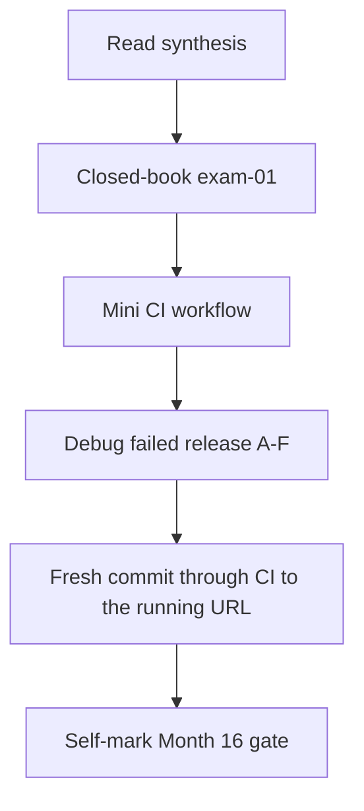
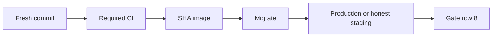

# Month 16 · Week 4 · Day 7
# Month 16 Exam + Gate

**Program:** Full-Stack Mastery · 18 months  
**Phase:** 5 — Production engineering  
**Month index:** [../../README.md](../../README.md)  
**Week 4:** [1](day-01.md) · [2](day-02.md) · [3](day-03.md) · [4](day-04.md) · [5](day-05.md) · [6](day-06.md) · Day 7 (today)  
**Week rhythm today:** Monthly exam  
**Study time:** 3–4 focused hours (repair the pipeline **after** if the gate is still false)

Textbook files stay **closed** except:

- **this file** (synthesis + exam blocks + self-mark table),
- [Month 16 README](../../README.md) **for the gate table wording**,
- your **own** `DEPLOY-PLAN.md`, `CHECKLIST.md`, and `RELEASES.md` only in the blocks that say so — not as a source to paste product code into the lab.

Repair forgotten facts from **this synthesis**, not from Weeks 1–4 day files and not from a random AWS blog.

Work in `~\fullstack-lab\month-16-exam\` for exam evidence. Do **not** implement exam minis inside Project 7. Do **not** start Month 17 because the calendar moved.

**Month 17** (performance, background work, distributed thinking) opens when this gate is true.

---

## How to read this chapter

This file is the **exam and the teacher**. The synthesis is written so a student whose Weeks 1–4 notes are foggy can still re-learn the month from **today’s pages**, then prove it with the blocks and the gate.



During Blocks 1–3, other day files stay closed. If you go blank, re-read **this synthesis**. AI may not write exam-01, the mini YAML, the debug answers, or the gate table.

---

## Today's contract

By the end of this day you will be able to teach Month 16 aloud from this synthesis, write a small CI workflow from spec, debug a failed release, push a **fresh commit** that is **gated** by CI and **reaches** the URL through your process, and **honestly** mark the Month 16 gate.

**Today's gate** is the Month 16 Gate table below — not “I attended four weeks.” If any required row is false, **do not start Month 17**.

---

## Time box

| Block | Minutes | Work |
|---|---|---|
| 0 | 25 | Read the complete explanation; speak it |
| 1 | 35 | Closed-book `exam-01.md` |
| 2 | 40 | Mini-build (`mini/` CI gym) |
| 3 | 25 | Debug A–F (failed release) |
| 4 | 15 | Review DEPLOY-PLAN vs reality |
| 5 | 45 | **Fresh commit → CI → production (or honest Path C)** |
| 6 | 15 | Design: what Month 17 will not fix |
| 7 | 20 | Retro + self-mark |

---

## Month 16 synthesis (the lesson, in this book)

**CI** is a **gate** on a **pull request**. A README badge you can ignore is decoration. GitHub Actions: **workflow** YAML under `.github/workflows/`; **event** (`pull_request`, `push` to `main`); **job** on a **runner** (`ubuntu-latest` is **Linux** while you type PowerShell); **step** is `uses` (checkout, setup-python, setup-node) **or** `run` (bash). Pin action versions. `permissions: contents: read` for tests. Service **Postgres** + `DATABASE_URL` + `pg_isready`. Cache pip/npm; artifacts are reports, not production. **Required status checks** on protected `main` — name must match the UI. `--no-verify` skips local hooks only. Flakes: health, isolation — not `retry: 3` as a lifestyle. Matrix/fail-fast are optional; one honest Ubuntu job is a gate. **Kubernetes is not required.**

**CD** moves a **known artifact** (container **digest**, SHA tag, never `:latest` as process) through **dev / staging / production**. `git pull` on the server is a **snowflake**. Promote **same bytes** that passed staging. Rebuild on prod can change the digest. **Migrate then start** (`alembic upgrade head`); **never** `create_all` in production. Expand/contract. Image rollback after contract can be unsafe — backups. Secrets: `.env` gitignored, `.env.example` in git, Actions secrets, **OIDC** to cloud. `VITE_*` is public. Wrong secret, old image, half-applied migrate, dumb health, env mixup — you can debug those.

**AWS.** Billing **alarm first**. Region vs AZ. Root + MFA vs IAM user vs **role**. Least privilege JSON. VPC lite; SG allow-list; **refuse** `0.0.0.0/0` on SSH and public 5432. **Default compute: App Runner** on a CI image; fallback EC2+Compose **pulling** images. ECS Fargate exists; Beanstalk exists; K8s optional. **RDS** managed Postgres, snapshots, restore changes endpoint. **S3** private, Block Public Access. Route 53 records; **ACM** lifecycle (issued ≠ attached; CloudFront certs in **us-east-1**). CloudFront caches static bytes. CloudWatch logs/metrics/**alarms**. Delete unused NAT/ALB/RDS. Threat-model IAM, data, network.

**Deploy.** Plan with **your** URLs. DNS + TLS checklist. First deploy evidence. Logs, restart vs redeploy, failed health. Config rollback ≠ image rollback. **Fresh commit** must pass CI and reach the running system **through that process**. Localhost is **not** production; Path C + mapping is honest unfinished production.

**Product tests and pipelines live in your repos.** Labs are gyms. This textbook does not paste Project 7.

**Wrong belief:** “Green CI means customers have the bits.”  
**Correct:** CI makes a SHA **eligible**. CD promotes a digest.

**Wrong belief:** “I SSHed and it worked; Month 16 is done.”  
**Correct:** if you cannot repeat it from the plan, the gate is false.

---

# Complete explanation — production engineering you must still own

## 1. CI (Week 1)

PR unit; YAML keys; Linux runner; Postgres service; caches; artifacts; required checks; flakes vs matrix.

## 2. CD (Week 2)

Artifacts, SHA/digest, GHCR, expand/contract, secrets/OIDC, rollback rehearsal, failed-release playbook.

## 3. AWS (Week 3)

IAM, VPC lite, App Runner default, RDS, S3, DNS/TLS/CDN, CloudWatch, teardown.

## 4. Deploy (Week 4)

Plan, DNS/TLS, first deploy, ops, config rollback, **this exam**.

---

# Block 0 — Speak the synthesis

Out loud, no other files: gate vs badge; digest vs git pull; migrate then start; App Runner default; private RDS; ACM attach; fresh commit. Then Block 1.

---

# Block 1 — Closed-book (35 min)

Create `~\fullstack-lab\month-16-exam\exam-01.md`.

Write **in your words** (25–40 lines):

1. Workflow vs job vs step vs runner vs event.  
2. Why ubuntu-latest when you use PowerShell; `curl.exe` on Windows.  
3. Tag vs digest vs `:latest`.  
4. Why not `create_all`; expand vs contract on rollback.  
5. Root vs role; why billing first.  
6. Why you refuse world SSH and public 5432.  
7. The URL you will hit in Block 5 (yours).  
8. Path A/B/C honesty.

If you cannot fill it, re-read the synthesis.

---

# Block 2 — Mini-build (40 min)

Textbook closed except this file’s spec.

```powershell
cd ~\fullstack-lab
mkdir month-16-exam\mini -Force
cd ~\fullstack-lab\month-16-exam\mini
```

**Domain (imposed): exam cafeteria trays.** Not Project 7.

Must:

- `trays.py` with `can_take(role: str, n: int) -> bool` — False if `n < 1` or blank role  
- tests including deny  
- `requirements-dev.txt` with pytest, ruff  
- `.github/workflows/ci.yml`: `pull_request` + `push` `main`; `ubuntu-latest`; checkout@v4; setup-python 3.12; pip install; ruff; pytest; `permissions: contents: read`  
- `CD.txt` five lines: promote digest, not git pull  

Should if time: comment in YAML that a Postgres **service** would belong here for integration.

Must not: product source, secrets, `continue-on-error` on pytest, Kubernetes, `create_all`, PowerShell in `run:`.

```powershell
pip install -r requirements-dev.txt
ruff check .
pytest -q
```

---

# Block 3 — Debug a failed release (25 min)

Write `exam-03-debug.md`. For each: **what fails**, **root cause**, **fix**.

**A.** Required check still named `CI` after workflow rename; `main` merges red.  
**B.** Production App Runner runs last week’s digest; CD pushed a new SHA tag nobody referenced.  
**C.** Alembic failed; wrapper started uvicorn anyway; half schema.  
**D.** `/health` 200; RDS full; list 500.  
**E.** Staging `DATABASE_URL` copied into production env.  
**F.** `git pull && docker compose build` on EC2 “because AWS was slow.”

Worked answers wait. Attempt first.

---

# Block 4 — Review the plan

Open **only** your `DEPLOY-PLAN.md`. `exam-04-gap.md`: one mismatch vs what you actually run (URL, compute, migrate). If the file is missing, the gate is already in trouble — say so.

---

# Block 5 — Fresh commit through the process (the month)

This is the **Month 16 exam performance**.

1. Make a **small** change on a **branch** in **your** product (a harmless log line, a version string, a README production URL — **not** a secret).  
2. Open PR. Wait for **CI**. Save `exam-05-ci.txt`: check name, green. If red, **fix**; do not skip.  
3. Merge only if protection allows (or honest equivalent).  
4. Promote: new SHA image (or Compose rebuild **documented** as debt if you still lack registry). Migrate if needed. Point the service at the new digest.  
5. `curl.exe` the **production** URL if Path A/B public HTTPS; otherwise staging URL **and** `GATE-HONESTY` remains.  
6. `exam-05-curl.txt` and a `RELEASES.md` row.  
7. If CI never ran on GitHub, the gate is **false**. Laptop pytest is not Actions.

Do not force-push `main`. Do not `--no-verify` to hide hooks. Do not open 5432 to the world to finish on time.

**Wrong belief:** “I’ll curl localhost and write a fake SHA.”  
**Correct:** the evidence must match git and the Actions log.

If Path C: still do the **fresh commit + CI** on GitHub, deploy to **staging Compose**, and keep production URL **false**. That is the honest exam.

---

# Block 6 — Design

`exam-06-design.md` (10–15 lines): why Month 17 (performance, queues) will **not** replace a skippable badge or a public RDS. What a fast endpoint still will not catch if authz tests never ran in CI.

---

# Block 7 — Retro + self-mark

`exam-07-retro.md`: weakest week; whether `:latest` still tempts you; remaining OWED (OIDC, custom DNS, Playwright in CI).

---

## Month 16 Gate (self-mark)

True **without a tutorial**. Evidence paths are yours. Wording matches the [Month 16 README](../../README.md).

| # | Claim | Evidence | Pass? |
|---|---|---|---|
| 1 | PR workflow: lint, types, unit, integration (service container or equivalent), build | Actions log | |
| 2 | `main` cannot merge while those checks are red (protection or documented equivalent you can defend) | branch settings / EQUIVALENT.md | |
| 3 | Versioned artifact: image tagged with git SHA | registry / DIGEST.txt | |
| 4 | Secrets in the platform, **not** in git | `.gitignore`, secret **names** | |
| 5 | Deploy runs migrations as a deliberate step, not `create_all` | MIGRATE.txt | |
| 6 | You can roll back to the previous image and say what happens to migrations | ROLLBACK.md / Day 6 | |
| 7 | You can explain IAM, compute (App Runner default or fallback), RDS, S3 if used, DNS+HTTPS, CloudWatch (or equivalent) | exam-01 | |
| 8 | A **fresh commit** passed CI and reached the production URL **through that process** — or Path C with **honest** false production URL | exam-05-* | |

If you are Path C, row 8 production URL is **false**. Do **not** start Month 17 on a false required row. You **may** continue polishing AWS until row 8 is true; that is still Month 16.

If any **required** row is false, **do not start Month 17**.

```powershell
cd ~\fullstack-lab
git add month-16-exam
git commit -m "Complete Month 16 exam evidence."
```

---

## If you passed

**Month 17** is forthcoming: performance, background jobs, distributed-system thinking. Open it only when this gate is true. Faster code will not invent required checks. Queues will not close a public database.

## If you did not pass

Stay on Month 16. This synthesis remains the teacher. Repair the missing row (often protection, migrate step, or a real Actions run), then repeat Block 5.

---

If the gate table has a false row, the honest action is more pipeline on **your** product, not a Kubernetes cluster.

---

## Optional review links

Repair from this synthesis first.

- [GitHub Actions workflow syntax](https://docs.github.com/en/actions/using-workflows/workflow-syntax-for-github-actions)  
- [GitHub: branch protection](https://docs.github.com/en/repositories/configuring-branches-and-merges-in-your-repository/managing-protected-branches/about-protected-branches)  
- [AWS App Runner](https://docs.aws.amazon.com/apprunner/latest/dg/what-is-apprunner.html)  
- [Alembic](https://alembic.sqlalchemy.org/en/latest/)  

---

# Scoring Block 5 (you, not a grader bot)

| Piece | Honest pass |
|---|---|
| Change is a real git commit | SHA in exam-05 |
| CI ran on GitHub for that commit | exam-05-ci.txt |
| Running system updated through the plan | RELEASES row |
| curl matches the new commit if you exposed a version string | optional but strong |
| Path C does not claim production | GATE-HONESTY |

If you only rebuilt on the server from `git pull`, Block 5 fails even if curl looks fine.

---

## Worked answers you should not need — check after you write debug

**A.** Update required check **name**; do not merge red.  
**B.** Point the service at the new digest; ledger.  
**C.** `set -e`; do not start API; repair schema carefully.  
**D.** Readiness must check DB; alarm on 5xx; disk alarm on RDS.  
**E.** Separate GitHub Environments; never copy staging URL to prod.  
**F.** Pull the **CI image**; stop building on the box.

If your written answers disagree, fix them from this box **only after** you attempted A–F alone.



---

## Month 17 is not a reward for finishing the calendar

Performance work on an ungated `main` and a public RDS is expensive theater. Continue Month 16 until every required row is true.

## Closed-book cards (write answers in exam-07-retro)

1. Badge vs required check.  
2. `uses` vs `run`.  
3. Why the runner is Linux.  
4. Digest vs tag.  
5. Why not `create_all`.  
6. OIDC in one sentence.  
7. Why App Runner is this course’s default.  
8. Issued vs attached cert.  
9. Config rollback vs image rollback.  
10. The Month 16 gate in one sentence.

If you miss more than two, re-read the synthesis, then the gate table. Missing these and starting Month 17 is how production becomes a laptop with a public IP.

**Mini pytest** after it is green:

```powershell
pytest -q --tb=short
```

Do not put the mini inside the product repo. Do not start Month 17 tonight on a false self-mark.

## Definition of done (exam day)

- [ ] exam-01 teaches CI/CD/AWS/deploy  
- [ ] Mini ruff + pytest green; YAML exists  
- [ ] Debug A–F written, then checked against the worked box  
- [ ] exam-05 shows a fresh commit through CI  
- [ ] curl evidence for the running URL (prod or honest staging)  
- [ ] Self-mark table is honest  
- [ ] Month 17 not started on a false row  

The gate table is the course’s definition of done for the month. Attendance is not.
