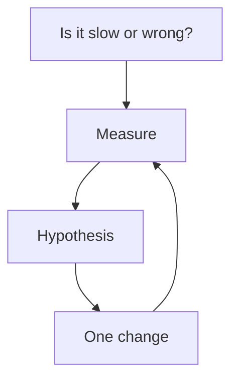

# Month 17 — Performance, Background Work, Distributed-System Thinking

**Program:** Full-Stack Mastery Textbook  
**Phase:** 6 — Advanced engineering and system design  
**Length:** 4 weeks · 7 days each · 3–4 focused hours/day  
**Prereq:** Month 16 gate passed (a commit can reach production through CI/CD)  
**This month’s job:** **Measure** before you guess. Add **one real background workflow**. Learn event and real-time ideas **without** turning Project 7 into a microservice mesh. Design from the **simplest architecture that works**.

This textbook will **not** paste Project 7 or Project 8.

---

## How this textbook is organized

```
month-17/
  README.md     ← you are here
  week-01/      Measure: latency, throughput, SQL, API, frontend, cache, load test
  week-02/      Jobs: queues, workers, retries, backoff, idempotency, DLQ, cron
  week-03/      Events: WebSockets/SSE concepts, pub/sub, delivery, ordering, consistency
  week-04/      Architecture: scale, monolith vs services, SOLID, React framework literacy
                + exam: justify every added box
```

Labs: `~\fullstack-lab\month-17\`. Product changes stay in **your** Project 7 (and notes toward Project 8).

---

## The rule of the month



**Wrong belief:** “We’ll add Redis and Kafka and it will scale.”  
**Correct:** you add a component when you can name the **failure** it prevents and the **failure** it introduces. Month 17’s gate is that sentence, not a vendor list.

**Wrong belief:** “Background jobs are `asyncio.create_task` in the request.”  
**Correct:** a request that must survive a process restart belongs on a **queue** with a **worker**, **retries**, and **idempotency**.

---

## Month 17 Gate

True **without a tutorial**:

1. You have a **baseline**: one hot API, one hot query, one frontend path — numbers, not vibes.  
2. You can explain **latency vs throughput**, and **p95** vs average.  
3. Caching has a **key**, a **TTL**, and an **invalidation** story — or you did not add a cache.  
4. One **background workflow** exists: enqueue, worker, retry with backoff, failure visible, **idempotent** where a double run would corrupt data.  
5. You can explain **at-least-once** delivery and **duplicate events** without claiming “exactly-once” as magic.  
6. WebSockets or SSE appear **only** if the product needs live updates; a poll is allowed if it is honest.  
7. You can sketch **vertical vs horizontal** scale, a **stateless** API, and why this course prefers a **modular monolith** until a boundary is proven.  
8. You built a **small** React-framework experiment (CSR/SSR/hydration ideas). You did **not** replace FastAPI without a reason.  
9. Given a design prompt, you start with the **simplest** architecture and **justify every added component**.

If any item is false, do not start Month 18.

---

## Optional until needed

Kubernetes, Kafka, GraphQL, Elasticsearch — roadmap optional. Do not collect them as trophies.

---

## Start

Open [week-01/day-01.md](week-01/day-01.md).

When Month 17’s gate is true, continue with [Month 18](../month-18/README.md).
